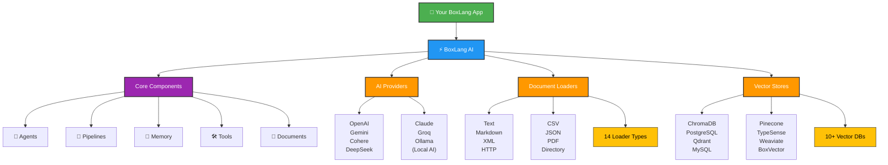

# ⚡ BoxLang AI Module Documentation

Welcome to the **BoxLang AI Module** - your unified gateway to integrating AI capabilities into BoxLang applications. This module provides an elegant, easy-to-use API for interacting with multiple AI providers, from simple chat requests to complex multi-agent systems.

## 🎯 What is BoxLang AI?

BoxLang AI is a comprehensive module that brings enterprise-grade artificial intelligence capabilities to the BoxLang ecosystem. Whether you're building chatbots, content generators, code assistants, RAG systems, or complex AI workflows, this module provides everything you need.



### ✨ Key Features

- 🌐 **Multi-Provider Support**: Work with OpenAI, Claude, Gemini, Grok, Groq, DeepSeek, Ollama, and more
- 🔄 **Unified API**: One consistent interface across all providers
- 👥 **Multi-Tenant Memory**: Enterprise-grade isolation with userId and conversationId across all 20 memory types
- 🎨 **Multimodal Content**: Process images, audio, video, and documents alongside text
- 🏠 **Local AI Support**: Run models locally with Ollama for privacy and offline use
- 🔗 **AI Pipelines**: Chain operations together for complex multi-step workflows
- ⚡ **Streaming Responses**: Get real-time responses as they're generated
- 🛠️ **Tool Integration**: Enable AI to call functions and access real-time data
- 🚀 **Async Support**: Non-blocking operations for better performance
- 📝 **Template System**: Create reusable prompts with dynamic placeholders
- 🤖 **AI Agents**: Autonomous agents with memory, tools, and reasoning
- 📄 **Document Loaders**: Load and process various file formats for RAG
- 🧠 **Vector Memory**: Semantic search with 10+ vector database integrations

### Supported Providers

BoxLang supports out of the box with a variety of AI providers.  You can also create custom providers by following our [Custom Provider Guide](advanced/custom-providers.md).

| Provider | Type | Best For |
|----------|------|----------|
| **OpenAI** | Cloud | General purpose, GPT-5, etc |
| **Claude** | Cloud | Long context, detailed analysis |
| **Gemini** | Cloud | Google integration, multimodal |
| **Grok** | Cloud | Real-time data, Twitter integration |
| **HuggingFace** | Cloud | Open-source models, community-driven |
| **Groq** | Cloud | Ultra-fast inference, LPU architecture |
| **DeepSeek** | Cloud | Code generation, reasoning |
| **Ollama** | Local | Privacy, offline use, no API costs |
| **OpenRouter** | Gateway | Access multiple models through one API |
| **Perplexity** | Cloud | Research, citations, factual answers |
| **Voyage** | Cloud | State-of-the-art embeddings, specialized for RAG |
| **Cohere** | Cloud | Embeddings, multilingual, chat, tool calling |

### 🚀 Use Cases

- 💬 **Chatbots**: Build conversational interfaces with memory and context
- ✍️ **Content Generation**: Create articles, documentation, marketing copy
- 💻 **Code Assistance**: Generate, review, and explain code
- 📊 **Data Analysis**: Extract insights from text and structured data
- 📄 **Document Processing**: Analyze PDFs, contracts, and reports
- 🎥 **Media Analysis**: Process images, audio, and video content
- 🌍 **Translations**: Multi-language content translation
- 📋 **Summarization**: Condense long documents intelligently
- ❓ **Question Answering**: Build knowledge bases and FAQs with RAG
- 🔄 **Custom Workflows**: Multi-step AI processing pipelines

---

## 📖 Documentation Structure

### 🎓 Getting Started

Perfect for beginners - get up and running quickly

### 💬 Simple AI Interactions

Learn basic chat, streaming, and structured output

### 🔗 AI Pipelines

Build complex workflows with agents, memory, and tools

### 🔬 Advanced Topics

Deep dives into specialized features and customization

---

## 📋 Table of Contents

### 🎓 Getting Started

**📦 [Installation](getting-started/installation.md)**
Install the BoxLang AI module in minutes.

**🧩 [Provider Setup & Configuration](getting-started/provider-setup.md)**
Detailed setup for all 12+ AI providers with API keys, models, and best practices.

**⚡ [Quick Start Guide](getting-started/quickstart.md)**
Get up and running in minutes with simple examples and your first AI chat.

---

### 💬 Simple AI Interactions

**🗣️ [Basic Chatting](chatting/basic-chatting.md)**
Simple question-answer interactions, parameters, and provider switching.

**🎯 [Advanced Chatting](chatting/advanced-chatting.md)**
Multi-message conversations, AI tools, async requests, and streaming responses.

**⚙️ [Service-Level Chatting](chatting/service-chatting.md)**
Direct service control, custom requests, headers, and managing multiple providers.

**📦 [Structured Output](chatting/structured-output.md)**
Extract type-safe, validated data from AI responses using classes, structs, or schemas.

---

### 🔗 AI Pipelines & Components

**✈️ [Main Components Overview](main-components/README.md)**
Core concepts of AI pipelines, composability, and building workflows.

**🔄 [Understanding Pipelines](main-components/overview.md)**
Core concepts of AI pipelines, composability, and building workflows.

**🤖 [AI Agents](main-components/agents.md)**
Create autonomous agents with memory, tools, and reasoning. Simplify complex AI workflows.

**🧠 [Working with Models](main-components/models.md)**
Creating model runnables, configuration, and integrating AI providers into pipelines.

**✉️ [Message Templates](main-components/messages.md)**
Building reusable prompts with dynamic placeholders and binding strategies.

**🛠️ [AI Tools & Function Calling](main-components/tools.md)**
Enable AI to call functions, access real-time data, and interact with external systems.

**💭 [Memory Systems](main-components/memory.md)**
Maintain conversation context with Windowed, Summary, Session, File, Cache, and JDBC memory.

**🔮 [Vector Memory](main-components/vector-memory.md)**
Semantic search using vector embeddings. Integrate ChromaDB, Pinecone, PostgreSQL, and more.

**🔧 [Transformers](main-components/transformers.md)**
Process and transform data between pipeline steps with pre/post-processing.

**🔗 [Pipelines](main-components/pipelines.md)**
Build composable AI workflows by chaining models, messages, and transformers into reusable templates.

**📡 [Pipeline Streaming](main-components/streaming.md)**
Real-time streaming through pipelines for responsive applications.

**📄 [Document Loaders](main-components/document-loaders.md)**
Load documents from files, directories, URLs. Supports text, Markdown, CSV, JSON, XML, and more.

**🎯 [RAG (Retrieval Augmented Generation)](main-components/rag.md)**
Build RAG systems combining document loaders, vector memory, and AI models.

---

### 🔬 Advanced Topics

**🔐 [Message Context](advanced/message-context.md)**
Inject security, RAG, and application context into AI messages with multi-tenant patterns.

**🎪 [Event System](advanced/events.md)**
Intercept and customize AI operations with hooks for monitoring, security, and extensibility.

**🛠️ [Utility Functions](advanced/utilities.md)**
Text chunking, token counting, and optimization techniques for AI processing.

**🔢 [Embeddings](advanced/embeddings.md)**
Generate vector representations for semantic search, recommendations, and similarity detection.

**🔌 [MCP Client](advanced/mcp-client.md)**
Connect to Model Context Protocol servers for external tools, resources, and prompts.

**🎨 [Custom AI Providers](advanced/custom-providers.md)**
Build custom provider integrations to connect any LLM service with BoxLang AI.

**🧠 [Custom Memory](advanced/custom-memory.md)**
Build your own memory implementations by extending BaseMemory.

**🧩 [Custom Vector Memory](advanced/custom-vector-memory.md)**
Implement custom vector memory providers by extending BaseVectorMemory.

**📚 [Custom Document Loaders](advanced/custom-loader.md)**
Create custom loaders for specialized data sources and formats.

**🔄 [Custom Transformers](advanced/custom-transformer.md)**
Build custom transformers for specialized data processing in pipelines.

**👥 [Multi-Tenant Memory](advanced/multi-tenant-memory.md)**
Enterprise-grade memory isolation with userId and conversationId patterns.

**🖥️ [MCP Server](advanced/mcp-server.md)**
Expose BoxLang capabilities as MCP server for integration with other AI systems.

---

## 👨‍💻 Class Models Reference

You can find all of our class model reference documentation here: [Class Models Reference](reference/models/README.md).

## 🔧 Built-In Functions (BIFs)

BoxLang AI provides a comprehensive set of BIFs for different AI operations.  You can see all of our BIF reference documentation here: [BIF Reference](reference/built-in-functions/README.md).

### 💬 Chat & Conversation

| BIF | Purpose | Return Type | Example Use Case |
|-----|---------|-------------|------------------|
| `aiChat()` | Simple one-shot chat request | String | Quick Q&A, content generation |
| `aiChatAsync()` | Non-blocking chat request | Future | Background processing, parallel requests |
| `aiChatRequest()` | Build structured chat requests | AiRequest | Complex requests with tools |
| `aiChatStream()` | Real-time streaming responses | void | Live chat, progressive output |

### 🏗️ Pipeline Components

| BIF | Purpose | Return Type | Example Use Case |
|-----|---------|-------------|------------------|
| `aiMessage()` | Build message pipelines | AiMessage | Reusable prompts, templates |
| `aiModel()` | Create model runnables | AiModel | Pipeline integration |
| `aiTransform()` | Create data transformers | Transformer | Pipeline data processing |
| `aiTool()` | Define callable functions | Tool | Real-time data, function calling |

### 🧠 Memory & Context

| BIF | Purpose | Return Type | Example Use Case |
|-----|---------|-------------|------------------|
| `aiMemory()` | Create conversation or vector memory | Memory | Context-aware conversations, RAG, semantic search |

### 📄 Document Processing

| BIF | Purpose | Return Type | Example Use Case |
|-----|---------|-------------|------------------|
| `aiDocuments()` | Load documents from sources | Array/Loader | Document processing, RAG |
| `aiDocumentLoader()` | Create loader instance | IDocumentLoader | Advanced loader configuration |
| `aiDocumentLoaders()` | Get all registered loaders | Struct | Loader metadata and capabilities |

### 🔢 Utilities

| BIF | Purpose | Return Type | Example Use Case |
|-----|---------|-------------|------------------|
| `aiChunk()` | Split text into chunks | Array | Processing large documents |
| `aiTokens()` | Estimate token counts | Numeric | Cost estimation, limits |
| `aiEmbed()` | Generate vector embeddings | Array/Struct | Semantic search, similarity |

### ⚙️ Service Management

| BIF | Purpose | Return Type | Example Use Case |
|-----|---------|-------------|------------------|
| `aiService()` | Get AI service instances | Service | Multi-provider management |
| `MCP()` | Connect to MCP servers | MCPClient | External tools, resources |

**Quick Reference by Category:**

- 🚀 **Simple Operations**: `aiChat()`, `aiChatAsync()`, `aiChatStream()`
- 📝 **Structured Requests**: `aiChatRequest()`, `aiMessage()`, `aiModel()`
- 🔧 **Advanced Features**: `aiTool()`, `aiMemory()`, `aiTransform()`
- 📊 **Utilities**: `aiChunk()`, `aiTokens()`, `aiEmbed()`
- 🎛️ **Service Management**: `aiService()`, `MCP()`

---

## 🚀 Quick Examples

### 💬 Simple Chat

```javascript
answer = aiChat( "What is BoxLang?" )
println( answer )
```

### 🎨 Simple Chat with Parameters

```javascript
answer = aiChat(
    "Write a haiku about coding",
    { temperature: 0.9, model: "gpt-4" }
)
```

### 🔗 Build a Pipeline

```javascript
pipeline = aiMessage()
    .system( "You are a helpful assistant" )
    .user( "Explain ${topic}" )
    .toDefaultModel()
    .transform( r => r.content )

result = pipeline.run( { topic: "recursion" } )
```

### ⚡ Stream Responses

```javascript
aiChatStream(
    "Tell me a story",
    ( chunk ) => print( chunk.choices?.first()?.delta?.content ?: "" )
)
```

### 📦 Get JSON Responses

```javascript
// Automatically parse JSON responses
user = aiChat(
    "Create a user profile with name, age, and email for Alice",
    { returnFormat: "json" }
)

println( "Name: #user.name#" )
println( "Age: #user.age#" )
println( "Email: #user.email#" )
```

### 🛠️ Use AI Tools

```javascript
// Let AI call functions for real-time data
getWeather = aiTool(
    name: "get_weather",
    description: "Get current weather for a location",
    parameters: {
        location: { type: "string", description: "City name" }
    },
    callback: ( args ) => {
        return { temp: 72, condition: "sunny", location: args.location }
    }
)

response = aiChat(
    "What's the weather in San Francisco?",
    { tools: [ getWeather ] }
)
```

### 🔢 Generate Embeddings

```javascript
// Create vector embeddings for semantic search
embeddings = aiEmbed([
    "BoxLang is a modern JVM language",
    "Java is a programming language",
    "Python is popular for AI"
])

// Use embeddings for similarity comparison
println( "Generated #embeddings.len()# embeddings" )
```

### 📄 Load Documents

```javascript
// Load documents for RAG
documents = aiDocuments( source: "docs/guide.md" )

// Use with memory
memory = aiMemory( type: "vector" )
memory.addDocuments( documents )

// Query with context
response = aiChat(
    "What is covered in the guide?",
    { memory: memory }
)
```

### 🤖 Create an Agent

```javascript
// Build an autonomous agent
agent = aiAgent()
    .name( "Research Assistant" )
    .instructions( "You help research and summarize topics" )
    .memory( aiMemory( type: "windowed", size: 10 ) )
    .tools([
        searchTool,
        summarizeTool
    ])

// Agent handles multi-turn conversations
response = agent.chat( "Research AI trends in 2025" )
```

---

## 🆘 Need Help?

### 📚 Resources

- **📖 Full Documentation**: Explore all sections above for comprehensive guides
- **💡 Examples**: Check the [`/examples`](../examples/README.md) folder for runnable code samples
- **🔍 BIF Reference**: See [`reference/built-in-functions/`](reference/built-in-functions/) for detailed function docs
- **📦 Module Components**: Explore [`main-components/`](main-components/) for in-depth component guides

### 🤝 Community & Support

- **👥 Community**: [BoxLang Community Forum](https://community.boxlang.io)
- **🐛 Issues**: [GitHub Issues](https://github.com/ortus-boxlang/bx-ai/issues)
- **💬 Discussions**: [GitHub Discussions](https://github.com/ortus-boxlang/bx-ai/discussions)
- **✉️ Email Support**: support@ortussolutions.com

### 🎓 Learning Paths

1. **🌱 Beginners**: Start with [Quick Start](getting-started/quickstart.md) → [Basic Chatting](chatting/basic-chatting.md) → [Examples](../examples/README.md)
2. **🏗️ Builders**: Learn [Pipelines](main-components/overview.md) → [Memory](main-components/memory.md) → [Tools](main-components/tools.md)
3. **🚀 Advanced**: Explore [Agents](main-components/agents.md) → [RAG](main-components/rag.md) → [Custom Components](advanced/)

---

## 🌟 Upgrade to Plus

Want enterprise features and priority support?

- 🏢 **Enterprise Modules**: Advanced components and integrations
- 🛠️ **Advanced Tooling**: Enhanced development and debugging tools
- ⚡ **Priority Support**: Direct access to our engineering team
- 🔐 **Enterprise Features**: SSO, audit logs, advanced security

**Learn more**: [boxlang.io/plans](https://boxlang.io/plans)

---

## 📜 Legal & Credits

**Copyright** © 2023-2025 Ortus Solutions, Corp
**License**: [Apache 2.0](https://www.apache.org/licenses/LICENSE-2.0)
**Website**: [boxlang.io](https://boxlang.io)

Made with ❤️ by the Ortus Solutions team
