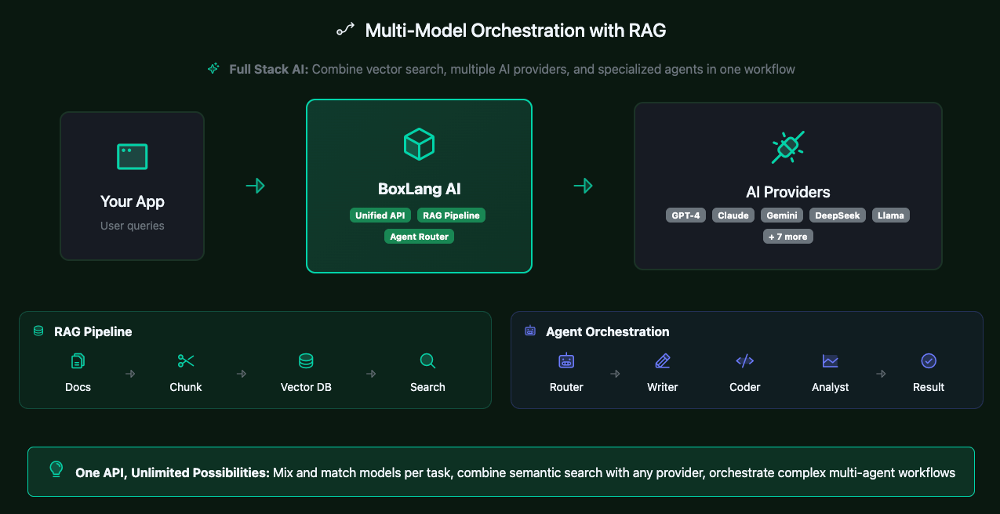

# Introduction

Welcome to the **BoxLang AI Module** - your unified gateway to integrating AI capabilities into BoxLang applications. This module provides an elegant, easy-to-use API for interacting with multiple AI providers, from simple chat requests to complex multi-agent systems.

<figure><figcaption></figcaption></figure>

## 🎯 What is BoxLang AI?

BoxLang AI is a comprehensive library that brings enterprise-grade artificial intelligence capabilities to the JVM ecosystem. Whether you're building chatbots, content generators, code assistants, RAG systems, or complex AI workflows, this module provides everything you need.


### ✨ Key Features

* 🌐 **Multi-Provider Support**: Work with OpenAI, Claude, Gemini, Grok, Groq, DeepSeek, Ollama, and more
* 🔄 **Unified API**: One consistent interface across all providers
* 👥 **Multi-Tenant Memory**: Enterprise-grade isolation with userId and conversationId across all 20 memory types
* 🎨 **Multimodal Content**: Process images, audio, video, and documents alongside text
* 🏠 **Local AI Support**: Run models locally with Ollama for privacy and offline use
* 🔗 **AI Pipelines**: Chain operations together for complex multi-step workflows
* ⚡ **Streaming Responses**: Get real-time responses as they're generated
* 🛠️ **Tool Integration**: Enable AI to call functions and access real-time data
* 🚀 **Async Support**: Non-blocking operations for better performance
* 📝 **Template System**: Create reusable prompts with dynamic placeholders
* 🤖 **AI Agents**: Autonomous agents with memory, tools, and reasoning
* 📄 **Document Loaders**: Load and process various file formats for RAG
* 🧠 **Vector Memory**: Semantic search with 10+ vector database integrations

### Supported Providers

BoxLang supports a variety of AI providers out of the box. You can also create custom providers by following our [Custom Provider Guide](extending-boxlang-ai/custom-providers.md).

<table><thead><tr><th width="170.41796875">Provider</th><th width="135.0078125">Type</th><th>Best For</th></tr></thead><tbody><tr><td><strong>Claude</strong></td><td>Cloud</td><td>Long context, detailed analysis</td></tr><tr><td><strong>Cohere</strong></td><td>Cloud</td><td>Embeddings, multilingual, chat, tool calling</td></tr><tr><td><strong>DeepSeek</strong></td><td>Cloud</td><td>Code generation, reasoning</td></tr><tr><td><strong>Gemini</strong></td><td>Cloud</td><td>Google integration, multimodal</td></tr><tr><td><strong>Grok</strong></td><td>Cloud</td><td>Real-time data, Twitter integration</td></tr><tr><td><strong>Groq</strong></td><td>Cloud</td><td>Ultra-fast inference, LPU architecture</td></tr><tr><td><strong>HuggingFace</strong></td><td>Cloud</td><td>Open-source models, community-driven</td></tr><tr><td><strong>Ollama</strong></td><td>Local</td><td>Privacy, offline use, no API costs</td></tr><tr><td><strong>OpenAI</strong></td><td>Cloud</td><td>General purpose, GPT-5, etc</td></tr><tr><td><strong>OpenRouter</strong></td><td>Gateway</td><td>Access multiple models through one API</td></tr><tr><td><strong>Perplexity</strong></td><td>Cloud</td><td>Research, citations, factual answers</td></tr><tr><td><strong>Voyage</strong></td><td>Cloud</td><td>State-of-the-art embeddings, specialized for RAG</td></tr></tbody></table>

### 🚀 Use Cases

* 💬 **Chatbots**: Build conversational interfaces with memory and context
* ✍️ **Content Generation**: Create articles, documentation, marketing copy
* 💻 **Code Assistance**: Generate, review, and explain code
* 📊 **Data Analysis**: Extract insights from text and structured data
* 📄 **Document Processing**: Analyze PDFs, contracts, and reports
* 🎥 **Media Analysis**: Process images, audio, and video content
* 🌍 **Translations**: Multi-language content translation
* 📋 **Summarization**: Condense long documents intelligently
* ❓ **Question Answering**: Build knowledge bases and FAQs with RAG
* 🔄 **Custom Workflows**: Multi-step AI processing pipelines

***

## 📖 Quick Start

### 🎓 Getting Started

[Perfect for beginners - get up and running quickly](getting-started/getting-started.md)

### 💬 Simple AI Interactions

[Learn basic chat, streaming, and structured output](main-components/chatting/)

### 🔗 AI Pipelines

[Build complex workflows with agents, memory, and tools](main-components/pipelines/)

### 🤖 AI Agents

[Build reusable and autonomous agents, sub-agents, and much more.](main-components/agents.md)


***

## 🔧 Built-In Functions (BIFs)

BoxLang AI provides a comprehensive set of BIFs for different AI operations. You can see all of our BIF reference documentation here: [BIF Reference](advanced/reference/built-in-functions/).

### 💬 Chat & Conversation

| BIF               | Purpose                        | Return Type | Example Use Case                         |
| ----------------- | ------------------------------ | ----------- | ---------------------------------------- |
| `aiChat()`        | Simple one-shot chat request   | String      | Quick Q\&A, content generation           |
| `aiChatAsync()`   | Non-blocking chat request      | Future      | Background processing, parallel requests |
| `aiChatRequest()` | Build structured chat requests | AiRequest   | Complex requests with tools              |
| `aiChatStream()`  | Real-time streaming responses  | void        | Live chat, progressive output            |

### 🏗️ Pipeline Components

| BIF             | Purpose                   | Return Type | Example Use Case                 |
| --------------- | ------------------------- | ----------- | -------------------------------- |
| `aiMessage()`   | Build message pipelines   | AiMessage   | Reusable prompts, templates      |
| `aiModel()`     | Create model runnables    | AiModel     | Pipeline integration             |
| `aiTransform()` | Create data transformers  | Transformer | Pipeline data processing         |
| `aiTool()`      | Define callable functions | Tool        | Real-time data, function calling |

### 🧠 Memory & Context

| BIF          | Purpose                              | Return Type | Example Use Case                                  |
| ------------ | ------------------------------------ | ----------- | ------------------------------------------------- |
| `aiMemory()` | Create conversation or vector memory | Memory      | Context-aware conversations, RAG, semantic search |

### 📄 Document Processing

| BIF             | Purpose                     | Return Type  | Example Use Case         |
| --------------- | --------------------------- | ------------ | ------------------------ |
| `aiDocuments()` | Load documents from sources | Array/Loader | Document processing, RAG |

### 🔢 Utilities

| BIF          | Purpose                    | Return Type  | Example Use Case            |
| ------------ | -------------------------- | ------------ | --------------------------- |
| `aiChunk()`  | Split text into chunks     | Array        | Processing large documents  |
| `aiTokens()` | Estimate token counts      | Numeric      | Cost estimation, limits     |
| `aiEmbed()`  | Generate vector embeddings | Array/Struct | Semantic search, similarity |

### ⚙️ Service Management

| BIF           | Purpose                  | Return Type | Example Use Case          |
| ------------- | ------------------------ | ----------- | ------------------------- |
| `aiService()` | Get AI service instances | Service     | Multi-provider management |
| `MCP()`       | Connect to MCP servers   | MCPClient   | External tools, resources |

***

## 🚀 Quick Examples

### 💬 Simple Chat

```javascript
answer = aiChat( "What is BoxLang?" )
println( answer )
```

### 🎨 Simple Chat with Parameters

```javascript
answer = aiChat(
    "Write a haiku about coding",
    { temperature: 0.9, model: "gpt-4" }
)
```

### 🔗 Build a Pipeline

```javascript
pipeline = aiMessage()
    .system( "You are a helpful assistant" )
    .user( "Explain ${topic}" )
    .toDefaultModel()
    .transform( r => r.content )

result = pipeline.run( { topic: "recursion" } )
```

### ⚡ Stream Responses

```javascript
aiChatStream(
    "Tell me a story",
    ( chunk ) => print( chunk.choices?.first()?.delta?.content ?: "" )
)
```

### 📦 Get JSON Responses

```javascript
// Automatically parse JSON responses
user = aiChat(
    "Create a user profile with name, age, and email for Alice",
    { returnFormat: "json" }
)

println( "Name: #user.name#" )
println( "Age: #user.age#" )
println( "Email: #user.email#" )
```

### 🛠️ Use AI Tools

```javascript
// Let AI call functions for real-time data
getWeather = aiTool(
    name: "get_weather",
    description: "Get current weather for a location",
    parameters: {
        location: { type: "string", description: "City name" }
    },
    callback: ( args ) => {
        return { temp: 72, condition: "sunny", location: args.location }
    }
)

response = aiChat(
    "What's the weather in San Francisco?",
    { tools: [ getWeather ] }
)
```

### 🔢 Generate Embeddings

```javascript
// Create vector embeddings for semantic search
embeddings = aiEmbed([
    "BoxLang is a modern JVM language",
    "Java is a programming language",
    "Python is popular for AI"
])

// Use embeddings for similarity comparison
println( "Generated #embeddings.len()# embeddings" )
```

### 📄 Load Documents

```javascript
// Load documents for RAG
documents = aiDocuments( source: "docs/guide.md" )

// Use with memory
memory = aiMemory( type: "vector" )
memory.addDocuments( documents )

// Query with context
response = aiChat(
    "What is covered in the guide?",
    { memory: memory }
)
```

### 🤖 Create an Agent

```javascript
// Build an autonomous agent
agent = aiAgent()
    .name( "Research Assistant" )
    .instructions( "You help research and summarize topics" )
    .memory( aiMemory( type: "windowed", size: 10 ) )
    .tools([
        searchTool,
        summarizeTool
    ])

// Agent handles multi-turn conversations
response = agent.chat( "Research AI trends in 2025" )
```

***

## 🆘 Need Help?

### 📚 Resources

* **📖 Full Documentation**: Explore all sections above for comprehensive guides
* **💡 Examples**: Check the [`/examples`](../examples/) folder for runnable code samples
* **🔍 BIF Reference**: See [`reference/built-in-functions/`](advanced/reference/built-in-functions/) for detailed function docs
* **📦 Module Components**: Explore [`main-components/`](main-components/main-components/) for in-depth component guides

### 🤝 Community & Support

* **👥 Community**: [BoxLang Community Forum](https://community.boxlang.io)
* **🐛 Issues**: [GitHub Issues](https://github.com/ortus-boxlang/bx-ai/issues)
* **💬 Discussions**: [GitHub Discussions](https://github.com/ortus-boxlang/bx-ai/discussions)
* **✉️ Email Support**: [ai@ortussolutions.com](mailto:ai@ortussolutions.com)

### 🎓 Learning Paths

1. **🌱 Beginners**: Start with [Quick Start](getting-started/quickstart.md) → [Basic Chatting](main-components/chatting/basic-chatting.md) → [Examples](../examples/)
2. **🏗️ Builders**: Learn [Pipelines](main-components/main-components/overview.md) → [Memory](main-components/memory/) → [Tools](main-components/tools.md)
3. **🚀 Advanced**: Explore [Agents](main-components/agents.md) → [RAG](rag/rag.md) → [Custom Components](advanced/advanced.md)

***

## 🌟 Upgrade to Plus

BoxLang and BoxLang AI are both Professional Open-Source (POS) projects.  However, we also offer enterprise features, priority support, SLAs, and much more in our [BoxLang +/++ Plans.](https://boxlang.io/plans)


* 🏢 **Enterprise Modules**: Advanced components and integrations
* 🛠️ **Advanced Tooling**: Enhanced development and debugging tools
* ⚡ **Priority Support**: Direct access to our engineering team
* 🔐 **Enterprise Features**: SSO, audit logs, advanced security


**Learn more**: [boxlang.io/plans](https://boxlang.io/plans)

***

## 📜 Legal & Credits

**Copyright** © 2023-2025 Ortus Solutions, Corp&#x20;

**License**: [Apache 2.0](https://www.apache.org/licenses/LICENSE-2.0)&#x20;

**Website**: [ai.boxlang.io](https://ai.boxlang.io/)

Made with ❤️ by the Ortus Solutions team
