# 🥷 Advanced Topics

Take your BoxLang AI skills to the next level with advanced features, integrations, and customization options.

## 🎯 Advanced Topics Architecture

```mermaid
graph TB
    subgraph "Core Features"
        EMB[🧬 Embeddings]
        EVT[🎯 Events]
        MCP[🌐 MCP]
    end

    subgraph "Memory Systems"
        CM[🔧 Custom Memory]
        VM[🧠 Vector Memory]
        MT[👥 Multi-Tenant]
    end

    subgraph "Utilities"
        UTIL[🛠️ Text Utils]
        TOK[🔢 Tokens]
        CTX[🔐 Context]
    end

    subgraph "Integration"
        MCPS[MCP Server]
        MCPC[MCP Client]
        API[External APIs]
    end

    subgraph "Operations"
        PROD[🚀 Production]
        SEC[🔐 Security]
    end

    EMB --> VM
    EVT --> CM
    MCP --> MCPS
    MCP --> MCPC

    CM --> MT
    VM --> MT

    UTIL --> TOK
    CTX --> MT

    PROD --> SEC

    style EMB fill:#4A90E2
    style EVT fill:#BD10E0
    style PROD fill:#27AE60
    style SEC fill:#E74C3C
    style MCP fill:#7ED321
    style CM fill:#F5A623
```



## 📚 Guides

### 🧬 [Embeddings](embeddings.md)

Convert text into vector representations for semantic search and similarity matching.

**What you'll learn:**

- Generating embeddings from text
- Choosing embedding models
- Vector similarity calculations
- Use cases: semantic search, clustering, recommendations

**Use when:** Building search engines, recommendation systems, or document similarity features.

---

### 🔐 [Message Context](message-context.md)

Inject security, RAG, and application context into AI messages.

**What you'll learn:**

- Adding context to AI messages (security, RAG, metadata)
- Using `${context}` placeholder for automatic injection via `render()`
- Multi-tenant isolation patterns
- RAG implementation with context

**Use when:** Building secure multi-user applications, implementing RAG, or customizing AI behavior based on user/tenant context.

---

### 👥 [Multi-Tenant Memory](multi-tenant-memory.md)

Enterprise-grade memory isolation with userId and conversationId patterns.

**What you'll learn:**

- Configuring multi-tenant memory systems
- Isolating conversation and vector memory by user and conversation
- Best practices for secure data handling
- Integration with agents and chat services
- Performance considerations
- Scalability strategies

**Use when:** Building SaaS applications, multi-user platforms, or any system requiring strict data isolation.

### 📡 [Event System](events.md)

Intercept and customize AI operations with the powerful event system.

**What you'll learn:**

- Available interception points (`onAIRequest`, `onAIResponse`, etc.)
- Logging AI interactions
- Modifying requests and responses
- Custom provider registration
- Performance monitoring and debugging

**Use when:** You need logging, custom behavior, request modification, or monitoring.

---

### 🔌 [MCP Client](mcp-client.md)

Integrate with the Model Context Protocol to access external tools and resources.

**What you'll learn:**

- What is MCP (Model Context Protocol)
- Connecting to MCP servers
- Using MCP tools with agents
- Available MCP integrations (filesystem, git, databases, APIs)
- Creating custom MCP clients

**Use when:** Building agents that need access to external systems, databases, or APIs beyond built-in tools.

---

### 🖥️ [MCP Server](mcp-server.md)

Expose your BoxLang tools, resources, and prompts via the Model Context Protocol.

**What you'll learn:**

- Creating and configuring MCP servers
- Registering tools, resources, and prompts
- HTTP endpoint for MCP requests
- **Statistics and monitoring** - Track performance and usage metrics
- Multi-server patterns for different use cases
- Application lifecycle integration

**Use when:** Building APIs that AI clients can discover and use, or exposing BoxLang functionality to external AI systems.

---

### 🧠 [Custom AI Providers](custom-providers.md)

Build custom provider integrations to connect any LLM service with BoxLang AI.

**What you'll learn:**

- Extending `BaseService` and implementing `IAiService`
- OpenAI-compatible vs. custom implementations
- Handling authentication and request/response formats
- Implementing streaming and embeddings
- Tool/function calling support
- Registration and testing patterns

**Use when:** Integrating enterprise AI services, private deployments, emerging providers, or building mock providers for testing.

---

### 📁 [Custom Loaders](custom-loaders.md)

Create custom document loaders to ingest data from any source for RAG applications.

**What you'll learn:**

- Implementing the `IAiDocumentLoader` interface
- Fetching and processing documents from APIs, databases, or file systems
- Text extraction and metadata handling
- Integration with RAG pipelines
- Error handling and performance optimization

**Use when:** Ingesting documents from non-standard sources or formats for retrieval-augmented generation.

---

### 🐏 [Custom Memory](custom-memory.md)

Build custom memory solutions to store and retrieve conversation history and embeddings.

**What you'll learn:**

- Implementing the `IAiMemory` interface
- Storing conversation history and embeddings
- Custom retrieval strategies
- Integration with agents and chat services
- Performance and scalability considerations
- Multi-tenant memory patterns

**Use when:** Creating specialized memory solutions for unique application requirements or optimizing performance.

---

### 📐[Custom Vector Memory](custom-vector-memory.md)

Create custom vector memory systems for storing and retrieving embeddings.

**What you'll learn:**

- Implementing the `IAiVectorMemory` interface
- Storing and querying vector embeddings
- Custom similarity search algorithms
- Integration with RAG and chat services
- Performance tuning and scalability
- Multi-tenant vector memory patterns

**Use when:** Building specialized vector storage solutions or optimizing similarity search for specific use cases.

---

### 🤖[Custom Transformers](custom-transformer.md)

Build custom data transformers for use in AI pipelines.

**What you'll learn:**

- Implementing the `IAiTransformer` interface
- Creating data processing steps for pipelines
- Handling input and output formats
- Integration with existing pipeline components
- Testing and debugging transformers
- Performance optimization

**Use when:** You need specialized data processing steps in your AI workflows.

---

### 🚀 [Production Deployment](production.md)

Comprehensive guide for deploying BoxLang AI to production environments.

**What you'll learn:**

- Pre-deployment checklist
- Configuration management (environment-based, secrets managers)
- Error handling & resilience (circuit breaker, retry logic, fallback providers)
- Monitoring & observability (events, metrics, health checks, audit logs)
- Performance optimization (caching, async, batching, connection pooling)
- Cost management & tracking
- High availability (failover, load balancing)
- Scaling strategies
- Database & memory configuration
- Container deployment (Docker, Kubernetes)
- Security hardening
- Operational procedures

---

### 🔐 [Security Guide](security.md)

Security best practices for BoxLang AI applications.

**What you'll learn:**

- API key management (secrets managers, rotation, scope limitation)
- Input validation & sanitization
- Prompt injection prevention (detection, protection strategies, testing)
- Output validation
- Data privacy (PII detection/redaction, encryption, data minimization)
- Multi-tenant security (isolation, namespaces, row-level security)
- PII handling
- Audit logging
- Compliance (GDPR, HIPAA, data retention)
- Secure configuration
- Network security (API gateway, TLS/SSL)
- Incident response

---

### 🛠️ [Utilities](utilities.md)

Helper functions for text processing, token counting, and data manipulation.

**What you'll learn:**

- **Text chunking** - Split documents intelligently for AI processing
- **Token counting** - Calculate token usage before API calls
- **Mock data generation** - Create test data with AI
- **Content validation** - Verify and sanitize AI outputs

**Use when:** Processing large documents, managing costs, testing, or preparing data for AI.

---

## Quick Examples

### Generate Embeddings

```java
embedding = aiEmbedding(
    provider: "openai",
    input: "BoxLang is a modern dynamic JVM language"
);
// Returns: [0.023, -0.015, 0.089, ...] (vector of 1536 dimensions)
```

### Intercept AI Requests

```java
// In your interceptor
function onAIRequest( event, interceptData ) {
    var data = arguments.interceptData;
    systemLog( "AI Request to #data.provider#: #data.chatRequest.toString()#" );
}
```

### Use MCP Tools

```java
agent = aiAgent()
    .withInstructions( "You are a helpful assistant" )
    .withMcpClient( "filesystem" )  // Gives agent file access
    .build();

response = agent.run( "List files in /tmp" );
```

### Expose Tools via MCP Server

```java
// Register tools at application startup
mcpServer( "myApp" )
    .registerTool(
        aiTool( "search", "Search documents", ( query ) => searchService.search( query ) )
    )
    .registerResource(
        uri: "docs://readme",
        name: "README",
        handler: () => fileRead( "/readme.md" )
    )
```

### Chunk Large Documents

```java
chunks = aiTextChunk(
    text: largeDocument,
    maxSize: 1000,
    overlap: 200
);

// Process each chunk
chunks.each( function( chunk ) {
    aiChat( message: "Summarize: #chunk#" );
} );
```

---

## Integration Patterns

### Semantic Search Pipeline

**Components:** Embeddings + Vector storage + Similarity search
**Guide:** [Embeddings Documentation](embeddings.md)

### Observable AI System

**Components:** Event system + Logging + Monitoring
**Guide:** [Event System Documentation](events.md)

### Tool-Enhanced Agents

**Components:** MCP Client + Agents + External APIs
**Guide:** [MCP Client Documentation](mcp-client.md)

### AI-Accessible APIs

**Components:** MCP Server + Tools + Resources
**Guide:** [MCP Server Documentation](mcp-server.md)

### Document Processing

**Components:** Text chunking + Token counting + Batch processing
**Guide:** [Utilities Documentation](utilities.md)

### Secure Multi-User AI

**Components:** Request Context + Interceptors + Tenant Isolation
**Guide:** [Message Context Documentation](message-context.md)

---

## Choosing Your Path

**"I need semantic search or recommendations"**
→ [Embeddings](embeddings.md)

**"I want to log or customize AI behavior"**
→ [Event System](events.md)

**"I need to inject security context or RAG data"**
→ [Message Context](message-context.md)

**"I need agents to access external systems"**
→ [MCP Client](mcp-client.md)

**"I want to expose my tools to AI clients"**
→ [MCP Server](mcp-server.md)

**"I need to integrate a custom AI provider"**
→ [Custom AI Providers](custom-providers.md)

**"I'm processing large documents or managing costs"**
→ [Utilities](utilities.md)

---

## Prerequisites

These topics assume familiarity with:

- Basic AI chatting - See [Chatting Guide](../chatting/README.md)
- AI agents - See [Agents Documentation](../main-components/agents.md)
- BoxLang interceptors (for event system)

---

## Next Steps

1. **Optimize performance** - [Utilities](utilities.md) for token counting and chunking
2. **Add monitoring** - [Event System](events.md) for logging and observability
3. **Extend capabilities** - [MCP Client](mcp-client.md) for external tool integration
4. **Build search** - [Embeddings](embeddings.md) for semantic similarity