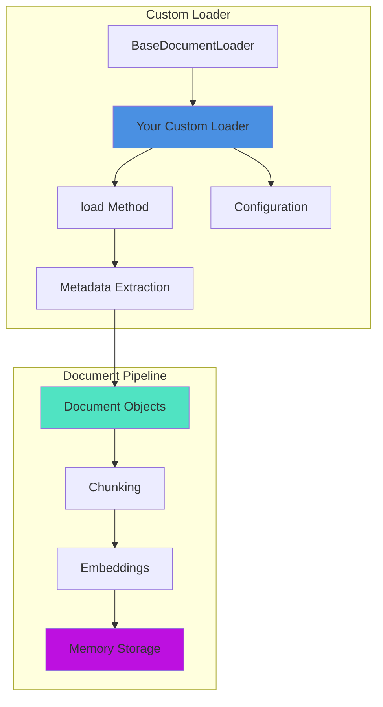

# 🧩 Building Custom Document Loaders

Create custom document loaders to integrate any data source into your BoxLang AI workflows. This guide shows you how to build loaders that work seamlessly with memory systems, RAG pipelines, and the `aiDocuments()` BIF.

## 🎯 Why Custom Loaders?

Build custom loaders when you need to:

- **Load proprietary formats** - Parse custom file formats or data structures
- **Integrate APIs** - Pull data from external services or APIs
- **Transform data** - Apply domain-specific logic during loading
- **Add metadata** - Extract and preserve rich metadata from sources
- **Optimize performance** - Implement specialized caching or batching

## 🏗️ Loader Architecture



## 📝 IDocumentLoader Interface

All document loaders must implement the `IDocumentLoader` interface:

```javascript
interface {
    /**
     * Load documents from the source
     * @return Array of Document objects
     */
    public array function load();

    /**
     * Load documents asynchronously
     * @return BoxLang Future resolving to array of Documents
     */
    public any function loadAsync();

    /**
     * Get the source being loaded
     * @return string
     */
    public string function getSource();

    /**
     * Configure the loader
     * @param config Configuration struct
     * @return this (for fluent API)
     */
    public any function configure( required struct config );
}
```

## 🚀 Quick Start: Simple Custom Loader

Here's a minimal custom loader that loads data from an API:

```javascript
// APILoader.bx
import bxModules.bxai.models.Document;
import bxModules.bxai.models.loaders.BaseDocumentLoader;

/**
 * Custom loader for REST API endpoints
 */
class extends="BaseDocumentLoader" {

    property name="apiKey" type="string" default="";
    property name="endpoint" type="string" default="";

    /**
     * Initialize the loader
     */
    function init( required string source, struct config={} ) {
        super.init( argumentCollection=arguments );

        // Extract API configuration
        variables.endpoint = arguments.source;
        variables.apiKey = arguments.config.apiKey ?: "";

        return this;
    }

    /**
     * Load documents from API
     */
    function load() {
        var documents = [];

        try {
            // Make HTTP request
            var data = http( variables.endpoint )
                .header( "Authorization", "Bearer #variables.apiKey#" )
				.asJson()
                .send();


            // Convert each item to a Document
            for ( var item in data.items ) {
                var doc = new Document(
                    id      = item.id ?: createUUID(),
                    content = item.content ?: item.text,
                    metadata = {
                        title: item.title ?: "",
                        author: item.author ?: "",
                        source: variables.endpoint,
                        timestamp: item.created ?: now()
                    }
                );
                documents.append( doc );
            }

        } catch ( any e ) {
            throw(
                type    = "APILoaderException",
                message = "Failed to load from API: #e.message#",
                detail  = e.detail
            );
        }

        return documents;
    }
}
```

**Usage:**

```javascript
// Load from custom API
import APILoader;

loader = new APILoader(
    source = "https://api.example.com/articles",
    config = { apiKey: "your-api-key" }
);

docs = loader.load();
println( "Loaded #docs.len()# documents from API" );
```

## 🎨 Extending BaseDocumentLoader

The `BaseDocumentLoader` provides common functionality:

### Inherited Methods

```javascript
// Chunking configuration
loader.chunkSize( 1000 )
loader.overlap( 200 )
loader.chunkStrategy( "recursive" )

// Metadata handling
loader.includeMetadata( true )
loader.addMetadata( { category: "api" } )

// Memory integration
result = loader.toMemory( vectorMemory )

// Async loading
future = loader.loadAsync()
docs = future.get()
```

### Fluent API Pattern

Implement fluent methods for your custom configuration:

```javascript
class extends="BaseDocumentLoader" {

    property name="apiKey" type="string" default="";
    property name="maxResults" type="numeric" default="100";
    property name="filterTag" type="string" default="";

    /**
     * Set API key (fluent)
     */
    function withApiKey( required string apiKey ) {
        variables.apiKey = arguments.apiKey;
        return this;
    }

    /**
     * Set max results (fluent)
     */
    function limit( required numeric count ) {
        variables.maxResults = arguments.count;
        return this;
    }

    /**
     * Filter by tag (fluent)
     */
    function filterBy( required string tag ) {
        variables.filterTag = arguments.tag;
        return this;
    }
}
```

**Usage:**

```javascript
docs = new APILoader( "https://api.example.com/data" )
    .withApiKey( "key" )
    .limit( 50 )
    .filterBy( "important" )
    .load();
```

## 💡 Advanced Example: Database Loader

Here's a more complex example that loads data from a database with pagination:

```javascript
// DatabaseLoader.bx
import bxModules.bxai.models.Document;
import bxModules.bxai.models.loaders.BaseDocumentLoader;

/**
 * Custom loader for database queries
 */
class extends="BaseDocumentLoader" {

    property name="datasource" type="string" default="";
    property name="query" type="string" default="";
    property name="batchSize" type="numeric" default="100";
    property name="contentColumn" type="string" default="content";
    property name="metadataColumns" type="array";

    function init( required string datasource, required string query, struct config={} ) {
        variables.datasource = arguments.datasource;
        variables.query = arguments.query;
        variables.batchSize = arguments.config.batchSize ?: 100;
        variables.contentColumn = arguments.config.contentColumn ?: "content";
        variables.metadataColumns = arguments.config.metadataColumns ?: [];

        // Initialize parent
        super.init( source: datasource, config: arguments.config );

        return this;
    }

    function load() {
        var documents = [];
        var offset = 0;
        var hasMore = true;

        while ( hasMore ) {
            // Query with pagination
            var paginatedQuery = "#variables.query# LIMIT #variables.batchSize# OFFSET #offset#";

            var qry = queryExecute(
                paginatedQuery,
                {},
                { datasource: variables.datasource }
            );

            if ( qry.recordCount == 0 ) {
                hasMore = false;
                break;
            }

            // Convert each row to a Document
            for ( var row in qry ) {
                var metadata = {
                    source: variables.datasource,
                    query: variables.query
                };

                // Extract metadata columns
                for ( var col in variables.metadataColumns ) {
                    if ( structKeyExists( row, col ) ) {
                        metadata[ col ] = row[ col ];
                    }
                }

                var doc = new Document(
                    id      = row.id ?: createUUID(),
                    content = row[ variables.contentColumn ],
                    metadata = metadata
                );

                documents.append( doc );
            }

            offset += variables.batchSize;

            // Check if we've loaded all records
            if ( qry.recordCount < variables.batchSize ) {
                hasMore = false;
            }
        }

        return documents;
    }

    // Fluent configuration methods
    function withBatchSize( required numeric size ) {
        variables.batchSize = arguments.size;
        return this;
    }

    function contentFrom( required string column ) {
        variables.contentColumn = arguments.column;
        return this;
    }

    function withMetadata( required array columns ) {
        variables.metadataColumns = arguments.columns;
        return this;
    }
}
```

**Usage:**

```javascript
import DatabaseLoader;

loader = new DatabaseLoader(
    datasource = "myDB",
    query = "SELECT id, title, content, author, created FROM articles WHERE status = 'published'"
)
.withBatchSize( 50 )
.contentFrom( "content" )
.withMetadata( ["title", "author", "created"] );

docs = loader.load();
println( "Loaded #docs.len()# articles from database" );

// Ingest into vector memory
result = loader.toMemory( vectorMemory, { chunkSize: 1000 } );
```

## 🔌 Registering Custom Loaders

Make your custom loader available via `aiDocuments()`:

### Module Registration

In your `ModuleConfig.bx`:

```javascript
function configure() {
    // Register custom loader
    bifs = [
        "APILoader",
        "DatabaseLoader"
    ];

    // Map file extensions to your loader
    interceptorSettings = {
        customPoints = {
            "onAIDocumentLoaderCreate": {
                loaders: {
                    "api": "APILoader",
                    "db": "DatabaseLoader"
                }
            }
        }
    };
}
```

### Usage After Registration

```javascript
// Use via aiDocuments() BIF
docs = aiDocuments(
    source = "https://api.example.com/data",
    type = "api",
    config = { apiKey: "key" }
);

// Or with fluent API
docs = aiDocuments( "https://api.example.com/data", { type: "api" } )
    .withApiKey( "key" )
    .limit( 50 )
    .load();
```

## ✅ Best Practices

### 1. Error Handling

Always wrap external calls with try/catch:

```javascript
function load() {
    var documents = [];

    try {
        // Your loading logic
    } catch ( any e ) {
        // Log the error
        writeLog(
            text = "Loader error: #e.message#",
            type = "error",
            file = "document-loader"
        );

        // Re-throw with context
        throw(
            type = "LoaderException",
            message = "Failed to load documents: #e.message#"
        );
    }

    return documents;
}
```

### 2. Resource Cleanup

Clean up resources in finally blocks:

```javascript
function load() {
    var connection = nullValue();

    try {
        connection = openConnection();
        // Load documents
    } finally {
        if ( !isNull( connection ) ) {
            connection.close();
        }
    }
}
```

### 3. Metadata Enrichment

Add rich metadata for better retrieval:

```javascript
var doc = new Document(
    id = item.id,
    content = item.content,
    metadata = {
        // Source information
        source: variables.endpoint,
        sourceType: "api",

        // Content metadata
        title: item.title,
        author: item.author,
        category: item.category,
        tags: item.tags,

        // Timestamps
        created: item.created,
        modified: item.modified,
        loaded: now(),

        // Quality metrics
        wordCount: item.content.listLen( " " ),
        language: detectLanguage( item.content )
    }
);
```

### 4. Performance Optimization

Implement batching and caching:

```javascript
class extends="BaseDocumentLoader" {

    property name="cache" type="struct";
    property name="batchSize" type="numeric" default="100";

    function init() {
        super.init( argumentCollection=arguments );
        variables.cache = {};
        return this;
    }

    function load() {
        // Check cache first
        var cacheKey = hash( variables.source );
        if ( structKeyExists( variables.cache, cacheKey ) ) {
            return variables.cache[ cacheKey ];
        }

        // Load in batches
        var documents = loadInBatches();

        // Cache results
        variables.cache[ cacheKey ] = documents;

        return documents;
    }

    private function loadInBatches() {
        var allDocs = [];
        var offset = 0;

        while ( true ) {
            var batch = loadBatch( offset, variables.batchSize );
            if ( batch.isEmpty() ) break;

            allDocs.append( batch, true );
            offset += variables.batchSize;
        }

        return allDocs;
    }
}
```

## 📚 Next Steps

- 📖 **Document Loaders**: [Complete loader documentation](../main-components/document-loaders.md)
- 🧬 **RAG Workflows**: [Implementing RAG](../main-components/rag.md)
- 🔧 **Custom Transformers**: [Building transformers](./custom-transformer.md)
- 💻 **Examples**: Check `examples/loaders/` for more examples

## 🎓 Summary

Custom document loaders enable you to:

- ✅ Integrate any data source into BoxLang AI workflows
- ✅ Preserve rich metadata for better retrieval
- ✅ Implement domain-specific logic and transformations
- ✅ Work seamlessly with memory systems and RAG pipelines
- ✅ Provide fluent APIs for easy configuration

Start with `BaseDocumentLoader`, implement the `load()` method, and you're ready to integrate your custom data sources!
