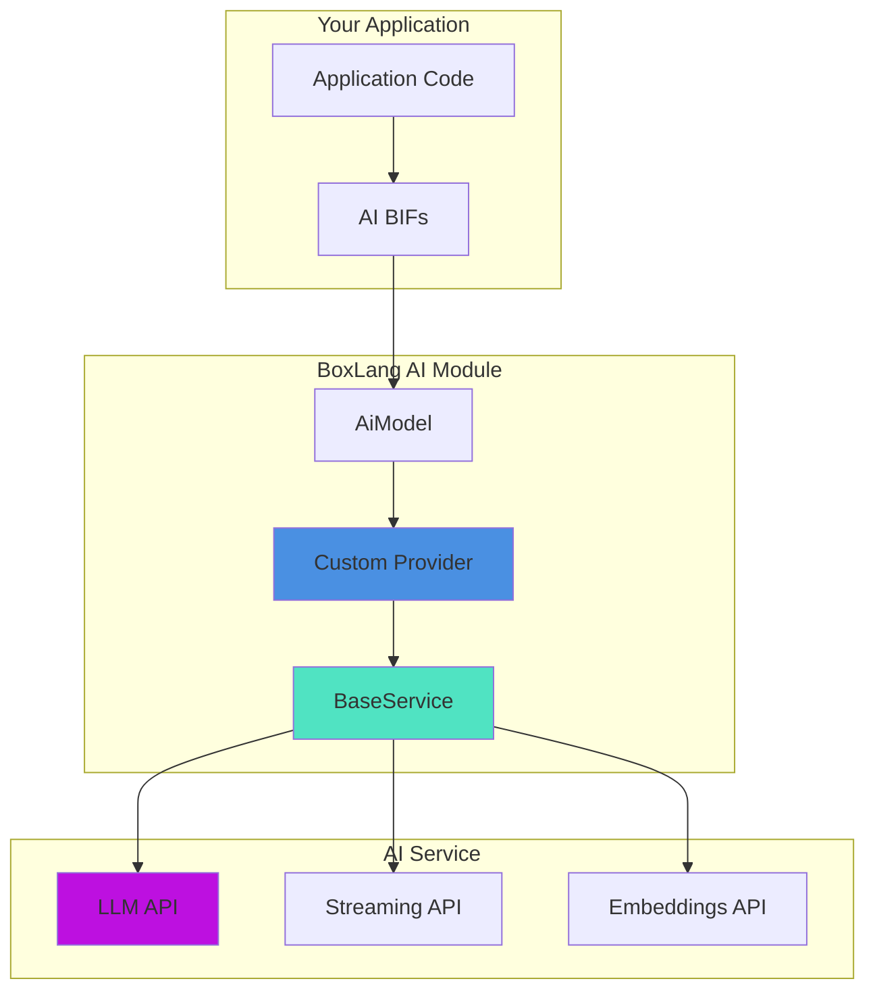

# 🔌 Building Custom AI Providers

Create custom AI provider integrations to connect any LLM service with BoxLang AI. This guide shows you how to build providers that work seamlessly with all BoxLang AI features including streaming, tools, embeddings, and memory systems.

## 🎯 Why Custom Providers?

Build custom providers when you need to:

- **Enterprise LLMs** - Connect to private AI deployments or custom endpoints
- **Emerging Services** - Integrate new AI providers not yet supported
- **Custom Logic** - Add organization-specific request/response handling
- **API Wrappers** - Create simplified interfaces for complex AI services
- **Testing Mocks** - Build mock providers for development and testing

## 🏗️ Provider Architecture



## 📝 IAiService Interface

All AI providers must implement the `IAiService` interface:

```javascript
interface {
    /**
     * Get the name of the LLM
     */
    function getName();

    /**
     * Configure the service with an API key
     * @apiKey - The API key to use with the provider
     * @return The service instance
     */
    IAiService function configure( required any apiKey );

    /**
     * Invoke the provider service with a AiRequest object
     * @aiRequest The AiRequest object to send to the provider
     * @return The response from the service
     */
    function invoke( required AiRequest aiRequest );

    /**
     * Invoke the provider service in streaming mode
     * @aiRequest The AiRequest object to send to the provider
     * @callback A callback function called with each chunk: function( chunk )
     * @return void
     */
    function invokeStream( required AiRequest aiRequest, required function callback );

    /**
     * Generate embeddings for the given input text(s)
     * @embeddingRequest The embedding request object
     * @return The embeddings response from the provider
     */
    function embeddings( required AiEmbeddingRequest embeddingRequest );
}
```

## 🚀 Quick Start: Simple Custom Provider

Here's a minimal custom provider for an OpenAI-compatible service:

```javascript
// CustomAIService.bx
import bxModules.bxai.models.providers.BaseService;

/**
 * Custom AI provider for MyAI service
 */
class extends="BaseService" {

    /**
     * Static defaults
     */
    static {
        DEFAULT_CHAT_PARAMS = {
            "model": "my-ai-model-v1"
        };
    }

    /**
     * Constructor
     */
    function init() {
        // Set provider-specific URLs
        variables.chatURL = "https://api.myai.com/v1/chat/completions";
        variables.embeddingsURL = "https://api.myai.com/v1/embeddings";
        variables.name = "MyAI";
        
        // Set default parameters
        defaults( static.DEFAULT_CHAT_PARAMS );
        
        return this;
    }
}
```

**Usage:**

```javascript
import CustomAIService;

// Create and configure provider
aiService = new CustomAIService()
    .configure( "your-api-key" );

// Use with aiChat
response = aiChat(
    provider: aiService,
    messages: "What is AI?"
);
println( response );
```

## 🎨 Extending BaseService

The `BaseService` provides OpenAI-compatible implementation:

### Inherited Properties

```javascript
property name="name" default="";              // Provider name
property name="apiKey" default="";            // API key
property name="chatURL" default="";           // Chat endpoint
property name="embeddingsURL" default="";     // Embeddings endpoint
property name="params" type="struct";         // Default parameters
property name="headers" type="struct";        // Default headers
property name="maxInteractions" default=10;   // Tool call limit
```

### Inherited Methods

```javascript
// Configuration
function defaults( required params )          // Set default params
function addHeader( required name, value )    // Add default header
function configure( required apiKey )         // Set API key

// Request handling (OpenAI-compatible)
function invoke( required aiRequest )         // Standard invocation
function invokeStream( aiRequest, callback )  // Streaming invocation
function embeddings( embeddingRequest )       // Generate embeddings

// Internal methods
function chat( required aiRequest )           // Chat request
function chatStream( aiRequest, callback )    // Streaming chat
```

## 💡 Provider Types

### Type 1: OpenAI-Compatible (Simplest)

If your provider follows OpenAI's API format, just extend `BaseService`:

```javascript
class extends="BaseService" {
    
    static {
        DEFAULT_CHAT_PARAMS = {
            "model": "your-default-model"
        };
    }

    function init() {
        variables.chatURL = "https://your-api.com/v1/chat/completions";
        variables.embeddingsURL = "https://your-api.com/v1/embeddings";
        variables.name = "YourProvider";
        defaults( static.DEFAULT_CHAT_PARAMS );
        return this;
    }
}
```

**Examples in codebase:**
- `OpenAIService.bx` - Standard OpenAI
- `GroqService.bx` - Groq (OpenAI-compatible)
- `DeepSeekService.bx` - DeepSeek (OpenAI-compatible)
- `PerplexityService.bx` - Perplexity (OpenAI-compatible)

### Type 2: Custom Authentication

Override methods to handle non-standard authentication:

```javascript
class extends="BaseService" {
    
    function init() {
        variables.chatURL = "https://api.provider.com/chat";
        variables.name = "CustomAuth";
        defaults( { "model": "default-model" } );
        return this;
    }

    /**
     * Override chat to customize authentication
     */
    @override
    function chat( required AiRequest aiRequest ) {
        // Build data packet
        var dataPacket = {
            "model": arguments.aiRequest.getModel(),
            "messages": arguments.aiRequest.getAiMessage().getMessages()
        }.append( arguments.aiRequest.getParams() );

        // Announce request
        BoxAnnounce( "onAIRequest", {
            dataPacket: dataPacket,
            aiRequest: arguments.aiRequest,
            provider: this
        });

        // Make HTTP request with custom auth
        var response = httpRequest( getChatURL() )
            .setMethod( "POST" )
            .addHeader( "X-API-Key", arguments.aiRequest.getApiKey() )
            .addHeader( "X-Client-ID", "your-client-id" )
            .setBody( jsonSerialize( dataPacket ) )
            .send();

        var result = response.getDataAsJSON();

        // Announce response
        BoxAnnounce( "onAIResponse", {
            response: result,
            aiRequest: arguments.aiRequest,
            provider: this
        });

        return result.choices[1].message.content;
    }
}
```

**Examples in codebase:**
- `ClaudeService.bx` - Uses `x-api-key` header instead of Bearer token

### Type 3: Custom Request/Response Format

Override methods to transform request/response formats:

```javascript
class extends="BaseService" {
    
    static {
        DEFAULT_CHAT_PARAMS = {
            "model": "custom-model"
        };
    }

    function init() {
        variables.chatURL = "https://api.custom.com/generate";
        variables.name = "CustomFormat";
        defaults( static.DEFAULT_CHAT_PARAMS );
        return this;
    }

    /**
     * Override chat to transform request format
     */
    @override
    function chat( required AiRequest aiRequest ) {
        // Transform to provider's format
        var dataPacket = {
            "modelName": arguments.aiRequest.getModel(),
            "prompt": formatMessagesAsPrompt( arguments.aiRequest.getAiMessage() ),
            "settings": {
                "temperature": arguments.aiRequest.getParams().temperature ?: 0.7,
                "maxLength": arguments.aiRequest.getParams().max_tokens ?: 1000
            }
        };

        // Make request
        var response = httpRequest( getChatURL() )
            .setMethod( "POST" )
            .addHeader( "Authorization", "Bearer #arguments.aiRequest.getApiKey()#" )
            .setBody( jsonSerialize( dataPacket ) )
            .send();

        var result = response.getDataAsJSON();

        // Transform response to standard format
        return result.generatedText ?: "";
    }

    /**
     * Helper to convert messages to single prompt
     */
    private function formatMessagesAsPrompt( required aiMessage ) {
        var prompt = "";
        
        for ( var msg in arguments.aiMessage.getMessages() ) {
            if ( msg.role == "system" ) {
                prompt &= "System: #msg.content#" & char(10);
            } else if ( msg.role == "user" ) {
                prompt &= "User: #msg.content#" & char(10);
            } else if ( msg.role == "assistant" ) {
                prompt &= "Assistant: #msg.content#" & char(10);
            }
        }
        
        return prompt;
    }
}
```

**Examples in codebase:**
- `GeminiService.bx` - Different message format
- `CohereService.bx` - Custom request structure

### Type 4: Custom Streaming

Override streaming to handle provider-specific SSE formats:

```javascript
class extends="BaseService" {
    
    /**
     * Override chatStream to handle custom streaming format
     */
    @override
    function chatStream( required AiRequest aiRequest, required function callback ) {
        var userCallback = arguments.callback;
        var thisAiRequest = arguments.aiRequest;

        var dataPacket = {
            "model": arguments.aiRequest.getModel(),
            "messages": arguments.aiRequest.getAiMessage().getMessages(),
            "stream": true
        };

        BoxAnnounce( "onAIRequest", {
            dataPacket: dataPacket,
            aiRequest: arguments.aiRequest,
            provider: this
        });

        var httpRequest = http( getChatURL() )
            .method( "POST" )
            .charset( "utf-8" )
            .timeout( arguments.aiRequest.getTimeout() )
            .header( "Authorization", "Bearer #arguments.aiRequest.getApiKey()#" )
            .header( "Content-Type", "application/json" )
            .sse( true )
            .body( jsonSerialize( dataPacket ) )
            .onChunk( ( chunk, lastEventId, httpResult, httpClient, response ) => {
                // Handle stream end
                if ( chunk.data == "[DONE]" ) {
                    return;
                }

                try {
                    var parsedChunk = jsonDeserialize( chunk.data );
                    
                    // Transform to standard format if needed
                    var standardChunk = {
                        "choices": [{
                            "delta": {
                                "content": parsedChunk.text ?: ""
                            }
                        }]
                    };
                    
                    userCallback( standardChunk );
                } catch ( any e ) {
                    writeLog(
                        text: "Error parsing stream chunk: #e.message#",
                        type: "error",
                        log: "ai"
                    );
                }
            })
            .onError( ( error, httpResult ) => {
                writeLog(
                    text: "Stream error: #error.message#",
                    type: "error",
                    log: "ai"
                );
                
                BoxAnnounce( "onAIError", {
                    error: error,
                    provider: this,
                    operation: "stream",
                    aiRequest: thisAiRequest,
                    canRetry: true
                });
            });

        httpRequest.send();
    }
}
```

**Examples in codebase:**
- `ClaudeService.bx` - Custom authentication in streaming
- `OllamaService.bx` - Different SSE format

## 🛠️ Advanced Features

### Tool/Function Calling Support

If your provider supports tools, format them correctly:

```javascript
class extends="BaseService" {
    
    @override
    function chat( required AiRequest aiRequest ) {
        var dataPacket = {
            "model": arguments.aiRequest.getModel(),
            "messages": arguments.aiRequest.getAiMessage().getMessages()
        };

        // Add tools if present
        if ( aiRequest.getParams()?.tools?.len() ) {
            dataPacket[ "tools" ] = formatToolsForProvider( 
                aiRequest.getParams().tools 
            );
        }

        // Rest of implementation...
    }

    /**
     * Format tools to provider's schema
     */
    private function formatToolsForProvider( required array tools ) {
        return arguments.tools.map( function( tool ) {
            return {
                "name": tool.function.name,
                "description": tool.function.description,
                "parameters": tool.function.parameters
            };
        });
    }
}
```

**Examples in codebase:**
- `ClaudeService.bx` - Full tool calling implementation with recursive handling

### Custom Headers

Add provider-specific headers:

```javascript
class extends="BaseService" {
    
    static {
        DEFAULT_HEADERS = {
            "X-Provider-Version": "v1",
            "X-Custom-Header": "value"
        };
    }

    function init() {
        variables.chatURL = "https://api.provider.com/chat";
        variables.name = "CustomHeaders";
        defaults( { "model": "default" } );
        
        // Add static headers
        for ( var header in static.DEFAULT_HEADERS ) {
            addHeader( header, static.DEFAULT_HEADERS[ header ] );
        }
        
        return this;
    }
}
```

**Examples in codebase:**
- `ClaudeService.bx` - Adds `anthropic-version` header

### Embeddings Support

Override embeddings for custom embedding endpoints:

```javascript
class extends="BaseService" {
    
    static {
        DEFAULT_EMBED_PARAMS = {
            "model": "text-embeddings-v1"
        };
    }

    function init() {
        variables.chatURL = "https://api.provider.com/chat";
        variables.embeddingsURL = "https://api.provider.com/embeddings";
        variables.name = "CustomEmbeddings";
        return this;
    }

    @override
    function embeddings( required AiEmbeddingRequest embeddingRequest ) {
        // Set default model if not specified
        if ( embeddingRequest.getModel().isEmpty() ) {
            embeddingRequest.setModelIfEmpty( static.DEFAULT_EMBED_PARAMS.model );
        }

        // Use parent implementation or customize
        return super.embeddings( embeddingRequest );
    }
}
```

**Examples in codebase:**
- `OpenAIService.bx` - Sets default embedding model
- `VoyageService.bx` - Custom embeddings implementation
- `CohereService.bx` - Different embeddings format

## 🔧 Real-World Example: Complete Custom Provider

Here's a comprehensive example integrating a fictional AI service with all features:

```javascript
// AcmeAIService.bx
import bxModules.bxai.models.providers.BaseService;

/**
 * Acme AI Provider - Full implementation example
 * Demonstrates all customization points
 */
class extends="BaseService" {

    static {
        DEFAULT_CHAT_PARAMS = {
            "model": "acme-gpt-turbo",
            "temperature": 0.7,
            "max_tokens": 2000
        };
        DEFAULT_EMBED_PARAMS = {
            "model": "acme-embeddings-large"
        };
        API_VERSION = "2024-01";
    }

    function init() {
        variables.chatURL = "https://api.acme-ai.com/v1/completions";
        variables.embeddingsURL = "https://api.acme-ai.com/v1/embed";
        variables.name = "AcmeAI";
        
        defaults( static.DEFAULT_CHAT_PARAMS );
        addHeader( "X-API-Version", static.API_VERSION );
        
        return this;
    }

    /**
     * Override chat for custom authentication and format
     */
    @override
    function chat( required AiRequest aiRequest ) {
        // Transform messages for Acme's format
        var messages = arguments.aiRequest.getAiMessage().getMessages();
        var acmeMessages = [];
        
        for ( var msg in messages ) {
            acmeMessages.append({
                "speaker": msg.role == "user" ? "human" : "ai",
                "text": msg.content,
                "timestamp": now().getTime()
            });
        }

        // Build request
        var dataPacket = {
            "model_name": arguments.aiRequest.getModel(),
            "conversation": acmeMessages,
            "parameters": {
                "temp": arguments.aiRequest.getParams().temperature ?: 0.7,
                "max_output": arguments.aiRequest.getParams().max_tokens ?: 2000
            }
        };

        // Add tools if present
        if ( arguments.aiRequest.getParams()?.tools?.len() ) {
            dataPacket[ "functions" ] = formatAcmeTools( 
                arguments.aiRequest.getParams().tools 
            );
        }

        BoxAnnounce( "onAIRequest", {
            dataPacket: dataPacket,
            aiRequest: arguments.aiRequest,
            provider: this
        });

        if ( arguments.aiRequest.getLogRequestToConsole() ) {
            println( "🤖 Acme AI Request:" );
            println( dataPacket );
        }

        try {
            // Make request with custom authentication
            var response = httpRequest( getChatURL() )
                .setMethod( "POST" )
                .addHeader( "X-Acme-Key", arguments.aiRequest.getApiKey() )
                .addHeader( "X-API-Version", static.API_VERSION )
                .addHeader( "Content-Type", "application/json" )
                .setTimeout( arguments.aiRequest.getTimeout() )
                .setBody( jsonSerialize( dataPacket ) )
                .send();

            var result = response.getDataAsJSON();

            if ( arguments.aiRequest.getLogResponseToConsole() ) {
                println( "📨 Acme AI Response:" );
                println( result );
            }

            BoxAnnounce( "onAIResponse", {
                response: result,
                aiRequest: arguments.aiRequest,
                provider: this
            });

            // Transform response to standard format
            return result.output?.text ?: result.response ?: "";

        } catch ( any e ) {
            writeLog(
                text: "Acme AI Error: #e.message#",
                type: "error",
                log: "ai"
            );

            BoxAnnounce( "onAIError", {
                error: e,
                provider: this,
                operation: "chat",
                aiRequest: arguments.aiRequest,
                canRetry: true
            });

            throw(
                type: "AcmeAIException",
                message: "Failed to invoke Acme AI: #e.message#",
                detail: e.detail
            );
        }
    }

    /**
     * Override streaming for Acme's SSE format
     */
    @override
    function chatStream( required AiRequest aiRequest, required function callback ) {
        var userCallback = arguments.callback;
        var thisAiRequest = arguments.aiRequest;

        // Transform messages
        var messages = arguments.aiRequest.getAiMessage().getMessages();
        var acmeMessages = messages.map( function( msg ) {
            return {
                "speaker": msg.role == "user" ? "human" : "ai",
                "text": msg.content
            };
        });

        var dataPacket = {
            "model_name": arguments.aiRequest.getModel(),
            "conversation": acmeMessages,
            "stream": true
        };

        BoxAnnounce( "onAIRequest", {
            dataPacket: dataPacket,
            aiRequest: arguments.aiRequest,
            provider: this
        });

        var httpRequest = http( getChatURL() )
            .method( "POST" )
            .charset( "utf-8" )
            .timeout( arguments.aiRequest.getTimeout() )
            .header( "X-Acme-Key", arguments.aiRequest.getApiKey() )
            .header( "X-API-Version", static.API_VERSION )
            .header( "Content-Type", "application/json" )
            .sse( true )
            .body( jsonSerialize( dataPacket ) )
            .onChunk( ( chunk, lastEventId, httpResult, httpClient, response ) => {
                if ( chunk.data == "[END]" ) {
                    return;
                }

                try {
                    var parsedChunk = jsonDeserialize( chunk.data );
                    
                    // Transform Acme format to OpenAI-compatible
                    var standardChunk = {
                        "choices": [{
                            "delta": {
                                "content": parsedChunk.chunk_text ?: ""
                            }
                        }]
                    };
                    
                    userCallback( standardChunk );
                } catch ( any e ) {
                    writeLog(
                        text: "Stream parsing error: #e.message#",
                        type: "error",
                        log: "ai"
                    );
                }
            })
            .onError( ( error, httpResult ) => {
                writeLog(
                    text: "Stream error: #error.message#",
                    type: "error",
                    log: "ai"
                );
                
                BoxAnnounce( "onAIError", {
                    error: error,
                    provider: this,
                    operation: "stream",
                    aiRequest: thisAiRequest,
                    canRetry: true
                });
            });

        httpRequest.send();
    }

    /**
     * Override embeddings for custom format
     */
    @override
    function embeddings( required AiEmbeddingRequest embeddingRequest ) {
        if ( embeddingRequest.getModel().isEmpty() ) {
            embeddingRequest.setModelIfEmpty( static.DEFAULT_EMBED_PARAMS.model );
        }

        var dataPacket = {
            "model_name": embeddingRequest.getModel(),
            "texts": isArray( embeddingRequest.getInput() ) 
                ? embeddingRequest.getInput() 
                : [ embeddingRequest.getInput() ]
        };

        var response = httpRequest( getEmbeddingsURL() )
            .setMethod( "POST" )
            .addHeader( "X-Acme-Key", embeddingRequest.getApiKey() )
            .addHeader( "X-API-Version", static.API_VERSION )
            .setBody( jsonSerialize( dataPacket ) )
            .send();

        var result = response.getDataAsJSON();

        // Transform to standard format
        return {
            "data": result.embeddings.map( function( emb, idx ) {
                return {
                    "embedding": emb,
                    "index": idx - 1
                };
            })
        };
    }

    /**
     * Format tools for Acme's function schema
     */
    private function formatAcmeTools( required array tools ) {
        return arguments.tools.map( function( tool ) {
            return {
                "function_name": tool.function.name,
                "description": tool.function.description ?: "",
                "parameters_schema": tool.function.parameters
            };
        });
    }
}
```

**Usage:**

```javascript
import AcmeAIService;

// Initialize provider
acmeAI = new AcmeAIService()
    .configure( getSystemSetting( "ACME_API_KEY" ) )
    .defaults({
        temperature: 0.8,
        max_tokens: 3000
    });

// Use with aiChat
response = aiChat(
    provider: acmeAI,
    messages: "Explain quantum computing",
    model: "acme-gpt-turbo"
);

// Use with streaming
aiChat(
    provider: acmeAI,
    messages: "Write a story",
    stream: true,
    callback: function( chunk ) {
        print( chunk.choices[1].delta.content ?: "" );
    }
);

// Use with models and pipelines
model = aiModel( acmeAI )
    .to( aiTransform( data => data.toUpper() ) );

result = model.run( "hello world" );
```

## 📦 Registering Custom Providers

### Module Registration

In your `ModuleConfig.bx`:

```javascript
function configure() {
    // Register custom provider
    bifs = [
        "AcmeAIService"
    ];

    // Listen for provider creation events
    interceptorSettings = {
        customPoints = {
            "onAIProviderCreate"
        }
    };

    // Intercept provider creation to inject custom providers
    interceptors = [
        {
            class: "interceptors.ProviderRegistration",
            name: "ProviderRegistration"
        }
    ];
}
```

**Interceptor implementation:**

```javascript
// interceptors/ProviderRegistration.bx
component {
    
    function onAIProviderCreate( event, interceptData ) {
        var providerName = interceptData.providerName ?: "";
        
        // Register Acme AI provider
        if ( providerName == "acmeai" ) {
            import AcmeAIService;
            interceptData.provider = new AcmeAIService();
        }
    }
}
```

### Application Registration

For non-module registration, use `BoxRegisterInterceptor()`:

```javascript
// Application.bx
import AcmeAIService;

component {
    
    this.name = "MyApp";

    function onApplicationStart() {
        // Register provider interceptor
        BoxRegisterInterceptor( {
            class: function( event, interceptData ) {
                if ( interceptData.providerName == "acmeai" ) {
                    interceptData.provider = new AcmeAIService();
                }
            },
            points: "onAIProviderCreate"
        });
    }
}
```

### Direct Usage

Most common approach - instantiate directly:

```javascript
import AcmeAIService;

// Create instance
acmeService = new AcmeAIService()
    .configure( "api-key" );

// Use with aiChat
response = aiChat(
    provider: acmeService,
    messages: "Hello!"
);

// Or with aiModel
model = aiModel( acmeService );
result = model.run( "Test message" );
```

## ✅ Best Practices

### 1. Configuration Validation

Validate configuration on initialization:

```javascript
function init() {
    variables.chatURL = "https://api.provider.com/chat";
    variables.name = "Provider";
    
    // Validate URLs
    if ( !variables.chatURL.len() ) {
        throw(
            type: "ConfigurationError",
            message: "Chat URL must be configured"
        );
    }
    
    defaults( static.DEFAULT_CHAT_PARAMS );
    return this;
}

function configure( required any apiKey ) {
    // Validate API key
    if ( !arguments.apiKey.len() ) {
        throw(
            type: "ConfigurationError",
            message: "API key cannot be empty"
        );
    }
    
    variables.apiKey = arguments.apiKey;
    return this;
}
```

### 2. Error Handling

Provide detailed error information:

```javascript
try {
    var response = httpRequest( getChatURL() )
        .setMethod( "POST" )
        .setBody( jsonSerialize( dataPacket ) )
        .send();

    var result = response.getDataAsJSON();
    
    // Check for API errors
    if ( result.error?.message?.len() ) {
        throw(
            type: "ProviderAPIError",
            message: result.error.message,
            detail: jsonSerialize( result.error )
        );
    }
    
    return result;

} catch ( any e ) {
    // Log error
    writeLog(
        text: "Provider error: #e.message#",
        type: "error",
        log: "ai"
    );

    // Announce error for monitoring
    BoxAnnounce( "onAIError", {
        error: e,
        provider: this,
        operation: "chat",
        aiRequest: arguments.aiRequest,
        canRetry: shouldRetry( e )
    });

    // Re-throw with context
    throw(
        type: "ProviderException",
        message: "Failed to invoke provider: #e.message#",
        detail: jsonSerialize({
            provider: getName(),
            endpoint: getChatURL(),
            error: e
        })
    );
}
```

### 3. Event Announcements

Always announce requests/responses for observability:

```javascript
// Before request
BoxAnnounce( "onAIRequest", {
    dataPacket: dataPacket,
    aiRequest: arguments.aiRequest,
    provider: this
});

// After response
BoxAnnounce( "onAIResponse", {
    response: result,
    aiRequest: arguments.aiRequest,
    provider: this
});

// On error
BoxAnnounce( "onAIError", {
    error: e,
    provider: this,
    operation: "chat",
    aiRequest: arguments.aiRequest,
    canRetry: true
});
```

### 4. Logging Support

Respect logging configuration:

```javascript
// Log request if enabled
if ( arguments.aiRequest.getLogRequestToConsole() ) {
    println( "🤖 AI Request (#getName()#):" );
    println( dataPacket );
}

// Log response if enabled
if ( arguments.aiRequest.getLogResponseToConsole() ) {
    println( "📨 AI Response (#getName()#):" );
    println( result );
}
```

### 5. Defensive Programming

Handle null/missing data gracefully:

```javascript
// Safe property access
var content = result.choices[1].delta.content ?: "";
var content = result.choices[1]?.delta?.content ?: "";

// Safe array access
if ( result.choices?.len() ) {
    return result.choices[1].message.content;
}

// Provide defaults
var temperature = arguments.aiRequest.getParams().temperature ?: 0.7;
var maxTokens = arguments.aiRequest.getParams().max_tokens ?: 1000;
```

## 🧪 Testing Custom Providers

### Unit Tests

Create comprehensive tests:

```javascript
// tests/AcmeAIServiceTest.bx
import testbox.system.BaseSpec;
import AcmeAIService;

class extends="BaseSpec" {
    
    function beforeAll() {
        variables.service = new AcmeAIService();
    }

    function run() {
        describe( "AcmeAIService", function() {
            
            it( "should initialize with defaults", function() {
                expect( service.getName() ).toBe( "AcmeAI" );
                expect( service.getChatURL() ).toInclude( "acme-ai.com" );
            });

            it( "should configure with API key", function() {
                service.configure( "test-key" );
                expect( service.getApiKey() ).toBe( "test-key" );
            });

            it( "should set default parameters", function() {
                service.defaults({ temperature: 0.5 });
                var params = service.getParams();
                expect( params.temperature ).toBe( 0.5 );
            });

            it( "should make chat request", function() {
                // Mock HTTP request or use test endpoint
                var aiRequest = new AiRequest()
                    .setModel( "acme-gpt-turbo" )
                    .setMessages([ { role: "user", content: "test" }])
                    .setApiKey( "test-key" );

                var response = service.invoke( aiRequest );
                expect( response ).toBeString();
            });
        });
    }
}
```

### Integration Tests

Test with real API:

```javascript
// tests/integration/AcmeAIIntegrationTest.bx
import testbox.system.BaseSpec;
import AcmeAIService;

class extends="BaseSpec" {
    
    function run() {
        describe( "AcmeAI Integration", function() {
            
            beforeEach( function() {
                variables.apiKey = getSystemSetting( "ACME_API_KEY", "" );
                if ( !variables.apiKey.len() ) {
                    skip( "ACME_API_KEY not set" );
                }
            });

            it( "should make real chat request", function() {
                var service = new AcmeAIService()
                    .configure( variables.apiKey );

                var aiRequest = new AiRequest()
                    .setModel( "acme-gpt-turbo" )
                    .setMessages([ 
                        { role: "user", content: "Say hello" }
                    ]);

                var response = service.invoke( aiRequest );
                
                expect( response ).toBeString();
                expect( response.len() ).toBeGT( 0 );
            });

            it( "should stream responses", function() {
                var service = new AcmeAIService()
                    .configure( variables.apiKey );

                var chunks = [];
                var aiRequest = new AiRequest()
                    .setModel( "acme-gpt-turbo" )
                    .setMessages([ 
                        { role: "user", content: "Count to 3" }
                    ]);

                service.invokeStream( 
                    aiRequest,
                    function( chunk ) {
                        chunks.append( chunk );
                    }
                );

                expect( chunks.len() ).toBeGT( 0 );
            });
        });
    }
}
```

## 📚 Next Steps

- 📖 **AI Models**: [Understanding AI models](../main-components/models.md)
- 🔧 **Configuration**: [Module settings](../getting-started/installation.md)
- 🎯 **Events**: [Event system](./events.md)
- 🧪 **Testing**: Check existing provider tests in `src/test/`

## 🎓 Summary

Custom AI providers enable you to:

- ✅ Connect any LLM service to BoxLang AI
- ✅ Handle custom authentication and request formats
- ✅ Implement streaming and embeddings support
- ✅ Add organization-specific logic and transformations
- ✅ Create mock providers for testing
- ✅ Work seamlessly with all BoxLang AI features

Start with `BaseService` for OpenAI-compatible APIs, or override methods for custom implementations!
