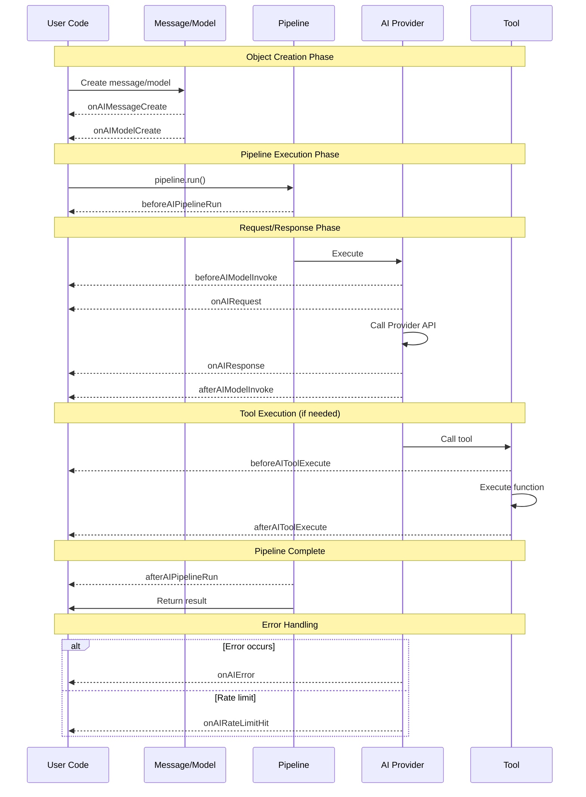
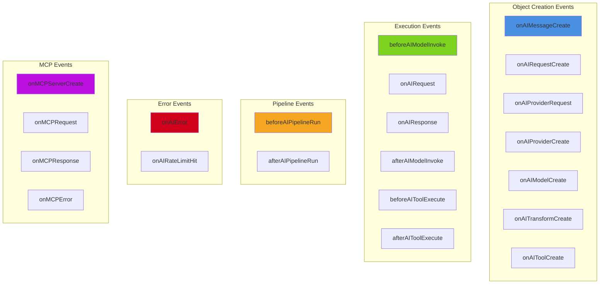
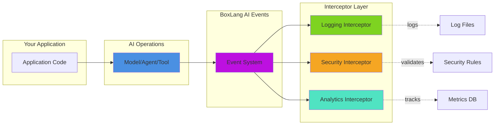

# 🎯 Event System

The BoxLang AI module provides a comprehensive event system that allows you to intercept, monitor, and customize AI operations at various stages. These events give you fine-grained control over the AI lifecycle, from object creation to request/response handling.

## 📋 Table of Contents

- [Overview](#overview)
- [Event Interception](#event-interception)
- [Available Events](#available-events)
- [Common Use Cases](#common-use-cases)
- [Examples](#examples)
- [Best Practices](#best-practices)

---

## 🔍 Overview

The event system allows you to **monitor**, **modify**, **validate**, **audit**, **secure**, and **customize** AI operations without modifying core code.

### All Available Events

| # | Event | When Fired | Key Data |
|---|-------|------------|----------|
| 1 | [onAIMessageCreate](#1-onaimessagecreate) | Message template created | `message` |
| 2 | [onAIRequestCreate](#2-onairequestcreate) | Request object instantiated | `aiRequest` |
| 3 | [onAIProviderRequest](#3-onaiproviderrequest) | Before provider creation | `provider`, `apiKey` |
| 4 | [onAIProviderCreate](#4-onaiprovidercreate) | Provider instance created | `provider` |
| 5 | [onAIModelCreate](#5-onaimodelcreate) | Model runnable created | `model`, `service` |
| 6 | [onAITransformCreate](#6-onaitransformcreate) | Transform runnable created | `transform` |
| 7 | [beforeAIModelInvoke](#7-beforeaimodelinvoke) | Before model execution | `model`, `request` |
| 8 | [onAIRequest](#8-onairequest) | Before HTTP request sent | `dataPacket`, `aiRequest`, `provider` |
| 9 | [onAIResponse](#9-onairesponse) | After HTTP response received | `response`, `rawResponse`, `provider` |
| 10 | [afterAIModelInvoke](#10-afteraimodelinvoke) | After model execution completes | `model`, `request`, `results` |
| 11 | [onAIToolCreate](#11-onaitoolcreate) | Tool created | `tool`, `name`, `description` |
| 12 | [beforeAIToolExecute](#12-beforeaitoolexecute) | Before tool execution | `tool`, `name`, `arguments` |
| 13 | [afterAIToolExecute](#13-afteraitoolexecute) | After tool execution | `tool`, `results`, `executionTime` |
| 14 | [onAIError](#14-onaierror) | Error occurs | `error`, `errorMessage`, `provider`, `canRetry` |
| 15 | [onAIRateLimitHit](#15-onairatelimithit) | Rate limit detected (429) | `provider`, `statusCode`, `retryAfter` |
| 16 | [beforeAIPipelineRun](#16-beforeaipipelinerun) | Before pipeline starts | `sequence`, `stepCount`, `input` |
| 17 | [afterAIPipelineRun](#17-afteraipipelinerun) | After pipeline completes | `sequence`, `result`, `executionTime` |
| 18 | [onAITokenCount](#18-onaitokencount) | Token usage available | `provider`, `model`, `totalTokens` |
| 19 | [onMCPServerCreate](#19-onmcpservercreate) | MCP server instance created | `server`, `name`, `description` |
| 20 | [onMCPServerRemove](#20-onmcpserverremove) | MCP server instance removed | `name` |
| 21 | [onMCPRequest](#21-onmcprequest) | Before processing MCP request | `server`, `requestData`, `serverName` |
| 22 | [onMCPResponse](#22-onmcpresponse) | After processing MCP response | `server`, `response`, `requestData` |
| 23 | [onMCPError](#23-onmcperror) | Exception during MCP operations | `server`, `context`, `exception`, request details |

### 🔄 Event Lifecycle Diagram



### 📊 Event Categories



---

## 🔌 Event Interception

To listen to events, create an interceptor and register it in your module or application.

### 🏗️ Interceptor Architecture



### Creating an Interceptor

```javascript
// interceptors/AIMonitor.bx
class {

    function configure() {
        // Interceptor configuration
    }

    function onAIRequest( event, interceptData ) {
        // Your event handling logic
    }

    function onAIResponse( event, interceptData ) {
        // Your event handling logic
    }
}
```

### Registering an Interceptor

**For BoxLang Modules** (in `ModuleConfig.bx`):

```javascript
function configure() {
    interceptors = [
        {
            class: "interceptors.AIMonitor",
            properties: {}
        }
    ];
}
```

**For Applications/Scripts** (use `BoxRegisterInterceptor()` BIF):

```javascript
// Application.bx or script
BoxRegisterInterceptor( "AIMonitor", "path.to.AIMonitor" );
```

📖 **Reference**: [BoxRegisterInterceptor() Documentation](https://boxlang.ortusbooks.com/boxlang-language/reference/built-in-functions/system/boxregisterinterceptor)

---

## 📡 Available Events

### 1. onAIMessageCreate

Fired when an AI message object is created via `aiMessage()`.

**When**: Message template creation
**Frequency**: Once per `aiMessage()` call

#### Event Arguments

| Argument | Type | Description |
|----------|------|-------------|
| `message` | `AiMessage` | The created message object |

#### Example

```java
function onAIMessageCreate( event, interceptData ) {
    var message = interceptData.message;

    // Log message creation
    writeLog(
        text: "AI Message created with #arrayLen( message.getMessages() )# messages",
        type: "info"
    );

    // Add default system message if none exists
    var messages = message.getMessages();
    if ( messages.isEmpty() || messages[1].role != "system" ) {
        message.system( "You are a helpful assistant" );
    }
}
```

---

### 2. onAIRequestCreate

Fired when an AI request object is created via `aiChatRequest()`.

**When**: Request object instantiation
**Frequency**: Once per `aiChatRequest()` call

#### Event Arguments

| Argument | Type | Description |
|----------|------|-------------|
| `aiRequest` | `AiRequest` | The created request object |
```

#### Example

```java
function onAIRequestCreate( event, interceptData ) {
    var request = interceptData.aiRequest;

    // Add tracking metadata
    request.setParams({
        user: getAuthenticatedUser(),
        requestId: createUUID(),
        timestamp: now()
    });

    // Apply organization-wide defaults
    if ( !request.getParams().keyExists( "temperature" ) ) {
        request.setParam( "temperature", 0.7 );
    }
}
```

---

### 3. onAIProviderRequest

Fired when a provider is requested from the factory.

**When**: Before provider/service is created or retrieved
**Frequency**: Once per provider request

#### Event Arguments

| Argument | Type | Description |
|----------|------|-------------|
| `provider` | `String` | Provider name (e.g., "openai", "claude") |
| `apiKey` | `String` | API key (if provided) |
| `params` | `Struct` | Request parameters |
| `options` | `Struct` | Request options |
```

#### Example

```java
function onAIProviderRequest( event, interceptData ) {
    var provider = interceptData.provider;

    // Override API keys from secure vault
    interceptData.apiKey = getSecretFromVault( "ai.#provider#.apiKey" );

    // Track provider usage
    trackProviderUsage( provider, getAuthenticatedUser() );

    // Apply rate limiting
    if ( hasExceededRateLimit( provider ) ) {
        throw( "Rate limit exceeded for provider: #provider#" );
    }
}
```

---

### 4. onAIProviderCreate

Fired when a provider/service instance is created.

**When**: After provider instantiation
**Frequency**: Once per unique provider instance

#### Event Arguments

| Argument | Type | Description |
|----------|------|-------------|
| `provider` | `IService` | The created service instance |
```

#### Example

```java
function onAIProviderCreate( event, interceptData ) {
    var service = interceptData.provider;

    // Configure provider-specific settings
    service.setTimeout( 60 );

    // Add custom headers
    service.setHeaders({
        "X-App-Version": getAppVersion(),
        "X-Environment": getEnvironment()
    });

    writeLog(
        text: "AI Provider created: #service.getProviderName()#",
        type: "info"
    );
}
```

---

### 5. onAIModelCreate

Fired when an AI model runnable is created via `aiModel()`.

**When**: Model wrapper creation
**Frequency**: Once per `aiModel()` call

#### Event Arguments

| Argument | Type | Description |
|----------|------|-------------|
| `model` | `AiModel` | The created model runnable |
| `service` | `IService` | The underlying service |
```

#### Example

```java
function onAIModelCreate( event, interceptData ) {
    var model = interceptData.model;
    var service = interceptData.service;

    // Set default model parameters
    model.setParams({
        temperature: 0.7,
        max_tokens: 2000
    });

    // Track model creation
    logMetric( "ai.model.created", {
        provider: service.getProviderName(),
        timestamp: now()
    });
}
```

---

### 6. onAITransformCreate

Fired when a transform runnable is created via `aiTransform()`.

**When**: Transform function creation
**Frequency**: Once per `aiTransform()` call

#### Event Arguments

| Argument | Type | Description |
|----------|------|-------------|
| `transform` | `AiTransformRunnable` | The created transform runnable |
```

#### Example

```java
function onAITransformCreate( event, interceptData ) {
    var transform = interceptData.transform;

    // Wrap transform with error handling
    var originalFn = transform.getTransformFn();
    transform.setTransformFn( function( input, params ) {
        try {
            return originalFn( input, params );
        } catch ( any e ) {
            logError( "Transform error: #e.message#" );
            return { error: true, message: e.message };
        }
    });
}
```

---

### 7. beforeAIModelInvoke

Fired before an AI model is invoked (before sending to provider).

**When**: Before model execution
**Frequency**: Every model invocation

#### Event Arguments

| Argument | Type | Description |
|----------|------|-------------|
| `model` | `AiModel` | The model being invoked |
| `request` | `AiRequest` | The request being sent |
```

#### Example

```java
function beforeAIModelInvoke( event, interceptData ) {
    var model = interceptData.model;
    var request = interceptData.request;

    // Validate request
    if ( arrayLen( request.getMessages() ) == 0 ) {
        throw( "Cannot invoke model with empty messages" );
    }

    // Add request tracking
    request.setMetadata({
        invokeTimestamp: now(),
        userId: getAuthenticatedUser()
    });

    // Cost estimation
    var estimatedTokens = estimateTokenCount( request.getMessages() );
    writeLog(
        text: "Model invocation: ~#estimatedTokens# tokens",
        type: "info"
    );
}
```

---

### 8. onAIRequest

Fired immediately before sending the HTTP request to the AI provider.

**When**: Before HTTP request
**Frequency**: Every API call (including streaming)

#### Event Arguments

| Argument | Type | Description |
|----------|------|-------------|
| `dataPacket` | `Struct` | The HTTP request data packet |
| `aiRequest` | `AiRequest` | The AI request object |
| `provider` | `IService` | The service making the request |
```

#### Example

```java
function onAIRequest( event, interceptData ) {
    var dataPacket = interceptData.dataPacket;
    var request = interceptData.aiRequest;
    var provider = interceptData.provider;

    // Modify request before sending
    dataPacket.headers[ "X-Request-ID" ] = createUUID();

    // Log request details
    writeLog(
        text: "AI Request to #provider.getProviderName()#: " &
              "#arrayLen( request.getMessages() )# messages",
        type: "info",
        log: "ai-requests"
    );

    // Track costs
    trackAPICall( provider.getProviderName(), request.getParams() );

    // Add custom authentication
    if ( getSetting( "useCustomAuth" ) ) {
        dataPacket.headers[ "Authorization" ] = getCustomAuthToken();
    }
}
```

---

### 9. onAIResponse

Fired after receiving the HTTP response from the AI provider.

**When**: After HTTP response
**Frequency**: Every API call (including streaming)

#### Event Arguments

| Argument | Type | Description |
|----------|------|-------------|
| `aiRequest` | `AiRequest` | The original request |
| `response` | `Struct` | The deserialized response |
| `rawResponse` | `Struct` | The raw HTTP response |
| `provider` | `IService` | The service that made the request |
```

#### Example

```java
function onAIResponse( event, interceptData ) {
    var response = interceptData.response;
    var request = interceptData.aiRequest;
    var provider = interceptData.provider;

    // Extract usage information
    if ( response.keyExists( "usage" ) ) {
        var usage = response.usage;
        logUsage({
            provider: provider.getProviderName(),
            promptTokens: usage.prompt_tokens ?: 0,
            completionTokens: usage.completion_tokens ?: 0,
            totalTokens: usage.total_tokens ?: 0,
            timestamp: now()
        });
    }

    // Modify response
    if ( response.keyExists( "choices" ) && arrayLen( response.choices ) > 0 ) {
        // Add metadata to response
        response._metadata = {
            processedAt: now(),
            provider: provider.getProviderName(),
            cached: false
        };
    }

    // Cache response
    if ( getSetting( "cacheResponses" ) ) {
        cacheResponse( request, response );
    }
}
```

---

### 10. afterAIModelInvoke

Fired after an AI model completes its invocation.

**When**: After model execution completes
**Frequency**: Every model invocation

#### Event Arguments

| Argument | Type | Description |
|----------|------|-------------|
| `model` | `AiModel` | The model that was invoked |
| `request` | `AiRequest` | The request that was sent |
| `results` | `Any` | The results returned by the model |
```

#### Example

```java
function afterAIModelInvoke( event, interceptData ) {
    var model = interceptData.model;
    var request = interceptData.request;
    var results = interceptData.results;

    // Calculate execution time
    var startTime = request.getMetadata().invokeTimestamp ?: now();
    var duration = dateDiff( "s", startTime, now() );

    // Log completion
    writeLog(
        text: "Model invocation completed in #duration#s",
        type: "info"
    );

    // Track metrics
    recordMetric( "ai.model.duration", duration );

    // Validate response
    if ( isStruct( results ) && results.keyExists( "error" ) ) {
        logError( "Model returned error: #results.error.message#" );
    }
}
```

---

### 11. onAIToolCreate

Fired when an AI tool is created via `aiTool()`.

**When**: Tool creation
**Frequency**: Once per `aiTool()` call

#### Event Arguments

| Argument | Type | Description |
|----------|------|-------------|
| `tool` | `Tool` | The created tool instance |
| `name` | `String` | Tool name |
| `description` | `String` | Tool description |
```

#### Example

```java
function onAIToolCreate( event, interceptData ) {
    var tool = interceptData.tool;

    // Register tool in catalog
    registerToolInCatalog( tool.getName(), tool.getSchema() );

    // Validate tool configuration
    if ( !tool.getSchema().function.parameters.properties.isEmpty() ) {
        writeLog(
            text: "Tool created: #tool.getName()# with #structCount( tool.getSchema().function.parameters.properties )# parameters",
            type: "info"
        );
    }
}
```

---

### 12. beforeAIToolExecute

Fired immediately before a tool's callable function is executed.

**When**: Before tool execution
**Frequency**: Every tool call

#### Event Arguments

| Argument | Type | Description |
|----------|------|-------------|
| `tool` | `Tool` | The tool being executed |
| `name` | `String` | Tool name |
| `arguments` | `Struct` | Arguments passed to the tool |
```

#### Example

```java
function beforeAIToolExecute( event, interceptData ) {
    var tool = interceptData.tool;
    var args = interceptData.arguments;

    // Validate tool arguments
    validateToolArguments( tool.getName(), args );

    // Check permissions
    var user = getAuthenticatedUser();
    if ( !hasToolPermission( user, tool.getName() ) ) {
        throw( "User not authorized to execute tool: #tool.getName()#" );
    }

    // Rate limiting per tool
    if ( isToolRateLimited( tool.getName() ) ) {
        throw( "Tool rate limit exceeded: #tool.getName()#" );
    }

    // Log execution attempt
    writeLog(
        text: "Executing tool: #tool.getName()# with args: #serializeJSON(args)#",
        type: "info",
        log: "ai-tools"
    );
}
```

---

### 13. afterAIToolExecute

Fired immediately after a tool's callable function completes execution.

**When**: After tool execution
**Frequency**: Every tool call

#### Event Arguments

| Argument | Type | Description |
|----------|------|-------------|
| `tool` | `Tool` | The tool that was executed |
| `name` | `String` | Tool name |
| `arguments` | `Struct` | Arguments passed to the tool |
| `results` | `Any` | Results returned by the tool |
| `executionTime` | `Numeric` | Execution time in milliseconds |
```

#### Example

```java
function afterAIToolExecute( event, interceptData ) {
    var tool = interceptData.tool;
    var results = interceptData.results;
    var executionTime = interceptData.executionTime;

    // Log execution metrics
    logMetric( "ai.tool.execution", {
        tool: tool.getName(),
        duration: executionTime,
        success: !isNull( results ),
        timestamp: now()
    });

    // Track tool usage
    trackToolUsage( tool.getName(), executionTime );

    // Alert on slow tools
    if ( executionTime > 5000 ) {
        writeLog(
            text: "Slow tool execution: #tool.getName()# took #executionTime#ms",
            type: "warning"
        );
    }

    // Validate results
    if ( isNull( results ) || results == "" ) {
        writeLog(
            text: "Tool returned empty result: #tool.getName()#",
            type: "warning"
        );
    }
}
```

---

### 14. onAIError

Fired when an error occurs during AI operations (chat, embeddings, or streaming).

**When**: Before throwing provider errors
**Frequency**: Every error condition

#### Event Arguments

| Argument | Type | Description |
|----------|------|-------------|
| `error` | `Any` | The error object/message from provider |
| `errorMessage` | `String` | Formatted error message |
| `provider` | `IService` | The provider where error occurred |
| `operation` | `String` | Operation type: "chat", "embeddings", "stream" |
| `aiRequest` | `AiRequest` | The request that caused the error (if available) |
| `embeddingRequest` | `AiEmbeddingRequest` | For embedding errors |
| `canRetry` | `Boolean` | Whether operation can be retried |
```

#### Example

```java
class {

    property name="retryAttempts" default={};
    property name="maxRetries" default=3;

    function onAIError( event, interceptData ) {
        var error = interceptData.error;
        var provider = interceptData.provider.getProviderName();
        var operation = interceptData.operation;
        var canRetry = interceptData.canRetry;

        // Log the error
        writeLog(
            text: "AI Error in #provider# (#operation#): #interceptData.errorMessage#",
            type: "error",
            log: "ai-errors"
        );

        // Track error metrics
        recordMetric( "ai.error", {
            provider: provider,
            operation: operation,
            errorType: isStruct( error ) ? error.type : "unknown",
            timestamp: now()
        });

        // Implement retry logic
        if ( canRetry ) {
            var requestId = interceptData.aiRequest?.getMetadata().requestId ?: createUUID();
            var attempts = retryAttempts.keyExists( requestId ) ? retryAttempts[ requestId ] : 0;

            if ( attempts < variables.maxRetries ) {
                retryAttempts[ requestId ] = attempts + 1;

                writeLog(
                    text: "Retry attempt #attempts+1# of #maxRetries# for request #requestId#",
                    type: "warning"
                );

                // Wait before retry (exponential backoff)
                sleep( 1000 * ( 2 ^ attempts ) );

                // Signal to retry (implementation specific)
                interceptData.shouldRetry = true;
            } else {
                // Max retries exceeded
                writeLog(
                    text: "Max retries exceeded for request #requestId#",
                    type: "error"
                );

                // Cleanup retry tracking
                structDelete( retryAttempts, requestId );
            }
        }

        // Send alerts for critical errors
        if ( !canRetry || attempts >= maxRetries ) {
            sendErrorAlert({
                provider: provider,
                operation: operation,
                error: interceptData.errorMessage,
                timestamp: now()
            });
        }
    }
}
```

---

### 15. onAIRateLimitHit

Fired when a provider returns a 429 (rate limit) HTTP status code.

**When**: When rate limit is detected
**Frequency**: Every rate limit response

#### Event Arguments

| Argument | Type | Description |
|----------|------|-------------|
| `provider` | `IService` | The provider that hit rate limit |
| `operation` | `String` | Operation type: "chat", "embeddings" |
| `statusCode` | `String` | HTTP status code (429) |
| `errorData` | `Struct` | Error response from provider |
| `aiRequest` | `AiRequest` | The request that hit the limit |
| `retryAfter` | `String` | Retry-After header value (if present) |
```

#### Example

```java
class {

    property name="rateLimitCooldowns" default={};

    function onAIRateLimitHit( event, interceptData ) {
        var provider = interceptData.provider.getProviderName();
        var retryAfter = interceptData.retryAfter;

        // Parse retry-after header (seconds or HTTP date)
        var cooldownSeconds = val( retryAfter );
        if ( cooldownSeconds == 0 && len( retryAfter ) ) {
            // Try parsing as HTTP date
            try {
                var retryDate = parseDateTime( retryAfter );
                cooldownSeconds = dateDiff( "s", now(), retryDate );
            } catch ( any e ) {
                cooldownSeconds = 60; // Default 1 minute
            }
        } else if ( cooldownSeconds == 0 ) {
            cooldownSeconds = 60; // Default if no header
        }

        var cooldownUntil = dateAdd( "s", cooldownSeconds, now() );
        rateLimitCooldowns[ provider ] = cooldownUntil;

        // Log rate limit
        writeLog(
            text: "Rate limit hit for #provider#. Cooldown until #cooldownUntil# (#cooldownSeconds#s)",
            type: "warning",
            log: "ai-rate-limits"
        );

        // Track in metrics
        recordMetric( "ai.rate_limit_hit", {
            provider: provider,
            cooldownSeconds: cooldownSeconds,
            timestamp: now()
        });

        // Send alert
        sendSlackAlert({
            channel: "#ai-monitoring",
            message: "🚨 Rate limit hit for #provider#. Cooling down for #cooldownSeconds# seconds.",
            color: "warning"
        });

        // Switch to backup provider if available
        var backupProvider = getBackupProvider( provider );
        if ( backupProvider != "" ) {
            writeLog(
                text: "Switching to backup provider: #backupProvider#",
                type: "info"
            );

            // Modify request to use backup (implementation specific)
            interceptData.useBackupProvider = backupProvider;
        }

        // Update application-wide rate limit status
        application.aiRateLimits[ provider ] = {
            limitedUntil: cooldownUntil,
            backupProvider: backupProvider
        };
    }
}
```

---

### 16. beforeAIPipelineRun

Fired before a runnable pipeline sequence begins execution.

**When**: Before pipeline execution starts
**Frequency**: Every pipeline run

#### Event Arguments

| Argument | Type | Description |
|----------|------|-------------|
| `sequence` | `AiRunnableSequence` | The sequence being executed |
| `name` | `String` | Sequence name |
| `stepCount` | `Numeric` | Number of steps in pipeline |
| `steps` | `Array` | Array of step information |
| `input` | `Any` | Initial input to pipeline |
| `params` | `Struct` | Parameters passed to pipeline |
| `options` | `Struct` | Options passed to pipeline |
```

#### Example

```java
function beforeAIPipelineRun( event, interceptData ) {
    var sequence = interceptData.sequence;
    var stepCount = interceptData.stepCount;
    var steps = interceptData.steps;

    // Log pipeline execution start
    writeLog(
        text: "Starting pipeline: #sequence.getName()# with #stepCount# steps",
        type: "info",
        log: "ai-pipelines"
    );

    // Print pipeline structure for debugging
    for ( var step in steps ) {
        writeLog(
            text: "  Step #step.index#: #step.name# (#step.type#)",
            type: "info"
        );
    }

    // Validate pipeline configuration
    if ( stepCount == 0 ) {
        throw( "Cannot run empty pipeline" );
    }

    // Add tracking metadata
    var pipelineId = createUUID();
    interceptData.pipelineId = pipelineId;

    // Track pipeline execution
    recordPipelineStart({
        pipelineId: pipelineId,
        name: sequence.getName(),
        stepCount: stepCount,
        timestamp: now()
    });
}
```

---

### 17. afterAIPipelineRun

Fired after a runnable pipeline sequence completes execution.

**When**: After pipeline execution completes
**Frequency**: Every pipeline run

#### Event Arguments

| Argument | Type | Description |
|----------|------|-------------|
| `sequence` | `AiRunnableSequence` | The sequence that was executed |
| `name` | `String` | Sequence name |
| `stepCount` | `Numeric` | Number of steps in pipeline |
| `steps` | `Array` | Array of step information |
| `input` | `Any` | Initial input to pipeline |
| `result` | `Any` | Final result from pipeline |
| `executionTime` | `Numeric` | Total execution time in milliseconds |
```

#### Example

```java
function afterAIPipelineRun( event, interceptData ) {
    var sequence = interceptData.sequence;
    var result = interceptData.result;
    var executionTime = interceptData.executionTime;
    var stepCount = interceptData.stepCount;

    // Log pipeline completion
    writeLog(
        text: "Pipeline completed: #sequence.getName()# in #executionTime#ms (#stepCount# steps)",
        type: "info",
        log: "ai-pipelines"
    );

    // Track metrics
    recordMetric( "ai.pipeline.duration", {
        name: sequence.getName(),
        duration: executionTime,
        stepCount: stepCount,
        timestamp: now()
    });

    // Alert on slow pipelines
    if ( executionTime > 10000 ) {
        writeLog(
            text: "Slow pipeline execution: #sequence.getName()# took #executionTime#ms",
            type: "warning"
        );
    }

    // Calculate average time per step
    var avgStepTime = executionTime / stepCount;
    writeLog(
        text: "Average time per step: #numberFormat(avgStepTime, '0.00')#ms",
        type: "info"
    );

    // Validate results
    if ( isNull( result ) ) {
        writeLog(
            text: "Pipeline returned null result: #sequence.getName()#",
            type: "warning"
        );
    }
}
```

---

### 18. onAITokenCount

Fired when token usage information is available from the AI provider response.

**When**: After receiving response with usage data
**Frequency**: Every successful API call that returns usage

#### Event Arguments

| Argument | Type | Description |
|----------|------|-------------|
| `provider` | `IService` | The provider used |
| `operation` | `String` | Operation type: "chat", "embeddings" |
| `model` | `String` | Model name |
| `promptTokens` | `Numeric` | Input tokens used |
| `completionTokens` | `Numeric` | Output tokens used |
| `totalTokens` | `Numeric` | Total tokens (prompt + completion) |
| `aiRequest` | `AiRequest` | The request object |
| `usage` | `Struct` | Full usage object from provider |
```

#### Example

```java
class {

    property name="monthlyUsage" default={};
    property name="budgetLimits" default={
        "openai": 10000,     // $10
        "claude": 15000,     // $15
        "gemini": 20000      // $20
    };

    function onAITokenCount( event, interceptData ) {
        var provider = interceptData.provider.getProviderName();
        var model = interceptData.model;
        var totalTokens = interceptData.totalTokens;
        var promptTokens = interceptData.promptTokens;
        var completionTokens = interceptData.completionTokens;

        // Calculate cost based on provider pricing
        var cost = calculateTokenCost(
            provider,
            model,
            promptTokens,
            completionTokens
        );

        // Track monthly usage
        var currentMonth = dateFormat( now(), "yyyy-mm" );
        if ( !monthlyUsage.keyExists( currentMonth ) ) {
            monthlyUsage[ currentMonth ] = {};
        }
        if ( !monthlyUsage[ currentMonth ].keyExists( provider ) ) {
            monthlyUsage[ currentMonth ][ provider ] = {
                tokens: 0,
                cost: 0,
                requests: 0
            };
        }

        monthlyUsage[ currentMonth ][ provider ].tokens += totalTokens;
        monthlyUsage[ currentMonth ][ provider ].cost += cost;
        monthlyUsage[ currentMonth ][ provider ].requests++;

        // Log token usage
        writeLog(
            text: "Token usage: #provider# (#model#) - #totalTokens# tokens ($#numberFormat(cost, '0.0000')#)",
            type: "info",
            log: "ai-tokens"
        );

        // Store in database for analytics
        queryExecute(
            "INSERT INTO ai_token_usage (provider, model, prompt_tokens, completion_tokens, total_tokens, cost, created_at) VALUES (?, ?, ?, ?, ?, ?, ?)",
            [
                provider,
                model,
                promptTokens,
                completionTokens,
                totalTokens,
                cost,
                now()
            ]
        );

        // Check budget limits
        var currentCost = monthlyUsage[ currentMonth ][ provider ].cost;
        var budgetLimit = budgetLimits.keyExists( provider ) ? budgetLimits[ provider ] : 0;

        if ( budgetLimit > 0 ) {
            var percentUsed = ( currentCost / budgetLimit ) * 100;

            // Alert at 80% budget
            if ( percentUsed >= 80 && percentUsed < 100 ) {
                sendBudgetAlert({
                    provider: provider,
                    percentUsed: percentUsed,
                    currentCost: currentCost,
                    budgetLimit: budgetLimit,
                    level: "warning"
                });
            }

            // Block at 100% budget
            if ( currentCost >= budgetLimit ) {
                writeLog(
                    text: "Budget limit exceeded for #provider#: $#currentCost# >= $#budgetLimit#",
                    type: "error"
                );

                sendBudgetAlert({
                    provider: provider,
                    percentUsed: percentUsed,
                    currentCost: currentCost,
                    budgetLimit: budgetLimit,
                    level: "critical"
                });

                // Optionally throw to prevent further usage
                // throw( "Budget limit exceeded for provider: #provider#" );
            }
        }

        // Track cost per user
        var user = interceptData.aiRequest.getMetadata().userId ?: "anonymous";
        trackUserCost( user, provider, cost, totalTokens );
    }

    private function calculateTokenCost( provider, model, promptTokens, completionTokens ) {
        // Pricing per 1M tokens (as of 2024)
        var pricing = {
            "openai": {
                "gpt-4": { prompt: 30.00, completion: 60.00 },
                "gpt-4-turbo": { prompt: 10.00, completion: 30.00 },
                "gpt-3.5-turbo": { prompt: 0.50, completion: 1.50 }
            },
            "claude": {
                "claude-3-opus": { prompt: 15.00, completion: 75.00 },
                "claude-3-sonnet": { prompt: 3.00, completion: 15.00 }
            },
            "gemini": {
                "gemini-pro": { prompt: 0.50, completion: 1.50 }
            }
        };

        // Get pricing for model
        var modelPricing = {};
        if ( pricing.keyExists( provider ) ) {
            for ( var key in pricing[ provider ] ) {
                if ( findNoCase( key, model ) ) {
                    modelPricing = pricing[ provider ][ key ];
                    break;
                }
            }
        }

        // Default pricing if not found
        if ( modelPricing.isEmpty() ) {
            modelPricing = { prompt: 1.00, completion: 2.00 };
        }

        // Calculate cost (per 1M tokens)
        var promptCost = ( promptTokens / 1000000 ) * modelPricing.prompt;
        var completionCost = ( completionTokens / 1000000 ) * modelPricing.completion;

        return promptCost + completionCost;
    }
}
```

### Event Priority Reference

Events fire in this order during a typical AI chat with tools:

1. `onAIMessageCreate` - Message template created
2. `onAIRequestCreate` - Request object created
3. `onAIModelCreate` - Model wrapper created
4. `onAIToolCreate` - Tool(s) created (if using tools)
5. `beforeAIPipelineRun` - Pipeline about to start (if using pipelines)
6. `beforeAIModelInvoke` - Model about to be invoked
7. `onAIRequest` - HTTP request about to be sent
8. `onAIRateLimitHit` - If rate limit encountered
9. `onAIResponse` - HTTP response received
10. `onAITokenCount` - Token usage tracked
11. `beforeAIToolExecute` - Tool about to execute (if AI requested tool call)
12. `afterAIToolExecute` - Tool execution complete
13. `onAIError` - If any error occurred
14. `afterAIModelInvoke` - Model invocation complete
15. `afterAIPipelineRun` - Pipeline execution complete

---

### 19. onMCPServerCreate

Fired when a new MCP (Model Context Protocol) server instance is created.

**When**: MCP server instantiation via `mcpServer()`
**Frequency**: Once per unique server creation

#### Event Arguments

| Argument | Type | Description |
|----------|------|-------------|
| `server` | `MCPServer` | The created server instance |
| `name` | `String` | Server name/identifier |
| `description` | `String` | Server description |
| `version` | `String` | Server version |
```

#### Example

```java
function onMCPServerCreate( event, interceptData ) {
    var server = interceptData.server;
    var name = interceptData.name;

    // Log server creation
    writeLog(
        text: "MCP Server created: #name# (v#interceptData.version#)",
        type: "info"
    );

    // Apply default configuration
    server.setCors( "*" );

    // Track server registry
    trackMCPServer( name, {
        createdAt: now(),
        description: interceptData.description
    });
}
```

---

### 20. onMCPServerRemove

Fired when an MCP server instance is being removed from the registry.

**When**: Before server removal via `MCPServer::removeInstance()`
**Frequency**: Once per server removal

#### Event Arguments

| Argument | Type | Description |
|----------|------|-------------|
| `name` | `String` | Name of the server being removed |
```

#### Example

```java
function onMCPServerRemove( event, interceptData ) {
    var serverName = interceptData.name;

    // Clean up server resources
    cleanupServerResources( serverName );

    // Log removal
    writeLog(
        text: "MCP Server removed: #serverName#",
        type: "info"
    );

    // Notify connected clients
    notifyClientsOfServerShutdown( serverName );
}
```

---

### 21. onMCPRequest

Fired before processing an incoming MCP request (JSON-RPC 2.0).

**When**: After CORS handling, before request processing
**Frequency**: Every MCP request

#### Event Arguments

| Argument | Type | Description |
|----------|------|-------------|
| `server` | `MCPServer` | The target server instance |
| `requestData` | `Struct` | Request metadata (method, body, urlParams) |
| `serverName` | `String` | Server identifier |
```

#### Example

```java
function onMCPRequest( event, interceptData ) {
    var server = interceptData.server;
    var requestData = interceptData.requestData;
    var serverName = interceptData.serverName;

    // Authentication for MCP requests
    if ( !isAuthorized( requestData ) ) {
        throw(
            type: "MCPAuthError",
            message: "Unauthorized MCP request"
        );
    }

    // Rate limiting
    if ( exceedsRateLimit( serverName ) ) {
        throw(
            type: "RateLimitExceeded",
            message: "Too many MCP requests"
        );
    }

    // Log request
    logMCPRequest({
        server: serverName,
        method: requestData.method,
        timestamp: now()
    });
}
```

---

### 22. onMCPResponse

Fired after processing an MCP response, before returning to client.

**When**: After request handling, before HTTP response
**Frequency**: Every MCP response

#### Event Arguments

| Argument | Type | Description |
|----------|------|-------------|
| `server` | `MCPServer` | The server instance |
| `response` | `Struct` | Response data (content, contentType, headers, statusCode) |
| `requestData` | `Struct` | Original request metadata |
| `serverName` | `String` | Server identifier |
```

#### Example

```java
function onMCPResponse( event, interceptData ) {
    var response = interceptData.response;
    var requestData = interceptData.requestData;
    var serverName = interceptData.serverName;

    // Add custom headers
    response.headers[ "X-MCP-Server" ] = serverName;
    response.headers[ "X-Response-Time" ] = getTickCount() - requestData.startTime;

    // Log response
    logMCPResponse({
        server: serverName,
        statusCode: response.statusCode,
        contentType: response.contentType,
        timestamp: now()
    });

    // Track metrics
    if ( response.statusCode >= 400 ) {
        incrementMetric( "mcp.errors.#serverName#" );
    }
}
```

---

### 23. onMCPError

Fired when an exception occurs during MCP server operations.

**When**: Exception in request handling, class scanning, or other MCP operations
**Frequency**: When errors occur

#### Event Arguments

| Argument | Type | Description |
|----------|------|-------------|
| `server` | `MCPServer` | The server instance |
| `context` | `String` | Where error occurred (`handleRequest`, `scanClass`, etc.) |
| `exception` | `Struct` | Exception object (message, detail, stackTrace, type) |
| `method` | `String` | Request method (context: `handleRequest`) |
| `requestId` | `Any` | Request ID (context: `handleRequest`) |
| `params` | `Struct` | Request parameters (context: `handleRequest`) |
| `responseTime` | `Numeric` | Time elapsed in ms (context: `handleRequest`) |
| `errorCode` | `Numeric` | RPC error code (context: `handleRequest`) |
| `classPath` | `String` | Class being scanned (context: `scanClass`) |

#### Example

```javascript
function onMCPError( event, interceptData ) {
    var exception = interceptData.exception;
    var context = interceptData.context;
    var server = interceptData.server;

    // Log detailed error
    writeLog(
        type: "error",
        file: "mcp-errors",
        text: "MCP Error in #context#: #exception.message#\nDetail: #exception.detail#"
    );

    // Context-specific handling
    if ( context == "handleRequest" ) {
        // Request-level error
        var method = interceptData.method;
        var errorCode = interceptData.errorCode;

        // Send alert for critical errors
        if ( errorCode == -32603 ) { // SERVER_ERROR
            emailService.sendAlert(
                to: "ops@example.com",
                subject: "MCP Server Error: #server.getName()#",
                body: "Method: #method#\nError: #exception.message#\nStackTrace: #exception.stackTrace#"
            );
        }

        // Track error metrics
        metrics.increment( "mcp.errors.#method#" );
        metrics.increment( "mcp.errors.code.#errorCode#" );
    } else if ( context == "scanClass" ) {
        // Class scanning error
        writeLog(
            type: "warning",
            file: "mcp-scan-errors",
            text: "Failed to scan class: #interceptData.classPath#"
        );
    }

    // Send to error tracking service
    errorTracker.captureException(
        exception: exception,
        context: {
            mcpServer: server.getName(),
            operation: context,
            serverInfo: server.getServerInfo()
        }
    );
}
```

---

## 💡 Common Use Cases

### 1. Request Logging and Monitoring

```java
function onAIRequest( event, interceptData ) {
    var logData = {
        timestamp: now(),
        provider: interceptData.provider.getProviderName(),
        messages: interceptData.aiRequest.getMessages(),
        params: interceptData.aiRequest.getParams(),
        user: getAuthenticatedUser()
    };

    // Log to database
    queryExecute(
        "INSERT INTO ai_request_log (data, created_at) VALUES (:data, :timestamp)",
        { data: serializeJSON( logData ), timestamp: now() }
    );
}
```

### 2. Cost Tracking and Budgeting

```java
class {

    function onAIResponse( event, interceptData ) {
        if ( !interceptData.response.keyExists( "usage" ) ) return;

        var usage = interceptData.response.usage;
        var provider = interceptData.provider.getProviderName();

        // Calculate cost based on provider pricing
        var cost = calculateCost( provider, usage );

        // Track against user/org budget
        var user = getAuthenticatedUser();
        var currentUsage = getUserUsage( user );

        updateUserUsage( user, cost );

        // Alert if approaching limit
        if ( currentUsage + cost >= getUserBudget( user ) * 0.9 ) {
            sendBudgetAlert( user );
        }

        // Block if over budget
        if ( currentUsage + cost > getUserBudget( user ) ) {
            throw( "Budget exceeded for user: #user#" );
        }
    }

    private function calculateCost( provider, usage ) {
        // Pricing per 1K tokens (example rates)
        var pricing = {
            openai: {
                prompt: 0.03,
                completion: 0.06
            },
            claude: {
                prompt: 0.015,
                completion: 0.075
            }
        };

        var rates = pricing[ provider ] ?: { prompt: 0.01, completion: 0.01 };

        return (
            ( usage.prompt_tokens / 1000 ) * rates.prompt +
            ( usage.completion_tokens / 1000 ) * rates.completion
        );
    }
}
```

### 3. Response Caching

```java
class {

    function onAIRequest( event, interceptData ) {
        var request = interceptData.aiRequest;
        var cacheKey = generateCacheKey( request );

        // Check cache
        var cached = cacheGet( cacheKey );
        if ( !isNull( cached ) ) {
            // Return cached response and skip actual API call
            interceptData.useCached = true;
            interceptData.cachedResponse = cached;

            writeLog(
                text: "Using cached AI response",
                type: "info"
            );
        }
    }

    function onAIResponse( event, interceptData ) {
        // Don't cache if we used cached response
        if ( interceptData.keyExists( "useCached" ) ) return;

        var request = interceptData.aiRequest;
        var response = interceptData.response;
        var cacheKey = generateCacheKey( request );

        // Cache for 1 hour
        cachePut(
            cacheKey,
            response,
            createTimeSpan( 0, 1, 0, 0 )
        );
    }

    private function generateCacheKey( request ) {
        var key = {
            messages: request.getMessages(),
            params: request.getParams()
        };
        return hash( serializeJSON( key ) );
    }
}
```

### 4. Content Filtering and Moderation

```java
function onAIRequest( event, interceptData ) {
    var request = interceptData.aiRequest;
    var messages = request.getMessages();

    // Check for prohibited content
    for ( var msg in messages ) {
        if ( containsProhibitedContent( msg.content ) ) {
            throw(
                type: "ContentViolation",
                message: "Request contains prohibited content"
            );
        }
    }
}

function onAIResponse( event, interceptData ) {
    var response = interceptData.response;

    // Filter response content
    if ( response.keyExists( "choices" ) ) {
        for ( var choice in response.choices ) {
            if ( choice.keyExists( "message" ) ) {
                choice.message.content = filterContent(
                    choice.message.content
                );
            }
        }
    }
}

private function containsProhibitedContent( text ) {
    var prohibitedPatterns = [
        "pattern1",
        "pattern2"
    ];

    for ( var pattern in prohibitedPatterns ) {
        if ( findNoCase( pattern, text ) ) {
            return true;
        }
    }

    return false;
}

private function filterContent( text ) {
    // Replace sensitive information
    text = reReplace( text, "\b\d{3}-\d{2}-\d{4}\b", "[SSN]", "all" );
    text = reReplace( text, "\b\d{16}\b", "[CREDIT_CARD]", "all" );
    return text;
}
```

### 5. Multi-Provider Fallback

```java
class {

    property name="failedProviders" default={};

    function onAIRequest( event, interceptData ) {
        var provider = interceptData.provider.getProviderName();

        // Check if provider is in cooldown
        if ( failedProviders.keyExists( provider ) ) {
            var cooldownEnd = failedProviders[ provider ];
            if ( now() < cooldownEnd ) {
                // Switch to backup provider
                var backup = getBackupProvider( provider );
                writeLog(
                    text: "Switching from #provider# to #backup# (cooldown)",
                    type: "warning"
                );
                // Recreate request with backup provider
                throw(
                    type: "ProviderCooldown",
                    message: "Provider in cooldown, use backup"
                );
            } else {
                // Cooldown expired, remove from list
                structDelete( failedProviders, provider );
            }
        }
    }

    function onAIResponse( event, interceptData ) {
        var response = interceptData.response;
        var provider = interceptData.provider.getProviderName();

        // Check for rate limiting
        if ( response.keyExists( "error" ) &&
             response.error.type == "rate_limit_exceeded" ) {

            // Put provider in 5-minute cooldown
            failedProviders[ provider ] = dateAdd( "n", 5, now() );

            writeLog(
                text: "Provider #provider# rate limited, cooldown until #failedProviders[provider]#",
                type: "warning"
            );
        }
    }

    private function getBackupProvider( provider ) {
        var backups = {
            "openai": "claude",
            "claude": "gemini",
            "gemini": "openai"
        };
        return backups[ provider ] ?: "openai";
    }
}
```

### 6. A/B Testing Different Models

```java
class {

    function onAIRequest( event, interceptData ) {
        var request = interceptData.aiRequest;
        var user = getAuthenticatedUser();

        // Assign users to test groups
        var testGroup = hash( user ).left( 1 ) < "8" ? "A" : "B";

        if ( testGroup == "A" ) {
            // Group A: GPT-4
            request.setParam( "model", "gpt-4" );
        } else {
            // Group B: Claude
            request.setParam( "model", "claude-3-opus" );
        }

        // Track which group
        request.setMetadata({
            testGroup: testGroup,
            experimentId: "model_comparison_2024"
        });
    }

    function onAIResponse( event, interceptData ) {
        var request = interceptData.aiRequest;
        var response = interceptData.response;
        var metadata = request.getMetadata();

        // Log results for analysis
        logExperiment({
            experimentId: metadata.experimentId,
            testGroup: metadata.testGroup,
            model: request.getParams().model,
            tokensUsed: response.usage?.total_tokens ?: 0,
            timestamp: now()
        });
    }
}
```

### 7. Adding Safety Guardrails

```java
class {

    function beforeAIModelInvoke( event, interceptData ) {
        var request = interceptData.request;

        // Add safety system message
        var messages = request.getMessages();
        var safetyMessage = {
            role: "system",
            content: "You must not provide information about: illegal activities, violence, harmful content, or personal data. If asked, politely decline and explain why."
        };

        // Prepend safety instructions
        arrayPrepend( messages, safetyMessage );
        request.setMessages( messages );
    }

    function afterAIModelInvoke( event, interceptData ) {
        var results = interceptData.results;

        // Check response for policy violations
        if ( isStruct( results ) && results.keyExists( "choices" ) ) {
            for ( var choice in results.choices ) {
                if ( violatesSafetyPolicy( choice.message.content ) ) {
                    // Override response
                    choice.message.content = "I cannot provide that information as it may violate safety policies.";

                    // Log violation
                    logSafetyViolation({
                        request: interceptData.request,
                        originalResponse: choice.message.content,
                        timestamp: now()
                    });
                }
            }
        }
    }

    private function violatesSafetyPolicy( content ) {
        // Implement your safety checks
        var violations = [
            "personal information",
            "illegal activity",
            "violence"
        ];

        for ( var violation in violations ) {
            if ( findNoCase( violation, content ) ) {
                return true;
            }
        }

        return false;
    }
}
```

---

## ✅ Best Practices

### 1. Keep Event Handlers Lightweight

Event handlers are called frequently. Keep processing minimal:

```java
// ❌ Bad: Heavy processing
function onAIRequest( event, interceptData ) {
    // This runs complex queries and blocks
    var history = getAllUserAIHistory( getUser() );
    analyzeHistoryForPatterns( history );
}

// ✅ Good: Lightweight, async if needed
function onAIRequest( event, interceptData ) {
    // Quick validation only
    validateRequest( interceptData.aiRequest );

    // Heavy work done async
    runAsync( function() {
        trackRequest( interceptData.aiRequest );
    });
}
```

### 2. Handle Errors Gracefully

Don't let interceptor errors break AI operations:

```java
function onAIResponse( event, interceptData ) {
    try {
        // Your processing
        processResponse( interceptData.response );
    } catch ( any e ) {
        // Log but don't throw
        writeLog(
            text: "Error in interceptor: #e.message#",
            type: "error"
        );
        // Continue without breaking the flow
    }
}
```

### 3. Document Side Effects

Make it clear what your interceptors modify:

```java
/**
 * AI Request Interceptor
 *
 * Modifies:
 * - Adds X-Request-ID header
 * - Overrides temperature to 0.7 if not set
 * - Logs request to database
 *
 * Does NOT modify:
 * - Message content
 * - Model selection
 */
function onAIRequest( event, interceptData ) {
    // Implementation
}
```

### 4. Use Naming Conventions

```java
// Prefix interceptor classes with purpose
AIMonitoringInterceptor.bx
AISecurityInterceptor.bx
AICostTrackingInterceptor.bx
AIContentFilterInterceptor.bx
```

### 5. Order Matters

Interceptors execute in registration order. Be mindful:

```java
interceptors = [
    { class: "SecurityInterceptor" },      // Run first: validate
    { class: "CostTrackingInterceptor" },  // Then: track costs
    { class: "LoggingInterceptor" }        // Finally: log
];
```

### 6. Test Interceptors Independently

Write unit tests for your interceptor logic:

```java
// tests/interceptors/AIMonitorTest.bx
class extends="testbox.system.BaseSpec" {

    function run() {
        describe( "AIMonitor Interceptor", function() {

            it( "should log requests", function() {
                var monitor = new interceptors.AIMonitor();
                var interceptData = {
                    aiRequest: mockRequest(),
                    provider: mockProvider()
                };

                monitor.onAIRequest( {}, interceptData );

                // Verify logging occurred
                expect( getLogEntries() ).toHaveLength( 1 );
            });
        });
    }
}
```

### 7. Make Interceptors Configurable

```java
class {

    property name="enabled" default=true;
    property name="logLevel" default="info";
    property name="destinations" default=["console","file"];

    function configure() {
        // Read from settings
        variables.enabled = getSetting( "monitoring.enabled" );
        variables.logLevel = getSetting( "monitoring.logLevel" );
    }

    function onAIRequest( event, interceptData ) {
        if ( !variables.enabled ) return;

        // Use configuration
        log( interceptData, variables.logLevel );
    }
}
```

---

## 📚 Examples

### Complete Monitoring Solution

```java
// interceptors/AICompleteMonitor.bx
class {

    property name="sessionId";

    function configure() {
        variables.sessionId = createUUID();
    }

    function onAIMessageCreate( event, interceptData ) {
        trackEvent( "message_created", {
            messageCount: arrayLen( interceptData.message.getMessages() )
        });
    }

    function onAIModelCreate( event, interceptData ) {
        trackEvent( "model_created", {
            provider: interceptData.service.getProviderName()
        });
    }

    function beforeAIModelInvoke( event, interceptData ) {
        interceptData.request.setMetadata({
            startTime: getTickCount(),
            sessionId: variables.sessionId
        });
    }

    function onAIRequest( event, interceptData ) {
        var request = interceptData.aiRequest;
        var metadata = request.getMetadata();

        trackEvent( "request_sent", {
            provider: interceptData.provider.getProviderName(),
            messageCount: arrayLen( request.getMessages() ),
            sessionId: metadata.sessionId
        });
    }

    function onAIResponse( event, interceptData ) {
        var request = interceptData.aiRequest;
        var response = interceptData.response;

        trackEvent( "response_received", {
            provider: interceptData.provider.getProviderName(),
            tokensUsed: response.usage?.total_tokens ?: 0,
            sessionId: request.getMetadata().sessionId
        });
    }

    function afterAIModelInvoke( event, interceptData ) {
        var request = interceptData.request;
        var metadata = request.getMetadata();
        var duration = getTickCount() - metadata.startTime;

        trackEvent( "invocation_complete", {
            duration: duration,
            sessionId: metadata.sessionId
        });
    }

    private function trackEvent( eventName, data ) {
        // Your analytics implementation
        analyticsService.track( eventName, data );
    }
}
```

### Security and Compliance

```java
// interceptors/AISecurityCompliance.bx
class {

    function onAIRequest( event, interceptData ) {
        var request = interceptData.aiRequest;
        var user = getAuthenticatedUser();

        // Validate user has permission
        if ( !hasPermission( user, "ai.use" ) ) {
            throw(
                type: "SecurityViolation",
                message: "User not authorized for AI operations"
            );
        }

        // Redact sensitive data
        var messages = request.getMessages();
        for ( var msg in messages ) {
            msg.content = redactSensitiveData( msg.content );
        }
        request.setMessages( messages );

        // Add audit trail
        request.setMetadata({
            userId: user.getId(),
            ipAddress: getClientIP(),
            timestamp: now()
        });
    }

    function onAIResponse( event, interceptData ) {
        // Log for compliance
        auditLog({
            userId: interceptData.aiRequest.getMetadata().userId,
            action: "ai_query",
            provider: interceptData.provider.getProviderName(),
            timestamp: now(),
            tokensUsed: interceptData.response.usage?.total_tokens ?: 0
        });
    }

    private function redactSensitiveData( text ) {
        // Email addresses
        text = reReplace( text, "\b[A-Z0-9._%+-]+@[A-Z0-9.-]+\.[A-Z]{2,}\b", "[EMAIL]", "all" );
        // Phone numbers
        text = reReplace( text, "\b\d{3}[-.]?\d{3}[-.]?\d{4}\b", "[PHONE]", "all" );
        // SSN
        text = reReplace( text, "\b\d{3}-\d{2}-\d{4}\b", "[SSN]", "all" );
        return text;
    }
}
```

---

## Next Steps

Now that you understand the event system, you can:

- **Monitor**: Track AI usage and performance
- **Secure**: Add authentication and content filtering
- **Optimize**: Implement caching and cost controls
- **Extend**: Build custom behaviors without modifying core code

### Related Documentation

- **[Pipeline Overview](../main-components/overview.md)** - Understanding AI pipelines
- **[Service-Level Chatting](../chatting/service-chatting.md)** - Direct service control

### Additional Resources

- **BoxLang Interceptor Documentation**: Learn more about the interceptor system
- **Event-Driven Architecture**: Best practices for event handling
- **Security Guidelines**: Protecting AI operations

---

**Copyright** © 2023-2025 Ortus Solutions, Corp
