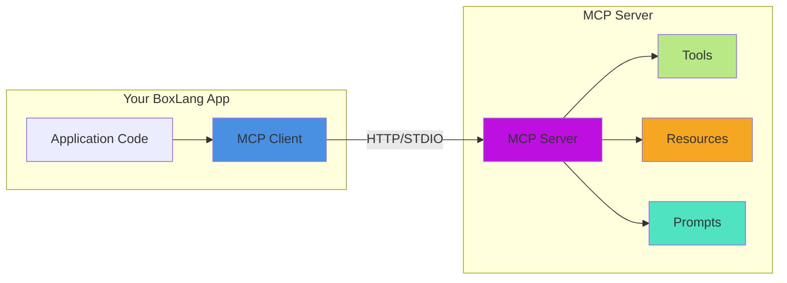

# 🔌 MCP Client - Model Context Protocol

The BoxLang AI Module includes built-in support for the Model Context Protocol (MCP), a standardized way for AI applications to connect to external data sources and tools.

## 🎯 What is MCP?

Model Context Protocol is an open protocol that enables AI models to:

## 🏗️ MCP Client Architecture



Model Context Protocol is an open protocol that enables AI models to:

- 🔧 **Access Tools**: Execute functions on remote servers
- 📚 **Read Resources**: Access documents, databases, and external data
- 💬 **Use Prompts**: Leverage server-defined prompt templates
- 🔍 **Discover Capabilities**: Dynamically learn what a server offers

## 🚀 Basic Usage

```java
// Create an MCP client
client = MCP( "http://localhost:3000" )

// Send a request to a tool
result = client.send( "searchDocs", {
    query: "BoxLang syntax",
    limit: 10
} )

// Check the response
if ( result.getSuccess() ) {
    writeOutput( result.getData() )
} else {
    writeOutput( "Error: " & result.getError() )
}
```

## ⚙️ Client Configuration

### ⏱️ Timeout Configuration

Set request timeout in milliseconds:

```java
client = MCP( "http://localhost:3000" )
    .withTimeout( 5000 )  // 5 second timeout
```

### Custom Headers

Add custom HTTP headers to requests:

```java
client = MCP( "http://localhost:3000" )
    .withHeaders( {
        "X-API-Key": "your-api-key",
        "X-Custom-Header": "value"
    } )
```

### Authentication

**Bearer Token Authentication:**

```java
client = MCP( "http://localhost:3000" )
    .withBearerToken( "your-bearer-token" )
```

**Basic Authentication:**

```java
client = MCP( "http://localhost:3000" )
    .withAuth( "username", "password" )
```

### Callbacks

Register success and error callbacks:

```java
client = MCP( "http://localhost:3000" )
    .onSuccess( ( response ) => {
        writeLog(
            type: "info",
            text: "MCP Success: #serializeJSON( response.getData() )#"
        )
    } )
    .onError( ( response ) => {
        writeLog(
            type: "error",
            text: "MCP Error [#response.getStatusCode()#]: #response.getError()#"
        )
    } )
```

### Fluent Chaining

All configuration methods return `this` for fluent API:

```java
client = MCP( "http://localhost:3000" )
    .withTimeout( 10000 )
    .withBearerToken( getSystemSetting( "MCP_TOKEN" ) )
    .withHeaders( { "X-Request-ID": createUUID() } )
    .onSuccess( logSuccess )
    .onError( logError )
```

## Discovery Methods

### List Tools

Discover available tools on the server:

```java
tools = MCP( "http://localhost:3000" ).listTools()

if ( tools.getSuccess() ) {
    for ( tool in tools.getData() ) {
        writeOutput( "
            <div>
                <h3>#tool.name#</h3>
                <p>#tool.description#</p>
                <pre>#serializeJSON( tool.parameters )#</pre>
            </div>
        " )
    }
}
```

### List Resources

Get available resources:

```java
resources = MCP( "http://localhost:3000" ).listResources()

if ( resources.getSuccess() ) {
    for ( resource in resources.getData() ) {
        writeOutput( "Resource: #resource.uri# (#resource.type#)" )
    }
}
```

### List Prompts

Discover prompt templates:

```java
prompts = MCP( "http://localhost:3000" ).listPrompts()

if ( prompts.getSuccess() ) {
    for ( prompt in prompts.getData() ) {
        writeOutput( "Prompt: #prompt.name#" )
        writeOutput( "Args: #prompt.arguments.toList()#" )
    }
}
```

### Get Capabilities

Check server capabilities:

```java
capabilities = MCP( "http://localhost:3000" ).getCapabilities()

if ( capabilities.getSuccess() ) {
    caps = capabilities.getData()
    writeOutput( "Server: #caps.serverInfo.name# v#caps.serverInfo.version#" )
    writeOutput( "Supports Tools: #caps.capabilities.tools#" )
    writeOutput( "Supports Resources: #caps.capabilities.resources#" )
}
```

## Execution Methods

### Send Tool Request

Invoke a tool with arguments:

```java
// Simple invocation
result = MCP( "http://localhost:3000" )
    .send( "calculateTax", {
        amount: 100.00,
        state: "CA"
    } )

// With configuration
result = MCP( "http://localhost:3000" )
    .withTimeout( 30000 )
    .withBearerToken( token )
    .send( "processPayment", {
        orderId: "12345",
        amount: 99.99
    } )
```

### Read Resource

Access a resource by URI:

```java
content = MCP( "http://localhost:3000" )
    .readResource( "docs://getting-started.md" )

if ( content.getSuccess() ) {
    markdown = content.getData().content
    writeOutput( markdown )
}
```

### Get Prompt

Retrieve a prompt template with arguments:

```java
prompt = MCP( "http://localhost:3000" )
    .getPrompt( "generateCode", {
        language: "java",
        description: "Sort an array of integers"
    } )

if ( prompt.getSuccess() ) {
    promptText = prompt.getData().messages[ 1 ].content
    // Use promptText with aiChat()
    code = aiChat( promptText )
}
```

## Response Structure

All MCP methods return an `MCPResponse` object:

```java
response = client.send( "tool", {} )

// Properties
success = response.getSuccess()       // Boolean
data = response.getData()            // Any (struct, array, string)
error = response.getError()          // String
statusCode = response.getStatusCode() // Numeric
headers = response.getHeaders()      // Struct

// Convert to struct
struct = response.toStruct()
// {
//     "success": true,
//     "data": { ... },
//     "error": "",
//     "statusCode": 200,
//     "headers": { ... }
// }
```

## Error Handling

### Network Errors

```java
result = MCP( "http://invalid-host:9999" )
    .withTimeout( 1000 )
    .listTools()

if ( !result.getSuccess() ) {
    // Network error occurred
    writeOutput( "Connection failed: " & result.getError() )
    // statusCode will be 0 for network errors
}
```

### HTTP Errors

```java
result = MCP( "http://localhost:3000" )
    .send( "unknownTool", {} )

if ( !result.getSuccess() ) {
    // HTTP error (4xx, 5xx)
    writeOutput( "HTTP #result.getStatusCode()#: #result.getError()#" )
}
```

### Try-Catch Pattern

```java
try {
    client = MCP( "http://localhost:3000" )
        .withTimeout( 5000 )

    result = client.send( "tool", { param: "value" } )

    if ( !result.getSuccess() ) {
        throw(
            type: "MCPError",
            message: result.getError(),
            detail: "Status: #result.getStatusCode()#"
        )
    }

    // Process successful result
    return result.getData()

} catch ( any e ) {
    writeLog(
        type: "error",
        text: "MCP operation failed: #e.message#"
    )
    rethrow
}
```

## Real-World Examples

### Documentation Search

```java
// Search BoxLang documentation via MCP
function searchDocs( required string query, numeric limit = 10 ) {
    var client = MCP( "https://boxlang.ortusbooks.com/~gitbook/mcp" )
        .withTimeout( 10000 )
        .withBearerToken( getSystemSetting( "MCP_TOKEN" ) )

    var result = client.send( "search", {
        query: arguments.query,
        limit: arguments.limit,
        type: "documentation"
    } )

    if ( !result.getSuccess() ) {
        throw( "Search failed: " & result.getError() )
    }

    return result.getData().results
}

// Usage
docs = searchDocs( "BoxLang installation" )
for ( doc in docs ) {
    writeOutput( "<h3>#doc.title#</h3>" )
    writeOutput( "<p>#doc.excerpt#</p>" )
    writeOutput( "<a href='#doc.url#'>Read more</a>" )
}
```

### Integration with AI Chat

```java
// Use MCP tools with AI chat
function aiWithMCP( required string userMessage ) {
    // Get relevant docs via MCP
    var mcpClient = MCP( "http://localhost:3000" )
    var searchResult = mcpClient.send( "searchDocs", {
        query: arguments.userMessage
    } )

    if ( searchResult.getSuccess() ) {
        var docs = searchResult.getData().results
        var context = docs.map( d => d.content ).toList( chr(10) )

        // Use context with AI
        var response = aiChat( [
            aiMessage().system( "Answer using this context: #context#" ),
            aiMessage().user( arguments.userMessage )
        ] )

        return response
    }

    // Fallback without context
    return aiChat( arguments.userMessage )
}

// Usage
answer = aiWithMCP( "How do I install BoxLang?" )
writeOutput( answer )
```

### Resource Caching

```java
class {
    property name="mcpClient";
    property name="cache";

    function init() {
        variables.mcpClient = MCP( "http://localhost:3000" )
            .withTimeout( 30000 )
        variables.cache = {}
        return this
    }

    function getResource( required string uri ) {
        // Check cache
        if ( structKeyExists( variables.cache, arguments.uri ) ) {
            return variables.cache[ arguments.uri ]
        }

        // Fetch from MCP
        var result = variables.mcpClient.readResource( arguments.uri )

        if ( !result.getSuccess() ) {
            throw( "Failed to read resource: " & result.getError() )
        }

        // Cache and return
        variables.cache[ arguments.uri ] = result.getData()
        return result.getData()
    }
}

// Usage
resourceLoader = new ResourceLoader()
content = resourceLoader.getResource( "docs://api-reference.md" )
```

## MCP Server Endpoints

The MCP client expects servers to implement these endpoints:

| Endpoint | Method | Purpose | Request Body |
|----------|--------|---------|--------------|
| `/tools` | GET | List available tools | None |
| `/tools/{name}/invoke` | POST | Invoke a tool | `{ "params": {...} }` |
| `/resources` | GET | List available resources | None |
| `/resources/read` | POST | Read a resource | `{ "uri": "..." }` |
| `/prompts` | GET | List available prompts | None |
| `/prompts/{name}` | POST | Get a prompt | `{ "params": {...} }` |
| `/capabilities` | GET | Get server capabilities | None |

## Best Practices

### 1. Use Configuration Objects

```java
// Create reusable client configurations
function createMCPClient( string env = "production" ) {
    var config = {
        "development": {
            url: "http://localhost:3000",
            timeout: 5000,
            token: ""
        },
        "production": {
            url: getSystemSetting( "MCP_URL" ),
            timeout: 30000,
            token: getSystemSetting( "MCP_TOKEN" )
        }
    }

    var settings = config[ arguments.env ]

    return MCP( settings.url )
        .withTimeout( settings.timeout )
        .withBearerToken( settings.token )
}
```

### 2. Always Check Success

```java
// Never assume success
result = client.send( "tool", {} )

if ( result.getSuccess() ) {
    // Process data
    processData( result.getData() )
} else {
    // Handle error
    logError( result.getError() )
}
```

### 3. Use Callbacks for Observability

```java
client = MCP( "http://localhost:3000" )
    .onSuccess( ( response ) => {
        writeLog(
            type: "info",
            text: "MCP request succeeded",
            extraInfo: {
                statusCode: response.getStatusCode(),
                dataSize: len( serializeJSON( response.getData() ) )
            }
        )
    } )
    .onError( ( response ) => {
        writeLog(
            type: "error",
            text: "MCP request failed: #response.getError()#",
            extraInfo: {
                statusCode: response.getStatusCode()
            }
        )
    } )
```

### 4. Timeout Appropriately

```java
// Short timeout for quick operations
quickClient = MCP( url ).withTimeout( 2000 )

// Longer timeout for heavy operations
heavyClient = MCP( url ).withTimeout( 60000 )
```

### 5. Secure Credentials

```java
// Never hardcode tokens
client = MCP( "http://localhost:3000" )
    .withBearerToken( getSystemSetting( "MCP_TOKEN" ) )

// Or use .env files
client = MCP( "http://localhost:3000" )
    .withBearerToken( server.system.environment.MCP_TOKEN )
```

## Testing MCP Clients

### Unit Testing

```java
class extends="testbox.system.BaseSpec" {

    function run() {
        describe( "MCP Client", () => {

            it( "can create client", () => {
                var client = MCP( "http://localhost:3000" )
                expect( client ).toBeComponent()
                expect( client.getBaseURL() ).toBe( "http://localhost:3000" )
            } )

            it( "can configure timeout", () => {
                var client = MCP( "http://localhost:3000" )
                    .withTimeout( 5000 )
                expect( client.getTimeout() ).toBe( 5000 )
            } )

            it( "handles network errors", () => {
                var result = MCP( "http://invalid:9999" )
                    .withTimeout( 1000 )
                    .listTools()
                expect( result.getSuccess() ).toBeFalse()
                expect( result.getError() ).notToBeEmpty()
            } )

        } )
    }

}
```

## Related Documentation

- [BoxLang AI Module](../../readme.md)
- [AI Tools](../main-components/tools.md)
- [AI Agents](../main-components/agents.md)

## External Resources

- [Model Context Protocol Specification](https://modelcontextprotocol.io)
- [MCP Server Examples](https://github.com/modelcontextprotocol)
- [BoxLang Documentation MCP Server](https://boxlang.ortusbooks.com/~gitbook/mcp)
