# aiMemory

Create AI memory instances for storing conversation history, context, or knowledge bases.

## 🧠 Memory Types Overview

```mermaid
graph TB
    subgraph "Conversation Memory"
        WIN[Window - Buffer]
        CACHE[Cache - Distributed]
        FILE[File - Persistent]
        JDBC[JDBC - Database]
        SESS[Session - User Scoped]
        SUM[Summary - Compressed]
    end

    subgraph "Vector Memory (RAG)"
        BOXV[BoxVector - Built-in]
        CHROMA[Chroma - Local/Cloud]
        MILV[Milvus - Large Scale]
        PG[PgVector - PostgreSQL]
        PINE[Pinecone - Managed]
        QDRANT[Qdrant - Performance]
    end

    subgraph "Use Cases"
        CHAT[Chat Context]
        KB[Knowledge Base]
        SEARCH[Semantic Search]
        RAG[RAG Applications]
    end

    WIN --> CHAT
    CACHE --> CHAT
    FILE --> CHAT

    CHROMA --> KB
    CHROMA --> SEARCH
    CHROMA --> RAG

    BOXV --> KB
    PINE --> RAG
    PG --> RAG

    style WIN fill:#4A90E2
    style CHROMA fill:#7ED321
    style CHAT fill:#BD10E0
    style RAG fill:#F5A623
```



## Syntax

```javascript
aiMemory(memory, key, userId, conversationId, config)
```

## Parameters

| Parameter        | Type   | Required | Default  | Description                                        |
| ---------------- | ------ | -------- | -------- | -------------------------------------------------- |
| `memory`         | string | No       | (config) | Memory type to create                              |
| `key`            | string | No       | UUID     | Unique identifier for memory instance              |
| `userId`         | string | No       | `""`     | User identifier for multi-tenant isolation         |
| `conversationId` | string | No       | `""`     | Conversation identifier for multiple conversations |
| `config`         | struct | No       | `{}`     | Configuration struct for the memory instance       |

## Memory Types

### Conversation Memory Types

| Type      | Description                     | Use Case                          |
| --------- | ------------------------------- | --------------------------------- |
| `window`  | Buffer of recent messages       | Short-term conversation context   |
| `cache`   | CacheBox-backed memory          | Distributed conversation storage  |
| `file`    | File-based persistence          | Simple local persistence          |
| `jdbc`    | Database-backed memory          | Enterprise conversation storage   |
| `session` | Session-scoped memory           | User session conversations        |
| `summary` | Summarized conversation history | Long conversations with summaries |

### Vector Memory Types (RAG)

| Type        | Description                    | Use Case                    |
| ----------- | ------------------------------ | --------------------------- |
| `boxvector` | Built-in vector storage        | Development, small datasets |
| `chroma`    | ChromaDB vector database       | Production RAG, local/cloud |
| `milvus`    | Milvus vector database         | Large-scale vector search   |
| `mysql`     | MySQL vector extension         | MySQL vector search         |
| `typesense` | Typesense vector search        | Fast semantic search        |
| `pgvector`  | PostgreSQL vector extension    | PostgreSQL-based RAG        |
| `pinecone`  | Pinecone cloud vectors         | Managed cloud vector DB     |
| `qdrant`    | Qdrant vector database         | High-performance vectors    |
| `weaviate`  | Weaviate vector database       | GraphQL vector queries      |
| `hybrid`    | Combined vector + conversation | Best of both worlds         |

## Returns

Returns an `IAiMemory` instance with methods:

* `add(message)` - Add message to memory
* `get(limit)` - Retrieve messages
* `clear()` - Clear all messages
* `seed(documents)` - Bulk add documents (vector memory)
* `search(query, limit)` - Semantic search (vector memory)
* `getRelevant(query, limit)` - Get relevant context

## Examples

### Window Memory (Default)

```javascript
// Simple conversation memory
memory = aiMemory( "window", {
    maxMessages: 10
} );

// Use with agent
agent = aiAgent(
    name: "ChatBot",
    memory: memory
);

agent.run( "Hello" );
agent.run( "What did I just say?" ); // Remembers "Hello"
```

### Vector Memory for RAG

```javascript
// Create Chroma vector memory
vectorMemory = aiMemory( "chroma", {
    collection: "knowledge_base",
    embeddingProvider: "openai",
    embeddingModel: "text-embedding-3-small"
} );

// Ingest documents
aiDocuments( "/docs" ).toMemory( vectorMemory );

// Create RAG agent
agent = aiAgent(
    name: "KnowledgeBot",
    memory: vectorMemory
);

response = agent.run( "What is BoxLang?" );
// Agent automatically retrieves relevant docs
```

### Multi-Tenant Memory

```javascript
// Separate memory per user
userMemory = aiMemory( "cache", {
    userId: "user123",
    conversationId: "chat456"
} );

// Different users get different memories
user1Memory = aiMemory( "cache", { userId: "user1" } );
user2Memory = aiMemory( "cache", { userId: "user2" } );
```

### Cache Memory

```javascript
// Distributed memory with CacheBox
cacheMemory = aiMemory( "cache", {
    cacheName: "default",
    maxMessages: 20,
    ttl: 3600 // 1 hour
} );
```

### File Memory

```javascript
// Persist to file
fileMemory = aiMemory( "file", {
    filePath: "/data/conversations/#userId#.json"
} );
```

### JDBC Memory

```javascript
// Database-backed memory
dbMemory = aiMemory( "jdbc", {
    datasource: "mydb",
    tableName: "conversations"
} );
```

### Summary Memory

```javascript
// Auto-summarize long conversations
summaryMemory = aiMemory( "summary", {
    maxMessages: 10,
    summaryThreshold: 8 // Summarize when > 8 messages
} );
```

### Multiple Memories

```javascript
// Combine conversation and knowledge
agent = aiAgent(
    name: "SmartBot",
    memory: [
        aiMemory( "window" ),        // Recent conversation
        aiMemory( "chroma", {        // Knowledge base
            collection: "kb"
        } )
    ]
);
```

### Manual Memory Operations

```javascript
memory = aiMemory( "window" );

// Add messages manually
memory.add({ role: "user", content: "Hello" });
memory.add({ role: "assistant", content: "Hi there!" });

// Retrieve messages
messages = memory.get( limit: 5 );

// Clear memory
memory.clear();
```

### Vector Memory Search

```javascript
vectorMemory = aiMemory( "chroma", {
    collection: "docs"
} );

// Seed with documents
vectorMemory.seed( documents );

// Search for relevant content
results = vectorMemory.search( "how to install", limit: 5 );

// Or get relevant context
context = vectorMemory.getRelevant( "BoxLang syntax", limit: 3 );
```

## Configuration Options by Type

### Window Memory

```javascript
{
    maxMessages: 10,           // Max messages to keep
    includeSystemMessages: true // Include system messages
}
```

### Vector Memory

```javascript
{
    collection: "default",     // Collection name
    embeddingProvider: "openai", // Embedding provider
    embeddingModel: "text-embedding-3-small",
    distance: "cosine",        // Distance metric
    dimensions: 1536           // Embedding dimensions
}
```

### Cache Memory

```javascript
{
    cacheName: "default",      // CacheBox cache name
    maxMessages: 20,
    ttl: 3600                  // Time to live (seconds)
}
```

### File Memory

```javascript
{
    filePath: "/path/to/file.json", // Storage file path
    autoSave: true             // Save on each add
}
```

## Notes

* **Auto-detection**: Default memory type from module configuration
* **Multi-tenant**: Use `userId` and `conversationId` for isolation
* **Vector RAG**: Vector memories automatically search for context
* **Conversation history**: Window/cache memories maintain chat context
* **Persistence**: File, JDBC, and cache memories persist across requests
* **Hybrid**: Combine multiple memory types for different purposes

## Related Functions

* [`aiAgent()`](aiagent.md) - Use memory with agents
* [`aiDocuments()`](aidocuments.md) - Load documents into memory
* [`aiEmbed()`](aiembed.md) - Generate embeddings

## Best Practices

```javascript
// ✅ Use window memory for conversations
chatMemory = aiMemory( "window", { maxMessages: 10 } );

// ✅ Use vector memory for knowledge bases
kbMemory = aiMemory( "chroma", { collection: "kb" } );

// ✅ Combine for best results
agent = aiAgent(
    memory: [ chatMemory, kbMemory ]
);

// ✅ Use multi-tenancy
userMemory = aiMemory( "cache", {
    userId: getUserId(),
    conversationId: getConversationId()
} );

// ❌ Don't use window memory for large knowledge bases
memory = aiMemory( "window" );
memory.add( hugeDocument ); // Use vector memory instead
```
