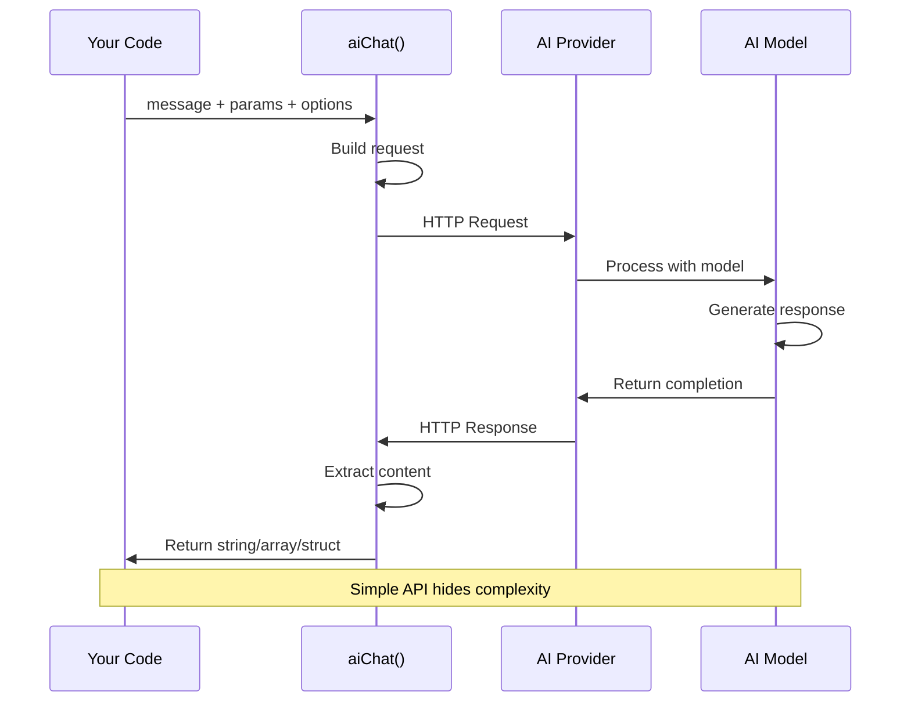
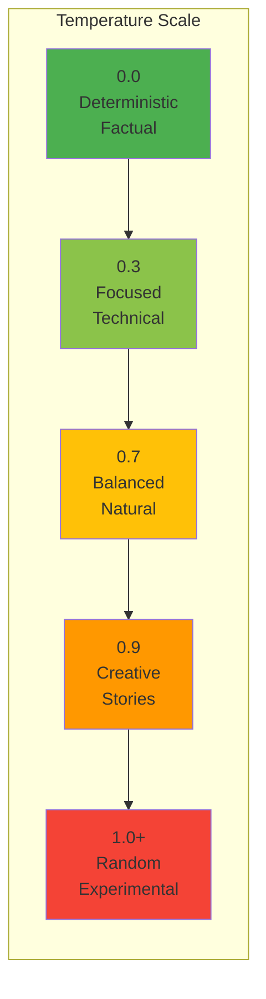

# Basic Chatting

Learn the fundamentals of interacting with AI using simple, straightforward chat requests.

## 📋 Table of Contents

- [The aiChat() Function](#the-aichat-function)
- [Simple Questions](#simple-questions)
- [Working with Parameters](#working-with-parameters)
- [Message Roles](#message-roles)
- [Provider Selection](#provider-selection)
- [Return Formats](#return-formats)
- [API Keys](#api-keys)
- [Error Handling](#error-handling)
- [Best Practices](#best-practices)

---

## The `aiChat()` Function

The `aiChat()` function is your primary interface for AI interactions. It's designed to be simple yet powerful.

### 🔄 Request-Response Flow



### Signature

```java
aiChat( message, params={}, options={} )
```

**Parameters:**
- `message` (string|array) - Your question or conversation
- `params` (struct) - Model parameters (temperature, max_tokens, etc.)
- `options` (struct) - Provider, API key, return format

**Returns:** String, Array, or Struct depending on `returnFormat`

## Simple Questions

The most basic usage - ask a question, get an answer:

```java
answer = aiChat( "What is the capital of France?" )
println( answer )
// "The capital of France is Paris."
```

```java
explanation = aiChat( "Explain what a function is in programming" )
println( explanation )
```

```java
code = aiChat( "Write a function to add two numbers in BoxLang" )
println( code )
```

## Working with Parameters

Parameters control how the AI behaves and responds.

### Temperature

Controls randomness and creativity (0.0 = focused, 1.0 = creative):



**Usage Guide:**
- **0.0 - 0.3**: Math, facts, code, technical docs
- **0.5 - 0.7**: General chat, balanced responses
- **0.8 - 1.0**: Creative writing, brainstorming

```java
// Very focused, deterministic
factual = aiChat(
    "What is 2+2?",
    { temperature: 0.0 }
)
// Always returns: "4"

// Balanced
normal = aiChat(
    "Describe a sunset",
    { temperature: 0.7 }
)

// Very creative
creative = aiChat(
    "Write a creative story opening",
    { temperature: 0.95 }
)
```

### Max Tokens

Limits response length:

```java
// Brief answer
short = aiChat(
    "Explain AI",
    { max_tokens: 50 }
)

// Detailed answer
long = aiChat(
    "Explain AI in detail",
    { max_tokens: 500 }
)
```

### Model Selection

Choose specific models:

```java
// OpenAI models
gpt4 = aiChat(
    "Complex reasoning task",
    { model: "gpt-4" }
)

gpt35 = aiChat(
    "Simple task",
    { model: "gpt-3.5-turbo" }
)

// Claude models
claude = aiChat(
    "Analyze this",
    { model: "claude-3-opus-20240229" }
)

// Ollama local models
local = aiChat(
    "Quick question",
    { model: "llama3.2" },
    { provider: "ollama" }
)
```

### Multiple Parameters

Combine parameters for precise control:

```java
answer = aiChat(
    "Write a technical blog post about databases",
    {
        model: "gpt-4",
        temperature: 0.6,
        max_tokens: 1000,
        top_p: 0.9,
        presence_penalty: 0.1,
        frequency_penalty: 0.1
    }
)
```

## Switching Providers

Override the default provider for any request:

```java
// Use OpenAI (even if default is different)
openai = aiChat(
    "Question",
    {},
    { provider: "openai" }
)

// Use Claude
claude = aiChat(
    "Question",
    {},
    { provider: "claude" }
)

// Use Gemini
gemini = aiChat(
    "Question",
    {},
    { provider: "gemini" }
)

// Use local Ollama
local = aiChat(
    "Question",
    {},
    { provider: "ollama" }
)
```

### With Custom API Keys

```java
answer = aiChat(
    "Hello",
    {},
    {
        provider: "openai",
        apiKey: "sk-custom-key-here"
    }
)
```

## Return Formats

Control how responses are returned:

### Single (Default)

Returns just the content as a string:

```java
answer = aiChat( "Say hello" )
// "Hello! How can I help you today?"

// Explicit
answer = aiChat(
    "Say hello",
    {},
    { returnFormat: "single" }
)
```

### All Messages

Returns the complete conversation array:

```java
messages = aiChat(
    "Say hello",
    {},
    { returnFormat: "all" }
)

/*
[
    {
        role: "assistant",
        content: "Hello! How can I help you today?"
    }
]
*/

// Access the content
println( messages[1].content )
```

### Raw Response

Returns the complete API response:

```java
raw = aiChat(
    "Say hello",
    {},
    { returnFormat: "raw" }
)

/*
{
    id: "chatcmpl-...",
    object: "chat.completion",
    created: 1234567890,
    model: "gpt-4",
    choices: [
        {
            index: 0,
            message: {
                role: "assistant",
                content: "Hello!"
            },
            finish_reason: "stop"
        }
    ],
    usage: {
        prompt_tokens: 10,
        completion_tokens: 5,
        total_tokens: 15
    }
}
*/

// Access specific data
println( "Model: " & raw.model )
println( "Tokens: " & raw.usage.total_tokens )
println( "Answer: " & raw.choices[1].message.content )
```

### JSON Format (Auto-Parse)

Automatically parses JSON responses into BoxLang structs/arrays:

```java
// Ask for structured data
person = aiChat(
    "Create a JSON object for a person named Alice, age 30, with email alice@example.com",
    {},
    { returnFormat: "json" }
)

// Directly access as struct - no manual parsing needed!
println( "Name: #person.name#" )        // "Alice"
println( "Age: #person.age#" )          // 30
println( "Email: #person.email#" )      // "alice@example.com"
```

**More JSON Examples:**

```java
// Get array data
colors = aiChat(
    "List 5 colors as a JSON array",
    {},
    { returnFormat: "json" }
)

colors.each( color => println( color ) )
// Outputs: red, blue, green, yellow, purple

// Complex nested structure
product = aiChat(
    "Create a JSON product with name, price, and an array of 3 features",
    {},
    { returnFormat: "json" }
)

println( "Product: #product.name#" )
println( "Price: $#product.price#" )
println( "Features:" )
product.features.each( feature => println( "  - #feature#" ) )
```

### XML Format (Auto-Parse)

Automatically parses XML responses into BoxLang XML objects:

```java
// Ask for XML document
book = aiChat(
    "Create XML for a book: title 'Learning BoxLang', author 'John Doe', year 2025",
    {},
    { returnFormat: "xml" }
)

// Access XML nodes directly
println( "Title: #book.xmlRoot.book.title.xmlText#" )
println( "Author: #book.xmlRoot.book.author.xmlText#" )
println( "Year: #book.xmlRoot.book.year.xmlText#" )
```

**More XML Examples:**

```java
// Generate RSS feed
feed = aiChat(
    "Create an RSS 2.0 feed XML with 2 news articles",
    {},
    { returnFormat: "xml" }
)

// Iterate through XML items
feed.xmlRoot.channel.xmlChildren
    .filter( node => node.xmlName == "item" )
    .each( item => {
        println( "Title: #item.title.xmlText#" )
        println( "Description: #item.description.xmlText#" )
        println( "---" )
    } )

// Configuration file
config = aiChat(
    "Create an XML config with database settings: host=localhost, port=3306, dbname=mydb",
    {},
    { returnFormat: "xml" }
)

println( "Database: #config.xmlRoot.config.database.host.xmlText#" )
```

## Practical Examples

### FAQ Bot

```java
function askFAQ( question ) {
    return aiChat(
        question,
        {
            temperature: 0.3,  // Consistent answers
            max_tokens: 200
        }
    )
}

answer1 = askFAQ( "What are your business hours?" )
answer2 = askFAQ( "How do I reset my password?" )
answer3 = askFAQ( "What payment methods do you accept?" )
```

### Code Explainer

```java
code = "
function quickSort(arr) {
    if (arr.length <= 1) return arr;
    // ... implementation
}
"

explanation = aiChat(
    "Explain this code:\n" & code,
    {
        model: "gpt-4",
        temperature: 0.4
    }
)

println( explanation )
```

### Content Summarizer

```java
longText = "
Lorem ipsum dolor sit amet, consectetur adipiscing elit...
[1000 words of text]
"

summary = aiChat(
    "Summarize this in 3 sentences:\n" & longText,
    {
        temperature: 0.5,
        max_tokens: 150
    }
)

println( summary )
```

### Multi-Language Support

```java
function translateText( text, targetLang ) {
    return aiChat(
        "Translate to #targetLang#: #text#",
        { temperature: 0.3 }
    )
}

spanish = translateText( "Good morning", "Spanish" )
french = translateText( "Thank you", "French" )
german = translateText( "See you later", "German" )

println( spanish )  // "Buenos días"
println( french )   // "Merci"
println( german )   // "Bis später"
```

### Data Extraction with JSON

```java
// Old way - manual parsing
text = "John Doe, 123 Main St, New York, NY 10001, Phone: 555-1234"

structured = aiChat(
    "Extract contact info as JSON from: " & text,
    { temperature: 0.2 }
)
data = deserializeJSON( structured )  // Manual parsing

// New way - automatic parsing with returnFormat: "json"
text = "Jane Smith, 456 Oak Ave, Boston, MA 02101, Phone: 555-5678"

contact = aiChat(
    "Extract contact info as JSON from: " & text,
    { temperature: 0.2 },
    { returnFormat: "json" }  // Auto-parses!
)

// Direct access - no manual parsing needed
println( "Name: #contact.name#" )
println( "Address: #contact.address#" )
println( "City: #contact.city#" )
println( "Phone: #contact.phone#" )
```

### Form Data Generation

```java
// Generate structured form data as JSON
formData = aiChat(
    "Create a user registration form data with username, email, password, and preferences",
    {},
    { returnFormat: "json" }
)

// Use the structured data directly
println( "Creating user: #formData.username#" )
println( "Email: #formData.email#" )
println( "Preferences: #formData.preferences.newsletter#" )

// Perfect for database inserts
queryExecute(
    "INSERT INTO users (username, email, password) VALUES (?, ?, ?)",
    [ formData.username, formData.email, formData.password ]
)
```

### Code Generator

```java
function generateCode( description, language = "BoxLang" ) {
    return aiChat(
        "Write #language# code to: #description#",
        {
            model: "gpt-4",
            temperature: 0.4,
            max_tokens: 500
        }
    )
}

boxlang = generateCode( "sort an array of numbers" )
java = generateCode( "read a file", "Java" )
python = generateCode( "make an HTTP request", "Python" )
```

## Error Handling

Always wrap AI calls in try/catch for production:

```java
try {
    answer = aiChat( "Question" )
    println( answer )
} catch( any e ) {
    println( "AI Error: " & e.message )

    // Log the error
    writeLog( "AI request failed: " & e.message )

    // Return fallback
    answer = "I'm sorry, I'm having trouble processing that request."
}
```

### Specific Error Handling

```java
try {
    answer = aiChat( "Question" )
} catch( "TimeoutException" e ) {
    // Retry with longer timeout
    answer = aiChat(
        "Question",
        {},
        { timeout: 60 }
    )
} catch( "AuthenticationException" e ) {
    // API key issue
    println( "Check your API key configuration" )
} catch( any e ) {
    // General error
    println( "Unexpected error: " & e.message )
}
```

## Tips and Best Practices

### 1. Use Appropriate Temperature

```java
// Facts and accuracy: 0.0 - 0.3
facts = aiChat( "What is the boiling point of water?", { temperature: 0.2 } )

// General tasks: 0.5 - 0.7
general = aiChat( "Write a product description", { temperature: 0.6 } )

// Creative tasks: 0.8 - 1.0
creative = aiChat( "Write a poem", { temperature: 0.9 } )
```

### 2. Be Specific in Prompts

```java
// Vague
vague = aiChat( "Tell me about cars" )

// Specific - better results
specific = aiChat( "List 5 key differences between electric and gas cars" )
```

### 3. Set Token Limits

```java
// Prevent excessive costs
answer = aiChat(
    "Explain AI",
    { max_tokens: 200 }  // Reasonable limit
)
```

### 4. Choose Right Provider

```java
// OpenAI - general purpose, reliable
openai = aiChat( question, {}, { provider: "openai" } )

// Claude - long context, detailed analysis
claude = aiChat( longDocument, {}, { provider: "claude" } )

// Ollama - privacy, offline, free
local = aiChat( question, {}, { provider: "ollama" } )
```

### 5. Cache Repeated Requests

```java
// Cache function
function cachedAIChat( message, ttl = 3600 ) {
    cacheKey = "ai_" & hash( message )

    if( cacheExists( cacheKey ) ) {
        return cacheGet( cacheKey )
    }

    answer = aiChat( message )
    cachePut( cacheKey, answer, ttl )

    return answer
}

// Use it
answer = cachedAIChat( "Common question" )
```

## Debugging

### Log Requests and Responses

Enable in configuration:

```json
{
  "modules": {
    "bxai": {
      "settings": {
        "logRequest": true,
        "logResponse": true,
        "logRequestToConsole": true
      }
    }
  }
}
```

### Use Raw Format for Debugging

```java
raw = aiChat(
    "Test",
    {},
    { returnFormat: "raw" }
)

println( "Model used: " & raw.model )
println( "Tokens: " & raw.usage.total_tokens )
println( "Cost estimate: $" & (raw.usage.total_tokens * 0.00002) )
```

## Next Steps

- **[Advanced Chatting](advanced-chatting.md)** - Multi-turn conversations, tools, async, streaming
- **[Service-Level Chatting](service-chatting.md)** - Direct service control
- **[Message Templates](../main-components/messages.md)** - Reusable prompt templates
- **[Message Context](../advanced/message-context.md)** - Inject security and RAG data
