# Structured Output

Get **type-safe, validated responses** from AI providers by defining expected output schemas. The module automatically converts AI responses into properly typed objects, eliminating manual parsing and validation.

## 📋 Table of Contents

- [Why Use Structured Output?](#why-use-structured-output)
- [Quick Start](#quick-start)
- [Using Classes](#using-classes)
- [Using Struct Templates](#using-struct-templates)
- [Arrays of Objects](#arrays-of-objects)
- [Manual Population](#manual-population)
- [Best Practices](#best-practices)

---

## Why Use Structured Output?

### 🔄 Data Extraction Flow

```mermaid
sequenceDiagram
    participant Code as Your Code
    participant AI as AI Provider
    participant Schema as Schema Builder
    participant Valid as Validator
    participant Obj as Typed Object

    Code->>Schema: Define class/template<br/>Person { name, age, email }
    Code->>AI: Send prompt + schema

    Note over AI: AI understands<br/>required structure

    AI->>AI: Generate JSON matching schema
    AI->>Valid: Return structured JSON

    Valid->>Valid: Validate against schema
    alt Valid JSON
        Valid->>Obj: Populate typed object
        Obj->>Code: Return Person instance
        Note over Code: person.getName()<br/>person.getAge()
    else Invalid JSON
        Valid->>AI: Retry with schema hints
        AI->>Valid: Corrected JSON
        Valid->>Obj: Populate typed object
        Obj->>Code: Return Person instance
    end

    style Obj fill:#4CAF50
    style Valid fill:#2196F3
    style Schema fill:#FFC107
```

**Benefits:**

- **Type Safety**: Get validated objects with proper types, not generic structs
- **Automatic Validation**: Schema constraints ensure correct data structure
- **Better Reliability**: Reduces hallucinations by strictly constraining format
- **IDE Support**: Full autocomplete and type checking with classes
- **No Manual Parsing**: Direct access to typed properties and methods

## Quick Start

### 📊 Class vs Struct Template

```mermaid
graph TB
    subgraph "Class-Based (Recommended)"
        C1["class Person {<br/>property name<br/>property age<br/>}"]
        C2[Type Safety ✓]
        C3[IDE Autocomplete ✓]
        C4[Validation ✓]
        C5[Reusable ✓]

        C1 --> C2
        C1 --> C3
        C1 --> C4
        C1 --> C5
    end

    subgraph "Struct Template (Quick)"
        S1["{<br/>name: '',<br/>age: 0<br/>}"]
        S2[Type Safety ✗]
        S3[IDE Autocomplete ✗]
        S4[Validation ✓]
        S5[Reusable ✓]

        S1 --> S2
        S1 --> S3
        S1 --> S4
        S1 --> S5
    end

    style C1 fill:#4CAF50
    style C2 fill:#4CAF50
    style C3 fill:#4CAF50
    style C4 fill:#4CAF50
    style C5 fill:#4CAF50
    style S1 fill:#FF9800
    style S2 fill:#F44336
    style S3 fill:#F44336
    style S4 fill:#4CAF50
    style S5 fill:#4CAF50
```



**Recommendation:** Use classes for production code, struct templates for quick prototypes.

### Using a Class

```java
class Person {
    property name="name" type="string";
    property name="age" type="numeric";
    property name="email" type="string";
}

// Extract structured data from natural language
person = aiChat( "Extract: John Doe, 30, john@example.com" )
    .structuredOutput( new Person() )

// Type-safe access with getters
println( person.getName() )   // "John Doe"
println( person.getAge() )    // 30 (numeric)
println( person.getEmail() )  // "john@example.com"
```

### Using a Struct Template

For quick prototyping without defining classes:

```java
template = {
    "productId": 0,
    "productName": "",
    "price": 0.0,
    "inStock": false,
    "tags": []
}

product = aiChat( "Generate a laptop product" )
    .structuredOutput( template )

// All fields guaranteed with correct types
println( product.productName )  // "MacBook Pro"
println( product.price )        // 1299.99
println( product.inStock )      // true
```

## Extracting Arrays

Extract multiple items of the same type:

```java
class Task {
    property name="title" type="string";
    property name="priority" type="string";
    property name="estimatedHours" type="numeric";
}

// Note: Pass array with ONE instance as the template
tasks = aiChat( "Extract: Finish report (high, 4hrs), Review code (medium, 2hrs)" )
    .structuredOutput( [ new Task() ] )

// Iterate with full type safety
tasks.each( task => {
    println( "#task.getTitle()# [#task.getPriority()#] - #task.getEstimatedHours()#hrs" )
} )
```

## Multiple Schemas

Extract different entity types from the same text:

```java
class Customer {
    property name="name" type="string";
    property name="email" type="string";
}

class Order {
    property name="orderId" type="string";
    property name="total" type="numeric";
}

result = aiChat( "John Doe (john@example.com) placed order #12345 for $150" )
    .structuredOutputs({
        "customer": new Customer(),
        "order": new Order()
    })

// Access each typed entity
println( "Customer: #result.customer.getName()#" )
println( "Order Total: $#result.order.getTotal()#" )
```

## With Conversations

Use structured output in multi-turn conversations:

```java
class Analysis {
    property name="sentiment" type="string";
    property name="keyPoints" type="array";
    property name="score" type="numeric";
}

conversation = [
    { role: "system", content: "You are a product review analyzer" },
    { role: "user", content: "Analyze: Great laptop but expensive" }
]

analysis = aiChat( conversation )
    .structuredOutput( new Analysis() )

println( "Sentiment: #analysis.getSentiment()#" )  // "mixed"
println( "Score: #analysis.getScore()#" )          // 7
```

## With Tools

Combine structured output with function calling:

```java
class WeatherData {
    property name="temperature" type="numeric";
    property name="condition" type="string";
    property name="humidity" type="numeric";
}

weatherTool = aiTool(
    "get_weather",
    "Get current weather",
    ( args ) => {
        return { temperature: 72, condition: "Sunny", humidity: 45 }
    }
).describeLocation( "City name" )

weather = aiChat( "What's the weather in San Francisco?" )
    .tools( [ weatherTool ] )
    .structuredOutput( new WeatherData() )

println( "Temperature: #weather.getTemperature()#°F" )
```

## Manual Population with aiPopulate()

Convert JSON or structs into typed objects without making AI calls:

```java
// From JSON string
jsonData = '{"name":"John Doe","age":30,"email":"john@example.com"}'
person = aiPopulate( new Person(), jsonData )

// From struct
data = { name: "Jane", age: 25, email: "jane@example.com" }
person = aiPopulate( new Person(), data )

// Populate array
tasksJson = '[{"title":"Task 1","priority":"high"},{"title":"Task 2","priority":"low"}]'
tasks = aiPopulate( [ new Task() ], tasksJson )
```

**Perfect for:**
- Testing with mock data
- Using cached AI responses
- Converting existing JSON to typed objects
- Validating data structures

## Comparison: Structured Output vs JSON Return Format

| Feature | Structured Output | JSON Return Format |
|---------|------------------|-------------------|
| Type Safety | ✅ Full type safety | ❌ Generic structs |
| Validation | ✅ Schema validation | ⚠️ Manual validation |
| IDE Support | ✅ Autocomplete | ❌ No type info |
| Reliability | ✅ Strict schema | ⚠️ May return invalid JSON |
| Best For | Production code | Quick prototypes |

**Use Structured Output when:**
- Building production applications
- Type safety is important
- Working with complex nested data
- Consistency is critical

**Use JSON Return Format when:**
- Quick prototypes or scripts
- Dynamic/unknown data structures
- Flexibility is more important than type safety

## Provider Support

All providers support structured output:

| Provider | Support | Notes |
|----------|---------|-------|
| OpenAI | ✅ Native | Best support with strict validation |
| Claude | ✅ JSON Mode | Excellent results |
| Gemini | ✅ JSON Mode | Good support |
| Ollama | ✅ JSON Mode | Model dependent |
| Others | ✅ JSON Mode | Schema-guided responses |

**Note:** OpenAI provides native structured output with strict schema validation. Other providers use JSON mode with schema constraints, which provides excellent results.

## Best Practices

### 1. Keep Schemas Simple

```java
// ✅ GOOD: Simple, focused schema
class Product {
    property name="name" type="string";
    property name="price" type="numeric";
}

// ❌ BAD: Overly complex
class Product {
    property name="details" type="ProductDetails";
    property name="metadata" type="ProductMetadata";
    // Many nested objects...
}
```

### 2. Use Descriptive Property Names

```java
// ✅ GOOD: Clear, descriptive
class Order {
    property name="customerEmail" type="string";
    property name="orderTotal" type="numeric";
}

// ❌ BAD: Ambiguous
class Order {
    property name="email" type="string";
    property name="amount" type="numeric";
}
```

### 3. Handle Missing Data

```java
class Contact {
    property name="name" type="string";
    property name="email" type="string" default="";
    property name="phone" type="string" default="";
}

// Defaults handle optional fields gracefully
```

### 4. Cache Pipelines with Structured Output

```java
// ✅ GOOD: Reuse
variables.productExtractor = aiModel().structuredOutput( new Product() )

function extractProduct( text ) {
    return variables.productExtractor.run( text )
}

// ❌ BAD: Recreate every time
function extractProduct( text ) {
    return aiModel().structuredOutput( new Product() ).run( text )
}
```

## Error Handling

```java
try {
    person = aiChat( ambiguousText )
        .structuredOutput( new Person() )

    // Validate result
    if( person.getName().len() == 0 ) {
        throw( "Could not extract name" )
    }

} catch( any e ) {
    // Handle extraction failure
    println( "Extraction failed: #e.message#" )

    // Retry with more specific prompt
    person = aiChat( "Extract person details: #ambiguousText#" )
        .structuredOutput( new Person() )
}
```

## Next Steps

- **[Advanced Chatting](advanced-chatting.md#structured-output)** - More examples with tools, streaming, and conversations
- **[Pipeline Structured Output](../main-components/structured-output.md)** - Use in composable workflows
- **[Utility Functions](../advanced/utilities.md#object-population)** - Learn about `aiPopulate()`
- **[Examples](../../examples/structured/)** - Complete working examples
