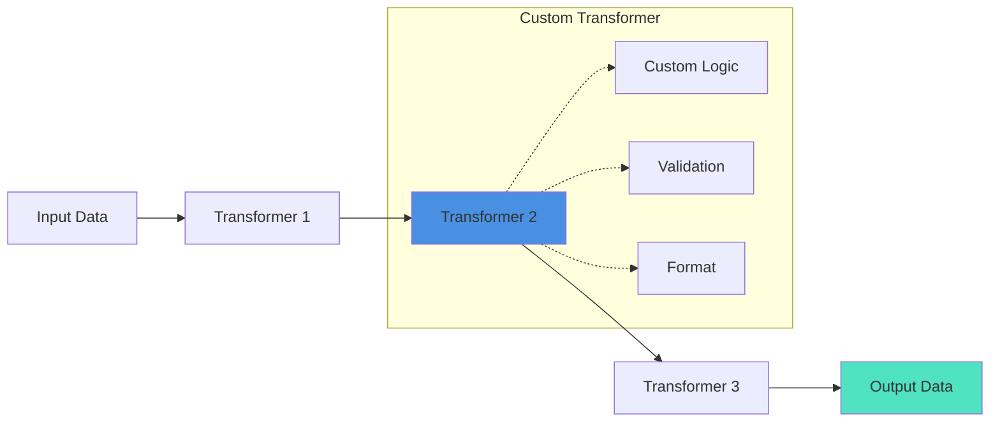

# Building Custom Transformers

Create custom transformers to process, validate, and shape data as it flows through AI pipelines. Transformers sit between pipeline steps, allowing you to apply custom business logic, format conversions, and data validation.

## 🎯 Why Custom Transformers?

Build custom transformers when you need to:

* **Format conversion** - Transform data between different formats (JSON, XML, custom)
* **Data validation** - Validate and sanitize AI responses
* **Business logic** - Apply domain-specific rules and processing
* **Content extraction** - Parse and extract specific data from responses
* **Logging and monitoring** - Track data as it flows through pipelines

## 🏗️ Transformer Architecture



## 📝 ITransformer Interface

All transformers should implement basic transformation methods:

```javascript
interface {
    /**
     * Transform input data
     * @param input The data to transform
     * @return Transformed data
     */
    public any function transform( required any input );

    /**
     * Configure the transformer
     * @param config Configuration struct
     * @return this (for fluent API)
     */
    public any function configure( required struct config );
}
```

## 🚀 Quick Start: Simple Transformer

Here's a minimal transformer that cleans and formats text:

```javascript
// TextCleanerTransformer.bx
import bxModules.bxai.models.transformers.BaseTransformer;

/**
 * Cleans and normalizes text content
 */
class extends="BaseTransformer" {

    property name="trim" type="boolean" default="true";
    property name="removeExtraSpaces" type="boolean" default="true";
    property name="stripHTML" type="boolean" default="false";

    /**
     * Initialize with configuration
     */
    function init( struct config={} ) {
        variables.trim = arguments.config.trim ?: true;
        variables.removeExtraSpaces = arguments.config.removeExtraSpaces ?: true;
        variables.stripHTML = arguments.config.stripHTML ?: false;
        return this;
    }

    /**
     * Transform text by cleaning it
     */
    function transform( required any input ) {
        var text = arguments.input;

        // Handle non-string input
        if ( !isSimpleValue( text ) ) {
            text = text.toString();
        }

        // Strip HTML if configured
        if ( variables.stripHTML ) {
            text = reReplace( text, "<[^>]*>", "", "all" );
        }

        // Remove extra spaces
        if ( variables.removeExtraSpaces ) {
            text = reReplace( text, "\s+", " ", "all" );
        }

        // Trim whitespace
        if ( variables.trim ) {
            text = trim( text );
        }

        return text;
    }

    /**
     * Configure transformer (fluent)
     */
    function configure( required struct config ) {
        variables.append( arguments.config );
        return this;
    }
}
```

**Usage:**

```javascript
import TextCleanerTransformer;

// Create and use transformer
cleaner = new TextCleanerTransformer( {
    trim: true,
    removeExtraSpaces: true,
    stripHTML: true
} );

cleaned = cleaner.transform( "  <p>Hello    World</p>  " );
println( cleaned ); // "Hello World"
```

## 🎨 Using Transformers in Pipelines

### Inline Transformers

Use lambda functions for simple transformations:

```javascript
pipeline = aiMessage()
    .user( "Count to 5" )
    .toDefaultModel()
    .transform( r => r.content ?: "" )           // Extract content
    .transform( s => s.ucase() )                  // Uppercase
    .transform( s => s.replace( ",", " -" ) );    // Format

result = pipeline.run();
```

### Named Transformers with aiTransform()

Create reusable transformers:

```javascript
// Define transformer
jsonParser = aiTransform( response => {
    var content = response.content ?: "";

    try {
        return jsonDeserialize( content );
    } catch ( any e ) {
        return { error: "Invalid JSON", raw: content };
    }
} );

// Use in pipeline
pipeline = aiMessage()
    .system( "Return only valid JSON" )
    .user( "Create a person object" )
    .toDefaultModel()
    .to( jsonParser );

person = pipeline.run();
```

### Custom Transformer Classes

For complex logic, create classes:

```javascript
// Use in pipeline
import TextCleanerTransformer;

cleaner = new TextCleanerTransformer();

pipeline = aiMessage()
    .user( "Generate some text" )
    .toDefaultModel()
    .transform( r => r.content )
    .to( cleaner );

result = pipeline.run();
```

## 💡 Advanced Example: JSON Schema Validator

Here's a transformer that validates AI responses against JSON schemas:

```javascript
// JSONSchemaTransformer.bx
import bxModules.bxai.models.transformers.BaseTransformer;

/**
 * Validates and transforms JSON responses using schemas
 */
class extends="BaseTransformer" {

    property name="schema" type="struct";
    property name="strict" type="boolean" default="true";
    property name="defaults" type="struct";

    function init( required struct schema, struct config={} ) {
        variables.schema = arguments.schema;
        variables.strict = arguments.config.strict ?: true;
        variables.defaults = arguments.config.defaults ?: {};
        return this;
    }

    function transform( required any input ) {
        var data = arguments.input;

        // Parse if string
        if ( isSimpleValue( data ) ) {
            try {
                data = jsonDeserialize( data );
            } catch ( any e ) {
                if ( variables.strict ) {
                    throw(
                        type = "ValidationError",
                        message = "Invalid JSON input: #e.message#"
                    );
                }
                return {};
            }
        }

        // Validate against schema
        var validated = validateSchema( data, variables.schema );

        // Apply defaults for missing fields
        for ( var field in variables.defaults ) {
            if ( !structKeyExists( validated, field ) ) {
                validated[ field ] = variables.defaults[ field ];
            }
        }

        return validated;
    }

    private function validateSchema( required struct data, required struct schema ) {
        var result = {};

        // Validate each field in schema
        for ( var field in arguments.schema ) {
            var fieldSchema = arguments.schema[ field ];
            var value = arguments.data[ field ] ?: nullValue();

            // Check required fields
            if ( fieldSchema.required ?: false ) {
                if ( isNull( value ) ) {
                    if ( variables.strict ) {
                        throw(
                            type = "ValidationError",
                            message = "Required field missing: #field#"
                        );
                    }
                    continue;
                }
            }

            // Type validation
            if ( !isNull( value ) && structKeyExists( fieldSchema, "type" ) ) {
                if ( !validateType( value, fieldSchema.type ) ) {
                    if ( variables.strict ) {
                        throw(
                            type = "ValidationError",
                            message = "Invalid type for field '#field#': expected #fieldSchema.type#"
                        );
                    }
                    continue;
                }
            }

            // Add to result if valid
            if ( !isNull( value ) ) {
                result[ field ] = value;
            }
        }

        return result;
    }

    private function validateType( required any value, required string type ) {
        switch ( arguments.type ) {
            case "string":
                return isSimpleValue( arguments.value );
            case "number":
                return isNumeric( arguments.value );
            case "boolean":
                return isBoolean( arguments.value );
            case "array":
                return isArray( arguments.value );
            case "struct":
                return isStruct( arguments.value );
            default:
                return true;
        }
    }
}
```

**Usage:**

```javascript
import JSONSchemaTransformer;

// Define schema
schema = {
    name: { type: "string", required: true },
    age: { type: "number", required: true },
    email: { type: "string", required: false },
    active: { type: "boolean", required: false }
};

// Create transformer
validator = new JSONSchemaTransformer(
    schema: schema,
    config: {
        strict: true,
        defaults: { active: true }
    }
);

// Use in pipeline
pipeline = aiMessage()
    .system( "Return a person object as JSON" )
    .user( "Create a person: John, age 30" )
    .toDefaultModel()
    .transform( r => r.content )
    .to( validator );

person = pipeline.run();
// { name: "John", age: 30, active: true }
```

## 🔄 Extending BaseTransformer

The `BaseTransformer` provides common functionality:

### Core Methods

```javascript
class extends="BaseTransformer" {

    /**
     * Transform single value or array
     */
    function transform( required any input ) {
        // Handle arrays
        if ( isArray( arguments.input ) ) {
            return arguments.input.map( item => transformSingle( item ) );
        }

        return transformSingle( arguments.input );
    }

    /**
     * Transform single item (override this)
     */
    private function transformSingle( required any item ) {
        // Your custom logic here
        return arguments.item;
    }
}
```

### Chainable Configuration

Implement fluent methods:

```javascript
class extends="BaseTransformer" {

    property name="maxLength" type="numeric" default="0";
    property name="prefix" type="string" default="";
    property name="suffix" type="string" default="";

    function withMaxLength( required numeric length ) {
        variables.maxLength = arguments.length;
        return this;
    }

    function withPrefix( required string prefix ) {
        variables.prefix = arguments.prefix;
        return this;
    }

    function withSuffix( required string suffix ) {
        variables.suffix = arguments.suffix;
        return this;
    }
}
```

**Usage:**

```javascript
transformer = new CustomTransformer()
    .withMaxLength( 100 )
    .withPrefix( ">> " )
    .withSuffix( " <<" );

result = transformer.transform( "Hello World" );
// ">> Hello World <<"
```

## 🎯 Built-In Transformers

BoxLang AI ships with several core transformers:

### TextChunker

Splits text into chunks with overlap:

```javascript
import bxModules.bxai.models.util.TextChunker;

chunker = new TextChunker( {
    chunkSize: 1000,
    overlap: 200,
    strategy: "recursive"
} );

chunks = chunker.chunk( longText );
```

### TextCleaner

Cleans and normalizes text:

```javascript
import bxModules.bxai.models.transformers.TextCleanerTransformer;

cleaner = new TextCleanerTransformer( {
    trim: true,
    removeExtraSpaces: true,
    normalizeLineBreaks: true,
    stripHTML: true,
    maxConsecutiveNewlines: 2
} );

cleaned = cleaner.transform( messyText );
```

### AiTransformRunnable

Wraps functions as runnables:

```javascript
// Create transformer from function
transformer = aiTransform( data => data.toUpper() );

// Use in pipeline
pipeline = aiModel( "openai" )
    .to( transformer )
    .to( aiTransform( data => data.trim() ) );
```

## 💼 Real-World Examples

### Code Extractor

Extract code blocks from AI responses:

````javascript
class extends="BaseTransformer" {

    function transform( required any input ) {
        var content = isStruct( arguments.input ) ?
            arguments.input.content ?: "" :
            arguments.input;

        // Extract from markdown code blocks
        var pattern = "```[a-zA-Z]*\n(.*?)```";
        var matches = reMatchNoCase( pattern, content );

        if ( matches.len() > 0 ) {
            // Get first code block
            var code = reReplaceNoCase( matches[1], "```[a-zA-Z]*\n(.*?)```", "\1" );
            return trim( code );
        }

        return content;
    }
}
````

### Price Parser

Extract and format prices:

```javascript
class extends="BaseTransformer" {

    property name="currency" type="string" default="USD";

    function transform( required any input ) {
        var text = arguments.input.toString();

        // Find price patterns
        var pricePattern = "\$?([\d,]+\.?\d*)";
        var match = reFind( pricePattern, text, 1, true );

        if ( match.pos[1] > 0 ) {
            var price = mid( text, match.pos[2], match.len[2] );
            price = replace( price, ",", "", "all" );

            return {
                amount: val( price ),
                currency: variables.currency,
                formatted: dollarFormat( val( price ) )
            };
        }

        return { amount: 0, currency: variables.currency };
    }
}
```

### Sentiment Analyzer

Add sentiment analysis:

```javascript
class extends="BaseTransformer" {

    function transform( required any input ) {
        var text = arguments.input.toString();

        // Simple sentiment analysis
        var positiveWords = ["good", "great", "excellent", "happy", "love"];
        var negativeWords = ["bad", "terrible", "hate", "awful", "poor"];

        var score = 0;
        for ( var word in positiveWords ) {
            score += findNoCase( word, text ) > 0 ? 1 : 0;
        }
        for ( var word in negativeWords ) {
            score -= findNoCase( word, text ) > 0 ? 1 : 0;
        }

        return {
            text: text,
            sentiment: score > 0 ? "positive" : (score < 0 ? "negative" : "neutral"),
            score: score
        };
    }
}
```

## ✅ Best Practices

### 1. Handle Multiple Input Types

```javascript
function transform( required any input ) {
    // Handle struct responses
    if ( isStruct( arguments.input ) ) {
        return transformStruct( arguments.input );
    }

    // Handle arrays
    if ( isArray( arguments.input ) ) {
        return arguments.input.map( item => transform( item ) );
    }

    // Handle simple values
    return transformString( arguments.input.toString() );
}
```

### 2. Validate and Sanitize

```javascript
function transform( required any input ) {
    // Validate input
    if ( isNull( arguments.input ) || arguments.input == "" ) {
        return variables.defaultValue ?: "";
    }

    // Sanitize
    var cleaned = trim( arguments.input.toString() );

    // Process
    return processCleanedInput( cleaned );
}
```

### 3. Provide Meaningful Errors

```javascript
function transform( required any input ) {
    try {
        return processInput( arguments.input );
    } catch ( any e ) {
        throw(
            type = "TransformError",
            message = "Failed to transform input: #e.message#",
            detail = "Input: #serializeJSON(arguments.input)#",
            extendedInfo = e.extendedInfo
        );
    }
}
```

### 4. Make Transformers Reusable

```javascript
// Configure once, use many times
transformer = new CustomTransformer( {
    maxLength: 100,
    format: "json"
} );

// Use in multiple pipelines
pipeline1 = model1.to( transformer );
pipeline2 = model2.to( transformer );
pipeline3 = model3.to( transformer );
```

## 📚 Next Steps

* 🔄 **Transformers Guide**: [Complete transformer documentation](../main-components/transformers.md)
* 📖 **Pipeline Patterns**: [Building pipelines](../main-components/main-components/overview.md)
* 🧩 **Custom Loaders**: [Building loaders](custom-loader.md)
* 💻 **Examples**: Check `examples/pipelines/` for more examples

## 🎓 Summary

Custom transformers enable you to:

* ✅ Process and validate data between pipeline steps
* ✅ Apply domain-specific business logic
* ✅ Convert between data formats
* ✅ Extract and parse specific content
* ✅ Chain multiple transformations for complex workflows

Start with a simple function, wrap it with `aiTransform()`, or extend `BaseTransformer` for full control!
