# 🤖 AI Agents Quick Start

Get up and running with AI Agents in BoxLang - autonomous AI assistants with memory, tools, and reasoning capabilities.

> **💡 New to BoxLang AI?** Start with the [Quick Start Guide](quickstart.md) to learn the basics first.

## 🎯 What are AI Agents?

AI Agents are autonomous assistants that:

### 🏗️ Agent Setup Flow


- **Remember context** across conversations using memory systems
- **Use tools** to perform actions and access real-time data
- **Reason** about tasks and break them into steps
- **Maintain state** across multiple interactions

Think of agents as AI assistants that can:

- Answer questions while remembering previous context
- Search databases or APIs when they need information
- Execute functions to perform actions
- Make decisions based on accumulated knowledge

## 🚀 Your First Agent

The simplest agent is just a conversation interface with memory:

```java
// agent-hello.bxs
// Create an agent with memory
agent = aiAgent(
    name: "Assistant",
    description: "A helpful AI assistant"
)

// First interaction
response1 = agent.run( "My name is John" )
println( response1 )
// "Nice to meet you, John!"

// Agent remembers context
response2 = agent.run( "What's my name?" )
println( response2 )
// "Your name is John."
```

**Key Difference**: Without memory, the AI would forget your name between calls!

## 🛠️ Agents with Tools

Give your agent the ability to perform actions:

### 🔄 Agent Tool Execution Flow

```mermaid
sequenceDiagram
    participant U as User
    participant A as Agent
    participant T as Weather Tool
    participant API as Weather API
    
    U->>A: "What's the weather in Boston?"
    A->>A: Analyze question
    Note over A: Realizes it needs<br/>weather data
    A->>T: Call get_weather("Boston")
    T->>API: HTTP Request
    API->>T: {temp: 15, condition: "cloudy"}
    T->>A: Return weather data
    A->>A: Format response
    A->>U: "The weather in Boston is 15°C and cloudy"
    
    Note over U,API: Agent automatically decides<br/>when to use tools
```



```java
// Define a tool for weather lookup
weatherTool = aiTool(
    name: "get_weather",
    description: "Get current weather for a location",
    action: ( location ) => {
        // Your weather API call here
        return getWeatherData( location )
    }
).describeLocation( "City name and country" )

## ⚙️ Fluent Agent Configuration

Build agents step-by-step with the fluent API:
    instructions: "You help users check weather. Use the weather tool when needed.",
    tools: [ weatherTool ]
)

// Ask about weather
response = agent.run( "What's the weather in Boston?" )
println( response )
// Agent automatically calls weatherTool("Boston") and responds with the data
// "The current weather in Boston is 15°C and cloudy."
```

**What happens:**

1. Agent receives: "What's the weather in Boston?"
2. Agent thinks: "I need to use the weather tool"
3. Agent calls: `get_weather("Boston")`
4. Tool returns: `{ temp: 15, conditions: "cloudy" }`
5. Agent responds: "The current weather in Boston is 15°C and cloudy."

## Fluent Agent Configuration

Build agents step-by-step with the fluent API:

```java
// Database lookup tool
dbTool = aiTool(
    name: "lookup_user",
    description: "Find user information by email",
    action: ( email ) => queryExecute(
        "SELECT * FROM users WHERE email = :email",
        { email: email }
    ).getRow( 1 )
).describeEmail( "User email address" )

// Calculator tool
calcTool = aiTool(
    name: "calculate",
    description: "Perform mathematical calculations",
    action: ( expression ) => evaluate( expression )
).describeExpression( "Math expression to evaluate" )

// Build agent with multiple tools
agent = aiAgent(
    name: "Support Agent",
    description: "Customer support assistant",
    instructions: "You help customers with account questions and calculations",
    tools: [ dbTool, calcTool ],
    memory: aiMemory( "simple", "support-session-123" )
)

// Agent can now look up users and do math
response = agent.run(
    "What's the account balance for user@example.com divided by 2?"
)
```

## 💭 Different Memory Types

### Window Memory (Default)

Keeps only recent messages in RAM - good for managing context limits:

```java
agent = aiAgent(
    name: "Chatbot",
    memories: aiMemory(
        type: "buffered",
        key: "session-1",
        config: { maxMessages: 20 }  // Keep last 20 messages
    )
)
```

### Session Memory

Persists across requests in web applications:

```java
agent = aiAgent(
    name: "WebAssistant",
    memories: new bxModules.bxai.models.memory.SessionMemory( "bxai-chat" )
)
// Remembers conversation across page requests!
```

### File Memory

Saves to disk - persists across application restarts:

```java
agent = aiAgent(
    name: "PersistentBot",
    memories: aiMemory(
        type: "file",
        key: "user-123",
        config: { filePath: expandPath( "./data/chat-history.json" ) }
    )
)
```

### Multiple Memories

Combine different memory types:

```java
agent = aiAgent( name: "MultiMemory" )
    .addMemory( aiMemory( "simple", "short-term" ) )      // Recent context
    .addMemory( aiMemory( "file", "long-term", {          // Persistent facts
        filePath: expandPath( "./data/facts.json" )
    } ) )
```

## Practical Examples

### Customer Support Agent

```java
// Tools for support tasks
lookupOrder = aiTool(
    name: "lookup_order",
    description: "Find order details by order number",
    action: ( orderNum ) => getOrderDetails( orderNum )
).describeOrderNum( "Order number" )

cancelOrder = aiTool(
    name: "cancel_order",
    description: "Cancel an order",
    action: ( orderNum ) => processCancellation( orderNum )
).describeOrderNum( "Order number to cancel" )

// Support agent
supportAgent = aiAgent(
    name: "SupportBot",
    instructions: "
        You are a customer support agent.
        Help customers with orders politely and efficiently.
        Always confirm before canceling orders.
    ",
    tools: [ lookupOrder, cancelOrder ],
    memories: aiMemory( "buffered", "support-${session.id}", { maxMessages: 50 } )
)

// Customer interaction
response = supportAgent.run( "I need to cancel order #12345" )
// Agent will lookup order first, then ask for confirmation before canceling
```

### Code Review Agent

```java
// Tool to fetch code from repository
fetchCode = aiTool(
    name: "fetch_code",
    description: "Get code content from a file",
    action: ( filePath ) => fileRead( filePath )
).describeFilePath( "Path to code file" )

// Review agent
reviewer = aiAgent(
    name: "CodeReviewer",
    instructions: "
        You are an expert code reviewer.
        Review code for: bugs, security issues, best practices, performance.
        Be constructive and specific in your feedback.
    ",
    tools: [ fetchCode ]
)

// Request review
review = reviewer.run(
    "Please review the authentication logic in /src/security/Auth.cfc"
)
```

### Research Assistant

```java
// Tools for research
searchWeb = aiTool(
    name: "search_web",
    description: "Search the web for information",
    action: ( query ) => performWebSearch( query )
).describeQuery( "Search query" )

readArticle = aiTool(
    name: "read_article",
    description: "Fetch and read article content from URL",
    action: ( url ) => fetchArticleContent( url )
).describeUrl( "Article URL" )

// Research agent with memory
researcher = aiAgent(
    name: "Researcher",
    instructions: "
        You are a research assistant.
        Search for information, read articles, and provide well-sourced answers.
        Remember previous research to build comprehensive responses.
    ",
    tools: [ searchWeb, readArticle ],
    memories: aiMemory( "simple", "research-session" )
)

// Multi-step research
answer1 = researcher.run( "What are the latest developments in quantum computing?" )
// Agent searches, reads articles, responds

answer2 = researcher.run( "How does that compare to last year?" )
// Agent remembers previous research and provides comparative analysis
```

## Return Formats

Control what agents return:

### Single (Default) - Just the Response

```java
agent = aiAgent( name: "Simple" )
response = agent.run( "Hello" )
// Returns: "Hi! How can I help you?"
```

### All - Complete Conversation

```java
agent = aiAgent(
    name: "Detailed",
    returnFormat: "all"
)

messages = agent.run( "Hello" )
// Returns: [
//   { role: "user", content: "Hello" },
//   { role: "assistant", content: "Hi! How can I help?" }
// ]
```

### Raw - Full API Response

```java
agent = aiAgent(
    name: "Debug",
    returnFormat: "raw"
)

raw = agent.run( "Hello" )
// Returns: { id: "...", choices: [...], usage: {...} }
```

### JSON - Structured Data

Returns the single message response as a JSON object:

```java
agent = aiAgent(
	name: "JsonAgent",
	returnFormat: "json"
)
data = agent.run( "Give me a summary of AI agents in json format" )
```

### XML - Structured Data in XML format

```java
agent = aiAgent(
	name: "XmlAgent",
	returnFormat: "xml"
)
data = agent.run( "Give me a summary of AI agents in xml format" )
```

## Streaming Agent Responses

Get real-time responses from your agent:

```java
agent = aiAgent(
    name: "Storyteller",
    instructions: "You tell engaging stories"
)

print( "Agent: " )
agent.stream(
    onChunk: ( chunk ) => {
        content = chunk.choices?.first()?.delta?.content ?: ""
        print( content )
    },
    input: "Tell me a short story about a robot"
)
println( "\nDone!" )
```

## Agent Configuration Options

Full configuration example:

```java
agent = aiAgent(
    name: "CustomAgent",                           // Required: Agent name
    description: "Detailed description",           // Optional: What this agent does
    instructions: "Behavioral guidelines...",      // Optional: How agent should act
    model: "gpt-4",                               // Optional: Specific model
    provider: "openai",                           // Optional: AI provider
    tools: [ tool1, tool2 ],                      // Optional: Available tools
    memories: memory,                             // Optional: Memory system
    returnFormat: "single",                       // Optional: single|all|raw
    params: {                                     // Optional: Model parameters
        temperature: 0.7,
        max_tokens: 2000
    }
)
```

## Best Practices

### 1. Clear Instructions
```java
// ❌ Vague
agent = aiAgent(
    name: "Helper",
    instructions: "Be helpful"
)

// ✅ Specific
agent = aiAgent(
    name: "SupportAgent",
    instructions: "
        You are a customer support agent for TechCorp.
        - Always be polite and professional
        - Verify user identity before sharing account info
        - Escalate billing issues to human support
        - Use tools to lookup real-time data, never guess
    "
)
```

### 2. Tool Descriptions

```java
// ❌ Unclear
tool = aiTool(
    name: "get_data",
    description: "Gets data",
    action: ( id ) => getData( id )
)

// ✅ Clear
tool = aiTool(
    name: "lookup_customer",
    description: "Retrieves customer account details including name, email, and order history by customer ID",
    action: ( customerId ) => queryCustomer( customerId )
).describeCustomerId( "Numeric customer ID from the database" )
```

### 3. Choose Right Memory

```java
// Short-lived chat (web request)
webAgent = aiAgent( name: "Chat" )
    .setMemories( aiMemory( "simple", session.id ) )

// Long conversation with limits
supportAgent = aiAgent( name: "Support" )
    .setMemories( aiMemory( "buffered", user.id, { maxMessages: 100 } ) )

// Persistent across restarts
botAgent = aiAgent( name: "Bot" )
    .setMemories( aiMemory( "file", "bot-memory", {
        filePath: expandPath( "./data/bot-memory.json" )
    } ) )
```

### 4. Error Handling

```java
try {
    response = agent.run( userInput )
    println( response )
} catch( any e ) {
    writeLog(
        text: "Agent error: #e.message#",
        type: "error"
    )

    // Provide fallback
    response = "I'm having trouble right now. Please try again."
}
```

### 5. Test Tools Independently

```java
// Test tool before giving to agent
testResult = weatherTool.execute( "Boston" )
println( "Tool test: " & testResult )

// Then add to agent
agent = aiAgent( name: "WeatherBot" )
    .addTool( weatherTool )
```

## Common Patterns

### Conversation History

```java
// Add user message to agent
agent.addMemory( { role: "user", content: "Hello" } )

// Get conversation history
history = agent.getMemory().getAll()
history.each( ( msg ) => {
    println( "#msg.role#: #msg.content#" )
} )

// Clear memory when needed
agent.clearMemory()
```

### Dynamic Tool Selection

```java
// Start with basic tools
agent = aiAgent( name: "Assistant" )
    .setTools( [ basicTool ] )

// Add admin tools for privileged users
if ( user.hasRole( "admin" ) ) {
    agent.addTool( adminTool )
    agent.addTool( deleteTool )
}
```

### Multi-Step Workflows

```java
// Agent can handle multi-step tasks
agent = aiAgent(
    name: "DataAnalyst",
    instructions: "Break complex analysis into steps",
    tools: [ fetchData, analyzeData, visualizeData ]
)

result = agent.run(
    "Analyze sales data for Q4 and create a visualization"
)
// Agent will:
// 1. Use fetchData to get sales data
// 2. Use analyzeData to process it
// 3. Use visualizeData to create charts
// 4. Return comprehensive analysis
```

## Agents with Structured Output

Agents can return type-safe, structured data instead of plain text responses:

### Extract Structured Data

```java
class CustomerInfo {
    property name="customerId" type="string";
    property name="name" type="string";
    property name="email" type="string";
    property name="accountBalance" type="numeric";
}

// Agent extracts structured customer data
agent = aiAgent(
    name: "DataExtractor",
    instructions: "Extract customer information from conversations"
)

customerData = agent
    .run( "Customer John Doe, ID: C123, email: john@example.com, balance: $1500" )
    .structuredOutput( new CustomerInfo() )

// Type-safe access
println( customerData.getName() )           // John Doe
println( customerData.getAccountBalance() ) // 1500 (numeric)
```

### Agents with Tools and Structured Output

```java
class AnalysisReport {
    property name="summary" type="string";
    property name="keyFindings" type="array";
    property name="recommendation" type="string";
    property name="confidence" type="numeric";
}

// Tool that fetches data
dataTool = aiTool(
    name: "fetch_sales",
    description: "Fetch sales data for a period",
    action: ( period ) => querySalesData( period )
).describePeriod( "Time period like 'Q4 2024'" )

// Agent analyzes and returns structured report
agent = aiAgent(
    name: "Analyst",
    instructions: "Analyze sales data and provide structured insights",
    tools: [ dataTool ]
)

report = agent
    .run( "Analyze Q4 2024 sales performance" )
    .structuredOutput( new AnalysisReport() )

// Access structured results
println( "Summary: #report.getSummary()#" )
report.getKeyFindings().each( finding => println( "- #finding#" ) )
println( "Confidence: #report.getConfidence()#%" )
```

### Multiple Structured Outputs

```java
class UserProfile {
    property name="name" type="string";
    property name="role" type="string";
}

class TaskList {
    property name="urgent" type="array";
    property name="normal" type="array";
}

// Agent extracts multiple entities
agent = aiAgent( name: "Organizer" )

result = agent
    .run( "John (admin) needs to: fix bug (urgent), write docs (normal), update tests (urgent)" )
    .structuredOutputs({
        "user": new UserProfile(),
        "tasks": new TaskList()
    })

println( "User: #result.user.getName()# (#result.user.getRole()#)" )
println( "Urgent: #result.tasks.urgent.len()# tasks" )
```

**Learn more:** [Structured Output Guide](../chatting/structured-output.md)

## Debugging Agents

### Enable Raw Format Temporarily

```java
// See what the AI actually receives/returns
agent.setReturnFormat( "raw" )
response = agent.run( "Test message" )
writeDump( response )
```

### Log Tool Calls

```java
debugTool = aiTool(
    name: "debug_tool",
    description: "Tool description",
    action: ( arg ) => {
        writeLog( text: "Tool called with: #arg#", log: "ai-debug" )
        result = performAction( arg )
        writeLog( text: "Tool returned: #result#", log: "ai-debug" )
        return result
    }
)
```

### Monitor Memory

```java
// Check memory state
summary = agent.getMemory().getSummary()
println( "Messages: #summary.messageCount#" )
println( "Has system: #summary.hasSystemMessage#" )

// Export for inspection
exported = agent.getMemory().export()
writeDump( exported )
```

## Next Steps

Ready to dive deeper?

### Learn More About Agents

- **[Full Agent Documentation](../main-components/agents.md)** - Complete guide to agent features
- **[Agent Examples](../../examples/agents/)** - Working code examples

### Related Topics

- **[Working with Tools](../chatting/advanced-chatting.md#function-calling-tools)** - Deep dive into AI tools
- **[Memory Systems](../main-components/agents.md#memory-management)** - Understanding memory types
- **[Pipeline Integration](../main-components/overview.md)** - Using agents in pipelines

### Example Code

Check the [examples directory](../../examples/) for complete, runnable examples:

- **[basic-agent.bxs](../../examples/agents/basic-agent.bxs)** - Simple agent with memory
- **[agent-with-tools.bxs](../../examples/agents/agent-with-tools.bxs)** - Agent using tools
- **[customer-support-agent.bxs](../../examples/agents/customer-support-agent.bxs)** - Production-ready support bot
- **[research-agent.bxs](../../examples/agents/research-agent.bxs)** - Web research assistant

## Common Issues

**"Agent not remembering context"**

- Ensure memory is configured: `.setMemories( aiMemory(...) )`
- Check memory isn't being cleared between calls
- Verify session/key is consistent across calls

**"Tools not being called"**

- Make tool descriptions clear and specific
- Check tool is added to agent: `.addTool()`
- Verify tool function doesn't throw errors

**"Responses too slow"**

- Use smaller/faster model for simple tasks
- Reduce maxMessages in window memory
- Consider async: `agent.runAsync()`

**"Memory growing too large"**

- Use WindowMemory with maxMessages limit
- Clear memory periodically: `agent.clearMemory()`
- Export important conversations before clearing
