# 🚀 Quick Start Guide

Get up and running with BoxLang AI in minutes. This comprehensive guide walks you through everything from your first AI chat to building autonomous agents with memory, tools, and RAG capabilities.

## 📖 Table of Contents

- [Prerequisites](#-prerequisites)
- [Your First AI Chat](#-your-first-ai-chat)
- [Understanding the Basics](#-understanding-the-basics)
- [Working with Different Providers](#-working-with-different-providers)
- [Building Conversations](#-building-conversations)
- [Controlling AI Behavior](#-controlling-ai-behavior)
- [Practical Examples](#-practical-examples)
- [Introduction to Pipelines](#-introduction-to-pipelines)
- [Document Loading & RAG](#-document-loading--rag)
- [AI Agents Quick Start](#-ai-agents-quick-start)
  - [What are AI Agents?](#-what-are-ai-agents)
  - [Your First Agent](#-your-first-agent)
  - [Agents with Tools](#-agents-with-tools)
  - [Different Memory Types](#-different-memory-types)
  - [RAG Agents](#-rag-agents)
- [Structured Output](#-structured-output)
- [Async & Streaming](#-async--streaming)
- [Next Steps](#-next-steps)

## 📋 Prerequisites

- BoxLang installed and configured
- bx-ai module installed ([Installation Guide](installation.md))
- API key for your chosen provider OR Ollama installed locally

## 💬 Your First AI Chat

The simplest way to use AI is with the `aiChat()` function:

### 🔄 Getting Started Flow


```javascript
// hello.bxs
answer = aiChat( "What is BoxLang?" )
println( answer )
```

Run it:
```bash
boxlang hello.bxs
```

**Output:**
```
BoxLang is a modern, dynamic programming language for the JVM that combines the best features of CFML with modern language design...
```

## 📖 Understanding the Basics

### The `aiChat()` Function

```javascript
aiChat( message, params, options )
```

- **message**: Your question or prompt (string or array of messages)
- **params**: Model parameters like temperature, max_tokens (optional)
- **options**: Provider, API key, return format (optional)

### Simple Examples

**Ask a question:**

```javascript
answer = aiChat( "Explain recursion" )
```

**Get creative:**

```javascript
poem = aiChat(
    "Write a haiku about coding",
    { temperature: 0.9 }
)
```

**Use a specific model:**

```javascript
answer = aiChat(
    "Explain quantum physics",
    { model: "gpt-4", temperature: 0.3 }
)
```

## 🌐 Working with Different Providers

### ☁️ Cloud Providers


### Cloud Providers

**OpenAI:**

```javascript
answer = aiChat(
    "Hello!",
    {},
    { provider: "openai", apiKey: "sk-..." }
)
```

**Claude:**

```javascript
answer = aiChat(
    "Analyze this code",
    { model: "claude-3-opus-20240229" },
    { provider: "claude" }
)
```

**Gemini:**

```javascript
answer = aiChat(
    "What's new in AI?",
    {},
    { provider: "gemini" }
)
```

**Mistral:**

```javascript
answer = aiChat(
    "Explain machine learning",
    { model: "mistral-small-latest" },
    { provider: "mistral" }
)
```

### Local AI with Ollama

**No API key needed, runs on your machine:**

```javascript
// First time: pull a model
// ollama pull llama3.2

answer = aiChat(
    "Explain variables",
    { model: "llama3.2" },
    { provider: "ollama" }
)
```

**Benefits of Ollama:**
- 🔒 **Privacy**: Data never leaves your machine
- 💰 **Cost**: Zero API charges
- 🚀 **Speed**: No network latency
- 🔌 **Offline**: Works without internet

## 💭 Building Conversations

### Multi-Turn Dialogue

```javascript
conversation = [
    { role: "system", content: "You are a helpful tutor" },
    { role: "user", content: "What is a variable?" },
    { role: "assistant", content: "A variable is a container for data..." },
    { role: "user", content: "Show me an example" }
]

answer = aiChat( conversation )
```

### Using Message Builder

```javascript
message = aiMessage()
    .system( "You are a code reviewer" )
    .user( "Review: function add(a,b) { return a+b }" )

answer = aiChat( message.getMessages() )
```

## 🎛️ Controlling AI Behavior

### Temperature (Creativity)

```javascript
// Focused/deterministic (0.0 - 0.3)
technical = aiChat(
    "Explain TCP/IP",
    { temperature: 0.2 }
)

// Balanced (0.5 - 0.7)
normal = aiChat(
    "Write a blog post",
    { temperature: 0.7 }
)

// Creative/random (0.8 - 1.0)
creative = aiChat(
    "Write a sci-fi story",
    { temperature: 0.95 }
)
```

### Response Length

```javascript
// Short response
summary = aiChat(
    "Summarize quantum physics",
    { max_tokens: 100 }
)

// Detailed response
detailed = aiChat(
    "Explain quantum physics in detail",
    { max_tokens: 2000 }
)
```

## 💡 Practical Examples

### Code Assistant

```javascript
// code-helper.bxs
code = aiChat(
    "Write a BoxLang function to reverse a string",
    {
        model: "gpt-4",
        temperature: 0.3
    }
)

println( "Generated Code:" )
println( code )
```

### Content Generator

```javascript
// blog-writer.bxs
topic = "Benefits of local AI"

article = aiChat(
    "Write a 3-paragraph blog post about: " & topic,
    {
        temperature: 0.7,
        max_tokens: 500
    }
)

println( article )
```

### Translator

```javascript
// translator.bxs
function translate( text, to = "Spanish" ) {
    return aiChat(
        "Translate to #to#: #text#",
        { temperature: 0.3 }
    )
}

spanish = translate( "Hello, how are you?" )
french = translate( "Thank you", "French" )

println( spanish )
println( french )
```

### Smart Q&A

```javascript
// qa.bxs
context = "
BoxLang is a modern dynamic JVM language.
It runs on Java 21+ and provides CFML compatibility.
BoxLang supports modules, package management, and modern syntax.
"

question = "What Java version does BoxLang require?"

answer = aiChat( [
    { role: "system", content: "Answer based only on the context provided" },
    { role: "user", content: "Context: " & context },
    { role: "user", content: "Question: " & question }
], { temperature: 0.2 } )

println( answer )
// "BoxLang requires Java 21 or higher"
```

## ⛓️ Introduction to Pipelines

Pipelines let you chain AI operations together for more complex workflows. Here are some quick examples:

### Simple Pipeline

```javascript
// Create a reusable pipeline
pipeline = aiMessage()
    .system( "You are a helpful coding assistant" )
    .user( "Explain ${topic}" )
    .toDefaultModel()
    .transform( r => r.content )

// Run it with different topics
explanation = pipeline.run({ topic: "recursion" })
println( explanation )

result = pipeline.run({ topic: "closures" })
println( result )
```

### FAQ Bot Pipeline

```javascript
// Build a reusable FAQ pipeline
faqBot = aiMessage()
    .system( "You are a helpful FAQ assistant. Answer briefly and clearly." )
    .user( "${question}" )
    .toDefaultModel()
    .transform( r => r.content )

// Use it multiple times
answer1 = faqBot.run({ question: "What are your business hours?" })
answer2 = faqBot.run({ question: "Do you offer refunds?" })
answer3 = faqBot.run({ question: "How do I reset my password?" })
```

### Multi-Step Pipeline

```javascript
// Create a pipeline with multiple transformations
analyzer = aiMessage()
    .system( "You are a code analyzer" )
    .user( "Analyze this code: ${code}" )
    .toDefaultModel()
    .transform( r => r.content )
    .transform( analysis => {
        return {
            timestamp: now(),
            analysis: analysis,
            codeLength: len( code )
        }
    })

// Run analysis
report = analyzer.run({
    code: "function hello() { return 'world'; }"
})

println( report.analysis )
```

### Why Use Pipelines?

**Reusability**: Create once, run many times with different inputs

```javascript
// Define once
greeter = aiMessage()
    .system( "You are a friendly greeter" )
    .user( "Greet ${name} in ${style} style" )
    .toDefaultModel()
    .transform( r => r.content )

// Use many times
greeter.run({ name: "Alice", style: "formal" })
greeter.run({ name: "Bob", style: "casual" })
greeter.run({ name: "Charlie", style: "funny" })
```

Learn more about pipelines in the [Pipeline Overview](../main-components/overview.md) section.

## 📚 Document Loading & RAG

### Loading Documents

Load documents from various sources:

```javascript
// Load PDF documents
pdfDocs = aiDocuments( "/docs/manual.pdf", "pdf" )

// Load entire directory
docs = aiDocuments( "/docs", "directory", {
    recursive: true,
    extensions: ["md", "txt", "pdf"]
} )

// Load from web
webDocs = aiDocuments( "https://example.com/docs", "http" )

// Each document has: { id, content, metadata }
docs.each( doc => {
    println( "Loaded: #doc.metadata.filename#" )
} )
```

### Quick RAG System

```javascript
// Step 1: Create vector memory
vectorMemory = aiMemory( "chroma", {
    collection: "knowledge",
    embeddingProvider: "openai"
} )

// Step 2: Ingest documents
result = aiDocuments( "/docs", { type: "directory" } )
    .toMemory(
        memory  = vectorMemory,
        options = { chunkSize: 1000, overlap: 200 }
    )

println( "✅ Ingested #result.chunksOut# chunks" )

// Step 3: Query with context
function ragQuery( question ) {
    // Retrieve relevant docs
    docs = vectorMemory.getRelevant( question, limit = 3 )

    // Build context
    context = docs.map( d => d.content ).toList( "\n\n" )

    // Query with context
    return aiMessage()
        .system( "Answer using the provided context" )
        .setContext( context )
        .user( question )
        .toDefaultModel()
        .run()
}

// Usage
answer = ragQuery( "How do I configure SSL?" )
```

Learn more in the [RAG Guide](../main-components/rag.md) and [Document Loaders](../main-components/document-loaders.md).

## 🤖 AI Agents Quick Start

### 🎯 What are AI Agents?

AI Agents are autonomous assistants that:


- **Remember context** across conversations using memory systems
- **Use tools** to perform actions and access real-time data
- **Reason** about tasks and break them into steps
- **Maintain state** across multiple interactions

Think of agents as AI assistants that can:

- Answer questions while remembering previous context
- Search databases or APIs when they need information
- Execute functions to perform actions
- Make decisions based on accumulated knowledge

### 🚀 Your First Agent

The simplest agent is just a conversation interface with memory:

```javascript
// agent-hello.bxs
// Create an agent with memory
agent = aiAgent(
    name: "Assistant",
    description: "A helpful AI assistant"
)

// First interaction
response1 = agent.run( "My name is John" )
println( response1 )
// "Nice to meet you, John!"

// Agent remembers context
response2 = agent.run( "What's my name?" )
println( response2 )
// "Your name is John."
```

**Key Difference**: Without memory, the AI would forget your name between calls!

### 🛠️ Agents with Tools

Give your agent the ability to perform actions:

```mermaid
sequenceDiagram
    participant U as User
    participant A as Agent
    participant T as Weather Tool
    participant API as Weather API

    U->>A: "What's the weather in Boston?"
    A->>A: Analyze question
    Note over A: Realizes it needs<br/>weather data
    A->>T: Call get_weather("Boston")
    T->>API: HTTP Request
    API->>T: {temp: 15, condition: "cloudy"}
    T->>A: Return weather data
    A->>A: Format response
    A->>U: "The weather in Boston is 15°C and cloudy"

    Note over U,API: Agent automatically decides<br/>when to use tools
```



```javascript
// Define a tool for weather lookup
weatherTool = aiTool(
    name: "get_weather",
    description: "Get current weather for a location",
    action: ( location ) => {
        // Your weather API call here
        return getWeatherData( location )
    }
).describeLocation( "City name and country" )

// Create agent with tool
agent = aiAgent(
    name: "WeatherBot",
    description: "Weather information assistant",
    instructions: "You help users check weather. Use the weather tool when needed.",
    tools: [ weatherTool ]
)

// Ask about weather
response = agent.run( "What's the weather in Boston?" )
println( response )
// Agent automatically calls weatherTool("Boston") and responds with the data
// "The current weather in Boston is 15°C and cloudy."
```

**What happens:**

1. Agent receives: "What's the weather in Boston?"
2. Agent thinks: "I need to use the weather tool"
3. Agent calls: `get_weather("Boston")`
4. Tool returns: `{ temp: 15, conditions: "cloudy" }`
5. Agent responds: "The current weather in Boston is 15°C and cloudy."

### 💭 Different Memory Types

#### Window Memory (Default)

Keeps only recent messages in RAM - good for managing context limits:

```javascript
agent = aiAgent(
    name: "Chatbot",
    memories: aiMemory(
        type: "buffered",
        key: "session-1",
        config: { maxMessages: 20 }  // Keep last 20 messages
    )
)
```

#### Session Memory

Persists across requests in web applications:

```javascript
agent = aiAgent(
    name: "WebAssistant",
    memories: new bxModules.bxai.models.memory.SessionMemory( "bxai-chat" )
)
// Remembers conversation across page requests!
```

#### File Memory

Saves to disk - persists across application restarts:

```javascript
agent = aiAgent(
    name: "PersistentBot",
    memories: aiMemory(
        type: "file",
        key: "user-123",
        config: { filePath: expandPath( "./data/chat-history.json" ) }
    )
)
```

### 🧬 RAG Agents

Agents can access knowledge bases automatically:

```javascript
// Step 1: Create and populate vector memory
vectorMemory = aiMemory( "chroma", {
    collection: "support_docs",
    embeddingProvider: "openai"
} )

aiDocuments( "/docs/support", { type: "directory" } )
    .toMemory( vectorMemory )

// Step 2: Create agent with vector memory
agent = aiAgent(
    name: "Support Agent",
    description: "Customer support specialist",
    instructions: "Answer questions using the support documentation. Always cite sources.",
    memory: vectorMemory
)

// Step 3: Agent automatically retrieves relevant docs
response = agent.run( "How do I reset my password?" )
// Agent searches vector memory, finds relevant docs, provides accurate answer
```

### 🎯 Practical Agent Examples

**Customer Support:**

```javascript
lookupOrder = aiTool(
    name: "lookup_order",
    description: "Find order details by order number",
    action: ( orderNum ) => getOrderDetails( orderNum )
).describeOrderNum( "Order number" )

supportAgent = aiAgent(
    name: "SupportBot",
    instructions: "Help customers with orders politely and efficiently. Always confirm before canceling orders.",
    tools: [ lookupOrder ],
    memories: aiMemory( "simple", "support-${session.id}" )
)

response = supportAgent.run( "What's the status of order #12345?" )
```

**Code Review:**

```javascript
fetchCode = aiTool(
    name: "fetch_code",
    description: "Get code content from a file",
    action: ( filePath ) => fileRead( filePath )
).describeFilePath( "Path to code file" )

reviewer = aiAgent(
    name: "CodeReviewer",
    instructions: "Review code for: bugs, security issues, best practices. Be constructive.",
    tools: [ fetchCode ]
)

review = reviewer.run( "Review the authentication logic in /src/Auth.bx" )
```

Learn more in the [Agents Guide](../main-components/agents.md).

## 📊 Structured Output

Get type-safe responses by defining the expected structure using classes or struct templates.

### With a Class

```javascript
class Person {
    property name="name" type="string";
    property name="age" type="numeric";
    property name="email" type="string";
}

// Extract structured data
person = aiChat( "Extract: John Doe, 30, john@example.com" )
    .structuredOutput( new Person() )

// Type-safe access
println( person.getName() )   // John Doe
println( person.getAge() )    // 30 (numeric)
```

### With a Struct Template

```javascript
template = {
    "title": "",
    "summary": "",
    "tags": [],
    "sentiment": ""
}

result = aiChat( "Analyze: Great product, highly recommended!" )
    .structuredOutput( template )

println( result.sentiment )  // positive
println( result.tags.len() ) // 3
```

### Extracting Arrays

```javascript
class Task {
    property name="title" type="string";
    property name="priority" type="string";
}

tasks = aiChat( "Extract: Finish report (high), Review code (medium)" )
    .structuredOutput( [ new Task() ] )

tasks.each( t => println( "#t.getTitle()# [#t.getPriority()#]" ) )
```

Learn more in the [Structured Output Guide](../chatting/structured-output.md).

## ⚡ Async & Streaming

### Async Operations

For non-blocking AI calls:

```javascript
// Start request
future = aiChatAsync( "Explain machine learning" )

// Do other work
println( "Processing..." )
doOtherWork()

// Get result when ready
answer = future.get()
println( answer )
```

### Streaming Responses

Get responses in real-time:

```javascript
print( "AI: " )

aiChatStream(
    "Tell me a short story",
    ( chunk ) => {
        content = chunk.choices?.first()?.delta?.content ?: ""
        print( content )
    }
)

println( "\nDone!" )
```

### Streaming Agent Responses

```javascript
agent = aiAgent(
    name: "Storyteller",
    instructions: "You tell engaging stories"
)

print( "Agent: " )
agent.stream(
    onChunk: ( chunk ) => {
        content = chunk.choices?.first()?.delta?.content ?: ""
        print( content )
    },
    input: "Tell me a short story about a robot"
)
println( "\nDone!" )
```

## 🎓 Next Steps

Now that you're comfortable with the basics, explore:

### 📚 Core Concepts
- **[Basic Chatting](../chatting/basic-chatting.md)** - Master the fundamentals
- **[Advanced Chatting](../chatting/advanced-chatting.md)** - Tools, async, streaming
- **[Service-Level Control](../chatting/service-chatting.md)** - Direct service management

### 🤖 AI Agents
- **[Agents Guide](../main-components/agents.md)** - Complete agent documentation
- **[Agent Examples](../../examples/agents/)** - Working code examples
- **[Memory Systems](../main-components/memory.md)** - Conversation history
- **[Tools](../main-components/tools.md)** - Function calling patterns

### 🧬 RAG & Documents
- **[RAG Guide](../main-components/rag.md)** - Complete RAG workflow
- **[Document Loaders](../main-components/document-loaders.md)** - Load data from various sources
- **[Vector Memory](../main-components/vector-memory.md)** - Semantic search

### ⛓️ AI Pipelines
- **[Pipeline Overview](../main-components/overview.md)** - Learn about composable workflows
- **[Working with Models](../main-components/models.md)** - Pipeline-compatible AI models
- **[Message Templates](../main-components/messages.md)** - Reusable prompts
- **[Transformers](../main-components/transformers.md)** - Data processing

### 🔧 Advanced Topics
- **[Event System](../advanced/events.md)** - Intercept and customize AI operations
- **[Custom Memory](../advanced/custom-memory.md)** - Build custom memory implementations
- **[Custom Loaders](../advanced/custom-loader.md)** - Create custom document loaders
- **[Custom Transformers](../advanced/custom-transformer.md)** - Build custom transformers

### 💻 Examples
Check the `/examples` folder in the repository for more complete applications.

## ❓ Common Issues

**"No API key provided"**
- Set API key in `boxlang.json` or pass directly in options

**"Connection timeout"**
- Increase timeout in settings or pass longer timeout in options

**"Model not found"**
- Check provider documentation for available model names
- For Ollama: make sure you've pulled the model with `ollama pull <model>`

**Ollama not responding**
- Start Ollama: `ollama serve`
- Check status: `curl http://localhost:11434/api/tags`

**"Agent not remembering context"**
- Ensure memory is configured: `.setMemories( aiMemory(...) )`
- Check memory isn't being cleared between calls
- Verify session/key is consistent across calls
