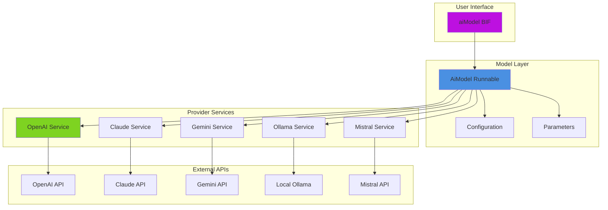
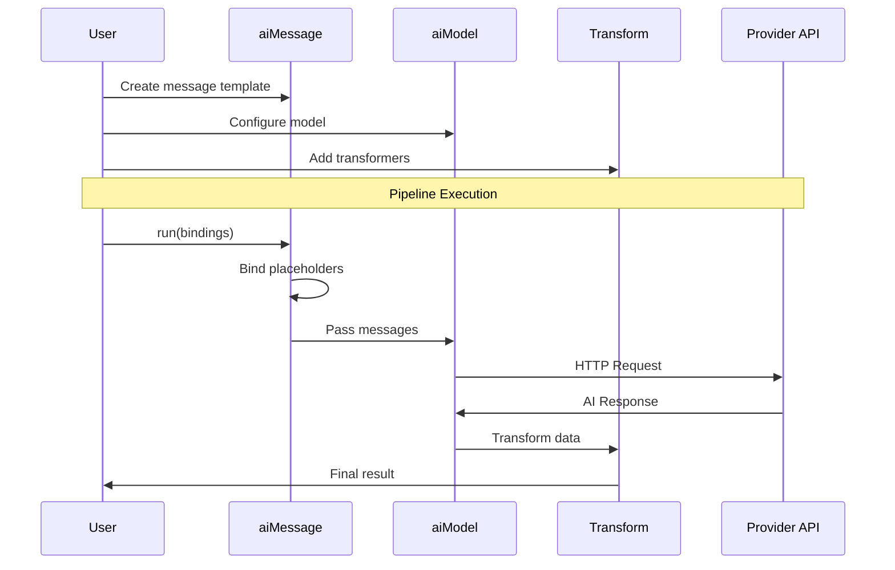

# 🧠 Working with Models

Learn how to use AI models as pipeline-compatible runnables. Models wrap AI service providers for seamless integration into pipelines.

## 🚀 Creating Models

The `aiModel()` BIF creates pipeline-compatible AI models.

### 🏗️ Model Architecture



### Basic Creation

```java
// Uses default provider from config
model = aiModel()

// Specific provider
model = aiModel( "openai" )
model = aiModel( "claude" )
model = aiModel( "gemini" )
model = aiModel( "mistral" )
model = aiModel( "ollama" )

// With custom API key
model = aiModel( "openai", "sk-your-key-here" )
```

### Model Configuration

```java
model = aiModel( "openai" )
    .withParams( {
        model: "gpt-4",
        temperature: 0.7,
        max_tokens: 1000,
        top_p: 0.9
    } )
    .withName( "my-gpt4-model" )
```

## 🔗 Models in Pipelines

### 🔄 Pipeline Integration Flow



### Basic Pipeline

```java
pipeline = aiMessage()
    .user( "Explain ${topic}" )
    .to( aiModel( "openai" ) )

result = pipeline.run( { topic: "AI" } )
```

### Using Default Model

```java
// Shortcut for .to( aiModel() )
pipeline = aiMessage()
    .user( "Hello ${name}" )
    .toDefaultModel()

result = pipeline.run( { name: "World" } )
```

### Multiple Models in Sequence

```java
// Generate with OpenAI, review with Claude
pipeline = aiMessage()
    .user( "Write code to ${task}" )
    .to( aiModel( "openai" ).withName( "generator" ) )
    .transform( r => r.content )
    .to( aiMessage().user( "Review: ${code}" ) )
    .to( aiModel( "claude" ).withName( "reviewer" ) )

result = pipeline.run( { task: "sort an array" } )
```

## ⚙️ Model Parameters

### Common Parameters

```java
model = aiModel( "openai" )
    .withParams( {
        model: "gpt-4",              // Model name
        temperature: 0.7,            // 0.0 = focused, 1.0 = creative
        max_tokens: 500,             // Response length limit
        top_p: 0.9,                  // Nucleus sampling
        presence_penalty: 0.0,       // Reduce topic repetition
        frequency_penalty: 0.0       // Reduce word repetition
    } )
```

### Provider-Specific Parameters

**OpenAI:**
```java
model = aiModel( "openai" )
    .withParams( {
        model: "gpt-4",
        response_format: { type: "json_object" },
        seed: 12345,
        user: "user-id-123"
    } )
```

**Claude:**
```java
model = aiModel( "claude" )
    .withParams( {
        model: "claude-3-opus-20240229",
        max_tokens: 4096,  // Required for Claude
        stop_sequences: [ "\n\nHuman:" ]
    } )
```

**Ollama:**
```java
model = aiModel( "ollama" )
    .withParams( {
        model: "llama3.2",
        temperature: 0.7,
        num_predict: 500
    } )
```

### Runtime Parameter Override

```java
model = aiModel( "openai" )
    .withParams( { temperature: 0.7 } )

// Override at runtime - second parameter is params
result = model.run(
    { messages: [...] },
    { temperature: 0.9 }  // Uses 0.9
)
```

## 🎛️ Model Options

Models support the `options` parameter for controlling runtime behavior.

### Setting Default Options

```java
model = aiModel( "openai" )
    .withParams( { model: "gpt-4" } )
    .withOptions( {
        returnFormat: "single",
        timeout: 60,
        logRequest: true
    } )

// Uses default options
result = aiMessage()
    .user( "Hello" )
    .to( model )
    .run()
```

### Runtime Options Override

```java
model = aiModel( "openai" )
    .withOptions( { returnFormat: "raw" } )

pipeline = aiMessage()
    .user( "Hello ${name}" )
    .to( model )

// Override at runtime - third parameter is options
result = pipeline.run(
    { name: "World" },           // input bindings
    { temperature: 0.7 },        // AI parameters
    { returnFormat: "single" }   // runtime options (overrides default)
)
```

### Convenience Methods

```java
// Return just the content string
result = aiMessage()
    .user( "Say hello" )
    .to( aiModel() )
    .singleMessage()  // Convenience method
    .run()
// "Hello! How can I help you?"

// Return array of messages
result = aiMessage()
    .user( "List colors" )
    .to( aiModel() )
    .allMessages()  // Convenience method
    .run()
// [{ role: "assistant", content: "Red, Blue, Green" }]

// Return raw response (default for pipelines)
result = aiMessage()
    .user( "Hello" )
    .to( aiModel() )
    .rawResponse()  // Explicit (raw is default)
    .run()
// { model: "gpt-3.5-turbo", choices: [...], usage: {...}, ... }
```

### Available Options

- `returnFormat:string` - `"raw"` (default), `"single"`, or `"all"`
- `timeout:numeric` - Request timeout in seconds
- `logRequest:boolean` - Log requests to `ai.log`
- `logRequestToConsole:boolean` - Log requests to console
- `logResponse:boolean` - Log responses to `ai.log`
- `logResponseToConsole:boolean` - Log responses to console
- `provider:string` - Override AI provider
- `apiKey:string` - Override API key

### Debugging with Options

```java
// Enable logging for debugging
debugModel = aiModel( "openai" )
    .withOptions( {
        logRequest: true,
        logRequestToConsole: true,
        logResponse: true,
        logResponseToConsole: true
    } )

pipeline = aiMessage()
    .user( "Debug this" )
    .to( debugModel )

result = pipeline.run()  // Logs everything to console and ai.log
```

## Model Patterns

### Task-Specific Models

```java
// Creative writing model
creativeModel = aiModel( "openai" )
    .withParams( {
        model: "gpt-4",
        temperature: 0.9,
        max_tokens: 2000
    } )
    .withName( "creative-writer" )

// Code generation model
codeModel = aiModel( "openai" )
    .withParams( {
        model: "gpt-4",
        temperature: 0.3,
        max_tokens: 1000
    } )
    .withName( "code-generator" )

// Analysis model
analysisModel = aiModel( "claude" )
    .withParams( {
        model: "claude-3-opus-20240229",
        temperature: 0.2,
        max_tokens: 4096
    } )
    .withName( "analyzer" )
```

### Model Factory

```java
component {
    function getModel( required string purpose ) {
        switch( arguments.purpose ) {
            case "creative":
                return aiModel( "openai" )
                    .withParams({ temperature: 0.9, model: "gpt-4" })

            case "factual":
                return aiModel( "openai" )
                    .withParams({ temperature: 0.2, model: "gpt-4" })

            case "code":
                return aiModel( "openai" )
                    .withParams({ temperature: 0.3, model: "gpt-4" })

            case "analysis":
                return aiModel( "claude" )
                    .withParams({ temperature: 0.2, max_tokens: 4096 })

            case "local":
                return aiModel( "ollama" )
                    .withParams({ model: "llama3.2" })

            default:
                return aiModel()
        }
    }
}

// Usage
factory = new ModelFactory()
result = aiMessage()
    .user( "Write a poem" )
    .to( factory.getModel( "creative" ) )
    .run()
```

### Model Ensemble

```java
// Get multiple perspectives
function askEnsemble( required string question ) {
    models = [
        aiModel( "openai" ).withName( "openai" ),
        aiModel( "claude" ).withName( "claude" ),
        aiModel( "ollama" ).withName( "ollama" )
    ]

    message = aiMessage().user( arguments.question )

    return models.map( m => {
        return {
            model: m.getName(),
            response: message.to( m ).run()
        }
    } )
}

// Usage
responses = askEnsemble( "What is the future of AI?" )
responses.each( r => {
    println( r.model & ": " & r.response )
} )
```

## Advanced Usage

### Conditional Model Selection

```java
function getAppropriateModel( required string taskType, required numeric complexity ) {
    if( arguments.taskType == "creative" ) {
        return aiModel( "openai" ).withParams({ temperature: 0.9 })
    }

    if( arguments.complexity > 8 ) {
        return aiModel( "openai" ).withParams({ model: "gpt-4" })
    }

    if( arguments.complexity < 3 ) {
        return aiModel( "ollama" ).withParams({ model: "llama3.2:1b" })
    }

    return aiModel( "openai" ).withParams({ model: "gpt-3.5-turbo" })
}

// Usage
model = getAppropriateModel( "analysis", 9 )
result = aiMessage().user( "Complex task" ).to( model ).run()
```

### Model with Fallback

```java
function robustPipeline( required string question ) {
    message = aiMessage().user( arguments.question )

    try {
        // Try primary model
        return message.to( aiModel( "openai" ) ).run()
    } catch( any e ) {
        try {
            // Fallback to Claude
            return message.to( aiModel( "claude" ) ).run()
        } catch( any e2 ) {
            // Last resort: local model
            return message.to( aiModel( "ollama" ) ).run()
        }
    }
}
```

### Cost-Aware Model Selection

```java
component {
    property name="budget" type="numeric" default="0";
    property name="spent" type="numeric" default="0";

    function init( required numeric budget ) {
        variables.budget = arguments.budget
        return this
    }

    function getModel() {
        remaining = variables.budget - variables.spent

        if( remaining > 0.10 ) {
            return aiModel( "openai" ).withParams({ model: "gpt-4" })
        } else if( remaining > 0.01 ) {
            return aiModel( "openai" ).withParams({ model: "gpt-3.5-turbo" })
        } else {
            return aiModel( "ollama" )  // Free
        }
    }

    function trackUsage( required numeric cost ) {
        variables.spent += arguments.cost
    }
}
```

## Model Introspection

### Getting Model Information

```java
model = aiModel( "openai" )
    .withParams({ model: "gpt-4", temperature: 0.7 })
    .withName( "my-model" )

// Get name
println( model.getName() )  // "my-model"

// Get service
service = model.getService()
println( service.getName() )  // "openai"

// Get effective parameters
params = model.getMergedParams()
println( params )  // { model: "gpt-4", temperature: 0.7 }
```

### Getting Complete Configuration

The `getConfig()` method returns a comprehensive view of the model's configuration:

```java
model = aiModel( "openai" )
    .withParams({
        model: "gpt-4",
        temperature: 0.7,
        max_tokens: 1000
    })
    .withName( "my-custom-model" )
    .bindTools( [ weatherTool, searchTool ] )

config = model.getConfig()
println( serializeJSON( config, true ) )

/* Output:
{
    "name": "my-custom-model",
    "provider": "OpenAI",
    "toolCount": 2,
    "params": {
        "model": "gpt-4",
        "temperature": 0.7,
        "max_tokens": 1000
    },
    "options": {
        "returnFormat": "raw"
    }
}
*/
```

### Configuration Use Cases

**Debugging and Logging:**

```java
model = aiModel( "openai" ).withParams({ temperature: 0.9 })
config = model.getConfig()

logger.info( "Using model: #config.name# (provider: #config.provider#)" )
logger.debug( "Temperature: #config.params.temperature#" )
logger.debug( "Tools available: #config.toolCount#" )
```

**Configuration Validation:**

```java
function validateModel( required model ) {
    config = model.getConfig()

    if ( config.provider != "openai" && config.provider != "claude" ) {
        throw( message: "Unsupported provider: #config.provider#" )
    }

    if ( config.params.temperature > 1.0 ) {
        throw( message: "Temperature too high: #config.params.temperature#" )
    }

    return true
}
```

**Model Comparison:**

```java
models = [
    aiModel( "openai" ).withParams({ temperature: 0.3 }),
    aiModel( "claude" ).withParams({ temperature: 0.7 }),
    aiModel( "ollama" ).withParams({ model: "llama3.2" })
]

models.each( m => {
    config = m.getConfig()
    println( "#config.provider#: temp=#config.params.temperature ?: 'default'#" )
})
```

**Saving/Restoring Configuration:**

```java
// Save configuration
model = aiModel( "openai" ).withParams({ temperature: 0.8 })
config = model.getConfig()
fileWrite( "model-config.json", serializeJSON( config ) )

// Restore configuration (conceptually)
savedConfig = deserializeJSON( fileRead( "model-config.json" ) )
restoredModel = aiModel( savedConfig.provider.toLower() )
    .withParams( savedConfig.params )
    .withName( savedConfig.name )
```

### Pipeline Inspection

```java
pipeline = aiMessage()
    .user( "Hello" )
    .withName( "greeting" )
    .to( aiModel( "openai" ).withName( "gpt-model" ) )
    .transform( r => r.content )

// Get pipeline structure
steps = pipeline.getSteps()
println( "Pipeline has " & steps.len() & " steps:" )
steps.each( (s, i) => {
    println( "#i#. #s.getName()#" )
})
```

## Binding Tools to Models

Models can have tools bound to them for function calling capabilities. Tools bound to a model are automatically available when the model is used.

### Basic Tool Binding

```java
// Create tools
weatherTool = aiTool(
    "get_weather",
    "Get current weather for a location",
    location => getWeatherData( location )
).describeLocation( "City name" )

// Bind tools to model
model = aiModel( "openai" )
    .bindTools( [ weatherTool ] )

// Tools are automatically used when needed
pipeline = aiMessage()
    .user( "What's the weather in ${city}?" )
    .to( model )

result = pipeline.run( { city: "Boston" } )
```

### Multiple Tools

```java
// Create multiple tools
searchTool = aiTool(
    "search",
    "Search for information",
    query => performSearch( query )
).describeQuery( "Search query" )

calculatorTool = aiTool(
    "calculate",
    "Perform calculations",
    expression => evaluate( expression )
).describeExpression( "Math expression" )

// Bind all tools at once
model = aiModel( "openai" )
    .bindTools( [ searchTool, calculatorTool, weatherTool ] )
```

### Adding Tools Incrementally

```java
// Start with base tools
model = aiModel( "openai" )
    .bindTools( [ commonTool1, commonTool2 ] )

// Add more tools (appends, doesn't replace)
model = model.addTools( [ specialTool ] )

// Now has all three tools
```

### Tools in Agents

Models with bound tools work seamlessly in agents:

```java
// Create model with tools
tooledModel = aiModel( "claude" )
    .bindTools( [ weatherTool, searchTool ] )

// Agent automatically uses the model's tools
agent = aiAgent(
    name: "Assistant",
    model: tooledModel
)

response = agent.run( "What's the weather in Paris?" )
// Agent uses weatherTool automatically
```

### Runtime Tools vs Bound Tools

**Bound Tools (via bindTools/addTools):**

- Permanently attached to the model
- Available in all executions
- Ideal for reusable models
- Used automatically in agents

**Runtime Tools (via params.tools):**

- Passed per execution
- Merged with bound tools
- Useful for context-specific needs

```java
// Model with common tools
model = aiModel( "openai" )
    .bindTools( [ lookupTool, validateTool ] )

// Add admin tools at runtime
if ( isAdmin( user ) ) {
    result = model.run(
        messages: messages,
        params: {
            tools: [ adminTool, deleteTool ]  // Merged with bound tools
        }
    )
} else {
    result = model.run( messages: messages )  // Only bound tools
}
```

### Tool Execution Flow

When a model has tools:

1. **Request Sent**: Model receives message with available tools
2. **AI Decides**: Model determines if tool call is needed
3. **Tool Invoked**: Service executes the tool function
4. **Result Returned**: Tool result sent back to model
5. **Final Response**: Model generates answer using tool result

All tool execution is handled automatically by the service layer.

```java
weatherTool = aiTool(
    "get_weather",
    "Get weather data",
    location => {
        // This code executes automatically when AI calls the tool
        return getWeatherAPI( location )
    }
).describeLocation( "City and country" )

model = aiModel( "openai" ).bindTools( [ weatherTool ] )

// User asks question
result = model.run(
    { role: "user", content: "What's the weather in London?" }
)
// 1. Model receives question and tool definition
// 2. Model calls get_weather tool with "London"
// 3. Tool function executes getWeatherAPI("London")
// 4. Result sent back to model
// 5. Model responds: "It's 15°C and cloudy in London"
```

## Best Practices

1. **Name Your Models**: Use `.withName()` for debugging
2. **Set Appropriate Temperature**: Match creativity to task
3. **Limit Max Tokens**: Control costs and response time
4. **Use Local Models**: For privacy and development
5. **Cache Model Instances**: Reuse configured models
6. **Handle Errors**: Models can timeout or fail
7. **Monitor Costs**: Track usage with raw responses

## Examples

### Document Processor

```java
summarizer = aiMessage()
    .system( "Summarize concisely" )
    .user( "${document}" )
    .to( aiModel( "openai" ).withParams({ temperature: 0.3 }) )
    .transform( r => r.content )

extractor = aiMessage()
    .system( "Extract key points" )
    .user( "${document}" )
    .to( aiModel( "claude" ).withParams({ max_tokens: 4096 }) )
    .transform( r => r.content )

document = "Long document text..."
summary = summarizer.run( { document: document } )
keyPoints = extractor.run( { document: document } )
```

### Multi-Model Validator

```java
pipeline = aiMessage()
    .user( "Generate code to ${task}" )
    .to( aiModel( "openai" ).withName( "generator" ) )
    .transform( r => r.content )
    .to( aiMessage().user( "Validate: ${code}" ) )
    .to( aiModel( "claude" ).withName( "validator" ) )
    .transform( r => r.content )

result = pipeline.run( { task: "sort array" } )
```

## Next Steps

- **[Message Templates](messages.md)** - Build dynamic prompts
- **[Transformers](transformers.md)** - Process model outputs
- **[Pipeline Streaming](streaming.md)** - Real-time responses
