# 🧩 Main Components

Welcome to the core building blocks of BoxLang AI. This section covers the essential components you need to build sophisticated AI agents and composable pipelines.

## 📖 Overview

BoxLang AI is built on a **runnable pipeline architecture** that allows you to:

- **🔗 Chain operations** - Connect AI models, messages, transforms, and agents
- **♻️ Reuse workflows** - Define once, execute with different inputs
- **🧩 Compose freely** - Mix and match components to create complex flows
- **🎯 Stay flexible** - Swap providers, add steps, or modify behavior without refactoring

Think of these components as LEGO blocks - each piece has a specific purpose, but the real power comes from how you combine them.

### 🏗️ Architecture Overview

```mermaid
graph TB
    subgraph "Core Components"
        M[🧠 AI Models]
        MSG[✉️ Messages]
        T[🔧 Transformers]
        AG[🤖 Agents]
        MEM[💭 Memory]
        TOOL[🛠️ Tools]
    end
    
    subgraph "Pipeline Flow"
        INPUT[Input Data] --> MSG
        MSG --> M
        M --> T
        T --> OUTPUT[Output]
    end
    
    subgraph "Agent Architecture"
        AG --> M
        AG --> MEM
        AG --> TOOL
        TOOL --> API[External APIs]
    end
    
    style M fill:#4A90E2
    style MSG fill:#7ED321
    style T fill:#F5A623
    style AG fill:#BD10E0
    style MEM fill:#50E3C2
    style TOOL fill:#B8E986
```



### 🔄 Pipeline Execution Flow


---

## 🎯 Core Components

Below is a detailed overview of each component. Each has a specific role in the ecosystem, and they work together seamlessly.

### 🧠 [AI Models](models.md)

AI provider integrations wrapped as runnable pipeline components.

**What it does:**
- Wraps OpenAI, Claude, Gemini, Ollama, and other providers
- Makes them composable in pipelines
- Provides consistent interface across all providers

**Quick example:**
```java
model = aiModel( "openai" )
    .withModel( "gpt-4o" )
    .withTemperature( 0.7 );

response = model.run( "What is BoxLang?" );
```

**Use when:** You need direct model control, want to swap providers, or build custom workflows.

→ [Full Models Documentation](models.md)

---

### ✉️ [Messages & Templates](messages.md)

Reusable message builders with dynamic placeholders and role management.

**What it does:**
- Builds conversation messages (system, user, assistant)
- Supports dynamic placeholders for variable injection
- Handles multimodal content (images, audio, video, documents)
- Creates reusable prompt templates

**Quick example:**
```java
template = aiMessage()
    .system( "You are a ${role}" )
    .user( "Explain ${topic} in ${style} style" );

response = template
    .to( aiModel( "claude" ) )
    .run( {
        role: "teacher",
        topic: "quantum computing",
        style: "simple"
    } );
```

**Use when:** You have repeated prompts, need dynamic content, or want organized message management.

→ [Full Messages Documentation](messages.md)

---

### 🤖 [AI Agents](agents.md)

Autonomous AI entities with memory, tools, and reasoning capabilities.

**What it does:**
- Maintains conversation context across multiple turns
- Automatically decides when to use tools
- Manages multiple memory strategies (windowed, summary, session, file)
- Provides autonomous reasoning and planning

**Quick example:**
```java
agent = aiAgent()
    .withInstructions( "You are a helpful research assistant" )
    .withTools( [ searchTool, calculatorTool ] )
    .withMemory( "windowed", { maxMessages: 20 } )
    .build();

response = agent.run( "What's the weather in Boston?" );
// Agent automatically calls weather tool
```

**Use when:** You need context-aware conversations, autonomous tool use, or complex multi-turn interactions.

→ [Full Agents Documentation](agents.md)

---

### 💭 [Memory Systems](memory.md)

Context management strategies for maintaining conversation history.

**What it does:**
- Windowed memory - Keep recent N messages
- Summary memory - Compress old context
- Session memory - Persist across application restarts
- File memory - Store conversations on disk
- Vector memory - Semantic similarity search

**Quick example:**
```java
// Keep last 20 messages
memory = aiMemory( "windowed", { maxMessages: 20 } );

// Summarize old conversations
memory = aiMemory( "summary", {
    maxMessages: 10,
    summaryInstructions: "Summarize key points"
} );

// Use in agent
agent.withMemory( memory );
```

**Use when:** Building chatbots, maintaining context, or managing long conversations.

→ [Full Memory Documentation](memory.md)

---

### 🔧 [Transformers](transformers.md)

Data processing and transformation steps in pipelines.

**What it does:**
- Transform AI responses into desired formats
- Extract specific data from responses
- Chain multiple transformations
- Apply custom logic between pipeline steps

**Quick example:**
```java
pipeline = aiModel( "openai" )
    .transform( response => response.content )
    .transform( text => text.toUpper() )
    .transform( text => text.trim() );

result = pipeline.run( "hello world" );
// Output: "HELLO WORLD"
```

**Use when:** You need data processing, format conversion, or custom business logic in workflows.

→ [Full Transformers Documentation](transformers.md)

---

### 🛠️ [AI Tools](tools.md)

Function calling to enable AI to access real-time data and external systems.

**What it does:**
- Define functions that AI can call
- Access databases, APIs, and external services
- Provide real-time data to AI models
- Enable AI to perform actions in your system

**Quick example:**
```java
weatherTool = aiTool(
    "get_weather",
    "Get current weather for a location",
    ( args ) => getWeatherData( args.location )
).describeLocation( "City name" );

result = aiChat(
    "What's the weather in San Francisco?",
    { tools: [ weatherTool ] }
);
```

**Use when:** AI needs access to real-time data, external APIs, databases, or your own functions.

→ [Full Tools Documentation](tools.md)

---

### 📊 [Structured Output](structured-output.md)

Extract structured data from AI responses into classes, structs, or arrays.

---

## 🔄 Component Relationships


---

## 💡 When to Use Each Component

| Scenario | Recommended Component | Why |
|----------|----------------------|-----|
| Simple Q&A | `aiChat()` function | Fastest for one-off queries |
| Reusable prompts | `aiMessage()` | Dynamic placeholders, template reuse |
| Direct model control | `aiModel()` | Swap providers, configure parameters |
| Complex workflows | Pipeline with transforms | Chain multiple steps |
| Context-aware chat | `aiAgent()` with memory | Maintains conversation history |
| Real-time data access | `aiAgent()` with tools | AI can call your functions |
| Long conversations | Agent with summary memory | Compresses old context |
| Structured data | Structured output + JSON format | Extract typed data |

---

**What it does:**
- Define schemas for AI output
- Populate BoxLang classes automatically
- Extract arrays of data
- Validate and type-check responses

**Quick example:**
```java
// Define a class for type-safe extraction
class Person {
    property name="name" type="string";
    property name="age" type="numeric";
    property name="job" type="string";
}

// Extract data into typed class
result = aiChat( "Extract: John is 30, works as a developer" )
    .structuredOutput( new Person() );

println( result.getName() ); // "John"
println( result.getAge() );  // 30
```

**Use when:** Extracting data from text, generating forms, or parsing documents into structured formats.

→ [Full Structured Output Documentation](structured-output.md)

---

### 📡 [Streaming](streaming.md)

Real-time response streaming for better user experience.

**What it does:**
- Stream AI responses token-by-token
- Works with models, agents, and pipelines
- Provides callbacks for real-time updates
- Enables responsive UIs

**Quick example:**
```java
aiModel( "openai" ).stream(
    onChunk: ( chunk ) => {
        print( chunk );
    },
    input: "Write a short story"
);
```

**Use when:** Building interactive UIs, chatbots, or any application where real-time feedback matters.

→ [Full Streaming Documentation](streaming.md)

---

## Understanding Pipelines

### What are Pipelines?

Pipelines are sequences of **runnables** - components that process data and pass results to the next step. Think of them as assembly lines for AI processing.

### Basic Pipeline Structure

```
Input → Message Template → AI Model → Transform → Output
```

Each step:

1. Receives input from the previous step
2. Processes the data
3. Passes output to the next step

### Why Use Pipelines?

**Composability**: Chain multiple operations together

```java
pipeline = aiMessage().user( "Hello" ).to( aiModel( "openai" ) ).transform( r => r.content )
```

**Reusability**: Define once, use with different inputs

```java
greeter = aiMessage().user( "Greet ${name}" ).to( aiModel( "openai" ) )
greeter.run( { name: "Alice" } )  // "Hello Alice!"
greeter.run( { name: "Bob" } )    // "Hello Bob!"
```

**Immutability**: Each operation creates a new pipeline

```java
base = aiMessage().user( "Hello" )
pipeline1 = base.to( aiModel( "openai" ) )  // Doesn't modify base
pipeline2 = base.to( aiModel( "claude" ) )  // Different pipeline
```

**Flexibility**: Mix models, transforms, and custom logic

```java
complex = aiMessage()
    .user( "Task: ${task}" )
    .to( aiModel( "openai" ) )
    .transform( r => r.content )
    .to( aiMessage().user( "Review: ${review}" ) )
    .to( aiModel( "claude" ) )
```

## Runnable Interface

### Runnables

All pipeline components implement the `IAiRunnable` interface:

```java
interface IAiRunnable {
    // Synchronous execution
    any function run( any input = {}, struct params = {}, struct options = {} )

    // Streaming execution
    void function stream( function onChunk, any input = {}, struct params = {}, struct options = {} )

    // Chaining
    IAiRunnable function to( IAiRunnable next )

    // Introspection
    string function getName()
}
```

**Built-in Runnables:**

- `AiMessage` - Message templates
- `AiModel` - AI providers wrapped for pipelines
- `AiAgent` - Autonomous agents with memory and tools
- `AiTransformRunnable` - Data transformers
- `AiRunnableSequence` - Pipeline chains

### Input and Output

**Input types:**

- Empty struct `{}` - No input
- Struct with bindings `{ key: "value" }`
- Messages array `[{ role: "user", content: "..." }]`
- Previous step output

**Output types:**

- Messages array
- AI response struct
- Transformed data (string, struct, array, etc.)

### Parameters

Runtime parameters merge with stored defaults:

```java
model = aiModel()
    .withParams( { temperature: 0.7 } )  // Stored default

// Runtime params override
model.run( {}, { temperature: 0.9 } )  // Uses 0.9
```

### Options

Options control runtime behavior (returnFormat, timeout, logging, etc.):

```java
pipeline = aiMessage()
    .user( "Hello" )
    .toDefaultModel()
    .withOptions( { returnFormat: "single", timeout: 60 } )  // Stored defaults

// Runtime options override
pipeline.run( {}, {}, { returnFormat: "raw" } )  // Uses raw format
```

## Building Your First Pipeline

### Step 1: Create a Message Template

```java
message = aiMessage()
    .system( "You are a helpful assistant" )
    .user( "Explain ${topic}" )
```

### Step 2: Add an AI Model

```java
pipeline = message.toDefaultModel()
```

### Step 3: Add a Transformer

```java
pipeline = message
    .toDefaultModel()
    .transform( response => response.content )
```

### Step 4: Run It

```java
result = pipeline.run( { topic: "recursion" } )
println( result )
```

### Complete Example

```java
// Create pipeline
explainer = aiMessage()
    .system( "You are a ${style} teacher" )
    .user( "Explain ${topic} in simple terms" )
    .toDefaultModel()
    .transform( r => r.content )
    .transform( s => s.trim() )

// Use multiple times
println( explainer.run( { style: "patient", topic: "variables" } ) )
println( explainer.run( { style: "concise", topic: "functions" } ) )
```

## Chaining Operations

### The `.to()` Method

Connects runnables in sequence:

```java
step1 = aiMessage().user( "Hello" )
step2 = aiModel( "openai" )
step3 = aiTransform( r => r.content )

pipeline = step1.to( step2 ).to( step3 )
```

### Helper Methods

**`.toDefaultModel()`** - Connect to default model:

```java
pipeline = aiMessage()
    .user( "Hello" )
    .toDefaultModel()  // Equivalent to .to( aiModel() )
```

**`.transform()`** - Add a transformer:

```java
pipeline = aiMessage()
    .user( "Hello" )
    .toDefaultModel()
    .transform( r => r.content.ucase() )
```

## Pipeline Patterns

### Linear Pipeline

```java
// Simple sequence: A → B → C
pipeline = aiMessage()
    .user( "Write code to ${task}" )
    .toDefaultModel()
    .transform( r => r.content )
```

### Multi-Step Processing

```java
// Generate, then review
pipeline = aiMessage()
    .user( "Write a function to ${task}" )
    .to( aiModel( "openai" ).withName( "generator" ) )
    .transform( r => r.content )
    .to( aiMessage().user( "Review this code: ${code}" ) )
    .to( aiModel( "claude" ).withName( "reviewer" ) )
    .transform( r => r.content )
```

### Branching Logic

```java
// Create different pipelines based on conditions
basePipeline = aiMessage().user( "Analyze ${data}" )

if( needsDeepAnalysis ) {
    pipeline = basePipeline.to( aiModel( "gpt-4" ).withParams({ temperature: 0.3 }) )
} else {
    pipeline = basePipeline.to( aiModel( "gpt-3.5-turbo" ) )
}
```

### Reusable Components

```java
// Create reusable steps
systemPrompt = aiMessage().system( "You are an expert ${role}" )
reviewer = aiModel( "claude" ).withParams({ temperature: 0.3 })
formatter = aiTransform( r => r.content.trim().ucase() )

// Combine in different ways
pipeline1 = systemPrompt.user( "Task 1" ).to( reviewer ).to( formatter )
pipeline2 = systemPrompt.user( "Task 2" ).to( reviewer )  // Without formatter
```

## Working with Pipeline Results

### Running Pipelines

```java
// With bindings
result = pipeline.run( { key: "value" } )

// Without bindings
result = pipeline.run()

// With runtime parameters
result = pipeline.run( { key: "value" }, { temperature: 0.9 } )
```

### Options and Return Formats

By default, pipelines return **raw responses** from the AI provider (full API response struct). This gives you maximum flexibility to access all response data including metadata, usage stats, and multiple choices.

**Five format options:**

1. **`raw`** (default) - Full API response with all metadata
2. **`single`** - Extract just the content string from first message
3. **`all`** - Array of all choice messages
4. **`json`** - Automatically parse JSON response into struct/array
5. **`xml`** - Automatically parse XML response into XML object

#### Using `.withOptions()`

```java
// Explicit format specification
pipeline = aiMessage()
    .user( "Hello" )
    .toDefaultModel()
    .withOptions( { returnFormat: "single" } )  // Returns string content

result = pipeline.run()  // "Hello! How can I help you?"

// Or specify at runtime
result = pipeline.run( {}, {}, { returnFormat: "single" } )  // "Hello! How can I help you?"
```

#### Convenience Methods

**`.singleMessage()`** - Extract content string (most common):

```java
// Returns just the text response
content = aiMessage()
    .user( "What is 2+2?" )
    .toDefaultModel()
    .singleMessage()
    .run()

println( content )  // "4"
```

**`.allMessages()`** - Get array of message objects:

```java
// Returns array of choice messages
messages = aiMessage()
    .user( "List 3 colors" )
    .toDefaultModel()
    .allMessages()
    .run()

messages.each( m => println( m.content ) )
```

**`.rawResponse()`** - Explicit raw format (default behavior):

```java
// Returns full API response
raw = aiMessage()
    .user( "Hello" )
    .toDefaultModel()
    .rawResponse()  // Optional - raw is default
    .run()

println( "Model used: " & raw.model )
println( "Usage: " & raw.usage.total_tokens )
println( "Content: " & raw.choices.first().message.content )
```

**`.asJson()`** - Parse JSON response automatically:

```java
// Returns parsed JSON as struct/array
data = aiMessage()
    .system( "Return only valid JSON" )
    .user( "Create a person object with name and age" )
    .toDefaultModel()
    .asJson()
    .run()

println( "Name: #data.name#" )  // Direct access!
println( "Age: #data.age#" )
```

**`.asXml()`** - Parse XML response automatically:

```java
// Returns parsed XML object
doc = aiMessage()
    .system( "Return valid XML" )
    .user( "Create XML for a book with title and author" )
    .toDefaultModel()
    .asXml()
    .run()

println( "Title: #doc.xmlRoot.book.title.xmlText#" )
println( "Author: #doc.xmlRoot.book.author.xmlText#" )
```

#### Format Comparison

```java
pipeline = aiMessage().user( "Say hello" ).toDefaultModel()

// Raw (default) - full response struct
rawResult = pipeline.run()
// { model: "gpt-3.5-turbo", choices: [...], usage: {...}, ... }

// Single - just the content string (convenience method)
singleResult = pipeline.singleMessage().run()
// "Hello! How can I help you today?"

// Single - using withOptions
singleResult = pipeline.withOptions({ returnFormat: "single" }).run()
// "Hello! How can I help you today?"

// Single - using runtime options
singleResult = pipeline.run( {}, {}, { returnFormat: "single" } )
// "Hello! How can I help you today?"

// All - array of message objects
allResult = pipeline.allMessages().run()
// [{ role: "assistant", content: "Hello! How can I help you today?" }]

// JSON - parsed JSON data
jsonPipeline = aiMessage()
    .system( "Return valid JSON" )
    .user( "Create a user with name and email" )
    .toDefaultModel()

jsonResult = jsonPipeline.asJson().run()
// { name: "John", email: "john@example.com" }
println( jsonResult.name )  // Direct access!

// XML - parsed XML document
xmlPipeline = aiMessage()
    .system( "Return valid XML" )
    .user( "Create book XML with title and author" )
    .toDefaultModel()

xmlResult = xmlPipeline.asXml().run()
// XML object
println( xmlResult.xmlRoot.book.title.xmlText )  // Direct access!
```

#### Available Options

The `options` struct supports these properties:

- `returnFormat:string` - Response format: `"raw"` (default), `"single"`, `"all"`, `"json"`, or `"xml"`
- `timeout:numeric` - Request timeout in seconds (default: 30)
- `logRequest:boolean` - Log requests to `ai.log` (default: false)
- `logRequestToConsole:boolean` - Log requests to console (default: false)
- `logResponse:boolean` - Log responses to `ai.log` (default: false)
- `logResponseToConsole:boolean` - Log responses to console (default: false)
- `provider:string` - Override AI provider
- `apiKey:string` - Override API key

```java
pipeline = aiMessage()
    .user( "Debug this" )
    .toDefaultModel()
    .withOptions( {
        returnFormat: "single",
        timeout: 60,
        logRequest: true,
        logResponse: true
    } )
```

#### Options Propagation

Options set via `withOptions()` propagate through pipeline chains:

```java
step1 = aiMessage()
    .user( "Hello" )
    .withOptions( { returnFormat: "single" } )

step2 = aiModel( "openai" )

pipeline = step1.to( step2 )  // Options from step1 become defaults for the sequence
result = pipeline.run()  // Uses single format
```

Runtime options override default options:

```java
pipeline = aiMessage()
    .user( "Hello" )
    .toDefaultModel()
    .withOptions( { returnFormat: "raw" } )

// Override at runtime
result = pipeline.run( {}, {}, { returnFormat: "single" } )  // Returns string, not struct
```

#### When to Use Each Format

**Use `raw` (default) when:**

- Building reusable pipeline components
- Need access to metadata (model, usage, tokens)
- Handling multiple choice responses
- Debugging API responses

**Use `singleMessage()` when:**

- Simple text extraction is all you need
- Building user-facing features
- Migrating from `aiChat()` to pipelines
- Chaining with transformers

**Use `allMessages()` when:**

- Processing multiple response choices
- Iterating over message objects
- Extracting role/content pairs
- Building conversation logs

**Use `asJson()` when:**

- AI generates structured data (objects, arrays)
- Need automatic JSON parsing
- Building APIs or data extraction
- Eliminating manual `deserializeJSON()` calls

**Use `asXml()` when:**

- AI generates XML documents
- Working with legacy XML systems
- RSS/ATOM feed generation
- Configuration file creation

#### Format vs Transform

Return formats are **built-in extraction**, transforms are **custom logic**:

```java
// Using format (built-in)
result = pipeline.singleMessage().run()

// Using transform (custom)
result = pipeline.transform( r => r.choices.first().message.content ).run()

// They can be equivalent, but formats are cleaner for common cases
```

## JSON and XML in Pipelines

### JSON Data Pipelines

Create pipelines that automatically parse JSON responses:

```java
// Simple JSON extraction
userPipeline = aiMessage()
    .system( "Return only valid JSON" )
    .user( "Create a user profile for ${name}, age ${age}" )
    .toDefaultModel()
    .asJson()

user = userPipeline.run( { name: "Alice", age: 30 } )
println( "Name: #user.name#" )
println( "Age: #user.age#" )
```

**Complex nested structures:**

```java
// Generate product catalog
catalogPipeline = aiMessage()
    .system( "You are a product data generator. Always return valid JSON." )
    .user( "Create ${count} products with id, name, price, and features array" )
    .toDefaultModel()
    .asJson()

products = catalogPipeline.run( { count: 5 } )

products.each( product => {
    println( "##product.id#: #product.name# - $#product.price#" )
    println( "Features: #product.features.toList( ', ' )#" )
} )
```

**Multi-step JSON processing:**

```java
// Generate data, then transform it
pipeline = aiMessage()
    .system( "Return valid JSON" )
    .user( "Create 3 users with name and email" )
    .toDefaultModel()
    .asJson()  // Parse JSON
    .transform( users => {
        // Transform the parsed data
        return users.map( user => {
            return {
                fullName: user.name.ucase(),
                email: user.email.lcase(),
                domain: user.email.listLast( "@" )
            }
        } )
    } )

enrichedUsers = pipeline.run()
enrichedUsers.each( u => {
    println( "#u.fullName# at #u.domain#" )
} )
```

**JSON for data extraction:**

```java
// Extract structured data from text
extractorPipeline = aiMessage()
    .system( "Extract information as JSON" )
    .user( "Extract contact info as JSON from: ${text}" )
    .toDefaultModel()
    .asJson()

text = "John Doe, 555-1234, john@example.com, 123 Main St"
contact = extractorPipeline.run( { text: text } )

println( "Name: #contact.name#" )
println( "Phone: #contact.phone#" )
println( "Email: #contact.email#" )
```

**Reusable JSON templates:**

```java
// Create a reusable form generator
formGenerator = aiMessage()
    .system( "Generate form data as JSON with fields: ${fields}" )
    .user( "Create sample data for a ${formType} form" )
    .toDefaultModel()
    .asJson()

// Use for different forms
registrationData = formGenerator.run({
    formType: "user registration",
    fields: "username, email, password"
})

surveyData = formGenerator.run({
    formType: "customer survey",
    fields: "rating, comments, wouldRecommend"
})
```

### XML Document Pipelines

Generate and parse XML documents:

```java
// Simple XML generation
configPipeline = aiMessage()
    .system( "Return valid XML configuration" )
    .user( "Create server config with host: ${host}, port: ${port}" )
    .toDefaultModel()
    .asXml()

config = configPipeline.run({ host: "localhost", port: 8080 })
println( "Host: #config.xmlRoot.server.host.xmlText#" )
println( "Port: #config.xmlRoot.server.port.xmlText#" )
```

**RSS feed generation:**

```java
// Generate RSS feed
rssPipeline = aiMessage()
    .system( "Generate valid RSS 2.0 XML" )
    .user( "Create RSS feed about ${topic} with ${count} articles" )
    .toDefaultModel()
    .asXml()

feed = rssPipeline.run({
    topic: "Technology News",
    count: 3
})

// Parse and display
println( "Feed: #feed.xmlRoot.channel.title.xmlText#" )

feed.xmlRoot.channel.xmlChildren
    .filter( node => node.xmlName == "item" )
    .each( item => {
        println( "- #item.title.xmlText#" )
        println( "  #item.description.xmlText#" )
    } )
```

**Multi-step XML processing:**

```java
// Generate XML, then extract data
reportPipeline = aiMessage()
    .system( "Generate sales report XML" )
    .user( "Create monthly sales report for ${month}" )
    .toDefaultModel()
    .asXml()
    .transform( xml => {
        // Extract and summarize from XML
        total = 0
        regions = []

        xml.xmlRoot.report.regions.xmlChildren.each( region => {
            sales = val( region.sales.xmlText )
            total += sales
            regions.append({
                name: region.name.xmlText,
                sales: sales
            })
        } )

        return {
            total: total,
            regions: regions,
            average: total / regions.len()
        }
    } )

summary = reportPipeline.run({ month: "January 2025" })
println( "Total Sales: $#numberFormat( summary.total )#" )
println( "Average per Region: $#numberFormat( summary.average )#" )
```

**XML to JSON conversion pipeline:**

```java
// Convert XML to JSON
conversionPipeline = aiMessage()
    .system( "Generate XML data" )
    .user( "Create product XML with id, name, price" )
    .toDefaultModel()
    .asXml()
    .transform( xml => {
        // Convert XML to struct
        return {
            id: xml.xmlRoot.product.id.xmlText,
            name: xml.xmlRoot.product.name.xmlText,
            price: val( xml.xmlRoot.product.price.xmlText )
        }
    } )

product = conversionPipeline.run()
println( serializeJSON( product ) )  // JSON output from XML input
```

### Combining Formats in Workflows

```java
// Step 1: Generate JSON data
step1 = aiMessage()
    .user( "Generate 3 users as JSON" )
    .toDefaultModel()
    .asJson()

// Step 2: Convert to XML
step2 = aiMessage()
    .user( "Convert this data to XML: ${data}" )
    .toDefaultModel()
    .asXml()

// Chain them
workflow = step1.to( step2 )

result = workflow.run()
// Input: text → JSON → XML
```

### Inspecting Pipelines

```java
pipeline = aiMessage()
    .user( "Hello" )
    .toDefaultModel()
    .transform( r => r.content )

// Count steps
count = pipeline.count()  // 3

// Get steps
steps = pipeline.getSteps()  // Array of runnables

// Get names
steps.each( s => println( s.getName() ) )
```

### Debugging Pipelines

```java
// Name your steps
pipeline = aiMessage()
    .user( "Hello" )
    .withName( "greeting-template" )
    .to( aiModel().withName( "gpt-model" ) )
    .transform( r => r.content )

// Print pipeline structure
pipeline.print()
/*
Pipeline with 3 steps:
1. greeting-template
2. gpt-model
3. AiTransformRunnable
*/
```

## Advanced Features

### Storing Bindings

```java
// Pre-bind some values
template = aiMessage()
    .system( "You are ${role}" )
    .user( "Explain ${topic}" )
    .bind( { role: "a teacher" } )  // Stored

// Only need to provide topic
result = template.toDefaultModel().run( { topic: "AI" } )
```

### Parameter Management

```java
// Set default parameters
model = aiModel( "openai" )
    .withParams( {
        temperature: 0.7,
        max_tokens: 500
    } )

// Runtime parameters merge
model.run( {}, { temperature: 0.9 } )  // Uses 0.9, keeps max_tokens: 500

// Clear defaults
model.clearParams()
```

### Naming for Organization

```java
// Name components
analyzer = aiMessage()
    .system( "Analyze the following" )
    .withName( "analyzer-prompt" )

model = aiModel( "gpt-4" )
    .withName( "analysis-model" )

pipeline = analyzer.user( "${text}" ).to( model )
    .withName( "document-analyzer" )

println( pipeline.getName() )  // "document-analyzer"
```

## Error Handling

```java
try {
    result = pipeline.run( bindings )
} catch( "InvalidInput" e ) {
    // Handle input validation errors
    println( "Invalid input: " & e.message )
} catch( "TimeoutException" e ) {
    // Handle timeout
    println( "Request timed out" )
} catch( any e ) {
    // Handle other errors
    println( "Pipeline error: " & e.message )
}
```

## Performance Tips

1. **Reuse Pipelines**: Create once, run many times
2. **Cache Results**: Cache expensive pipeline outputs
3. **Use Appropriate Models**: Match model capabilities to task complexity
4. **Limit Max Tokens**: Control costs and response times
5. **Stream Long Responses**: Better UX for detailed outputs

## Next Steps

- **[AI Agents](agents.md)** - Autonomous agents with memory and tools
- **[Working with Models](models.md)** - AI models in pipelines
- **[Message Templates](messages.md)** - Advanced templating
- **[Transformers](transformers.md)** - Data transformation
- **[Pipeline Streaming](streaming.md)** - Real-time processing
