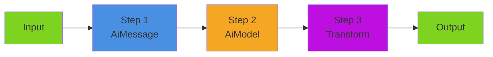

# Pipelines

Pipelines are the foundation of BoxLang AI's composable architecture. They allow you to chain AI operations, create reusable workflows, and build complex data processing flows with simple, readable code.

## 📋 Table of Contents

* [📋 Table of Contents](./#-table-of-contents)
* [🎯 What are Pipelines?](./#-what-are-pipelines)
  * [Key Benefits](./#key-benefits)
  * [Real-World Analogy](./#real-world-analogy)
* [🏗️ Pipeline Architecture](./#️-pipeline-architecture)
  * [The IAiRunnable Interface](./#the-iairunnable-interface)
  * [Built-in Runnable Components](./#built-in-runnable-components)
  * [Pipeline Flow](./#pipeline-flow)
* [🔨 Building Pipelines](./#-building-pipelines)
  * [Method 1: Fluent Chaining with `.to()`](./#method-1-fluent-chaining-with-to)
  * [Method 2: Helper Methods](./#method-2-helper-methods)
  * [Method 3: Explicit Sequence](./#method-3-explicit-sequence)
* [📥 Input and Output Flow](./#-input-and-output-flow)
  * [Data Passing](./#data-passing)
  * [Input Types](./#input-types)
  * [Output Types](./#output-types)
* [🔄 Transform Pipelines](./#-transform-pipelines)
  * [Simple Transformations](./#simple-transformations)
  * [Pre-Processing](./#pre-processing)
  * [Post-Processing](./#post-processing)
  * [Bidirectional Processing](./#bidirectional-processing)
* [🎭 Multi-Step Workflows](./#-multi-step-workflows)
  * [Draft-Refine Pattern](./#draft-refine-pattern)
  * [Analysis-Enhancement Pattern](./#analysis-enhancement-pattern)
  * [Validation Pipeline](./#validation-pipeline)
* [🔀 Multi-Model Pipelines](./#-multi-model-pipelines)
  * [Model Specialization](./#model-specialization)
  * [Parallel Processing](./#parallel-processing)
  * [Dynamic Model Selection](./#dynamic-model-selection)
* [♻️ Reusable Templates](./#️-reusable-templates)
  * [Parameterized Pipelines](./#parameterized-pipelines)
  * [Pipeline Factories](./#pipeline-factories)
  * [Composable Building Blocks](./#composable-building-blocks)
* [📡 Streaming Pipelines](./#-streaming-pipelines)
  * [Stream Execution](./#stream-execution)
  * [Stream Processing](./#stream-processing)
  * [Conditional Streaming](./#conditional-streaming)
* [⚙️ Parameters and Options](./#️-parameters-and-options)
  * [Default Parameters](./#default-parameters)
  * [Runtime Parameters](./#runtime-parameters)
  * [Options vs Parameters](./#options-vs-parameters)
* [🎬 Pipeline Events](./#-pipeline-events)
  * [Available Events](./#available-events)
  * [Event Interception](./#event-interception)
* [🐛 Debugging Pipelines](./#-debugging-pipelines)
  * [Print Pipeline Structure](./#print-pipeline-structure)
  * [Inspect Steps](./#inspect-steps)
  * [Step-by-Step Execution](./#step-by-step-execution)
* [⚡ Performance Optimization](./#-performance-optimization)
  * [Choose the Right Model](./#choose-the-right-model)
  * [Minimize Steps](./#minimize-steps)
  * [Cache Results](./#cache-results)
  * [Parallel Execution](./#parallel-execution)
* [🔒 Error Handling](./#-error-handling)
  * [Try-Catch Patterns](./#try-catch-patterns)
  * [Graceful Degradation](./#graceful-degradation)
  * [Validation Pipelines](./#validation-pipelines)
* [📚 Best Practices](./#-best-practices)
  * [Design Principles](./#design-principles)
  * [Common Patterns](./#common-patterns)
  * [Anti-Patterns to Avoid](./#anti-patterns-to-avoid)
* [🔗 Related Documentation](./#-related-documentation)

***

## 🎯 What are Pipelines?

Pipelines are **composable workflows** where data flows through a sequence of operations. Each operation (called a "runnable") processes the input and passes the result to the next step.

```javascript
// Simple pipeline: Message → AI Model → Transform
pipeline = aiMessage()
    .user( "Explain AI in one sentence" )
    .toDefaultModel()
    .transform( r => r.content.uCase() )

// Execute the pipeline
result = pipeline.run()
// Result: "ARTIFICIAL INTELLIGENCE IS THE SIMULATION OF HUMAN INTELLIGENCE BY MACHINES."
```

### Key Benefits

✅ **Composability** - Mix and match components like LEGO blocks ✅ **Reusability** - Define once, execute with different inputs ✅ **Readability** - Pipelines read like natural workflows ✅ **Flexibility** - Swap providers, add steps, modify behavior easily ✅ **Testability** - Each step can be tested independently ✅ **Maintainability** - Changes are isolated to specific steps

### Real-World Analogy

Think of a pipeline like an **assembly line** in a factory:

1. **Raw materials** (input) enter the line
2. **Each station** (runnable) performs a specific operation
3. **Output** from one station becomes **input** to the next
4. **Final product** (result) exits the line

```javascript
// Assembly line for content generation
contentPipeline = aiMessage()                    // Station 1: Prepare message
    .user( "Write about ${topic}" )
    .toDefaultModel()                             // Station 2: AI generation
    .transform( r => r.content )                  // Station 3: Extract text
    .transform( text => text.trim() )             // Station 4: Clean up
    .transform( text => {                         // Station 5: Package result
        return {
            content: text,
            wordCount: text.split( " " ).len(),
            timestamp: now()
        }
    } )
```

***

## 🏗️ Pipeline Architecture

### The IAiRunnable Interface

All pipeline components implement the `IAiRunnable` interface:

```javascript
interface IAiRunnable {
    // Synchronous execution
    any function run( any input = {}, struct params = {}, struct options = {} )

    // Streaming execution
    void function stream( function onChunk, any input = {}, struct params = {}, struct options = {} )

    // Chaining
    IAiRunnable function to( IAiRunnable next )

    // Introspection
    string function getName()
}
```

This consistent interface means **everything can be chained** with everything else.

### Built-in Runnable Components

| Component               | Purpose             | Example                                    |
| ----------------------- | ------------------- | ------------------------------------------ |
| **AiMessage**           | Message templates   | `aiMessage().user( "Hello ${name}" )`      |
| **AiModel**             | AI provider wrapper | `aiModel( "openai" )`                      |
| **AiAgent**             | Autonomous agent    | `aiAgent( model, memory, tools )`          |
| **AiTransformRunnable** | Data transformer    | `aiTransform( r => r.content )`            |
| **AiRunnableSequence**  | Pipeline chain      | `new AiRunnableSequence( [step1, step2] )` |

### Pipeline Flow



**Data flows left-to-right:**

1. Input data enters the first step
2. Each step's **output** becomes the next step's **input**
3. Final step's output is the pipeline result

***

## 🔨 Building Pipelines

There are multiple ways to build pipelines, all creating the same underlying `AiRunnableSequence`.

### Method 1: Fluent Chaining with `.to()`

The most common approach - chain components using `.to()`:

```javascript
pipeline = aiMessage()
    .user( "Translate '${text}' to ${language}" )
    .to( aiModel( "openai" ) )
    .to( aiTransform( r => r.content ) )

result = pipeline.run({
    text: "Hello, world!",
    language: "Spanish"
})
// Result: "¡Hola, mundo!"
```

**How it works:**

* Each `.to()` call creates a new `AiRunnableSequence`
* The sequence contains all previous steps + the new step
* Pipelines are **immutable** - chaining creates new sequences

### Method 2: Helper Methods

Convenience methods for common patterns:

```javascript
// .toDefaultModel() - Connect to default configured model
pipeline = aiMessage()
    .user( "Hello" )
    .toDefaultModel()

// .toModel( provider, apiKey ) - Connect to specific model
pipeline = aiMessage()
    .user( "Hello" )
    .toModel( "claude", myApiKey )

// .transform( fn ) - Add a transformation
pipeline = aiMessage()
    .user( "Count to 5" )
    .toDefaultModel()
    .transform( r => r.content.split( "," ).len() )
```

### Method 3: Explicit Sequence

For advanced scenarios, create sequences manually:

```javascript
import bxModules.bxai.models.runnables.AiRunnableSequence;

// Create individual steps
step1 = aiMessage().user( "Step 1" )
step2 = aiModel( "openai" )
step3 = aiTransform( r => r.content )

// Combine into sequence
pipeline = new AiRunnableSequence( [ step1, step2, step3 ] )

// Or use aiRunnableSequence() BIF
pipeline = aiRunnableSequence([
    step1,
    step2,
    step3
])
```

**When to use:**

* Building pipelines dynamically
* Conditional step inclusion
* Complex branching logic

***

## 📥 Input and Output Flow

Understanding how data moves through pipelines is crucial for building complex workflows.

### Data Passing

Each step receives the **previous step's output** as its **input**:

```javascript
pipeline = aiTransform( x => x * 2 )          // Step 1: Double
    .to( aiTransform( x => x + 10 ) )          // Step 2: Add 10
    .to( aiTransform( x => x / 2 ) )           // Step 3: Divide by 2

result = pipeline.run( 5 )
// Flow: 5 → 10 → 20 → 10
// Result: 10
```

**Step-by-step:**

1. Input `5` → Step 1: `5 * 2 = 10`
2. Input `10` → Step 2: `10 + 10 = 20`
3. Input `20` → Step 3: `20 / 2 = 10`
4. Output: `10`

### Input Types

Different components accept different input types:

| Component       | Input Type                  | Example                             |
| --------------- | --------------------------- | ----------------------------------- |
| **AiMessage**   | Struct (bindings)           | `{ name: "Alice", role: "admin" }`  |
| **AiModel**     | Messages array or AiMessage | `[{ role: "user", content: "Hi" }]` |
| **AiTransform** | Any type                    | String, struct, array, etc.         |
| **AiAgent**     | String (user message)       | `"What's the weather?"`             |

**Example - Mixed inputs:**

```javascript
// Message accepts struct bindings
template = aiMessage().user( "Hello ${name}" )

// Model accepts message output (array of message structs)
pipeline = template
    .toDefaultModel()
    // Transform accepts AI response struct
    .transform( r => r.content )
    // Next transform accepts string
    .transform( text => text.uCase() )

result = pipeline.run({ name: "Alice" })
// Flow: {name:"Alice"} → [{role:"user",content:"Hello Alice"}] → {content:"Hello, Alice!"} → "Hello, Alice!" → "HELLO, ALICE!"
```

### Output Types

The final output depends on the last step in the pipeline:

```javascript
// Model output: Full AI response struct
pipeline1 = aiMessage().user( "Hi" ).toDefaultModel()
result1 = pipeline1.run()
// result1 = { content: "Hello!", model: "gpt-4", usage: {...}, ... }

// Transform to content only
pipeline2 = pipeline1.transform( r => r.content )
result2 = pipeline2.run()
// result2 = "Hello!"

// Transform to custom struct
pipeline3 = pipeline2.transform( content => {
    return {
        message: content,
        length: content.len(),
        timestamp: now()
    }
} )
result3 = pipeline3.run()
// result3 = { message: "Hello!", length: 6, timestamp: {ts} }
```

***

## 🔄 Transform Pipelines

Transformations are the glue that connects incompatible steps and shapes data to your needs.

### Simple Transformations

Extract, format, or modify data:

```javascript
// Extract content from AI response
pipeline = aiMessage()
    .user( "Say hello" )
    .toDefaultModel()
    .transform( r => r.content )

// Chain multiple transforms
pipeline = aiMessage()
    .user( "List 3 colors" )
    .toDefaultModel()
    .transform( r => r.content )              // Extract content
    .transform( text => text.split( "," ) )   // Split into array
    .transform( arr => arr.map( s => s.trim() ) )  // Trim each item
    .transform( arr => arr.filter( s => s.len() > 0 ) )  // Remove empty

result = pipeline.run()
// Result: ["Red", "Blue", "Green"]
```

### Pre-Processing

Clean or enhance input **before** sending to AI:

```javascript
// Clean user input before AI processing
cleanPipeline = aiTransform( input => {
        // Remove extra spaces
        return input.reReplace( "\s+", " ", "all" ).trim()
    } )
    .transform( input => {
        // Add context
        return "User question: " & input & "\nPlease respond professionally."
    } )
    .to( aiModel( "openai" ) )

messyInput = "  What    is    BoxLang?   "
result = cleanPipeline.run( messyInput )
// AI receives: "User question: What is BoxLang?\nPlease respond professionally."
```

### Post-Processing

Process AI output **after** generation:

````javascript
// Extract code from AI response
codePipeline = aiMessage()
    .system( "Generate code wrapped in ```javascript blocks" )
    .user( "Write a function to ${task}" )
    .toDefaultModel()
    .transform( r => r.content )
    .transform( content => {
        // Extract code between ```javascript and ```
        matches = content.reMatch( "```javascript(.*?)```" )
        return matches.len() > 0 ? matches[1].trim() : ""
    } )

result = codePipeline.run({ task: "reverse a string" })
// Result: "function reverse(str) { return str.split('').reverse().join(''); }"
````

### Bidirectional Processing

Combine pre-processing and post-processing:

```javascript
// Full processing pipeline
fullPipeline = aiTransform( input => input.trim() )         // Pre: Clean
    .transform( input => "QUERY: " & input )                 // Pre: Add context
    .to( aiModel( "openai" ) )                               // AI generation
    .transform( r => r.content )                             // Post: Extract
    .transform( content => content.uCase() )                 // Post: Format
    .transform( content => {                                 // Post: Package
        return {
            response: content,
            length: content.len(),
            processed: now()
        }
    } )
```

***

## 🎭 Multi-Step Workflows

Pipelines excel at multi-stage workflows where each step has a specific purpose.

### Draft-Refine Pattern

Use a fast model for drafts, then refine with a better model:

```javascript
// Stage 1: Fast draft
drafter = aiMessage()
    .system( "Generate quick content drafts" )
    .user( "Write about: ${topic}" )
    .to( aiModel( "openai", { model: "gpt-4o-mini" } ) )
    .transform( r => r.content )

// Stage 2: Quality refinement
refiner = aiMessage()
    .system( "Improve and expand content while maintaining core message" )
    .user( "Enhance this draft: ${draft}" )
    .to( aiModel( "openai", { model: "gpt-4o" } ) )
    .transform( r => r.content )

// Execute stages
topic = "AI in healthcare"
draft = drafter.run({ topic: topic })
refined = refiner.run({ draft: draft })
```

**Benefits:**

* Faster initial generation (cheap model)
* Higher quality final output (better model)
* Cost optimization (only use expensive model for refinement)

### Analysis-Enhancement Pattern

Analyze content, then enhance based on analysis:

```javascript
// Stage 1: Analyze sentiment
analyzer = aiMessage()
    .user( "Analyze sentiment: ${text}" )
    .to( aiModel( "openai", { model: "gpt-4o-mini" } ) )
    .transform( r => r.content )

// Stage 2: Generate appropriate response
responder = aiMessage()
    .system( "Generate a response matching the sentiment: ${sentiment}" )
    .user( "Respond to: ${original}" )
    .toDefaultModel()
    .transform( r => r.content )

// Execute
review = "This product is amazing! Best purchase ever."
sentiment = analyzer.run({ text: review })
response = responder.run({
    sentiment: sentiment,
    original: review
})
```

### Validation Pipeline

Generate, validate, and retry if needed:

```javascript
// Generator
generator = aiMessage()
    .user( "Generate a valid email for ${name}" )
    .toDefaultModel()
    .transform( r => r.content )

// Validator
validator = aiTransform( email => {
    isValid = email.reFind( "^[\w\.\-]+@[\w\.\-]+\.\w+$" ) > 0
    return {
        email: email,
        valid: isValid,
        message: isValid ? "Valid" : "Invalid email format"
    }
} )

// Combined pipeline
pipeline = generator.to( validator )

// Execute with retry logic
maxRetries = 3
for ( i = 1; i <= maxRetries; i++ ) {
    result = pipeline.run({ name: "John Doe" })
    if ( result.valid ) {
        println( "Generated valid email: #result.email#" )
        break
    }
    println( "Attempt #i# failed: #result.message#" )
}
```

***

## 🔀 Multi-Model Pipelines

Leverage different models' strengths in a single workflow.

### Model Specialization

Use each model for what it does best:

```javascript
// Fast model for quick tasks
quickModel = aiModel( "openai", { model: "gpt-4o-mini", temperature: 0.7 } )

// Smart model for complex reasoning
smartModel = aiModel( "openai", { model: "gpt-4o", temperature: 0.3 } )

// Code-specialized model
codeModel = aiModel( "deepseek", { model: "deepseek-coder", temperature: 0.2 } )

// Workflow: Quick summary → Detailed analysis → Code generation
workflow = aiMessage()
    .user( "Summarize: ${doc}" )
    .to( quickModel )                          // Fast summary
    .transform( r => r.content )
    .transform( summary => {
        return aiMessage()
            .user( "Analyze in detail: ${summary}" )
            .to( smartModel )                  // Deep analysis
            .run({ summary: summary }).content
    } )
    .transform( analysis => {
        return aiMessage()
            .user( "Generate code based on: ${analysis}" )
            .to( codeModel )                   // Code generation
            .run({ analysis: analysis }).content
    } )
```

### Parallel Processing

Run multiple models simultaneously (not sequential pipeline):

```javascript
text = "This product is great but expensive."

// Create separate pipelines
sentimentPipeline = aiMessage()
    .user( "Analyze sentiment: ${text}" )
    .to( aiModel( "openai", { model: "gpt-4o-mini" } ) )
    .transform( r => r.content )

aspectPipeline = aiMessage()
    .user( "Extract aspects (quality, price): ${text}" )
    .to( aiModel( "openai", { model: "gpt-4o" } ) )
    .transform( r => r.content )

// Run both (BoxLang doesn't have native async, but you can use threads)
sentiment = sentimentPipeline.run({ text: text })
aspects = aspectPipeline.run({ text: text })

// Combine results
result = {
    sentiment: sentiment,
    aspects: aspects,
    original: text
}
```

### Dynamic Model Selection

Choose model based on input characteristics:

```javascript
function createAdaptivePipeline( complexity ) {
    // Simple tasks: fast model
    // Complex tasks: smart model
    model = complexity > 5 ?
        aiModel( "openai", { model: "gpt-4o" } ) :
        aiModel( "openai", { model: "gpt-4o-mini" } )

    return aiMessage()
        .user( "Process: ${input}" )
        .to( model )
        .transform( r => r.content )
}

// Use based on task
simplePipeline = createAdaptivePipeline( 3 )
complexPipeline = createAdaptivePipeline( 8 )
```

***

## ♻️ Reusable Templates

One of the most powerful features of pipelines is **reusability** - define once, execute many times.

### Parameterized Pipelines

Create templates that accept different inputs:

```javascript
// Define reusable greeter template
greeter = aiMessage()
    .system( "You are a friendly greeter" )
    .user( "Greet ${name} in ${style} style" )
    .toDefaultModel()
    .transform( r => r.content )

// Reuse with different inputs
formal = greeter.run({ name: "Dr. Smith", style: "formal" })
casual = greeter.run({ name: "Bob", style: "casual" })
pirate = greeter.run({ name: "Captain Jack", style: "pirate" })

// Each execution is independent
println( formal )   // "Good day, Dr. Smith. How may I assist you?"
println( casual )   // "Hey Bob! What's up?"
println( pirate )   // "Ahoy, Captain Jack! What brings ye here?"
```

### Pipeline Factories

Generate customized pipelines on demand:

```javascript
function createTranslator( targetLanguage ) {
    return aiMessage()
        .system( "You are a professional translator" )
        .user( "Translate to #targetLanguage#: ${text}" )
        .toDefaultModel()
        .transform( r => r.content )
}

// Create specialized translators
spanishTranslator = createTranslator( "Spanish" )
frenchTranslator = createTranslator( "French" )
germanTranslator = createTranslator( "German" )

// Use them
text = "Hello, how are you?"
println( spanishTranslator.run({ text: text }) )  // "Hola, ¿cómo estás?"
println( frenchTranslator.run({ text: text }) )   // "Bonjour, comment allez-vous?"
println( germanTranslator.run({ text: text }) )   // "Hallo, wie geht es dir?"
```

### Composable Building Blocks

Build complex pipelines from reusable components:

```javascript
// Reusable components
contentExtractor = aiTransform( r => r.content )
uppercaser = aiTransform( text => text.uCase() )
trimmer = aiTransform( text => text.trim() )
wordCounter = aiTransform( text => {
    return {
        text: text,
        words: text.split( " " ).len()
    }
} )

// Compose different pipelines
basicPipeline = aiMessage()
    .user( "Say hello" )
    .toDefaultModel()
    .to( contentExtractor )

formattedPipeline = basicPipeline
    .to( trimmer )
    .to( uppercaser )

analysisPipeline = basicPipeline
    .to( wordCounter )

// Each pipeline reuses common components
result1 = basicPipeline.run()      // "Hello there!"
result2 = formattedPipeline.run()  // "HELLO THERE!"
result3 = analysisPipeline.run()   // { text: "Hello there!", words: 2 }
```

***

## 📡 Streaming Pipelines

Pipelines support streaming for real-time AI responses.

### Stream Execution

Use `.stream()` instead of `.run()`:

```javascript
pipeline = aiMessage()
    .user( "Explain AI in 3 paragraphs" )
    .toDefaultModel()

// Stream the response
pipeline.stream(
    ( chunk ) => {
        content = chunk.choices?.first()?.delta?.content ?: ""
        print( content )  // Print each chunk as it arrives
    }
)
```

**How it works:**

* All steps **except the last** execute normally
* The **last step** streams its output
* Your callback receives each chunk

### Stream Processing

Process chunks in real-time:

```javascript
fullText = ""
wordCount = 0

pipeline.stream(
    ( chunk ) => {
        content = chunk.choices?.first()?.delta?.content ?: ""
        fullText &= content

        // Count words as they arrive
        if ( content.contains( " " ) ) {
            wordCount++
        }

        print( content )
    }
)

println( "\n\nTotal words: #wordCount#" )
```

### Conditional Streaming

Choose streaming vs. normal execution:

```javascript
function processQuery( query, useStreaming = false ) {
    pipeline = aiMessage()
        .user( query )
        .toDefaultModel()

    if ( useStreaming ) {
        pipeline.stream(
            ( chunk ) => {
                print( chunk.choices?.first()?.delta?.content ?: "" )
            }
        )
    } else {
        result = pipeline.run()
        println( result.content )
    }
}

// Interactive mode: stream
processQuery( "Explain AI", true )

// Batch mode: normal
processQuery( "Explain AI", false )
```

**Note:** Transforms run **after** streaming completes, not per-chunk:

```javascript
pipeline = aiMessage()
    .user( "Count to 5" )
    .toDefaultModel()
    .transform( r => r.content.uCase() )  // Runs AFTER streaming finishes

// Streaming still works on the AI model step
pipeline.stream( chunk => print( chunk ) )  // Streams AI response
// Then transform runs on complete response
```

***

## ⚙️ Parameters and Options

Pipelines support default and runtime configuration.

### Default Parameters

Set parameters that apply to all executions:

```javascript
pipeline = aiMessage()
    .user( "Explain: ${topic}" )
    .toDefaultModel()
    .withParams({
        model: "gpt-4o",
        temperature: 0.7,
        maxTokens: 500
    })

// All executions use these defaults
result1 = pipeline.run({ topic: "AI" })
result2 = pipeline.run({ topic: "ML" })
```

### Runtime Parameters

Override defaults at execution time:

```javascript
pipeline = aiMessage()
    .user( "Write about: ${topic}" )
    .toDefaultModel()
    .withParams({
        temperature: 0.7,  // Default
        maxTokens: 500
    })

// Override temperature for creative output
creative = pipeline.run(
    { topic: "poetry" },
    { temperature: 1.0 }  // Runtime override
)

// Override temperature for factual output
factual = pipeline.run(
    { topic: "science" },
    { temperature: 0.2 }  // Runtime override
)
```

**Merge behavior:**

* Runtime parameters **override** defaults
* Unspecified parameters use defaults
* Input bindings are separate from parameters

### Options vs Parameters

**Parameters** configure the **AI provider** (model, temperature, etc.) **Options** configure the **runnable behavior** (returnFormat, timeout, logging)

```javascript
pipeline = aiMessage()
    .user( "Hello" )
    .toDefaultModel()
    .withParams({
        model: "gpt-4o",         // AI provider parameter
        temperature: 0.7         // AI provider parameter
    })
    .withOptions({
        returnFormat: "single",  // Runnable option
        timeout: 30,             // Runnable option
        logging: true            // Runnable option
    })

// Runtime overrides
result = pipeline.run(
    {},                          // Input bindings
    { temperature: 1.0 },        // Parameter overrides
    { returnFormat: "raw" }      // Option overrides
)
```

***

## 🎬 Pipeline Events

Pipelines emit events during execution for monitoring and debugging.

### Available Events

| Event                 | When                      | Data                                                                 |
| --------------------- | ------------------------- | -------------------------------------------------------------------- |
| `beforeAIPipelineRun` | Before pipeline execution | `{ sequence, name, stepCount, steps, input, params, options }`       |
| `afterAIPipelineRun`  | After pipeline execution  | `{ sequence, name, stepCount, steps, input, result, executionTime }` |

### Event Interception

Listen to pipeline events in your application:

```javascript
// Register interceptor
BoxRegisterInterceptor({
    interceptorObject: {
        beforeAIPipelineRun: ( event, interceptData ) => {
            println( "Pipeline starting: #interceptData.name#" )
            println( "Steps: #interceptData.stepCount#" )
            println( "Input: #serializeJSON( interceptData.input )#" )
        },
        afterAIPipelineRun: ( event, interceptData ) => {
            println( "Pipeline completed: #interceptData.name#" )
            println( "Time: #interceptData.executionTime#ms" )
            println( "Result: #serializeJSON( interceptData.result )#" )
        }
    }
})

// Now all pipelines emit events
pipeline = aiMessage().user( "Hello" ).toDefaultModel()
result = pipeline.run()
// Console output:
// Pipeline starting: AiRunnableSequence
// Steps: 2
// Input: {}
// Pipeline completed: AiRunnableSequence
// Time: 1543ms
// Result: {"content":"Hello! How can I help you?"}
```

**Use cases:**

* Performance monitoring
* Debugging workflows
* Logging and auditing
* Cost tracking (count tokens)
* Error tracking

***

## 🐛 Debugging Pipelines

Tools for understanding and troubleshooting pipelines.

### Print Pipeline Structure

Use `.print()` to see pipeline composition:

```javascript
pipeline = aiMessage()
    .user( "Hello" )
    .toDefaultModel()
    .transform( r => r.content )
    .transform( t => t.uCase() )

pipeline.print()
// Output:
// AiRunnableSequence (4 steps)
//   [1] AiMessage (src.main.bx.models.AiMessage)
//   [2] AiModel (src.main.bx.models.AiModel)
//   [3] Transform (src.main.bx.models.transformers.AiTransformRunnable)
//   [4] Transform (src.main.bx.models.transformers.AiTransformRunnable)
```

### Inspect Steps

Get detailed step information:

```javascript
steps = pipeline.getSteps()

for ( step in steps ) {
    println( "Step #step.index#:" )
    println( "  Name: #step.name#" )
    println( "  Type: #step.type#" )
    println( "  Params: #serializeJSON( step.params )#" )
}
```

### Step-by-Step Execution

Execute each step manually for debugging:

```javascript
// Get individual steps
steps = pipeline.getSteps()

// Execute step by step
input = { name: "Alice" }
for ( step in steps ) {
    println( "Executing: #step.name#" )
    println( "Input: #serializeJSON( input )#" )

    input = step.step.run( input )

    println( "Output: #serializeJSON( input )#" )
    println( "─".repeat( 50 ) )
}
```

***

## ⚡ Performance Optimization

Tips for building efficient pipelines.

### Choose the Right Model

Use cheaper/faster models for simple tasks:

```javascript
// Fast model for simple extraction
extractor = aiMessage()
    .user( "Extract email from: ${text}" )
    .to( aiModel( "openai", { model: "gpt-4o-mini" } ) )  // Cheap & fast
    .transform( r => r.content )

// Smart model for complex reasoning
reasoner = aiMessage()
    .user( "Explain quantum computing: ${topic}" )
    .to( aiModel( "openai", { model: "gpt-4o" } ) )  // Expensive & accurate
    .transform( r => r.content )
```

### Minimize Steps

Combine transformations when possible:

```javascript
// ❌ Multiple transforms
pipeline = aiMessage()
    .user( "Hello" )
    .toDefaultModel()
    .transform( r => r.content )
    .transform( t => t.trim() )
    .transform( t => t.uCase() )
    .transform( t => "RESULT: " & t )

// ✅ Single transform
pipeline = aiMessage()
    .user( "Hello" )
    .toDefaultModel()
    .transform( r => "RESULT: " & r.content.trim().uCase() )
```

### Cache Results

Cache expensive AI calls:

```javascript
cache = {}

function getCachedResult( pipeline, input ) {
    key = hash( serializeJSON( input ) )

    if ( cache.keyExists( key ) ) {
        return cache[ key ]
    }

    result = pipeline.run( input )
    cache[ key ] = result
    return result
}

// Use cached pipeline
result = getCachedResult( expensivePipeline, { topic: "AI" } )
```

### Parallel Execution

For independent tasks, run pipelines in parallel (using threads):

```javascript
// Sequential (slow)
result1 = pipeline1.run( input1 )
result2 = pipeline2.run( input2 )
result3 = pipeline3.run( input3 )

// Parallel (faster) - BoxLang doesn't have native async,
// but you can use Java's CompletableFuture or similar
```

***

## 🔒 Error Handling

Robust error handling for production pipelines.

### Try-Catch Patterns

Wrap pipeline execution in error handlers:

```javascript
try {
    result = pipeline.run( input )
} catch ( any e ) {
    println( "Pipeline error: #e.message#" )
    println( "Type: #e.type#" )

    // Fallback behavior
    result = getDefaultResponse()
}
```

### Graceful Degradation

Provide fallbacks for AI failures:

```javascript
function processWithFallback( input ) {
    try {
        return aiPipeline.run( input )
    } catch ( any e ) {
        println( "AI failed, using rule-based fallback" )
        return ruleBasedProcessor( input )
    }
}
```

### Validation Pipelines

Validate at each critical step:

```javascript
pipeline = aiMessage()
    .user( "Generate JSON: ${prompt}" )
    .toDefaultModel()
    .transform( r => r.content )
    .transform( content => {
        // Validate JSON
        try {
            return deserializeJSON( content )
        } catch ( any e ) {
            throw( type: "ValidationError", message: "Invalid JSON response" )
        }
    } )
    .transform( data => {
        // Validate structure
        if ( !data.keyExists( "result" ) ) {
            throw( type: "ValidationError", message: "Missing 'result' key" )
        }
        return data
    } )
```

***

## 📚 Best Practices

### Design Principles

✅ **Single Responsibility** - Each step does one thing well ✅ **Immutability** - Don't modify pipeline state during execution ✅ **Composition** - Build complex workflows from simple components ✅ **Reusability** - Design pipelines as reusable templates ✅ **Explicit > Implicit** - Be clear about data transformations

### Common Patterns

**Extract-Transform-Load (ETL)**

```javascript
etlPipeline = dataLoader              // Extract
    .to( dataTransformer )             // Transform
    .to( dataSaver )                   // Load
```

**Template-Execute-Format**

```javascript
workflow = messageTemplate             // Template
    .toDefaultModel()                  // Execute
    .transform( r => formatOutput( r ) )  // Format
```

**Validate-Process-Validate**

```javascript
safePipeline = inputValidator          // Validate input
    .to( aiProcessor )                 // Process
    .to( outputValidator )             // Validate output
```

### Anti-Patterns to Avoid

❌ **Overly Long Pipelines** (>10 steps) - Break into sub-pipelines ❌ **Side Effects in Transforms** - Keep transforms pure (no DB writes, no external API calls) ❌ **Tight Coupling** - Don't hardcode provider-specific logic ❌ **Missing Error Handling** - Always handle AI failures gracefully ❌ **Ignoring Performance** - Profile and optimize expensive operations

***

## 🔗 Related Documentation

* [**AI Models**](../models.md) - Configure and use AI providers
* [**Messages**](../messages/) - Build message templates
* [**Transformers**](../transformers.md) - Data transformation patterns
* [**Streaming**](streaming.md) - Real-time response handling
* [**Agents**](../agents.md) - Autonomous AI workflows
* [**Events**](../../advanced/events.md) - Event interception and monitoring

***

**Ready to build complex AI workflows?** Start with simple pipelines and gradually add complexity as your needs grow. The composable architecture scales from basic scripts to enterprise applications.
