# 🧬 RAG (Retrieval-Augmented Generation)

Retrieval-Augmented Generation (RAG) combines the power of document retrieval with AI generation to create intelligent systems that answer questions using your own data. BoxLang AI provides a complete RAG workflow from document loading to context injection.

## 📖 Table of Contents

- [What is RAG?](#-what-is-rag)
- [Complete RAG Workflow](#-complete-rag-workflow)
- [Quick Start: Complete RAG System](#-quick-start-complete-rag-system)
- [Step-by-Step Implementation](#-step-by-step-implementation)
- [Advanced RAG Patterns](#-advanced-rag-patterns)
- [Vector Database Options](#-vector-database-options)
- [Performance Optimization](#-performance-optimization)
- [Best Practices](#-best-practices)
- [Monitoring & Metrics](#-monitoring--metrics)

## 🎯 What is RAG?

RAG enhances AI responses by:

- **Grounding responses in facts** - AI answers are based on your actual documents
- **Reducing hallucinations** - Provides source material to prevent made-up information
- **Keeping data current** - Update documents without retraining models
- **Domain expertise** - AI gains knowledge from your proprietary data
- **Source attribution** - Track which documents informed each answer

### Traditional AI vs RAG


## 🔄 Complete RAG Workflow

```mermaid
graph TB
    START[Documents] --> LOAD[📄 Load Documents]
    LOAD --> CHUNK[✂️ Chunk Text]
    CHUNK --> EMBED[🧬 Generate Embeddings]
    EMBED --> STORE[💾 Store in Vector DB]

    QUERY[❓ User Query] --> QEMBED[🧬 Embed Query]
    QEMBED --> SEARCH[🔍 Vector Search]
    STORE --> SEARCH
    SEARCH --> RETRIEVE[📚 Retrieve Top K Docs]
    RETRIEVE --> CONTEXT[💉 Inject into Context]
    CONTEXT --> AI[🤖 AI Generation]
    AI --> RESPONSE[✅ Grounded Response]

    style LOAD fill:#4A90E2
    style EMBED fill:#BD10E0
    style STORE fill:#50E3C2
    style SEARCH fill:#F5A623
    style AI fill:#7ED321
    style RESPONSE fill:#B8E986
```



## 🚀 Quick Start: Complete RAG System

Here's a complete RAG system in just a few lines:

```javascript
// Step 1: Create vector memory
vectorMemory = aiMemory( "chroma", {
    collection: "knowledge_base",
    embeddingProvider: "openai",
    embeddingModel: "text-embedding-3-small"
} );

// Step 2: Ingest documents
result = aiDocuments( "/docs", { 
    type: "directory",
    recursive: true, 
    extensions: ["md", "txt", "pdf"] 
} ).toMemory(
    memory  = vectorMemory,
    options = { chunkSize: 1000, overlap: 200 }
);

println( "✅ Ingested #result.documentsIn# docs as #result.chunksOut# chunks" );

// Step 3: Create RAG agent
agent = aiAgent(
    name: "Knowledge Assistant",
    description: "AI assistant with access to knowledge base",
    instructions: "Answer questions using the provided documentation. If unsure, say so.",
    memory: vectorMemory
);

// Step 4: Query with automatic retrieval
response = agent.run( "How do I create a custom loader?" );
println( response );
```

That's it! The agent automatically:
1. Embeds the user's question
2. Searches vector memory for relevant documents
3. Injects context into the AI prompt
4. Generates a grounded response

## 📚 Step-by-Step: Building RAG from Scratch

### Step 1: Load Documents

Use document loaders to import your content:

```javascript
// Load from various sources
docs = [];

// Text files
docs.append( aiDocuments( "/docs/guide.txt", "text" ).load(), true );

// Markdown documentation
docs.append( aiDocuments( "/docs", { type: "markdown" } )
    .recursive()
    .load(), true );

// PDF documents
docs.append( aiDocuments( "/reports/annual-report.pdf", "pdf" )
    .pageRange( 1, 50 )
    .load(), true );

// Web content
docs.append( aiDocuments( "https://docs.example.com", "webcrawler" )
    .maxDepth( 2 )
    .load(), true );

// Database content
docs.append( aiDocuments( "SELECT * FROM articles WHERE published = 1", { type: "sql" } )
    .datasource( "myDB" )
    .contentField( "content" )
    .load(), true );

println( "Loaded #docs.len()# total documents" );
```

### Step 2: Chunk Documents

Break large documents into manageable chunks:

```javascript
import bxModules.bxai.models.util.TextChunker;

chunker = new TextChunker( {
    chunkSize: 1000,
    overlap: 200,
    strategy: "recursive"  // Smart chunking by paragraphs/sentences
} );

allChunks = [];

for ( doc in docs ) {
    // Chunk the document
    chunks = chunker.chunk( doc.getContent() );

    // Create Document objects for each chunk
    for ( var i = 1; i <= chunks.len(); i++ ) {
        var chunkDoc = new Document(
            id = "#doc.getId()#_chunk_#i#",
            content = chunks[i],
            metadata = doc.getMetadata().append( {
                chunkIndex: i,
                totalChunks: chunks.len(),
                parentDoc: doc.getId()
            } )
        );
        allChunks.append( chunkDoc );
    }
}

println( "Created #allChunks.len()# chunks from #docs.len()# documents" );
```

### Step 3: Generate Embeddings and Store

Convert chunks to vectors and store in vector database:

```javascript
// Create vector memory
vectorMemory = aiMemory( "chroma", {
    collection: "rag_knowledge",
    embeddingProvider: "openai",
    embeddingModel: "text-embedding-3-small",
    dimensions: 1536
} );

// Add chunks to vector memory
for ( chunk in allChunks ) {
    vectorMemory.add(
        text = chunk.getContent(),
        metadata = chunk.getMetadata()
    );
}

println( "✅ Stored #allChunks.len()# chunks in vector database" );
```

**Or use the simplified approach:**

```javascript
// All-in-one ingestion
result = aiDocuments( "/docs", { 
    type: "directory",
    recursive: true 
} ).toMemory(
    memory  = vectorMemory,
    options = { chunkSize: 1000, overlap: 200 }
);
```

### Step 4: Query and Retrieve

Search for relevant documents:

```javascript
userQuery = "How do I implement custom authentication?";

// Retrieve relevant chunks
relevantDocs = vectorMemory.getRelevant(
    query: userQuery,
    limit: 5,
    threshold: 0.7  // Similarity threshold
);

println( "Found #relevantDocs.len()# relevant documents:" );
for ( doc in relevantDocs ) {
    println( "- #doc.metadata.title# (score: #doc.score#)" );
}
```

### Step 5: Inject Context into AI

Build prompt with retrieved context:

```javascript
// Build context from retrieved documents
contextText = relevantDocs
    .map( doc => "Source: #doc.metadata.source#\n#doc.text#" )
    .toList( "\n\n---\n\n" );

// Create message with context
message = aiMessage()
    .system( """
        You are a helpful assistant. Answer questions using ONLY the provided context.
        If the answer is not in the context, say "I don't have that information."

        Context:
        ${context}
    """ )
    .user( userQuery )
    .setContext( contextText );

// Get AI response
response = aiChat( message.render() );
println( response );
```

### Step 6: Use with Agent (Automatic Retrieval)

Agents handle retrieval automatically:

```javascript
agent = aiAgent(
    name: "RAG Assistant",
    description: "Assistant with RAG capabilities",
    instructions: """
        Answer questions using the knowledge base.
        Always cite your sources.
        Be concise and accurate.
    """,
    memory: vectorMemory,
    params: {
        model: "gpt-4",
        temperature: 0.3  // Lower temp for factual responses
    }
);

// Agent automatically retrieves relevant docs
response = agent.run( userQuery );
println( response );
```

## 🎯 Advanced RAG Patterns

### Multi-Source RAG

Combine multiple knowledge bases:

```javascript
// Create separate vector memories for different sources
docsMemory = aiMemory( "chroma", {
    collection: "documentation",
    embeddingProvider: "openai"
} );

codeMemory = aiMemory( "chroma", {
    collection: "code_examples",
    embeddingProvider: "openai"
} );

apiMemory = aiMemory( "chroma", {
    collection: "api_reference",
    embeddingProvider: "openai"
} );

// Query all sources
function multiSourceRAG( query ) {
    var allResults = [];

    // Retrieve from each source
    allResults.append( docsMemory.getRelevant( query, 3 ), true );
    allResults.append( codeMemory.getRelevant( query, 2 ), true );
    allResults.append( apiMemory.getRelevant( query, 2 ), true );

    // Sort by score
    allResults.sort( (a, b) => b.score - a.score );

    // Take top 5 overall
    return allResults.slice( 1, 5 );
}

relevantDocs = multiSourceRAG( "How do I use the API?" );
```

### Hybrid Search (Keyword + Semantic)

Combine traditional keyword search with vector similarity:

```javascript
function hybridSearch( query, limit=5 ) {
    // Semantic search via vectors
    var semanticResults = vectorMemory.getRelevant( query, limit * 2 );

    // Keyword search (simulate with simple text matching)
    var keywordResults = performKeywordSearch( query );

    // Combine and re-rank
    var combined = {};

    // Add semantic results (higher weight)
    for ( var doc in semanticResults ) {
        combined[ doc.id ] = {
            doc: doc,
            score: doc.score * 0.7  // 70% weight to semantic
        };
    }

    // Add keyword results
    for ( var doc in keywordResults ) {
        if ( structKeyExists( combined, doc.id ) ) {
            combined[ doc.id ].score += doc.score * 0.3;  // 30% weight to keyword
        } else {
            combined[ doc.id ] = {
                doc: doc,
                score: doc.score * 0.3
            };
        }
    }

    // Sort by combined score
    var results = [];
    for ( var id in combined ) {
        results.append( combined[id] );
    }
    results.sort( (a, b) => b.score - a.score );

    return results.slice( 1, min( limit, results.len() ) )
        .map( r => r.doc );
}
```

### Conversational RAG

Maintain conversation history with RAG:

```javascript
// Create hybrid memory: conversation + vector
conversationMemory = aiMemory( "windowed", { maxMessages: 10 } );
vectorMemory = aiMemory( "chroma", { collection: "kb" } );

function conversationalRAG( userMessage ) {
    // Get recent conversation context
    var history = conversationMemory.getAll();

    // Retrieve relevant documents for this query
    var docs = vectorMemory.getRelevant( userMessage, 3 );

    // Build context with conversation + documents
    var messages = [];

    messages.append( aiMessage().system( """
        Answer using the provided documents and conversation history.
        Documents: ${docs}
    """ ).setContext( docs.map( d => d.text ).toList( "\n\n" ) ).render()[1] );

    // Add conversation history
    messages.append( history, true );

    // Add current message
    messages.append( aiMessage().user( userMessage ).render()[1] );

    // Get response
    var response = aiChat( messages );

    // Store in conversation memory
    conversationMemory.add( aiMessage().user( userMessage ) );
    conversationMemory.add( aiMessage().assistant( response ) );

    return response;
}

// Multi-turn conversation with RAG
println( conversationalRAG( "What is BoxLang?" ) );
println( conversationalRAG( "How do I install it?" ) );  // Remembers context
println( conversationalRAG( "Show me an example" ) );    // Remembers both
```

### Re-ranking Retrieved Documents

Improve relevance with re-ranking:

```javascript
function rerankDocuments( query, documents, topK=3 ) {
    // First pass: Vector similarity (already done)

    // Second pass: Re-rank with more sophisticated model
    var reranked = [];

    for ( var doc in documents ) {
        // Calculate additional relevance signals
        var keywordScore = calculateKeywordMatch( query, doc.text );
        var freshnessScore = calculateFreshness( doc.metadata.created );
        var lengthScore = calculateLengthScore( doc.text );

        // Combine scores
        var finalScore = (
            doc.score * 0.6 +          // Original similarity
            keywordScore * 0.2 +       // Keyword match
            freshnessScore * 0.1 +     // Recency
            lengthScore * 0.1          // Length appropriateness
        );

        reranked.append( {
            doc: doc,
            score: finalScore
        } );
    }

    // Sort by new score
    reranked.sort( (a, b) => b.score - a.score );

    return reranked.slice( 1, topK ).map( r => r.doc );
}
```

## 💾 Vector Database Options

BoxLang AI supports multiple vector databases:

### ChromaDB (Local/Cloud)

```javascript
memory = aiMemory( "chroma", {
    collection: "docs",
    embeddingProvider: "openai",
    embeddingModel: "text-embedding-3-small",
    host: "localhost",  // Or cloud URL
    port: 8000
} );
```

### PostgreSQL with pgvector

```javascript
memory = aiMemory( "pgvector", {
    collection: "documents",
    datasource: "myPgDS",  // Must have pgvector extension
    embeddingProvider: "openai",
    embeddingModel: "text-embedding-3-small",
    dimensions: 1536
} );
```

### MySQL with Vector Support

```javascript
memory = aiMemory( "mysql", {
    collection: "knowledge",
    datasource: "myMysqlDS",  // MySQL 9.0+ with vector support
    embeddingProvider: "openai",
    embeddingModel: "text-embedding-3-small",
    distanceFunction: "COSINE"
} );
```

### TypeSense

```javascript
memory = aiMemory( "typesense", {
    collection: "search",
    host: "localhost",
    port: 8108,
    protocol: "http",
    apiKey: "xyz",
    embeddingProvider: "openai"
} );
```

### Weaviate

```javascript
memory = aiMemory( "weaviate", {
    collection: "Documents",
    host: "localhost",
    port: 8080,
    scheme: "http",
    embeddingProvider: "openai"
} );
```

## ⚡ Performance Optimization

### 1. Chunk Size Optimization

```javascript
// Too small: Lose context
chunkSize: 200  // ❌

// Too large: Less precise retrieval
chunkSize: 5000  // ❌

// Just right: Balance context and precision
chunkSize: 1000  // ✅
overlap: 200     // ✅
```

### 2. Embedding Model Selection

```javascript
// Fast and cheap (great for most use cases)
embeddingModel: "text-embedding-3-small"  // 1536 dimensions

// More accurate (higher cost)
embeddingModel: "text-embedding-3-large"  // 3072 dimensions

// Local and free (privacy-focused)
embeddingProvider: "ollama"
embeddingModel: "nomic-embed-text"  // 768 dimensions
```

### 3. Caching Embeddings

```javascript
// Cache document embeddings
var embeddingCache = {};

function getEmbeddingCached( text ) {
    var key = hash( text );

    if ( !structKeyExists( embeddingCache, key ) ) {
        embeddingCache[ key ] = aiEmbed( text );
    }

    return embeddingCache[ key ];
}
```

### 4. Batch Processing

```javascript
// Process documents in batches
var batchSize = 100;
var allDocs = loadAllDocuments();

for ( var i = 1; i <= allDocs.len(); i += batchSize ) {
    var batch = allDocs.slice( i, min( i + batchSize - 1, allDocs.len() ) );

    // Batch embed and store
    vectorMemory.seed( batch );

    println( "Processed batch #ceiling(i/batchSize)#" );
}
```

## 🎯 Best Practices

### ✅ DO

- **Use appropriate chunk sizes** - 500-1500 characters for most content
- **Add overlap** - 10-20% overlap between chunks maintains context
- **Enrich metadata** - Include source, date, author, category for filtering
- **Use lower temperature** - Set temperature: 0.2-0.5 for factual responses
- **Provide clear instructions** - Tell AI to cite sources and admit unknowns
- **Monitor costs** - Track embedding and token usage
- **Update regularly** - Keep document store current

### ❌ DON'T

- **Over-retrieve** - More docs ≠ better answers (3-5 is usually optimal)
- **Ignore metadata** - Use it to filter and improve relevance
- **Skip validation** - Verify retrieved docs actually answer the question
- **Forget sources** - Always enable source attribution
- **Use huge chunks** - Makes retrieval less precise
- **Mix languages** - Keep embeddings language-consistent

## 📊 Monitoring RAG Systems

```javascript
function ragWithMetrics( query ) {
    var startTime = getTickCount();

    // Track retrieval
    var retrievalStart = getTickCount();
    var docs = vectorMemory.getRelevant( query, 5 );
    var retrievalTime = getTickCount() - retrievalStart;

    // Track generation
    var generationStart = getTickCount();
    var response = generateResponse( query, docs );
    var generationTime = getTickCount() - generationStart;

    // Log metrics
    writeLog(
        text = "RAG Metrics - Query: #query#, Docs: #docs.len()#, Retrieval: #retrievalTime#ms, Generation: #generationTime#ms",
        type = "information",
        file = "rag-metrics"
    );

    return {
        response: response,
        metrics: {
            totalTime: getTickCount() - startTime,
            retrievalTime: retrievalTime,
            generationTime: generationTime,
            docsRetrieved: docs.len(),
            avgScore: docs.reduce( (sum, doc) => sum + doc.score, 0 ) / docs.len()
        }
    };
}
```

## 📚 Next Steps

- 📖 **Document Loaders**: [Loading documents](./document-loaders.md)
- 🧠 **Vector Memory**: [Vector memory guide](./vector-memory.md)
- 🤖 **AI Agents**: [Building agents](./agents.md)
- 🔧 **Custom Loaders**: [Advanced loaders](../advanced/custom-loader.md)
- 💻 **Examples**: Check `examples/rag/` for complete RAG implementations

## 🎓 Summary

RAG enables powerful AI systems that:

- ✅ Answer questions using your actual documents
- ✅ Reduce hallucinations and improve accuracy
- ✅ Keep knowledge current without retraining
- ✅ Provide source attribution for transparency
- ✅ Scale to millions of documents with vector search

With BoxLang AI, you have everything needed to build production-ready RAG systems in minutes!
