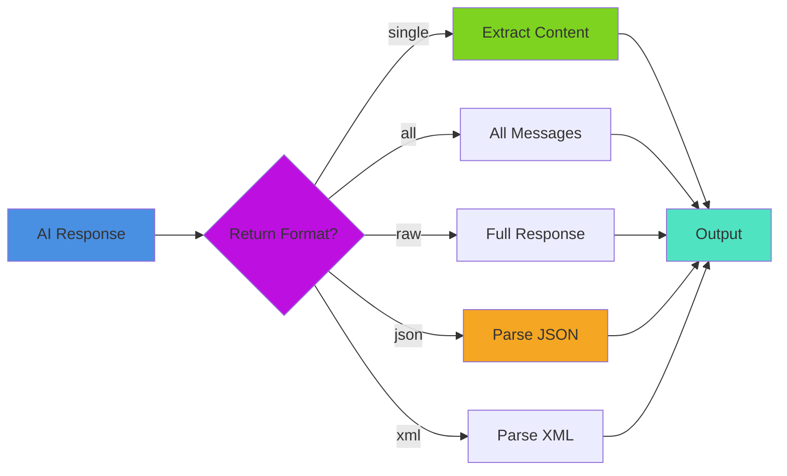
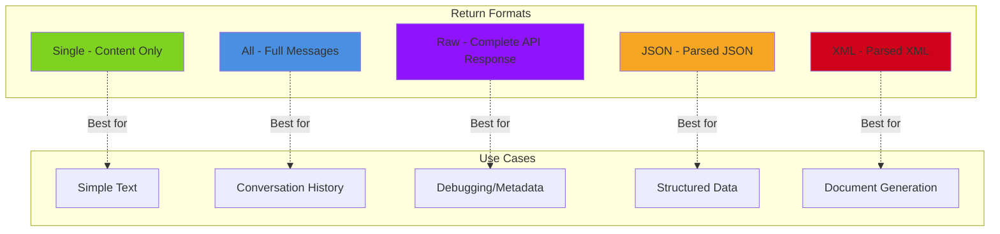
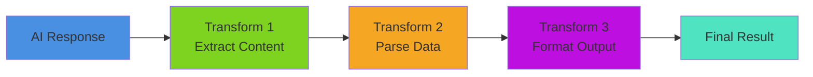
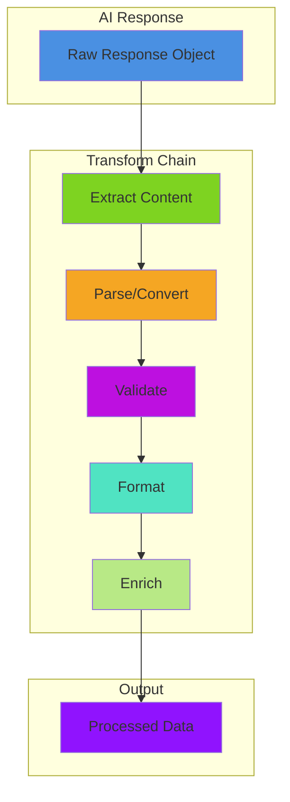

# 🔄 Transformers & Return Formats

Transform and process data between pipeline steps. Learn about built-in transformers (return formats) and custom data transformations.

## 📖 Table of Contents

- [Built-In Transformers: Return Formats](#-built-in-transformers-return-formats)
  - [Transformation Pipeline](#-transformation-pipeline)
  - [Available Return Formats](#-available-return-formats)
  - [Single Format](#single-format-default-for-functions)
  - [All Format](#all-format)
  - [Raw Format](#raw-format-default-for-pipelines)
  - [JSON Format](#json-format-new)
  - [XML Format](#xml-format-new)
  - [Using Return Formats in Pipelines](#using-return-formats-in-pipelines)
- [Core Built-In Transformers](#-core-built-in-transformers)
  - [CodeExtractorTransformer](#codeextractortransformer)
  - [JSONExtractorTransformer](#jsonextractortransformer)
  - [XMLExtractorTransformer](#xmlextractortransformer)
  - [TextCleanerTransformer](#textcleanertransformer)
  - [AiTransformRunnable](#aitransformrunnable)
- [Custom Transformers](#-custom-transformers)
  - [Custom Transform Flow](#-custom-transform-flow)
  - [Inline Transform](#inline-transform)
  - [Using aiTransform()](#using-aitransform)
- [Advanced Patterns](#advanced-patterns)
  - [Chaining Transforms](#-chaining-transforms)
  - [Combining Return Formats with Custom Transforms](#combining-return-formats-with-custom-transforms)
  - [Transform Library](#transform-library)
- [Best Practices](#best-practices)
- [Building Your Own Transformers](#-building-your-own-transformers)

## 🎯 Built-In Transformers: Return Formats

The most common "transformers" in bx-ai are **return formats** - built-in ways to automatically transform AI responses.

### 🏗️ Transformation Pipeline



### 📊 Available Return Formats

All AI functions accept a `returnFormat` option that controls response transformation:



| Format | Description | Returns | Use Case |
|--------|-------------|---------|----------|
| `single` | Extract content only | String | Simple text responses |
| `all` | Full messages array | Array | Conversation history |
| `raw` | Complete API response | Struct | Debugging, metadata |
| `json` | Parse JSON response | Any | Structured data |
| `xml` | Parse XML response | XML Object | XML documents |

### Single Format (Default for Functions)

Returns just the content string - the most common use case:

```java
// These are equivalent
result = aiChat( "What is BoxLang?" )
result = aiChat( "What is BoxLang?", {}, { returnFormat: "single" } )

println( result )  // "BoxLang is a modern dynamic JVM language..."
```

**Perfect for:**
- Simple questions
- Text generation
- When you only need the answer

### All Format

Returns complete messages array with roles and metadata:

```java
result = aiChat(
    "What is BoxLang?",
    {},
    { returnFormat: "all" }
)

println( result )
// [
//     {
//         role: "user",
//         content: "What is BoxLang?"
//     },
//     {
//         role: "assistant",
//         content: "BoxLang is a modern dynamic JVM language...",
//         model: "gpt-4",
//         finishReason: "stop"
//     }
// ]
```

**Perfect for:**
- Conversation history
- Multi-turn chats
- Analyzing conversation flow

### Raw Format (Default for Pipelines)

Returns the complete API response with all metadata:

```java
result = aiChat(
    "What is BoxLang?",
    {},
    { returnFormat: "raw" }
)

println( result )
// {
//     id: "chatcmpl-123",
//     object: "chat.completion",
//     created: 1677652288,
//     model: "gpt-4",
//     choices: [
//         {
//             index: 0,
//             message: {
//                 role: "assistant",
//                 content: "BoxLang is..."
//             },
//             finishReason: "stop"
//         }
//     ],
//     usage: {
//         promptTokens: 12,
//         completionTokens: 45,
//         totalTokens: 57
//     }
// }
```

**Perfect for:**
- Token usage tracking
- Debugging
- Custom response processing
- Accessing metadata

### JSON Format (NEW!)

Automatically parses JSON responses:

```java
// Ask for JSON response
result = aiChat(
    "Return a JSON object with name and age for a person",
    {},
    { returnFormat: "json" }
)

println( result )
// { name: "John", age: 30 }

// Access directly as struct
println( "Name: #result.name#" )
println( "Age: #result.age#" )
```

**Perfect for:**
- Structured data extraction
- API-like responses
- Data transformation
- Form generation

**Advanced JSON Usage:**

```java
// Complex JSON structure
prompt = "
    Return JSON with this structure:
    {
        'users': [
            { 'name': string, 'email': string, 'active': boolean }
        ],
        'total': number
    }
"

data = aiChat( prompt, {}, { returnFormat: "json" } )

println( "Total users: #data.total#" )
data.users.each( user => {
    println( "#user.name# - #user.email# (Active: #user.active#)" )
} )
```

### XML Format (NEW!)

Automatically parses XML responses:

```java
// Ask for XML response
result = aiChat(
    "Return an XML document with person information",
    {},
    { returnFormat: "xml" }
)

// Result is parsed XML object
println( result.xmlRoot.person.name.xmlText )
println( result.xmlRoot.person.age.xmlText )
```

**Perfect for:**
- XML document generation
- Legacy system integration
- RSS/ATOM feeds
- SOAP responses

**Advanced XML Usage:**

```java
// Complex XML
prompt = "
    Generate an XML RSS feed with 3 articles.
    Use proper RSS 2.0 format.
"

feed = aiChat( prompt, {}, { returnFormat: "xml" } )

// Access XML nodes
println( "Feed title: #feed.xmlRoot.channel.title.xmlText#" )

// Iterate through items
feed.xmlRoot.channel.xmlChildren
    .filter( node => node.xmlName == "item" )
    .each( item => {
        println( "- #item.title.xmlText#" )
        println( "  #item.description.xmlText#" )
    } )
```

### Using Return Formats in Pipelines

Pipelines use `raw` format by default, but you can set any format:

```java
// Set format on pipeline
pipeline = aiMessage()
    .user( "What is ${topic}?" )
    .toDefaultModel()
    .withOptions({ returnFormat: "single" })

result = pipeline.run({ topic: "BoxLang" })
// Returns just the content string
```

**Helper methods for common formats:**

```java
// .singleMessage() - shorthand for returnFormat: "single"
pipeline = aiMessage()
    .user( "Hello" )
    .toDefaultModel()
    .singleMessage()

// .allMessages() - shorthand for returnFormat: "all"
pipeline = aiMessage()
    .user( "Hello" )
    .toDefaultModel()
    .allMessages()

// .rawResponse() - shorthand for returnFormat: "raw" (default)
pipeline = aiMessage()
    .user( "Hello" )
    .toDefaultModel()
    .rawResponse()

// .asJson() - shorthand for returnFormat: "json" (NEW!)
pipeline = aiMessage()
    .user( "Return JSON: ${data}" )
    .toDefaultModel()
    .asJson()

// .asXml() - shorthand for returnFormat: "xml" (NEW!)
pipeline = aiMessage()
    .user( "Return XML: ${data}" )
    .toDefaultModel()
    .asXml()
```

### Comparing Formats

```java
message = "Explain BoxLang in one sentence"

// Single - just text
single = aiChat( message, {}, { returnFormat: "single" } )
println( single )
// "BoxLang is a modern dynamic language for the JVM"

// All - full messages
all = aiChat( message, {}, { returnFormat: "all" } )
println( all.last().content )
// "BoxLang is a modern dynamic language for the JVM"

// Raw - complete response
raw = aiChat( message, {}, { returnFormat: "raw" } )
println( raw.choices.first().message.content )
// "BoxLang is a modern dynamic language for the JVM"
println( "Used #raw.usage.totalTokens# tokens" )

// JSON - parsed structure
jsonMessage = "Return JSON: { 'name': 'BoxLang', 'type': 'JVM language' }"
json = aiChat( jsonMessage, {}, { returnFormat: "json" } )
println( json.name )  // Direct access!
// "BoxLang"

// XML - parsed document
xmlMessage = "Return XML: <language><name>BoxLang</name></language>"
xml = aiChat( xmlMessage, {}, { returnFormat: "xml" } )
println( xml.xmlRoot.language.name.xmlText )
// "BoxLang"
```

## 🧰 Core Built-In Transformers

BoxLang AI ships with several powerful built-in transformers ready to use in your pipelines:

### CodeExtractorTransformer

Extracts code blocks from AI responses, particularly useful when AI returns code embedded in markdown formatting.

**Features:**
- Extract code from markdown code blocks (` ```language ... ``` `)
- Filter by programming language (or extract all)
- Extract single or multiple code blocks
- Include metadata (language, line numbers, etc.)
- Strip comments and normalize formatting
- Strict mode for error handling

**Configuration Options:**

| Option | Type | Default | Description |
|--------|------|---------|-------------|
| `language` | string | `"all"` | Filter by language (`"all"`, `"python"`, `"java"`, etc.) |
| `multiple` | boolean | `false` | Extract all blocks (`true`) or first only (`false`) |
| `returnMetadata` | boolean | `false` | Return metadata with code or just code string |
| `stripComments` | boolean | `false` | Remove comments from extracted code |
| `trim` | boolean | `true` | Trim whitespace from code blocks |
| `stripMarkdown` | boolean | `true` | Look for markdown code blocks |
| `strictMode` | boolean | `false` | Throw error if no code found |
| `defaultLanguage` | string | `"text"` | Default language when not specified |

**Basic Usage:**

```javascript
import bxModules.bxai.models.transformers.CodeExtractorTransformer;

// Create extractor for Python code
extractor = new CodeExtractorTransformer({
    language: "python",
    stripComments: true
});

// AI response with embedded code
aiResponse = """
Here's the solution:

```python
# Calculate sum
def add_numbers(a, b):
    return a + b

result = add_numbers(5, 3)
print(result)
```

Hope this helps!
""";

// Extract just the Python code
code = extractor.transform( aiResponse );
// Returns: "def add_numbers(a, b):\n    return a + b\n\nresult = add_numbers(5, 3)\nprint(result)"
```

**Pipeline Integration:**

```javascript
// Use in an AI pipeline to extract code from responses
pipeline = aiMessage()
    .system( "You are a code generator" )
    .user( "Write a Python function to calculate fibonacci" )
    .toDefaultModel()
    .transform( r => r.content )
    .to( new CodeExtractorTransformer({ 
        language: "python",
        stripComments: false 
    }) );

pythonCode = pipeline.run();
// Returns clean Python code ready to execute
```

**Extract Multiple Blocks:**

```javascript
extractor = new CodeExtractorTransformer({
    language: "all",
    multiple: true,
    returnMetadata: true
});

multiCodeResponse = """
Python example:
```python
print("Hello")
```

JavaScript example:
```javascript
console.log("Hello");
```
""";

blocks = extractor.transform( multiCodeResponse );
// Returns: [
//   { language: "python", code: 'print("Hello")' },
//   { language: "javascript", code: 'console.log("Hello");' }
// ]
```

**Use Cases:**
- ✅ Extracting code from AI code generation responses
- ✅ Processing documentation with embedded examples
- ✅ Building code execution pipelines
- ✅ Cleaning AI-generated code for storage or display

---

### JSONExtractorTransformer

Extracts and validates JSON from AI responses, handling markdown formatting and mixed text content.

**Features:**
- Extract JSON from markdown code blocks
- Find JSON in mixed text (finds `{...}` or `[...]`)
- Parse and validate JSON structure
- Extract specific paths using dot notation
- Schema validation
- Strict mode for error handling

**Configuration Options:**

| Option | Type | Default | Description |
|--------|------|---------|-------------|
| `stripMarkdown` | boolean | `true` | Remove markdown code block formatting |
| `strictMode` | boolean | `false` | Throw error if JSON invalid or not found |
| `extractPath` | string | `""` | Dot notation path to extract (e.g., `"data.users"`) |
| `returnRaw` | boolean | `false` | Return raw JSON string instead of parsed |
| `validateSchema` | boolean | `false` | Validate against provided schema |
| `schema` | struct | `{}` | JSON schema for validation |

**Basic Usage:**

```javascript
import bxModules.bxai.models.transformers.JSONExtractorTransformer;

// Create extractor
extractor = new JSONExtractorTransformer({
    stripMarkdown: true
});

// AI response with JSON in markdown
aiResponse = """
Here's the data you requested:

```json
{
    "name": "John Doe",
    "age": 30,
    "email": "john@example.com"
}
```

Does this help?
""";

// Extract and parse JSON
data = extractor.transform( aiResponse );
// Returns: { name: "John Doe", age: 30, email: "john@example.com" }
```

**Pipeline Integration:**

```javascript
// Extract structured data from AI responses
pipeline = aiMessage()
    .system( "Return user data as JSON" )
    .user( "Get info for user ID ${userId}" )
    .toDefaultModel()
    .transform( r => r.content )
    .to( new JSONExtractorTransformer() );

userData = pipeline.run({ userId: 123 });
// Returns parsed struct, ready to use
```

**Path Extraction:**

```javascript
extractor = new JSONExtractorTransformer({
    extractPath: "data.users"
});

response = """
```json
{
    "status": "success",
    "data": {
        "users": [
            { "id": 1, "name": "Alice" },
            { "id": 2, "name": "Bob" }
        ]
    }
}
```
""";

users = extractor.transform( response );
// Returns: [ { id: 1, name: "Alice" }, { id: 2, name: "Bob" } ]
```

**Schema Validation:**

```javascript
extractor = new JSONExtractorTransformer({
    validateSchema: true,
    schema: {
        required: ["name", "email"],
        properties: {
            name: { type: "string" },
            email: { type: "string", pattern: "^[^@]+@[^@]+\.[^@]+$" },
            age: { type: "numeric" }
        }
    }
});

// Will throw error if JSON doesn't match schema (when strictMode: true)
```

**Use Cases:**
- ✅ Extracting structured data from AI responses
- ✅ Building form auto-population from AI
- ✅ API response parsing
- ✅ Configuration generation

---

### XMLExtractorTransformer

Extracts and validates XML from AI responses, with support for XPath queries and case-sensitive parsing.

**Features:**
- Extract XML from markdown code blocks
- Find XML in mixed text (looks for `<?xml` or root tags)
- Parse and validate XML structure
- XPath queries for specific elements
- Case-sensitive or case-insensitive parsing
- Strict mode for error handling

**Configuration Options:**

| Option | Type | Default | Description |
|--------|------|---------|-------------|
| `stripMarkdown` | boolean | `true` | Remove markdown code block formatting |
| `strictMode` | boolean | `false` | Throw error if XML invalid or not found |
| `xPath` | string | `""` | XPath query to extract specific elements |
| `returnRaw` | boolean | `false` | Return raw XML string instead of parsed |
| `caseSensitive` | boolean | `true` | Case-sensitive parsing |

**Basic Usage:**

```javascript
import bxModules.bxai.models.transformers.XMLExtractorTransformer;

// Create extractor
extractor = new XMLExtractorTransformer({
    stripMarkdown: true
});

// AI response with XML in markdown
aiResponse = """
Here's the config:

```xml
<?xml version="1.0"?>
<config>
    <database>
        <host>localhost</host>
        <port>5432</port>
    </database>
</config>
```
""";

// Extract and parse XML
config = extractor.transform( aiResponse );
// Returns parsed XML document object
```

**Pipeline Integration:**

```javascript
// Extract XML configuration from AI
pipeline = aiMessage()
    .system( "Generate XML config" )
    .user( "Create database config for ${environment}" )
    .toDefaultModel()
    .transform( r => r.content )
    .to( new XMLExtractorTransformer() );

xmlConfig = pipeline.run({ environment: "production" });
// Returns parsed XML, ready to process
```

**XPath Queries:**

```javascript
extractor = new XMLExtractorTransformer({
    xPath: "//database/host"
});

response = """
```xml
<config>
    <database>
        <host>localhost</host>
        <port>5432</port>
    </database>
</config>
```
""";

hosts = extractor.transform( response );
// Returns array of matching nodes: [<host>localhost</host>]
```

**Use Cases:**
- ✅ Extracting XML configs from AI responses
- ✅ Processing SOAP/XML API responses
- ✅ Configuration file generation
- ✅ RSS/Atom feed parsing

---

### TextCleanerTransformer

Cleans and normalizes text content by removing unwanted characters, HTML tags, and formatting.

**Features:**
- HTML tag stripping
- Extra whitespace normalization
- Line break handling
- Trimming and cleanup

**Usage:**

```javascript
import bxModules.bxai.models.transformers.TextCleanerTransformer;

// Create cleaner with options
cleaner = new TextCleanerTransformer({
    stripHTML: true,
    removeExtraSpaces: true,
    trim: true
});

// Clean text
cleanText = cleaner.transform( dirtyText );

// In a pipeline
pipeline = aiMessage()
    .user( "Process this: ${rawText}" )
    .toDefaultModel()
    .transform( r => r.content )
    .to( cleaner )
    .transform( cleaned => "Cleaned: #cleaned#" );

result = pipeline.run({ rawText: "<p>Hello   World!</p>" });
// "Cleaned: Hello World!"
```

**Configuration Options:**

```javascript
cleaner = new TextCleanerTransformer({
    trim: true,                  // Trim start/end whitespace
    removeExtraSpaces: true,     // Collapse multiple spaces
    stripHTML: true,             // Remove HTML tags
    normalizeLineBreaks: true,   // Standardize \n, \r\n, \r
    removeEmptyLines: false      // Keep or remove empty lines
});
```

### AiTransformRunnable

A wrapper class that converts any lambda function into a pipeline-compatible transformer. This is what `aiTransform()` BIF creates internally.

**Features:**
- Converts functions to IAiRunnable interface
- Fluent API support
- Pipeline integration
- Named transformers

**Usage:**

```javascript
import bxModules.bxai.models.transformers.AiTransformRunnable;

// Create transformer from function
transformer = new AiTransformRunnable(
    transformFn: ( data ) => data.ucase(),
    name: "uppercase-transformer"
);

// Use in pipeline
result = aiMessage()
    .user( "Say hello" )
    .toDefaultModel()
    .transform( r => r.content )
    .to( transformer )
    .run();

// Or use the aiTransform() BIF (recommended)
transformer = aiTransform( data => data.ucase() )
    .withName( "uppercase" );
```

**Chaining Multiple Transformers:**

```javascript
// Build transformer chain
extractContent = aiTransform( r => r.content );
cleanText = new TextCleanerTransformer({ stripHTML: true });
uppercase = aiTransform( s => s.ucase() );

pipeline = aiMessage()
    .user( "Generate text" )
    .toDefaultModel()
    .to( extractContent )
    .to( cleanText )
    .to( uppercase );

result = pipeline.run();
```

## 🔧 Custom Transformers

Transformers process data between pipeline steps. They implement the `IAiRunnable` interface but ignore the `options` parameter since they don't interact with AI providers.

### 🔄 Custom Transform Flow



### Inline Transform

```java
pipeline = aiMessage()
    .user( "Say hello" )
    .toDefaultModel()
    .transform( response => response.content )
```

### Using `aiTransform()`

```java
transformer = aiTransform( response => response.content.ucase() )

pipeline = aiMessage()
    .user( "Hello" )
    .toDefaultModel()
    .to( transformer )
```

### Named Transformer

```java
transformer = aiTransform( r => r.content )
    .withName( "content-extractor" )
```

## Return Format Examples in Pipelines

### Simple Text Extraction with .singleMessage()

```java
// Extract just the text content
pipeline = aiMessage()
    .user( "Explain ${topic}" )
    .toDefaultModel()
    .singleMessage()  // Returns: "Explanation text..."

result = pipeline.run({ topic: "AI" })
println( result )  // Just a string
```

### JSON Data Extraction with .asJson()

```java
// Get structured JSON data
pipeline = aiMessage()
    .system( "Return only valid JSON" )
    .user( "Create a person object with name: ${name}, age: ${age}" )
    .toDefaultModel()
    .asJson()  // Automatically parses JSON

person = pipeline.run({ name: "Alice", age: 30 })
println( "Name: #person.name#" )
println( "Age: #person.age#" )

// Complex JSON extraction
dataPipeline = aiMessage()
    .system( "Return valid JSON array" )
    .user( "List 3 colors as JSON array" )
    .toDefaultModel()
    .asJson()

colors = dataPipeline.run()  // ["red", "green", "blue"]
colors.each( color => println( color ) )
```

### XML Document Generation with .asXml()

```java
// Generate and parse XML
pipeline = aiMessage()
    .system( "Return valid XML" )
    .user( "Create XML for a book: ${title} by ${author}" )
    .toDefaultModel()
    .asXml()  // Automatically parses XML

book = pipeline.run({
    title: "Learning BoxLang",
    author: "John Doe"
})

// Access XML nodes
println( "Title: #book.xmlRoot.book.title.xmlText#" )
println( "Author: #book.xmlRoot.book.author.xmlText#" )
```

### Full Response with .rawResponse()

```java
// Get complete API response for token tracking
pipeline = aiMessage()
    .user( "Hello ${name}" )
    .toDefaultModel()
    .rawResponse()  // Full API response

response = pipeline.run({ name: "World" })
println( "Content: #response.choices.first().message.content#" )
println( "Tokens used: #response.usage.totalTokens#" )
println( "Model: #response.model#" )
```

### Conversation History with .allMessages()

```java
// Build conversation flow
pipeline = aiMessage()
    .system( "You are a helpful assistant" )
    .user( "Hello" )
    .toDefaultModel()
    .allMessages()  // Returns full message array

messages = pipeline.run()
messages.each( msg => {
    println( "#msg.role#: #msg.content#" )
} )
```

## Combining Return Formats with Custom Transforms

### JSON Then Transform

```java
// Parse JSON, then transform it
pipeline = aiMessage()
    .user( "Return JSON with user data" )
    .toDefaultModel()
    .asJson()  // Parse JSON first
    .transform( data => {
        // Now transform the parsed data
        return {
            fullName: "#data.firstName# #data.lastName#",
            email: data.email.lcase(),
            displayAge: "#data.age# years old"
        }
    } )

result = pipeline.run()
println( result.fullName )
```

### XML Then Extract Data

```java
// Parse XML, then extract specific data
pipeline = aiMessage()
    .user( "Generate RSS feed with 3 articles" )
    .toDefaultModel()
    .asXml()  // Parse XML first
    .transform( feed => {
        // Extract just article titles
        return feed.xmlRoot.channel.xmlChildren
            .filter( node => node.xmlName == "item" )
            .map( item => item.title.xmlText )
    } )

titles = pipeline.run()  // ["Title 1", "Title 2", "Title 3"]
```

### Raw Response for Debugging

```java
// Use raw format to debug, then extract
debugPipeline = aiMessage()
    .user( "Test message" )
    .toDefaultModel()
    .rawResponse()  // Get full response
    .transform( response => {
        // Log everything for debugging
        writeLog( "Model: #response.model#" )
        writeLog( "Tokens: #response.usage.totalTokens#" )
        writeLog( "Finish reason: #response.choices.first().finishReason#" )

        // Return just content
        return response.choices.first().message.content
    } )
```

## Common Transformations

### Extract Content from Raw Response

```java
pipeline = aiMessage()
    .user( "Explain AI" )
    .toDefaultModel()
    .transform( r => r.choices.first().message.content )
// Input: { choices: [...], ... }
// Output: "AI is..."
```

### String Manipulation

```java
pipeline = aiMessage()
    .user( "List colors" )
    .toDefaultModel()
    .transform( r => r.content )
    .transform( s => s.ucase() )
    .transform( s => s.trim() )
```

### Parse JSON

```java
pipeline = aiMessage()
    .system( "Return only valid JSON" )
    .user( "Create person: name=${name}, age=${age}" )
    .toDefaultModel()
    .transform( r => r.content )
    .transform( s => deserializeJSON( s ) )

person = pipeline.run( { name: "Alice", age: 30 } )
// { name: "Alice", age: 30 }
```

### Extract Code

```java
codeExtractor = aiTransform( response => {
    content = response.content ?: ""
    // Extract from markdown code blocks
    code = content.reReplace( "(?s).*```[a-z]*\n(.*?)```.*", "\1", "one" )
    return code.trim()
} )

pipeline = aiMessage()
    .user( "Write a BoxLang function to ${task}" )
    .toDefaultModel()
    .to( codeExtractor )
```

## ⛓️ Chaining Transforms

### 🔗 Transform Chain Architecture



### Sequential Processing

```java
pipeline = aiMessage()
    .user( "List 3 colors" )
    .toDefaultModel()
    .transform( r => r.content )          // Extract content
    .transform( s => s.listToArray() )    // Convert to array
    .transform( arr => arr.map( c => c.ucase() ) )  // Uppercase each

result = pipeline.run()
// ["RED", "BLUE", "GREEN"]
```

### Data Enrichment

```java
pipeline = aiMessage()
    .user( "Explain ${topic}" )
    .toDefaultModel()
    .transform( r => {
        return {
            content: r.content,
            topic: variables.topic,
            timestamp: now(),
            length: len( r.content )
        }
    } )

result = pipeline.run( { topic: "AI" } )
// { content: "...", topic: "AI", timestamp: {ts}, length: 150 }
```

## Options in Transformers

Transformers accept the `options` parameter for interface consistency but **ignore it** since they don't make AI requests:

```java
transformer = aiTransform( r => r.content.ucase() )

// Options parameter exists but has no effect on transformer behavior
result = transformer.run(
    { content: "hello" },     // input
    {},                       // params (ignored)
    { timeout: 60 }          // options (ignored by transformer)
)
// "HELLO"
```

**Why options exist:** Transformers implement `IAiRunnable` interface which requires the `options` parameter. This maintains a consistent API across all pipeline components, even though transformers don't use options.

**Options propagation:** When transformers are part of a pipeline sequence, options flow through to AI components:

```java
pipeline = aiMessage()
    .user( "Hello" )
    .toDefaultModel()
    .transform( r => r.content )  // Ignores options
    .withOptions( { returnFormat: "single" } )  // Applies to model, not transform

result = pipeline.run()  // Options affect the model step
```

## Advanced Transforms

### Conditional Logic

```java
ratingTransform = aiTransform( response => {
    content = response.content ?: "0"
    rating = val( content.reReplace( "[^0-9]", "", "all" ) )

    return {
        raw: content,
        rating: rating,
        quality: rating >= 7 ? "good" : "needs improvement",
        passed: rating >= 5
    }
} )

pipeline = aiMessage()
    .user( "Rate this from 1-10: ${item}" )
    .toDefaultModel()
    .to( ratingTransform )
```

### Error Handling

```java
safeTransform = aiTransform( response => {
    try {
        if( !structKeyExists( response, "content" ) ) {
            return "Error: No content returned"
        }

        data = deserializeJSON( response.content )
        return data
    } catch( any e ) {
        return {
            error: true,
            message: e.message,
            raw: response.content ?: ""
        }
    }
} )
```

### Data Validation

```java
validator = aiTransform( data => {
    errors = []

    if( !structKeyExists( data, "name" ) || len( data.name ) < 2 ) {
        errors.append( "Invalid name" )
    }

    if( !structKeyExists( data, "age" ) || data.age < 0 ) {
        errors.append( "Invalid age" )
    }

    return {
        valid: errors.len() == 0,
        errors: errors,
        data: data
    }
} )
```

## Practical Examples

### Markdown to HTML

```java
markdownTransform = aiTransform( response => {
    markdown = response.content ?: ""

    // Simple markdown parsing
    html = markdown
        .reReplace( "#{3} (.*)", "<h3>\1</h3>", "all" )
        .reReplace( "#{2} (.*)", "<h2>\1</h2>", "all" )
        .reReplace( "#{1} (.*)", "<h1>\1</h1>", "all" )
        .reReplace( "\*\*(.*?)\*\*", "<strong>\1</strong>", "all" )
        .reReplace( "\*(.*?)\*", "<em>\1</em>", "all" )

    return html
} )

pipeline = aiMessage()
    .user( "Write markdown about ${topic}" )
    .toDefaultModel()
    .to( markdownTransform )
```

### SQL Generator

```java
sqlTransform = aiTransform( response => {
    sql = response.content
        .reReplace( "(?s).*```sql\n(.*?)```.*", "\1", "one" )
        .trim()

    return {
        sql: sql,
        safe: !sql.reFindNoCase( "drop|delete|truncate" ),
        parameterized: sql.contains( "?" ) || sql.contains( ":" )
    }
} )

pipeline = aiMessage()
    .user( "Write SQL to ${task}" )
    .toDefaultModel()
    .to( sqlTransform )
```

### Response Cache

```java
component {
    property name="cache" type="struct";

    function init() {
        variables.cache = {}
        return this
    }

    function getCachedTransform() {
        return aiTransform( response => {
            key = hash( response.content )

            if( structKeyExists( variables.cache, key ) ) {
                return variables.cache[ key ]
            }

            processed = processResponse( response )
            variables.cache[ key ] = processed

            return processed
        } )
    }

    function processResponse( response ) {
        // Your processing logic
        return response.content.trim()
    }
}
```

### Multi-Format Output

```java
formatter = aiTransform( response => {
    content = response.content ?: ""

    return {
        text: content,
        html: "<p>" & content.replace( "\n", "</p><p>" ) & "</p>",
        markdown: content,
        json: serializeJSON( { content: content } ),
        length: len( content ),
        words: content.listLen( " " )
    }
} )
```

## Transform Patterns

### Filter Pattern

```java
filterTransform = aiTransform( items => {
    return items.filter( item => item.score > 5 )
} )
```

### Map Pattern

```java
mapTransform = aiTransform( items => {
    return items.map( item => {
        return {
            id: item.id,
            display: item.name.ucase()
        }
    } )
} )
```

### Reduce Pattern

```java
sumTransform = aiTransform( items => {
    return items.reduce( ( sum, item ) => sum + item.value, 0 )
} )
```

### Aggregate Pattern

```java
aggregator = aiTransform( data => {
    return {
        total: data.len(),
        average: data.sum() / data.len(),
        min: data.min(),
        max: data.max()
    }
} )
```

## Transform Library

```java
component {
    function extractContent() {
        return aiTransform( r => r.content )
    }

    function toUpperCase() {
        return aiTransform( s => s.ucase() )
    }

    function toLowerCase() {
        return aiTransform( s => s.lcase() )
    }

    function trim() {
        return aiTransform( s => s.trim() )
    }

    function parseJSON() {
        return aiTransform( s => deserializeJSON( s ) )
    }

    function extractCode( language = "" ) {
        return aiTransform( r => {
            pattern = "(?s).*```#language#\n(.*?)```.*"
            return r.content.reReplace( pattern, "\1", "one" ).trim()
        } )
    }

    function wordCount() {
        return aiTransform( s => s.listLen( " " ) )
    }

    function summarize( maxWords = 50 ) {
        return aiTransform( s => {
            words = s.listToArray( " " )
            if( words.len() <= maxWords ) return s
            return words.slice( 1, maxWords ).toList( " " ) & "..."
        } )
    }
}

// Usage
lib = new TransformLibrary()

pipeline = aiMessage()
    .user( "Explain AI" )
    .toDefaultModel()
    .to( lib.extractContent() )
    .to( lib.trim() )
    .to( lib.wordCount() )
```

## TransformAndRun Shortcut

Combine transform and run in one step:

```java
result = aiMessage()
    .user( "Say hello" )
    .toDefaultModel()
    .transformAndRun( r => r.content.ucase() )
// "HELLO!"
```

## Best Practices

1. **Keep Transforms Simple**: One responsibility per transform
2. **Handle Errors**: Use try/catch in transforms
3. **Document Logic**: Comment complex transformations
4. **Test Transforms**: Unit test transformation functions
5. **Chain Appropriately**: Logical sequence of operations
6. **Return Consistent Types**: Predictable output format
7. **Use Named Transforms**: For reusability

## Testing Transforms

```java
// Test transform independently
transformer = aiTransform( r => r.content.ucase() )

testInput = { content: "hello" }
result = transformer.run( testInput )

assert( result == "HELLO" )
```

## 🏗️ Building Your Own Transformers

Want to create custom transformers for your specific needs? BoxLang AI provides a complete framework for building reusable, pipeline-compatible transformers.

**Learn More:**
- **[Building Custom Transformers](../advanced/custom-transformer.md)** - Complete guide with examples:
  - Implementing the ITransformer interface
  - Extending BaseTransformer
  - Real-world examples (JSONSchemaTransformer, code extractor, sentiment analyzer)
  - Pipeline integration patterns
  - Testing and best practices

**Common Custom Transformer Use Cases:**
- 🔍 **Data Validation** - Validate and sanitize AI responses
- 🔄 **Format Conversion** - Convert between JSON, XML, and custom formats
- 📊 **Content Extraction** - Parse specific data from responses (code, prices, entities)
- 🧮 **Business Logic** - Apply domain-specific rules and calculations
- 📝 **Logging & Monitoring** - Track and audit data flow through pipelines

## Next Steps

- **[Building Custom Transformers](../advanced/custom-transformer.md)** - Create your own transformers
- **[Pipeline Streaming](streaming.md)** - Stream through transforms
- **[Working with Models](models.md)** - Model output transforms
- **[Pipeline Overview](overview.md)** - Complete pipeline guide
