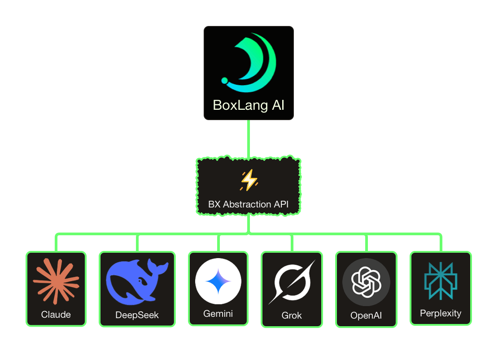

# ⚡︎ BoxLang AI Module

```
|:------------------------------------------------------:|
| ⚡︎ B o x L a n g ⚡︎
| Dynamic : Modular : Productive
|:------------------------------------------------------:|
```

<blockquote>
	Copyright Since 2023 by Ortus Solutions, Corp
	<br>
	<a href="https://www.boxlang.io">www.boxlang.io</a> |
	<a href="https://www.ortussolutions.com">www.ortussolutions.com</a>
</blockquote>

<p>&nbsp;</p>

## 👋 Welcome



Welcome to the **BoxLang AI Module** 🚀 This module provides AI generation capabilities to your [BoxLang](www.boxlang.io) applications in an easy to use and abstracted API, so you can interact with ANY AI provider in a consistent manner. Our core focus is productivity, fluency and ease of use. ✨

BoxLang AI eliminates the complexity of working with multiple AI providers by offering a unified interface. Whether you're using OpenAI, Claude, Gemini, Grok, DeepSeek, or Perplexity, your code remains the same—just change a configuration setting to switch providers. 🔄

### ✨ Key Features

- 🔌 **Multi-Provider Support** - Seamlessly integrate with leading AI providers through a single API
- 💬 **Fluent Interface** - Chainable, expressive syntax that makes AI integration intuitive
- 📝 **Flexible Messaging** - Send simple strings, structured messages, or complex conversation arrays
- ⚡ **Async Support** - Built-in asynchronous capabilities with futures for non-blocking operations
- 🔒 **Multi-Tenant Memory** - Enterprise-grade user and conversation isolation across all memory types
- ⚙️ **Configurable** - Global defaults, per-request overrides, and comprehensive logging options
- 🎯 **Event-Driven** - Intercept and extend AI processing with lifecycle events
- 🏭 **Production-Ready** - Timeout controls, error handling, and debugging tools

## 📄 License

BoxLang is open source and licensed under the [Apache 2](https://www.apache.org/licenses/LICENSE-2.0.html) license. 🎉 You can also get a professionally supported version with enterprise features and support via our BoxLang +/++ Plans (www.boxlang.io/plans). 💼

## 🚀 Getting Started

You can easily get started with BoxLang AI by using the module installer:

```bash
install-bx-module bx-ai
```

> If you would like to leverage it in your CommandBox Based Web applications, make sure you add it to your `server.json` or use `box install bx-ai`.

Once installed, make sure you setup any of the supported AI providers and their API keys in your `boxlang.json` configuration file.  After that
you can leverage the global functions (BIFs) in your BoxLang code.  Here is a simple example:

```java
// chat.bxs
answer = aiChat( "How amazing is BoxLang?" )
println( answer )
```

## 🤖 Providers

The following are the AI providers supported by this module. **Please note that in order to interact with these providers you will need to have an account with them and an API key.** 🔑

- 🧠 [Claude Anthropic](https://www.anthropic.com/claude)
- 🧬 [Cohere](https://cohere.com/) - High-quality embeddings and chat
- 🔍 [DeepSeek](https://www.deepseek.com/)
- 💎 [Gemini](https://gemini.google.com/)
- ⚡ [Grok](https://grok.com/)
- 🚀 [Groq](https://groq.com/)
- 🤗 [HuggingFace](https://huggingface.co/)
- 🌀 [Mistral](https://mistral.ai/)
- 🦙 [Ollama](https://ollama.ai/)
- 🟢 [OpenAI](https://www.openai.com/)
- 🔀 [OpenRouter](https://openrouter.ai/)
- 🔮 [Perplexity](https://docs.perplexity.ai/)
- 🚢 [Voyage AI](https://www.voyageai.com/) - Specialized embeddings provider

## 🎯 Features

Here are some of the features of this module:

- 🔌 Integration with multiple AI providers
- 📦 **Structured Output** - Type-safe AI responses using BoxLang classes, structs, or JSON schemas
- 🤖 **AI Agents** - Autonomous agents with memory, tools, and sub-agent orchestration
- 🔒 **Multi-Tenant Memory** - Built-in user and conversation isolation for enterprise applications
- 📝 Compose raw chat requests
- 💬 Build message objects
- 🛠️ Create AI service objects
- 🔧 Create AI tool objects
- 🔍 Generate embeddings for semantic search
- ⛓️ Fluent API
- ⚡ Asynchronous chat requests
- 🌐 Global defaults
- ✨ And much more

## 📊 Provider Support Matrix

Here is a matrix of the providers and their feature support. Please keep checking as we will be adding more providers and features to this module. 🔄

| Provider   | Real-time Tools | Embeddings | Structured Output |
|------------|-----------------|------------|-------------------|
| Claude    	| ✅ | ❌ | ✅ |
| Cohere       | ✅ | ✅ | ✅ |
| DeepSeek  | ✅ | ✅ | ✅ |
| Gemini    	| [Coming Soon]   | ✅ | ✅ |
| Grok      	 | ✅ | ✅ | ✅ |
| Groq         | ✅ | ✅ | ✅ |
| HuggingFace | ✅ | ✅ | ✅ |
| Mistral      | ✅ | ✅ | ✅ |
| Ollama       | ✅ | ✅ | ✅ |
| OpenAI       | ✅ | ✅ | ✅ (Native) |
| OpenRouter   | ✅ | ✅ | ✅ |
| Perplexity   | ✅ | ❌ | ✅ |
| Voyage       | ❌ | ✅ (Specialized) | ❌ |

**Note:**

- OpenAI provides native structured output support with strict schema validation. Other providers use JSON mode with schema constraints, which provides excellent results but may occasionally require prompt refinement.
- Voyage AI is a specialized embeddings-only provider with state-of-the-art models optimized for semantic search, RAG applications, and clustering. It does not support chat completions or structured output.
- Cohere provides high-quality embeddings with excellent multilingual support (100+ languages), chat capabilities, real-time tool calling, and structured output via JSON schema validation.

## 📦 Structured Output

Get **type-safe, validated responses** ✅ from AI providers by defining expected output schemas using BoxLang classes, structs, or JSON schemas. The module automatically converts AI responses into properly typed objects, eliminating manual parsing and validation. 🎯

### 🤔 Why Use Structured Output?

- ✅ **Type Safety** - Get validated objects instead of parsing JSON strings
- 🔒 **Automatic Validation** - Schema constraints ensure correct data types and required fields
- 🎯 **Better Reliability** - Reduces hallucinations by constraining response format
- 💻 **Developer Experience** - Work with native BoxLang objects immediately
- 🧪 **Testing & Caching** - Use `aiPopulate()` to create objects from JSON for tests or cached responses

### 💡 Quick Examples

**Using a Class:**

```java
class Person {
    property name="name" type="string";
    property name="age" type="numeric";
    property name="email" type="string";
}

result = aiChat( "Extract person info: John Doe, 30, john@example.com" )
    .structuredOutput( new Person() );

writeOutput( "Name: #result.getName()#, Age: #result.getAge()#" );
```

**Using a Struct Template:**

```java
template = {
    "title": "",
    "summary": "",
    "tags": [],
    "sentiment": ""
};

result = aiChat( "Analyze this article: [long text]" )
    .structuredOutput( template );

writeOutput( "Tags: #result.tags.toList()#" );
```

**Extracting Arrays:**

```java
class Task {
    property name="title" type="string";
    property name="priority" type="string";
    property name="dueDate" type="string";
}

tasks = aiChat( "Extract tasks from: Finish report by Friday (high priority), Review code tomorrow" )
    .structuredOutput( [ new Task() ] );

for( task in tasks ) {
    writeOutput( "#task.getTitle()# - Priority: #task.getPriority()#<br>" );
}
```

**Multiple Schemas (Extract Different Types Simultaneously):**

```java
result = aiChat( "Extract person and company: John Doe, 30 works at Acme Corp, founded 2020" )
    .structuredOutputs( {
        "person": new Person(),
        "company": new Company()
    } );

writeOutput( "Person: #result.person.getName()#<br>" );
writeOutput( "Company: #result.company.getName()#<br>" );
```

### 🔧 Manual Population with aiPopulate()

Convert JSON responses or cached data into typed objects without making AI calls:

```java
// From JSON string
jsonData = '{"name":"John Doe","age":30,"email":"john@example.com"}';
person = aiPopulate( new Person(), jsonData );

// From struct
data = { name: "Jane", age: 25, email: "jane@example.com" };
person = aiPopulate( new Person(), data );

// Populate array
tasksJson = '[{"title":"Task 1","priority":"high"},{"title":"Task 2","priority":"low"}]';
tasks = aiPopulate( [ new Task() ], tasksJson );
```

**Perfect for:** ⭐

- 🧪 Testing with mock data
- 💾 Using cached AI responses
- 🔄 Converting existing JSON data to typed objects
- ✅ Validating data structures

### ✅ Provider Support

All providers support structured output! 🎉 OpenAI offers native structured output with strict validation, while others use JSON mode with schema guidance (which works excellently in practice). 💪

### 📚 Learn More

- 🚀 **Quick Start**: [Simple Interactions Guide](docs/chatting/structured-output.md)
- 🔧 **Advanced Pipelines**: [Pipeline Integration Guide](docs/main-components/structured-output.md)
- 🎓 **Interactive Course**: [Lesson 12 - Structured Output](course/lesson-12-structured-output/)
- 💻 **Examples**: Check `examples/structured/` for complete working examples

## 🧠 Memory Systems

Build **stateful, context-aware AI applications** 🎯 with flexible memory systems that maintain conversation history, enable semantic search, and preserve context across interactions. BoxLang AI provides both traditional conversation memory and advanced vector-based memory for semantic understanding. 💡

### 🤔 Why Use Memory?

- 💭 **Context Retention** - AI remembers previous messages and maintains coherent conversations
- 💬 **Stateful Applications** - Build chat interfaces that remember user preferences and conversation history
- 🔍 **Semantic Search** - Find relevant past conversations using vector embeddings
- 💾 **Flexible Storage** - Choose from in-memory, file-based, database, session, or vector storage
- ⚙️ **Automatic Management** - Memory handles message limits, summarization, and context windows

### 📋 Memory Types

**Standard Memory** 💬 (Conversation History):

| Type | Description | Best For |
|------|-------------|----------|
| **Windowed** | Keeps last N messages | Quick chats, cost-conscious apps |
| **Summary** | Auto-summarizes old messages | Long conversations, context preservation |
| **Session** | Web session persistence | Multi-page web applications |
| **File** | File-based storage | Audit trails, long-term storage |
| **Cache** | CacheBox-backed | Distributed applications |
| **JDBC** | Database storage | Enterprise apps, multi-user systems |

**Vector Memory** 🔍 (Semantic Search):

| Type | Description | Best For |
|------|-------------|----------|
| **BoxVector** | In-memory vectors | Development, testing, small datasets |
| **Hybrid** | Recent + semantic | Best of both worlds approach |
| **Chroma** | ChromaDB integration | Python-based infrastructure |
| **Postgres** | PostgreSQL pgvector | Existing PostgreSQL deployments |
| **MySQL** | MySQL 9 native vectors | Existing MySQL infrastructure |
| **TypeSense** | Fast typo-tolerant search | Low-latency search, autocomplete |
| **Pinecone** | Cloud vector database | Production, scalable semantic search |
| **Qdrant** | High-performance vectors | Large-scale deployments |
| **Weaviate** | GraphQL vector database | Complex queries, knowledge graphs |
| **Milvus** | Enterprise vector DB | Massive datasets, high throughput |

### 💡 Quick Examples

**Windowed Memory (Multi-Tenant):**

```java
// Automatic per-user isolation
memory = aiMemory( "windowed",
    key: createUUID(),
    userId: "user123",
    config: { maxMessages: 10 }
)
agent = aiAgent( name: "Assistant", memory: memory )

agent.run( "My name is John" )
agent.run( "What's my name?" )  // "Your name is John"
```

**Summary Memory (Preserves Full Context):**

```java
memory = aiMemory( "summary", {
    maxMessages: 30,
    summaryThreshold: 15,
    summaryModel: "gpt-4o-mini"
} )
agent = aiAgent( name: "Support", memory: memory )
// Long conversation - older messages summarized automatically
```

**Vector Memory (Semantic Search + Multi-Tenant):**

```java
memory = aiMemory( "chroma",
    key: createUUID(),
    userId: "user123",
    conversationId: "support",
    config: {
        collection: "customer_support",
        embeddingProvider: "openai",
        embeddingModel: "text-embedding-3-small"
    }
)
// Retrieves semantically relevant past conversations
// Automatically filtered by userId/conversationId
```

**Hybrid Memory (Recent + Semantic):**

```java
memory = aiMemory( "hybrid", {
    recentLimit: 5,       // Keep last 5 messages
    semanticLimit: 5,     // Add 5 semantic matches
    vectorProvider: "chroma"
} )
// Combines recency with relevance
```

### 📚 Learn More

- 💬 **Standard Memory**: [Memory Systems Guide](docs/main-components/memory.md)
- 🔍 **Vector Memory**: [Vector Memory Guide](docs/main-components/vector-memory.md)
- 🔧 **Custom Memory**: [Building Custom Memory](docs/advanced/custom-memory.md)
- 🎓 **Interactive Course**: [Lesson 7 - Memory Systems](course/lesson-07-memory/)
- 💻 **Examples**: Check `examples/advanced/` and `examples/vector-memory/` for complete examples

## ⚙️ Settings

Here are the settings you can place in your `boxlang.json` file:

```json
{
	"modules" : {
		"bxai" : {
			"settings": {
				// The default provider to use: openai, claude, deepseek, gemini, grok, mistral, ollama, openrouter, perplexity
				"provider" : "openai",
				// The default API Key for the provider
				"apiKey" : "",
				// The default request params to use when calling a provider
				// Ex: { temperature: 0.5, max_tokens: 100, model: "gpt-3.5-turbo" }
				"defaultParams" : {
					// model: "gpt-3.5-turbo"
				},
				// The default timeout of the ai requests
				"timeout" : 30,
				// If true, log request to the ai.log
				"logRequest" : false,
				// If true, log request to the console
				"logRequestToConsole" : false,
				// If true, log the response to the ai.log
				"logResponse" : false,
				// If true, log the response to the console
				"logResponseToConsole" : false,
				// The default return format of the AI response: single, all, raw
				"returnFormat" : "single"
			}
		}
	}
}
```

### 🦙 Ollama Configuration

**Ollama** allows you to run AI models locally on your machine. It's perfect for privacy, offline use, and cost savings. 💰

#### 🔧 Setup Ollama

1. 📥 **Install**: Download from [https://ollama.ai](https://ollama.ai)
2. ⬇️ **Pull a model**: `ollama pull llama3.2` (or any supported model)
3. ▶️ **Start service**: Ollama runs on `http://localhost:11434` by default

#### 📝 Configuration

```json
{
	"modules": {
		"bxai": {
			"settings": {
				"provider": "ollama",
				"apiKey": "",  // Optional: for remote/secured Ollama instances
				"chatURL": "http://localhost:11434",  // Default local instance
				"defaultParams": {
					"model": "llama3.2"  // Any Ollama model you have pulled
				}
			}
		}
	}
}
```

#### 🌟 Popular Ollama Models

- 🦙 `llama3.2` - Latest Llama model (recommended)
- ⚡ `llama3.2:1b` - Smaller, faster model
- 💻 `codellama` - Code-focused model
- 🎯 `mistral` - High-quality general model
- 🔷 `phi3` - Microsoft's efficient model

## 📤 Return Formats

The AI module supports different return formats for the responses. You can specify the return format in the `options` struct when calling the `aiChat()` or `aiChatAsync()` functions, globally in the settings (as we saw above), or in the `ChatRequest` object. 🎯

| Format | Description |
|--------|-------------|
| `single` | Returns a single message as a string. This is the default format. |
| `all` | Returns an array of messages. Each message is a struct with `role` and `content` keys, or whatever the LLM returns |
| `raw` | Returns the raw response from the AI provider. This is useful for debugging or when you need the full response structure so you can mold it as you see fit |

## 🛠️ Global Functions (BIFs)

| Function | Purpose | Parameters | Return Type | Async Support |
|----------|---------|------------|-------------|---------------|
| `aiAgent()` | Create autonomous AI agent | `name`, `description`, `instructions`, `model`, `memory`, `tools`, `params`, `options` | AiAgent Object | ❌ |
| `aiChat()` | Chat with AI provider | `messages`, `params={}`, `options={}` | String/Array/Struct | ❌ |
| `aiChatAsync()` | Async chat with AI provider | `messages`, `params={}`, `options={}` | BoxLang Future | ✅ |
| `aiChatRequest()` | Compose raw chat request | `messages`, `params`, `options`, `headers` | AiRequestObject | N/A |
| `aiChatStream()` | Stream chat responses from AI provider | `messages`, `callback`, `params={}`, `options={}` | void | N/A |
| `aiChunk()` | Split text into chunks | `text`, `options={}` | Array of Strings | N/A |
| `aiEmbed()` | Generate embeddings | `input`, `params={}`, `options={}` | Array/Struct | N/A |
| `aiMemory()` | Create memory instance | `type`, `config={}` | IAiMemory Object | N/A |
| `aiMessage()` | Build message object | `message` | ChatMessage Object | N/A |
| `aiModel()` | Create AI model wrapper | `provider`, `apiKey` | AiModel Object | N/A |
| `aiPopulate()` | Populate class/struct from JSON | `target`, `data` | Populated Object | N/A |
| `aiService()` | Create AI service provider | `provider`, `apiKey` | IService Object | N/A |
| `aiTokens()` | Estimate token count | `text`, `options={}` | Numeric | N/A |
| `aiTool()` | Create tool for real-time processing | `name`, `description`, `callable` | Tool Object | N/A |
| `aiTransform()` | Create data transformer | `transformer` | Transformer function | N/A |
| `MCP()` | Create MCP client for Model Context Protocol servers | `baseURL` | MCPClient Object | N/A |
| `mcpServer()` | Get or create MCP server for exposing tools | `name="default"`, `description`, `version`, `cors` | MCPServer Object | N/A |

> **Note on Return Formats:** When using pipelines (runnable chains), the default return format is `raw` (full API response), giving you access to all metadata. Use `.singleMessage()`, `.allMessages()`, or `.withFormat()` to extract specific data. The `aiChat()` BIF defaults to `single` format (content string) for convenience. See the [Pipeline Return Formats](docs/main-components/overview.md#return-formats) documentation for details.

### 💡 Quick Usage Examples

```java
// Simple chat
result = aiChat( "Hello, world!" )

// Create an autonomous AI agent
agent = aiAgent(
    name: "MyAgent",
    description: "A helpful assistant",
    instructions: "Be concise and friendly"
)
response = agent.run( "What is BoxLang?" )

// Async chat with callback
future = aiChatAsync( "Hello!" ).then( r -> println(r) )

// Stream chat responses
aiChatStream( "Tell me a story", ( chunk ) => {
    print( chunk.choices?.first()?.delta?.content ?: "" )
} )

// Build complex request
request = aiChatRequest( messages, { model: "gpt-4" }, { provider: "openai" } )

// Fluent message building
msg = aiMessage().system( "Be helpful" ).user( "Hello" )

// AI Model wrapper
model = aiModel( "openai" ).bindTools( [tool1, tool2] )

// Service with custom settings
service = aiService( "openai", "my-key" ).defaults( { temperature: 0.7 } )

// Tool for function calling
tool = aiTool( "weather", "Get weather data", location => getWeather(location) )

// MCP client for Model Context Protocol servers
client = MCP( "http://localhost:3000" )
    .withTimeout( 5000 )
    .withBearerToken( "token" )
result = client.send( "searchDocs", { query: "syntax" } )

// MCP server for exposing tools to AI clients
mcpServer( "myApp" )
    .registerTool( aiTool( "search", "Search docs", ( query ) => searchDocs( query ) ) )
    .registerResource( uri: "docs://readme", name: "README", handler: () => fileRead( "/readme.md" ) )
```

This module exposes the following BoxLang global functions (BIFs) for you to interact with the AI providers:

### 💬 Chat Functions

- `aiChat( messages, struct params={}, struct options={} )` : This function will allow you to chat with the AI provider and get responses back.  This is the easiest way to interact with the AI providers.
- `aiChatAsync( messages, struct params={}, struct options={} )` : This function will allow you to chat with the AI provider and get a BoxLang future back so you can build fluent asynchronous code pipelines.
- `aiChatStream( messages, callback, struct params={}, struct options={} )` : This function will allow you to stream responses from the AI provider in real-time. A callback function is invoked for each chunk of data received.
- `aiChatRequest( messages, struct params, struct options, struct headers)` - This allows you to compose a raw chat request that you can then later send to an AI service.  The return is a `ChatRequest` object that you can then send to the AI service.

### 🔢 Embedding Functions

- `aiEmbed( input, struct params={}, struct options={} )` : Generate embeddings for text input. Input can be a single string or an array of strings. Returns numerical vectors that capture semantic meaning, useful for semantic search, clustering, and recommendations.

### ✂️ Text Processing Functions

- `aiChunk( text, struct options={} )` : Split text into chunks for processing within AI token limits. Supports multiple chunking strategies (recursive, characters, words, sentences, paragraphs) with configurable chunk size and overlap.
- `aiTokens( text, struct options={} )` : Estimate token count for text using character-based or word-based methods. Useful for planning API usage and managing token budgets.

### 🤖 Agent Functions

- `aiAgent( name, description, instructions, model, memory, tools, params, options )` - Creates an autonomous AI agent that can maintain conversation memory, use tools, and execute tasks. Agents simplify complex AI workflows by managing state and context automatically.
- `aiMemory( type, config )` - Creates a memory instance for agents and pipelines. Available types:
  - **`window`** - Windowed memory keeping last N messages (default, configurable via `maxMessages`)
  - **`summary`** - Intelligently compresses old messages while preserving context
  - **`session`** - Web session-persisted memory
  - **`file`** - File-based persistent storage
  - **`cache`** - CacheBox-backed storage
  - **`jdbc`** - Database-backed storage
  - **`chroma`** - Vector memory with semantic search (ChromaDB)
  - **`mysql`** - MySQL 9 native vector support
  - **`typesense`** - TypeSense fast typo-tolerant search
  - **`hybrid`** - Combines recent + semantic memory

### 🧰 Helper Functions

- `aiMessage( message )` - Allows you to build a message object that you can then use to send to the `aiChat()` or `aiAiRequest()` functions.  It allows you to fluently build up messages as well.
- `aiModel( provider, apiKey )` - Creates an AI model wrapper that can be configured with tools and used in agents or pipelines. Provides a fluent API for model configuration.
- `aiService( provider, apiKey )` - Creates a reference to an AI Service provider that you can then use to interact with the AI service.  This is useful if you want to create a service object and then use it multiple times.  You can pass in optional `provider` and `apiKey` to override the global settings.
- `aiTool( name, description, callable)` - Creates a tool object that you can use to add to a chat request for real-time system processing.  This is useful if you want to create a tool that can be used in multiple chat requests against localized resources.  You can then pass in the tool to the `aiChat()` or `aiAiRequest()` functions.
- `MCP( baseURL )` - Creates a fluent client for consuming Model Context Protocol (MCP) servers. MCP provides standardized access to external tools, resources, and prompts that AI models can use.
- `mcpServer( name, description, version, cors )` - Gets or creates an MCP server instance for registering tools, resources, and prompts that can be exposed to AI clients. Servers are singletons by name, stored globally for access across requests. The `description` and `version` parameters allow you to provide additional metadata for the server instance. The `cors` parameter sets the allowed CORS origin (empty string by default for secure-by-default behavior).

## 💬 aiChat()/aiChatAsync() - Chat with the AI

The `aiChat(), aiChatAsync()` functions are the easiest way to interact with the AI providers in a consistent and abstracted way. Here are the signatures of the function:

```js
aiChat( messages, struct params={}, struct options={} )
aiChatAsync( messages, struct params={}, struct options={} )
```

Here are the parameters:

- `messages` : This can be any of the following
  - A `string` : A message with a default `role` of `user` will be used
  - A `struct` : A struct with a `role` and `content` key message
  - An `array of structs` : An array of messages that must have a `role` and a `content` keys
  - A `ChatMessage` object
- `params` : This is a struct of request parameters that will be passed to the AI provider.  This can be anything the provider supports.  Usually this is the `model`, `temperature`, `max_tokens`, etc.
- `options` : This is a struct of options that can be used to control the behavior of the AI provider.  The available options are:
  - `provider:string` : The provider to use, if not passed it will use the global setting
  - `apiKey:string` : The API Key to use, if not passed it will use the global setting
  - `timeout:numeric` : The timeout in milliseconds for the request. Default is 30 seconds.
  - `logRequest:boolean` : Log the request to the `ai.log`. Default is `false`
  - `logRequestToConsole:boolean` : Log the request to the console for debugging. Default is `false`
  - `logResponse:boolean` : Log the response to the `ai.log`. Default is `false`
  - `logResponseToConsole:boolean` : Log the response to the console for debugging. Default is `false`
  - `returnFormat:string` : The format of the response.  The default is a `single` message.  The available formats are:
    - `single` : A single message
    - `all` : An array of messages
    - `raw` : The raw response from the AI provider

The `aiChat()` function will return a message according to the `options.returnFormat` type. If you use `aiChatAsync()` it will return a BoxLang future so you can build fluent asynchronous code pipelines.

> Don't worry that you must do a `role` and `content` in your messages if you use a struct or an array of structs.  The ai providers will understand the structure and process it accordingly.

### 🎯 System Messages

The `messages` argument as explained allows you to send 3 different types of messages. Another caveat is that there can only be one `system` message per request. ⚠️

### 💡 Examples

Here are some examples of chatting with the AI:

```js
// Simple chat
aiChat( "Write a haiku about recursion in programming." );

// Structural chat
aiChat( {
	"role": "user",
	"content": "Write a haiku about recursion in programming."
} );

// Using an array of messages
aiChat( [
	{
		"role": "system",
		"content": "You are a helpful assistant."
	},
	{
		"role": "user",
		"content": "Write a haiku about recursion in programming."
	}
] );

// Analyze an image
aiChat( {
	"role": "user",
	"content": [
		{
			"type": "text",
			"text": "What is in this image?"
		},
		{
			"type": "image_url",
			"image_url": {
				"url": "https://upload.wikimedia.org/wikipedia/commons/thumb/d/dd/Gfp-wisconsin-madison-the-nature-boardwalk.jpg/2560px-Gfp-wisconsin-madison-the-nature-boardwalk.jpg"
			}
		}
	]
} );
```

Now let's do some async chatting.  The benefit of async chatting is that you can build fluent asynchronous code pipelines and not block the main thread.  Once you are ready for retrieval of the results, then you can use the blocking `get()` method on the future.

```java
var future = aiChatAsync( "Write a haiku about recursion in programming." )
    .then( result -> {
        println( "AI Response: " + result );
        return result;
    } )
    .onError( error -> {
        writeLog( text: "AI Chat failed: " + error.getMessage(), type: "error" );
        return "An error occurred. Please try again.";
    } );

// Later in the code, you can retrieve the result
<h2>Chat Response</h2>
<p>#future.get()#</p>

// Transforming and formatting the response
var future = aiChatAsync( "Write a haiku about recursion in programming." )
    .then( result -> "### AI-Generated Haiku
	<br>
	#result.trim()#
	" )
    .onError( error -> {
        writeLog( text: "AI Chat failed: " + error.getMessage(), type: "error" );
        return "### AI Error
		<p>#error.getMessage()#</p>
		<p>An unexpected error occurred</p>
		<p>Please try again</p>
		";
    } );

// Print or return the formatted result
println( future.get() );
```

## 🌊 aiChatStream() - Stream Chat Responses

The `aiChatStream()` function allows you to receive AI responses in real-time as they are generated, rather than waiting for the complete response. This is ideal for building interactive chat interfaces or showing progressive output to users. ⚡

```js
aiChatStream( messages, callback, struct params={}, struct options={} )
```

Here are the parameters:

- `messages` : This can be any of the following
  - A `string` : A message with a default `role` of `user` will be used
  - A `struct` : A struct with a `role` and `content` key message
  - An `array of structs` : An array of messages that must have a `role` and a `content` keys
  - A `ChatMessage` object
- `callback` : A function that will be called for each chunk of data received from the stream. The function receives a single argument containing the chunk data (typically a struct with the streaming response format specific to the provider).
- `params` : This is a struct of request parameters that will be passed to the AI provider. This can be anything the provider supports. Usually this is the `model`, `temperature`, `max_tokens`, etc.
- `options` : This is a struct of options that can be used to control the behavior of the AI provider. The available options are:
  - `provider:string` : The provider to use, if not passed it will use the global setting
  - `apiKey:string` : The API Key to use, if not passed it will use the global setting
  - `timeout:numeric` : The timeout in seconds for the request. Default is 30 seconds.
  - `logRequest:boolean` : Log the request to the `ai.log`. Default is `false`
  - `logRequestToConsole:boolean` : Log the request to the console for debugging. Default is `false`
  - `logResponse:boolean` : Log the response to the `ai.log`. Default is `false`
  - `logResponseToConsole:boolean` : Log the response to the console for debugging. Default is `false`

### Examples

Here are some examples of streaming chat responses:

```js
// Simple streaming chat
aiChatStream(
    "Write a short story about a robot learning to paint",
    ( chunk ) => {
        // OpenAI streaming format
        print( chunk.choices?.first()?.delta?.content ?: "" )
    }
)

// Streaming with accumulated response
var fullResponse = ""
aiChatStream(
    "Explain quantum computing in simple terms",
    ( chunk ) => {
        var content = chunk.choices?.first()?.delta?.content ?: ""
        fullResponse &= content
        print( content )
    },
    { temperature: 0.7 },
    { provider: "openai" }
)
println( "\n\nFull Response: " & fullResponse )

// Streaming with custom provider
aiChatStream(
    [
        { role: "system", content: "You are a helpful coding assistant" },
        { role: "user", content: "Write a function to calculate fibonacci numbers" }
    ],
    ( chunk ) => {
        // Process each chunk as it arrives
        if( chunk.keyExists( "choices" ) && !chunk.choices.isEmpty() ) {
            var delta = chunk.choices.first().delta
            if( delta.keyExists( "content" ) ) {
                print( delta.content )
            }
        }
    },
    { model: "gpt-4" },
    { provider: "openai", timeout: 60 }
)

// Streaming with structured output handling
var codeBlocks = []
var currentBlock = ""
var inCodeBlock = false

aiChatStream(
    "Write a Java class for a basic calculator",
    ( chunk ) => {
        var content = chunk.choices?.first()?.delta?.content ?: ""
        print( content )

        // Detect code block boundaries
        if( content.contains( "```" ) ) {
            if( inCodeBlock ) {
                codeBlocks.append( currentBlock )
                currentBlock = ""
            }
            inCodeBlock = !inCodeBlock
        } else if( inCodeBlock ) {
            currentBlock &= content
        }
    }
)

println( "\n\nExtracted " & codeBlocks.len() & " code blocks" )
```

### 📡 Streaming Response Format

The chunk data passed to the callback function follows the Server-Sent Events (SSE) format used by most AI providers. For OpenAI-compatible providers, each chunk typically has this structure:

```js
{
    "id": "chatcmpl-...",
    "object": "chat.completion.chunk",
    "created": 1234567890,
    "model": "gpt-4",
    "choices": [
        {
            "index": 0,
            "delta": {
                "role": "assistant",  // Only in first chunk
                "content": "text"     // Progressive text content
            },
            "finish_reason": null  // or "stop", "length", etc. in final chunk
        }
    ]
}
```

Different providers may have slightly different formats, so consult your provider's documentation for exact details.

## 📝 aiAiRequest() - Compose a Chat Request

The `aiAiRequest()` function allows you to compose a raw chat request that you can then later send to an AI service. The return is a `ChatRequest` object that you can then send to the AI service. 🎯

```js
aiChatRequest( messages, struct params, struct options, struct headers )
```

Here are the parameters:

- `messages` : This can be any of the following
  - A `string` : A message with a default `role` of `user` will be used
  - A `struct` : A struct with a `role` and `content` key message
  - An `array of structs` : An array of messages that must have a `role` and a `content` keys
  - A `ChatMessage` object
- `params` : This is a struct of request parameters that will be passed to the AI provider.  This can be anything the provider supports.  Usually this is the `model`, `temperature`, `max_tokens`, etc.
- `options` : This is a struct of options that can be used to control the behavior of the AI provider.  The available options are:
  - `provider:string` : The provider to use, if not passed it will use the global setting
  - `apiKey:string` : The API Key to use, if not passed it will use the global setting
  - `timeout:numeric` : The timeout in milliseconds for the request. Default is 30 seconds.
  - `logRequest:boolean` : Log the request to the `ai.log`. Default is `false`
  - `logRequestToConsole:boolean` : Log the request to the console for debugging. Default is `false`
  - `logResponse:boolean` : Log the response to the `ai.log`. Default is `false`
  - `logResponseToConsole:boolean` : Log the response to the console for debugging. Default is `false`
  - `returnFormat:string` : The format of the response.  The default is a `single` message.  The available formats are:
    - `single` : A single message (content string only)
    - `all` : An array of messages
    - `raw` : The raw response from the AI provider
    - `json` : Automatically parse response as JSON (uses `jsonDeserialize()`)
    - `xml` : Automatically parse response as XML (uses `xmlParse()`)
- `headers` : This is a struct of headers that can be used to send to the AI provider.

### 🔧 AiRequestProperties

The `ChatRequest` object has several properties that you can use to interact with the request. All of them have a getter and a setter.

- `messages:array` : The messages to send to the AI provider
- `chatMessage:ChatMessage` : The original `ChatMessage` object that was used to create the request
- `params:struct` : The request parameters to send to the AI provider
- `provider:string` : The provider to use
- `apiKey:string` : The API Key to use
- `logRequest:boolean` : Log the request to the `ai.log`, default is `false`
- `logRequestToConsole:boolean` : Log the request to the console, default is `false`
- `logResponse:boolean` : Log the response to the `ai.log` default is `false`
- `logResponseToConsole:boolean` : Log the response to the console, default is `false`
- `returnFormat:string` : The format of the response
- `model:string` : The model to use for the request
- `timeout:numeric` : The timeout in milliseconds for the request. Default is 30 seconds.
- `sendAuthHeader:boolean` : Send the API Key as an Authorization header. Default is `true`
- `headers:struct` : The headers to send to the AI provider

### 🛠️ AiRequestMethods

The `ChatRequest` object has several methods that you can use to interact with the request apart from the aforementioned properties setters and getters.

- `addHeader( name, value ):ChatRequest` : Add a header to the request
- `getTool( name ):Attempt` : Get a tool from the defined params
- `hasMessages():boolean` : Check if the request has messages
- `hasModel():boolean` : Check if the request has a model
- `setModelIfEmpty( model ):ChatRequest` : Set the model if it is empty
- `hasApiKey():boolean` : Check if the request has an API Key
- `setApiKeyIfEmpty( apiKey ):ChatRequest` : Set the API Key if it is empty
- `mergeServiceParams( params ):ChatRequest` : Merge service default parameters into the request (only if not already set)
- `mergeServiceHeaders( headers ):ChatRequest` : Merge service default headers into the request (only if not already set)

### Examples

Here are some examples of composing a chat request:

```js
// Simple chat request
aiRequest = aiChatRequest( "Write a haiku about recursion in programming." )
response = aiService().invoke( aiRequest )

// Advanced request
aiRequest = aiChatRequest( "Write a haiku about recursion in programming.", {
		"model": "gpt-3.5-turbo",
		"temperature": 0.5,
		"max_tokens": 100
	},
	{
		"provider": "grok",
		"timeout": 10,
		"logRequest": true,
		"logResponse": true,
		"returnFormat": "raw"
	} );
response = aiService().invoke( aiRequest)
```

## 💬 aiMessage() - Build a Message Object

This function allows you to build up messages that you can then use to send to the `aiChat()` or `aiAiRequest()` functions. It allows you to fluently build up messages as well as it implements `onMissingMethod()`. Meaning that any method call that is not found in the `ChatMessage` object will be treated as `roled` message: `system( "message" ), user( "message" ), assistant( "message" )`. This method returns a `ChatMessage` object. ✨

This is also useful so you can keep track of your messages.

> Please note that the ai-plus module supports chat memory and more.

The `aiMessage()` function has the following signature:

```js
aiMessage( message )
```

Here are the parameters:

- `message` : This can be any of the following
  - A `string` : A message with a default `role` of `user` will be used
  - A `struct` : A struct with a `role` and `content` key message
  - An `array of structs` : An array of messages that must have a `role` and a `content` keys
  - A `ChatMessage` object itself.

### 🔧 ChatMessage Methods

The `ChatMessage` object has several methods that you can use to interact with the message.

**Message Management:** 📋

- `add( content ):ChatMessage` : Add a message to the messages array
- `history( messages ):ChatMessage` : Inflate the message with prior conversation history (array or AiMessage)
- `count():numeric` : Get the count of messages
- `clear():ChatMessage` : Clear the messages
- `getMessages():array` : Get the messages
- `getNonSystemMessages():array` : Get all messages except the system message
- `getSystemMessage():string` : Get the system message, if any.
- `hasSystemMessage():boolean` : Check if the message has a system message
- `replaceSystemMessage( content )` : Replace the system message with a new one
- `setMessages( messages ):ChatMessage` : Set the messages

**Multimodal Content (Images, Audio, Video, Documents):** 🎨🎵📹📄

- `image( path, detail = "auto" ):ChatMessage` : Add an image URL to the message (OpenAI, Claude, Gemini)
- `embedImage( filePath, detail = "auto" ):ChatMessage` : Embed a local image file as base64 (OpenAI, Claude, Gemini)
- `audio( path ):ChatMessage` : Add an audio URL to the message (OpenAI GPT-4o-audio, Gemini)
- `embedAudio( filePath ):ChatMessage` : Embed a local audio file as base64 (OpenAI GPT-4o-audio, Gemini)
- `video( path ):ChatMessage` : Add a video URL to the message (Gemini only)
- `embedVideo( filePath ):ChatMessage` : Embed a local video file as base64 (Gemini only)
- `document( path, name = "" ):ChatMessage` : Add a document URL to the message (Claude, OpenAI)
- `embedDocument( filePath, name = "" ):ChatMessage` : Embed a local document file as base64 (Claude, OpenAI)
- `pdf( path, name = "" ):ChatMessage` : Add a PDF URL (alias for document)
- `embedPdf( filePath, name = "" ):ChatMessage` : Embed a local PDF file (alias for embedDocument)

**Options Management (for pipelines):** ⚙️

- `withOptions( options ):ChatMessage` : Set default runtime options (returnFormat, timeout, logging, etc.)
- `singleMessage():ChatMessage` : Convenience for `.withOptions({ returnFormat: "single" })` - returns content string
- `allMessages():ChatMessage` : Convenience for `.withOptions({ returnFormat: "all" })` - returns array of messages
- `rawResponse():ChatMessage` : Convenience for `.withOptions({ returnFormat: "raw" })` - returns full API response (default for pipelines)
- `asJson():ChatMessage` : Convenience for `.withOptions({ returnFormat: "json" })` - auto-parses JSON response
- `asXml():ChatMessage` : Convenience for `.withOptions({ returnFormat: "xml" })` - auto-parses XML response
- `clearOptions():ChatMessage` : Clear all default options

**Parameter Management:** 🎛️

- `withParams( params ):ChatMessage` : Set default AI parameters (temperature, max_tokens, etc.)
- `clearParams():ChatMessage` : Clear all default parameters

**Chaining Methods:** ⛓️

- `to( runnable ):IAiRunnable` : Chain this message to another runnable
- `toDefaultModel():IAiRunnable` : Convenience for `.to( aiModel() )` - connect to default model
- `toModel( provider, apiKey ):IAiRunnable` : Convenience for `.to( aiModel( provider, apiKey ) )`
- `transform( transformer ):IAiRunnable` : Add a transformation step to the pipeline

### ✨ ChatMessage Dynamic Methods

The `ChatMessage` object is dynamic and will treat any method call that is not found as a **roled** message according to the name of the method you call. This allows you to build up messages fluently. 🌊

```java
aiMessage()
	.system( "You are a helpful assistant." )
	.user( "Write a haiku about recursion in programming." )
	.user( "What is the capital of France?" )
```

### Examples

Here are a few examples of building up messages and sending them to the `aiChat()` or `aiAiRequest()` functions:

```js
// Basic message with multiple roles
aiChat(
	aiMessage()
		.system( "You are a helpful assistant." )
		.user( "Write a haiku about recursion in programming." )
		.user( "What is the capital of France?" )
)

// Message with image URL (vision-capable models)
aiChat(
	aiMessage()
		.user( "What is in this image?" )
		.image( "https://example.com/photo.jpg" )
)

// Message with embedded local image
aiChat(
	aiMessage()
		.user( "Analyze this screenshot for UI issues" )
		.embedImage( "/path/to/screenshot.png", "high" )
)

// Multiple images for comparison
aiChat(
	aiMessage()
		.user( "Compare these product photos and describe the differences" )
		.image( "https://example.com/product-before.jpg" )
		.image( "https://example.com/product-after.jpg" )
)

// Audio message (OpenAI GPT-4o-audio, Gemini)
aiChat(
	aiMessage()
		.user( "Transcribe and summarize this audio" )
		.embedAudio( "/path/to/recording.mp3" )
)

// Video analysis (Gemini only)
aiChat(
	aiMessage()
		.user( "What is happening in this video?" )
		.embedVideo( "/path/to/video.mp4" ),
	{},
	{ provider: "gemini" }
)

// PDF document analysis (Claude, OpenAI)
aiChat(
	aiMessage()
		.user( "Summarize the key points from this contract" )
		.embedPdf( "/path/to/contract.pdf" )
)

// Mixed multimodal content
aiChat(
	aiMessage()
		.user( "Compare this document to the images and audio" )
		.embedDocument( "/path/to/report.pdf", "Quarterly Report" )
		.embedImage( "/path/to/chart.png" )
		.embedAudio( "/path/to/summary.mp3" )
)
```

### 🎨 Multimodal Provider Support

| Feature | OpenAI | Claude | Gemini | Ollama |
|---------|--------|--------|--------|--------|
| **Images** | ✅ GPT-4o, GPT-4-turbo | ✅ Claude 3 (Opus, Sonnet, Haiku) | ✅ Gemini Pro Vision, 1.5+, 2.0 | ✅ LLaVA, Bakllava |
| **Audio** | ✅ GPT-4o-audio-preview | ❌ | ✅ Gemini 1.5+, 2.0 | ❌ |
| **Video** | ❌ | ❌ | ✅ Gemini 1.5+, 2.0 | ❌ |
| **Documents/PDFs** | ✅ GPT-4o (inline) | ✅ Claude 3+ | ⚠️ Via text extraction | ❌ |

**Supported Formats:** 📁

- 🖼️ **Images**: png, jpg, jpeg, gif, webp
- 🎵 **Audio**: mp3, mp4, mpeg, mpga, m4a, wav, webm
- 📹 **Video**: mp4, mpeg, mov, avi, flv, mpg, webm, wmv (Gemini only)
- 📄 **Documents**: pdf, doc, docx, txt, xls, xlsx

**Size Limits:** ⚖️

- Images: 20MB per image (varies by provider)
- Audio: 25MB (OpenAI), 2GB (Gemini)
- Video: 2GB (Gemini only)
- Documents: ~10MB inline, larger files require file upload API

> **Note:** For large files (>10MB), consider using the provider's file upload API endpoints (OpenAI `/v1/files`, Gemini File API). The inline base64 embedding approach is best for small-to-medium files that fit within context limits.

## 🤖 aiService() - Create an AI Service Object

This function allows you to create a reference to an AI Service provider that you can then use to interact with an AI service. This is useful when you need to interact with a specific implementation of our `IAService` interface. 🔌

The `aiService()` function has the following signature:

```js
aiService( provider, apiKey )
```

Here are the parameters:

- `provider` : The provider to use, if not passed it will use the global setting
- `apiKey` : The API Key to use, if not passed it will use the global setting


### 🔧 Service Methods

Here are some useful methods each provider implements and gets via the `BaseService` abstract class.

- `getName():string` : Get the name of the AI Service
- `configure( apiKey ):IService` : Configure the service with an override API key
- `invoke( aiRequest ):any` : Invoke the provider service with a AiRequestobject
- `getChatURL():string` : Get the chat URL of the provider
- `setChatURL( url ):IService` : Set the chat URL of the provider
- `defaults( struct params ):IService` : Set the default parameters for the provider

### 📐 IAiService Interface

Here is the interface that all AI Service providers must implement:

```java
/**
 * Interface for all AI Service classes
 */
interface{

	/**
	 * Get the name of the LLM
	 */
	function getName();

	/**
	 * Configure the service with an override API key
	 *
	 * @apiKey - The API key to use with the provider
	 *
	 * @return The service instance
	 */
	IService function configure( required any apiKey );

	/**
	 * Invoke the provider service with a AiRequestobject
	 *
	 * @aiRequest The AiRequestobject to send to the provider
	 *
	 * @return The response from the service, which can be anything according to their specs: string, or struct, or whatever
	 */
	function invoke( required AiRequest aiRequest );

}
```

### 🏗️ BaseService

We have also provided a `BaseService` that implements the interface using the `OpenAI` standard. This is a great starting point for you to create your own AI Service provider if needed. 🎯

### Examples

Here are a few examples of creating an AI Service object and interacting with it:

```js
// Create a service object
service = aiProvider( "grok" )
	.configure( "myApiKey" )
	.defaults( { model: "gpt-3.5-turbo", temperature: 0.5, max_tokens: 100 } )

// Invoke the service
response = service.invoke( aiChatRequest( "Write a haiku about recursion in programming." ) )
// Or
response = service.invoke(
	aiChatRequest( "Write a haiku about recursion in programming.", { model: "gpt-3.5-turbo", temperature: 0.5, max_tokens: 100 } )
)
```

## ⚙️ Pipeline Options

All runnables (message templates, models, transforms, sequences) support an `options` parameter that controls runtime behavior. This provides a consistent API across all pipeline components. 🔧

### 🎛️ Options Parameter

The `options` struct can be passed to `run()` and `stream()` methods:

```java
pipeline.run( input, params, options )
pipeline.stream( onChunk, input, params, options )
```

**Available Options:** 🎯

- `returnFormat:string` : Format of the response - `"raw"` (default for pipelines), `"single"`, or `"all"`
- `timeout:numeric` : Request timeout in seconds (default: 30)
- `logRequest:boolean` : Log requests to `ai.log` (default: false)
- `logRequestToConsole:boolean` : Log requests to console (default: false)
- `logResponse:boolean` : Log responses to `ai.log` (default: false)
- `logResponseToConsole:boolean` : Log responses to console (default: false)
- `provider:string` : Override the AI provider
- `apiKey:string` : Override the API key

### Setting Default Options

Use `withOptions()` to set default options for a runnable:

```java
pipeline = aiMessage()
    .user( "Hello ${name}" )
    .toDefaultModel()
    .withOptions( {
        returnFormat: "single",
        timeout: 60,
        logRequest: true
    } )

// Uses default options
result = pipeline.run( { name: "World" } )
```

### Runtime Options Override

Runtime options override default options:

```java
pipeline = aiMessage()
    .user( "Hello" )
    .toDefaultModel()
    .withOptions( { returnFormat: "raw" } )

// Override at runtime
result = pipeline.run( {}, {}, { returnFormat: "single" } )  // Returns string
```

### Options Propagation

Options set via `withOptions()` propagate through pipeline chains:

```java
step1 = aiMessage()
    .user( "Generate code" )
    .withOptions( { returnFormat: "single", timeout: 60 } )

step2 = aiModel( "openai" )

pipeline = step1.to( step2 )  // Options from step1 become defaults for the sequence
```

### Convenience Methods

For return format, use convenience methods instead of `withOptions()`:

```java
// These are equivalent:
pipeline.withOptions( { returnFormat: "single" } )
pipeline.singleMessage()

// These are equivalent:
pipeline.withOptions( { returnFormat: "all" } )
pipeline.allMessages()

// These are equivalent:
pipeline.withOptions( { returnFormat: "raw" } )
pipeline.rawResponse()
```

### Return Format Behavior

**Pipelines (runnables) vs. BIFs:**

- **Pipelines default to `"raw"`** - Full API response with all metadata for composability
- **`aiChat()` defaults to `"single"`** - Content string for convenience

```java
// Pipeline - returns full response struct by default
pipeline = aiMessage().user( "Hello" ).toDefaultModel()
rawResult = pipeline.run()  // { choices: [...], usage: {...}, ... }

// Extract content with convenience method
singleResult = pipeline.singleMessage().run()  // "Hello! How can I help?"

// aiChat() - returns string by default
result = aiChat( "Hello" )  // "Hello! How can I help?"
```

See the [Pipeline Documentation](docs/main-components/overview.md#options-and-return-formats) for more details.

## aiModel() - Create an AI Model Wrapper

The `aiModel()` function creates an AI model wrapper that can be used in pipelines and agents. It provides a fluent API for configuring the model, binding tools, and managing runtime parameters.

### Function Signature

```java
aiModel( string provider = "", string apiKey = "" )
```

### Parameters

- `provider` : The AI provider to use (e.g., "openai", "claude", "gemini"). If empty, uses global default.
- `apiKey` : The API key for the provider. If empty, uses global default or environment variable.

### Return Value

Returns an `AiModel` object that implements `IAiRunnable` with the following methods:

**Configuration Methods:**

- `configure( provider, apiKey )` : Configure the provider and API key
- `bindTools( tools )` : Bind tools to the model (replaces existing)
- `addTools( tools )` : Add tools to the model (appends)
- `getName()` : Get the model's display name

**Execution Methods (IAiRunnable):**

- `run( input, params, options )` : Execute with messages
- `stream( onChunk, input, params, options )` : Stream responses
- `to( next )` : Chain to another runnable

### Examples

**Basic Model Creation:**

```java
// Use default provider
model = aiModel()

// Specific provider
model = aiModel( "claude" )

// With API key
model = aiModel( "openai", "sk-..." )

// Fluent configuration
model = aiModel()
    .configure( provider: "openai", apiKey: "sk-..." )
```

**Binding Tools:**

```java
// Create tools
weatherTool = aiTool(
    "get_weather",
    "Get weather for a location",
    location => getWeatherData( location )
).describeLocation( "City name" )

searchTool = aiTool(
    "search",
    "Search for information",
    query => performSearch( query )
).describeQuery( "Search query" )

// Bind tools to model (replaces any existing tools)
model = aiModel( "openai" ).bindTools( [ weatherTool, searchTool ] )

// Add tools to existing model (appends)
model = aiModel( "openai" )
    .bindTools( [ weatherTool ] )
    .addTools( [ searchTool ] )  // Now has both tools
```

**Using in Pipelines:**

```java
// Model in a pipeline
pipeline = aiMessage()
    .user( "What's the weather in ${city}?" )
    .to( aiModel( "openai" ).bindTools( [ weatherTool ] ) )

result = pipeline.run( { city: "Boston" } )
```

**Using in Agents:**

```java
// Model with tools for agent
model = aiModel( "claude" )
    .bindTools( [ tool1, tool2, tool3 ] )

agent = aiAgent(
    name: "Assistant",
    model: model
)
```

**Passing Tools via run() Parameters:**

```java
// Tools can also be passed at runtime
model = aiModel( "openai" )

// Tools in params override/merge with bound tools
result = model.run(
    messages: [ { role: "user", content: "What's the weather?" } ],
    params: { tools: [ weatherTool ] }
)
```

**Combining Bound and Runtime Tools:**

```java
// Bind default tools
model = aiModel( "openai" ).bindTools( [ commonTool1, commonTool2 ] )

// Add context-specific tools at runtime
result = model.run(
    messages: messages,
    params: {
        tools: [ contextSpecificTool ],  // Merged with bound tools
        temperature: 0.7
    }
)
```

### Tool Binding vs Runtime Tools

**Bound Tools (via bindTools/addTools):**

- Attached to the model permanently
- Useful for tools that are always needed
- Used in agents automatically
- Efficient for reusable models

**Runtime Tools (via params.tools):**

- Passed per execution
- Useful for context-specific tools
- Merged with bound tools
- Flexible for dynamic tool selection

**Example - Both Approaches:**

```java
// Create model with common tools
helpdesk = aiModel( "openai" )
    .bindTools( [
        lookupUserTool,      // Always available
        checkStatusTool      // Always available
    ] )

// Add admin tools only for admin users
if ( isAdmin( user ) ) {
    result = helpdesk.run(
        messages: messages,
        params: {
            tools: [ resetPasswordTool, deleteUserTool ]  // Admin-only tools
        }
    )
} else {
    result = helpdesk.run( messages: messages )  // Only common tools
}
```

### Best Practices

1. **Bind common tools to models** - Tools used frequently should be bound
2. **Pass contextual tools at runtime** - Use params.tools for dynamic scenarios
3. **Reuse configured models** - Create once, use many times
4. **Use descriptive names** - Model names help with debugging and logging
5. **Combine with agents** - Models with tools work great in agents

## aiTool() - Create a Tool Object

This function allows you to create a tool object that you can use to add to a chat request for real-time system processing.  This is useful if you want to create a tool that can be used in multiple chat requests against localized resources.  You can then pass in the tool to the `aiChat()` or `aiAiRequest()` functions.

The `aiTool()` function has the following signature:

```js
aiTool( name, description, callable )
```

Here are the parameters:

- `name` : The name of the tool sent to the AI provider
- `description` : Describe the function. This is used by the AI to communicate the purpose of the function.
- `callable` : A closure/lambda to call when the tool is invoked.

Once a tool object is made, you can pass them into a chat's or chat request's `params` via the `tools` array.

```java
result = aiChat( messages = "How hot is it in Kansas City? What about San Salvador? Answer with only the name of the warmer city, nothing else.", params = {
	tools: [ tool1, tool2, tool3 ],
	seed: 27
} )
```

### Tool Properties

The `Tool` object has several properties that you can use to interact with the tool.

- `name:string` : The name of the tool
- `description:string` : The description of the tool
- `callable:function` : The closure/lambda to call when the tool is invoked
- `schema:struct` : The schema of the tool
- `argDescriptions:struc` : The argument descriptions of the tool

Each of them have a getter and a setter.

### Tool Methods

The `Tool` object has several methods that you can use to interact with the tool.

- `describeFunction( description ):Tool` : Describe the function of the tool
- `describeArg( name, description ):Tool` : Describe an argument of the tool
- `call( callable ):Tool` : Set the callable closure/lambda of the tool
- `getArgumentsSchema():struct` : Get the arguments schema of the tool. This is useful for providers that require a schema for the tool arguments.
- `setSchema( schema ):Tool` : Set a custom schema for the tool (OpenAI function schema format)
- `getSchema():struct` : Get the tool's schema (auto-generated if not manually set)
- `invoke( args ):string` : Invoke the tool with the provided arguments

### Dynamic Tool Methods

The `Tool` object also listens to dynamic methods so you can build fluent descriptions of the function or arguments using the `describe{argument}()` methods.

```java
aiTool(
	"myTool",
	( args ) -> {
		return "Hello World";
	} )
	.describe( "My Tool Function" )
	.describeName( "The name of the person" )
	.describeAge( "The age of the person" )
```

### Examples

Let's build a sample AI tool that can be used in a chat request and talk to our local runtime to get realtime weather information.

```java
weatherTool = aiTool(
	"get_weather",
	"Get current temperature for a given location.",
	location => {
		if( location contains "Kansas City" ) {
			return "85"
		}

		if( location contains "San Salvador" ){
			return "90"
		}

		return "unknown";
	})
	.describeLocation( "City and country e.g. Bogotá, Colombia" )

result = aiChat( "How hot is it in Kansas City? What about San Salvador? Answer with only the name of the warmer city, nothing else.", {
	tools: [ weatherTool ],
	seed: 27
} )

println( result )
```

## aiAgent() - Create Autonomous AI Agents

The `aiAgent()` function creates autonomous AI agents that can maintain conversation memory, use tools, and execute tasks. Agents simplify complex AI workflows by managing state and context automatically, inspired by LangChain agents but "Boxified" for simplicity and productivity.

### Function Signature

```java
aiAgent(
    string name = "BxAi",
    string description = "",
    string instructions = "",
    AiModel model = aiModel(),
    any memory = aiMemory(),
    array tools = [],
    struct params = {},
    struct options = {}
)
```

### Parameters

- `name` : The agent's name (default: "BxAi")
- `description` : The agent's role/description (used in system message)
- `instructions` : System instructions for the agent's behavior
- `model` : An `AiModel` instance (default: uses global settings)
- `memory` : Memory instance(s) for conversation history. Can be:
  - A single `IAiMemory` instance
  - An array of memory instances for multiple memory systems
  - Default: Window memory (recent conversation history)
- `tools` : Array of `Tool` objects for function calling
- `params` : Default model parameters (temperature, max_tokens, etc.)
- `options` : Runtime options including:
  - `returnFormat` : "single" (default), "all", or "raw"

### Return Value

Returns an `AiAgent` object with the following methods:

**Execution Methods:**

- `run( input, params={}, options={} )` : Execute the agent with a task/prompt
- `stream( onChunk, input, params={}, options={} )` : Stream agent responses

**Configuration Methods (Fluent API):**

- `setName( name )` : Set the agent's name
- `setModel( model )` : Set the AI model
- `setTools( tools )` : Replace all tools
- `addTool( tool )` : Add a single tool
- `setSubAgents( subAgents )` : Replace all sub-agents
- `addSubAgent( agent )` : Add a single sub-agent
- `getSubAgent( name )` : Get a specific sub-agent by name
- `getSubAgents()` : Get all sub-agents
- `hasSubAgent( name )` : Check if a sub-agent exists
- `setMemory( memory )` : Set a single memory (replaces existing)
- `setMemories( memories )` : Set multiple memories (replaces existing)
- `addMemory( memory )` : Add a memory instance
- `clearMemory()` : Clear all conversation history
- `setParam( key, value )` : Set a model parameter

**Query Methods:**

- `getConfig()` : Get agent configuration (returns model config object, memories array, params, options)
- `getMemoryMessages()` : Get all messages from memory

### Examples

**Basic Agent:**

```java
// Create a simple agent
agent = aiAgent(
    name: "Assistant",
    description: "A helpful AI assistant",
    instructions: "Be concise and friendly"
)

// Use the agent
response = agent.run( "What is BoxLang?" )
println( response )
```

**Agent with Tools:**

```java
// Create tools
weatherTool = aiTool(
    "get_weather",
    "Get current weather for a location",
    location => {
        // Tool implementation
        return "Temperature: 72°F"
    }
).describeLocation( "City name" )

searchTool = aiTool(
    "search",
    "Search for information",
    query => performSearch( query )
).describeQuery( "Search query" )

// Create agent with tools
agent = aiAgent(
    name: "ResearchAgent",
    description: "An agent that can search and check weather",
    instructions: "Use tools when needed to provide accurate information",
    tools: [ weatherTool, searchTool ]
)

// Agent automatically uses tools when needed
response = agent.run( "What's the weather in Boston?" )
```

**Agent with Sub-Agents (Orchestration):**

Sub-agents allow you to create specialized agents that can be delegated to by a parent agent. When you register a sub-agent, it is automatically wrapped as an internal tool that the parent agent can invoke.

```java
// Create specialized sub-agents
mathAgent = aiAgent(
    name: "MathAgent",
    description: "A mathematics expert",
    instructions: "You help with mathematical calculations and concepts"
)

codeAgent = aiAgent(
    name: "CodeAgent",
    description: "A programming expert",
    instructions: "You help with code review and writing"
)

// Create parent agent with sub-agents
mainAgent = aiAgent(
    name: "OrchestratorAgent",
    description: "Main coordinator that delegates to specialists",
    instructions: """
        Analyze each request and delegate to appropriate sub-agents:
        - MathAgent: For mathematical tasks
        - CodeAgent: For programming tasks
        Answer directly for simple queries.
    """,
    subAgents: [ mathAgent, codeAgent ]
)

// The parent agent automatically delegates to sub-agents when appropriate
response = mainAgent.run( "Write a function to calculate factorial" )
// Automatically delegates to CodeAgent

response = mainAgent.run( "What is the square root of 144?" )
// Automatically delegates to MathAgent

response = agent.run( "What's the weather in New York?" )
```

**Agent with Memory:**

```java
// Create agent with conversation memory
agent = aiAgent(
    name: "ChatBot",
    description: "A conversational assistant",
    memory: aiMemory( "simple" )  // Maintains conversation history
)

// First interaction
agent.run( "My name is Luis" )  // "Nice to meet you, Luis!"

// Memory is preserved across calls
agent.run( "What's my name?" )  // "Your name is Luis"

// Clear memory when needed
agent.clearMemory()
```

**Constructor-Based Configuration (Recommended):**

```java
// Configure agent via constructor
agent = aiAgent(
    name: "CodeReviewer",
    description: "A code review specialist",
    instructions: "Review code for best practices and security",
    model: aiModel( "claude", { temperature: 0.3 } ),
    tools: [ codeTool ],
    memory: aiMemory( "simple" )
)

response = agent.run( "Review this function: function test() { return true; }" )
```

**Fluent API (Optional Chaining):**

```java
// Can still use fluent methods for dynamic configuration
agent = aiAgent( name: "CodeReviewer" )
    .setModel( aiModel( "claude" ) )
    .addTool( codeTool )
    .addMemory( aiMemory( "simple" ) )
    .setParam( "temperature", 0.3 )

response = agent.run( "Review code" )
```

**Agent in Pipelines:**

```java
// Agents implement IAiRunnable, so they work in pipelines
pipeline = aiMessage()
    .user( "Task: ${task}" )
    .to( agent )
    .transform( r => r.toUpper() )

result = pipeline.run( { task: "Summarize AI trends" } )
```

**Return Formats:**

```java
// Get content string (default)
content = agent.run( "Hello", {}, { returnFormat: "single" } )
println( content )  // "Hello! How can I help you?"

// Get all messages including memory
allMessages = agent.run( "Hello", {}, { returnFormat: "all" } )
// Returns: [{ role: "system", content: "..." }, { role: "user", content: "Hello" }, { role: "assistant", content: "..." }]

// Get raw provider response
rawResponse = agent.run( "Hello", {}, { returnFormat: "raw" } )
// Returns full OpenAI/Claude/etc response structure
```

**Custom Model Configuration:**

```java
// Agent with specific model and parameters
customModel = aiModel( "openai" )
    .configure( apiKey: "sk-..." )
    .bindTools( [ tool1, tool2 ] )

agent = aiAgent(
    name: "CustomAgent",
    model: customModel,
    params: { temperature: 0.7, max_tokens: 500 }
)
```

### Agent Architecture

Agents automatically handle:

- **Memory Management**: Stores user and assistant messages across interactions
- **Tool Execution**: Delegates to the AI model/service for tool calling loops
- **System Messages**: Combines description and instructions into system message
- **Parameter Merging**: Combines default params with runtime params
- **Event Interception**: Fires `beforeAIAgentRun` and `afterAIAgentRun` events

### Best Practices

1. **Use descriptive names and descriptions** - Helps the AI understand its role
2. **Provide clear instructions** - Guide the agent's behavior
3. **Choose appropriate memory** - Window memory for conversations, vector for semantic search, hybrid for complex context
4. **Bind tools to agents** - Tools are bound to the model for efficiency
5. **Clear memory when needed** - Reset conversation context for new topics
6. **Use returnFormat wisely** - "single" for content, "all" for full context, "raw" for debugging

## aiMemory() - Conversation Memory Systems

The `aiMemory()` function creates memory instances that enable AI agents and pipelines to maintain context across multiple interactions. Memory is essential for building conversational AI applications.

### Function Signature

```java
aiMemory(
    string memory = "windowed",      // Memory type
    string key = createUUID(),        // Unique identifier
    string userId = "",               // User ID for multi-tenant isolation
    string conversationId = "",       // Conversation ID for multi-conversation support
    struct config = {}                // Provider-specific configuration
)
```

### Multi-Tenant Isolation

**All memory types support multi-tenant isolation:**

```java
// Per-user isolation
memory = aiMemory( "windowed",
    key: createUUID(),
    userId: "user123",
    config: { maxMessages: 10 }
)

// Per-conversation isolation (same user, different chats)
supportChat = aiMemory( "windowed",
    key: createUUID(),
    userId: "user123",
    conversationId: "support-ticket-456",
    config: { maxMessages: 10 }
)

salesChat = aiMemory( "windowed",
    key: createUUID(),
    userId: "user123",
    conversationId: "sales-inquiry-789",
    config: { maxMessages: 10 }
)

// Each conversation is automatically isolated
```

### Memory Types

#### Windowed Memory - Recent Messages Only

Keeps last N messages, discards older ones:

```java
// Single-tenant
memory = aiMemory( "windowed", config = { maxMessages: 10 } )

// Multi-tenant
memory = aiMemory( "windowed",
    key: createUUID(),
    userId: "user123",
    conversationId: "chat456",
    config: { maxMessages: 10 }
)
```

**Best for:** Short conversations, cost-conscious apps, multi-user systems

#### Summary Memory ⭐ - Intelligent Compression

Compresses old messages while preserving context:

```java
// Single-tenant
memory = aiMemory( "summary", config = {
    maxMessages: 20,
    summaryThreshold: 10,
    summaryModel: "gpt-4o-mini"
} )

// Multi-tenant with per-user isolation
memory = aiMemory( "summary",
    key: createUUID(),
    userId: "user123",
    conversationId: "support-chat",
    config: {
        maxMessages: 20,
        summaryThreshold: 10,
        summaryModel: "gpt-4o-mini"
    }
)
```

**Best for:** Long conversations, customer support, research, enterprise multi-user apps

#### Session Memory - Web Persistent

Survives page refreshes via session scope (uses composite key: key + userId + conversationId):

```java
// Single-tenant
memory = aiMemory( "session", config = { key: "chatbot" } )

// Multi-tenant - automatically isolated by userId/conversationId
memory = aiMemory( "session",
    key: "chatbot",
    userId: "user123",
    conversationId: "support",
    config: { maxMessages: 20 }
)
```

**Best for:** Web chatbots, multi-page apps, per-user web sessions

#### File Memory - JSON Persistence

Stores conversation in JSON files:

```java
memory = aiMemory( "file",
    key: createUUID(),
    userId: "user123",
    config: {
        directoryPath: "/path/to/memories",
        maxMessages: 50
    }
)
// Automatically creates: /path/to/memories/[key]_user123.json
```

**Best for:** Audit trails, offline analysis, simple persistence

#### Cache Memory - CacheBox Integration

Stores conversation in CacheBox (supports Redis, Memcached, etc.):

```java
memory = aiMemory( "cache",
    key: "chat",
    userId: "user123",
    conversationId: "support",
    config: {
        cacheName: "default",
        cacheTimeout: 3600,
        maxMessages: 30
    }
)
// Uses composite cache key: chat_user123_support
```

**Best for:** Distributed apps, load-balanced environments, scalable sessions

#### JDBC Memory - Database Persistence

Stores conversation in database tables:

```java
memory = aiMemory( "jdbc",
    key: createUUID(),
    userId: "user123",
    conversationId: "chat456",
    config: {
        datasource: "myDS",
        table: "ai_conversations",
        maxMessages: 100,
        autoCreate: true
    }
)
// Stores with userId/conversationId columns for filtering
```

**Best for:** Enterprise apps, compliance, centralized storage, multi-user systems

#### Vector Memory - Semantic Search

All 11 vector memory providers support multi-tenant isolation:

- **BoxVector**: In-memory vectors (dev/testing)
- **Hybrid**: Recent + semantic (best of both worlds)
- **Chroma**: ChromaDB integration
- **Postgres**: PostgreSQL pgvector extension
- **MySQL**: MySQL 9+ native vectors
- **TypeSense**: Fast typo-tolerant search
- **Pinecone**: Cloud vector database
- **Qdrant**: High-performance vectors
- **Weaviate**: GraphQL vector database
- **Milvus**: Enterprise vector DB

```java
memory = aiMemory( "chroma",
    key: createUUID(),
    userId: "user123",
    conversationId: "support",
    config: {
        collection: "customer_support",
        embeddingProvider: "openai",
        embeddingModel: "text-embedding-3-small"
    }
)
// Automatically filters vectors by userId/conversationId
```

**See:** [Vector Memory Guide](docs/main-components/vector-memory.md) for complete documentation

### Quick Comparison

| Type | Token Cost | Context Loss | Multi-Tenant | Best Use Case |
|------|------------|--------------|--------------|---------------|
| Windowed | Low | High | ✅ | Quick chats, multi-user systems |
| Summary | Moderate | Low | ✅ | Long conversations, enterprise |
| Session | Low | Medium | ✅ | Web apps, per-user sessions |
| File | High | None | ✅ | Audit trails, compliance |
| Cache | Low | Medium | ✅ | Distributed apps, scalability |
| JDBC | Medium | None | ✅ | Enterprise, centralized storage |
| Vector | Variable | None | ✅ | Semantic search, relevance |

### Usage Examples

**Single-Tenant:**

```java
memory = aiMemory( "summary", config = { maxMessages: 20 } )

agent = aiAgent(
    name: "Support",
    memory: memory
)

agent.run( "My order is #12345" )
// ... 25 messages later ...
agent.run( "What was my order number?" )  // Still remembers!
```

**Multi-Tenant:**

```java
// Each user gets isolated memory
function getUserAgent( userId, conversationId ) {
    memory = aiMemory( "summary",
        key: createUUID(),
        userId: arguments.userId,
        conversationId: arguments.conversationId,
        config: {
            maxMessages: 30,
            summaryThreshold: 15
        }
    )

    return aiAgent(
        name: "Support",
        memory: memory
    )
}

// Automatic isolation per user/conversation
aliceSupport = getUserAgent( "alice", "support-123" )
bobSales = getUserAgent( "bob", "sales-456" )

aliceSupport.run( "My order is pending" )
bobSales.run( "I need a quote" )
// Completely isolated conversations
```

**See:**

- [Memory Documentation](docs/main-components/memory.md) for standard memory guide
- [Vector Memory Documentation](docs/main-components/vector-memory.md) for semantic search
- [Multi-Tenant Guide](docs/advanced/multi-tenant-memory.md) for enterprise patterns

## MCP() - Model Context Protocol Client

The `MCP()` function creates a fluent client for consuming Model Context Protocol (MCP) servers. MCP is a standardized protocol for connecting AI models to external tools and data sources.

**Signature:**

```java
MCP( required string baseURL )
```

### Features

- 🔌 **Server Discovery**: List available tools, resources, and prompts
- ⚡ **Tool Execution**: Send requests to MCP tools
- 📦 **Resource Access**: Read resources from MCP servers
- 💬 **Prompt Templates**: Get and use server-defined prompts
- 🔒 **Authentication**: Bearer token and basic auth support
- ⚙️ **Configuration**: Timeout, headers, and callbacks
- 📊 **Normalized Responses**: Consistent response structure with success/error handling

### Basic Usage

```java
// Simple tool invocation
result = MCP( "http://localhost:3000" ).send( "searchDocs", { query: "syntax" } )

// Check response
if ( result.getSuccess() ) {
    writeOutput( result.getData() )
} else {
    writeOutput( "Error: " & result.getError() )
}
```

### Configuration Methods

All configuration methods return `this` for fluent chaining:

```java
client = MCP( "http://localhost:3000" )
    .withTimeout( 5000 )                          // Set timeout in milliseconds
    .withHeaders( { "X-API-Key": "key123" } )     // Add custom headers
    .withBearerToken( "your-token" )              // Bearer authentication
    .withAuth( "username", "password" )           // Basic authentication
    .onSuccess( ( response ) => {                 // Success callback
        writeLog( "Success: #response.getData()#" )
    } )
    .onError( ( response ) => {                   // Error callback
        writeLog( "Error: #response.getError()#" )
    } )
```

### Discovery Methods

Discover available capabilities on an MCP server:

```java
// List all available tools
tools = MCP( "http://localhost:3000" ).listTools()
if ( tools.getSuccess() ) {
    for ( tool in tools.getData() ) {
        writeOutput( "Tool: #tool.name# - #tool.description#" )
    }
}

// List available resources
resources = MCP( "http://localhost:3000" ).listResources()

// List available prompts
prompts = MCP( "http://localhost:3000" ).listPrompts()

// Get server capabilities
capabilities = MCP( "http://localhost:3000" ).getCapabilities()
```

### Execution Methods

Execute operations on an MCP server:

```java
// Send request to a tool
result = MCP( "http://localhost:3000" )
    .send( "searchDocs", {
        query: "BoxLang syntax",
        maxResults: 10
    } )

// Read a resource
content = MCP( "http://localhost:3000" )
    .readResource( "docs://getting-started.md" )

// Get a prompt with arguments
prompt = MCP( "http://localhost:3000" )
    .getPrompt( "generateCode", {
        language: "java",
        description: "Sort array"
    } )
```

### Response Structure

All MCP methods return an `MCPResponse` object with normalized structure:

```java
response = {
    "success": true/false,      // Boolean indicating success
    "data": {},                 // Response data from server
    "error": "",                // Error message if failed
    "statusCode": 200,          // HTTP status code
    "headers": {}               // Response headers
}

// Access response properties
response.getSuccess()    // Boolean
response.getData()       // Any
response.getError()      // String
response.getStatusCode() // Numeric
response.getHeaders()    // Struct
response.toStruct()      // Convert to struct
```

### Real-World Example

```java
// Initialize MCP client with configuration
mcpClient = MCP( "https://boxlang.ortusbooks.com/~gitbook/mcp" )
    .withTimeout( 10000 )
    .withBearerToken( getSystemSetting( "MCP_TOKEN" ) )
    .onError( ( response ) => {
        writeLog(
            type: "error",
            text: "MCP Error: #response.getError()#"
        )
    } )

// Discover available tools
toolList = mcpClient.listTools()
if ( !toolList.getSuccess() ) {
    throw( "Cannot connect to MCP server" )
}

// Use a tool
searchResult = mcpClient.send( "search", {
    query: "BoxLang installation",
    category: "getting-started"
} )

if ( searchResult.getSuccess() ) {
    results = searchResult.getData()
    // Process search results
    for ( item in results.items ) {
        writeOutput( "<h3>#item.title#</h3>" )
        writeOutput( "<p>#item.excerpt#</p>" )
    }
}
```

### Error Handling

MCP client handles network, HTTP, and protocol errors gracefully:

```java
result = MCP( "http://invalid-server:9999" )
    .withTimeout( 1000 )
    .send( "tool", {} )

// Always check success
if ( !result.getSuccess() ) {
    // Access error details
    writeOutput( "Error: " & result.getError() )
    writeOutput( "Status: " & result.getStatusCode() )
}
```

**See:** [MCP Client Documentation](docs/advanced/mcp-client.md) for complete guide

## mcpServer() - MCP Server for Exposing Tools

The `mcpServer()` function gets or creates an MCP server instance for registering tools, resources, and prompts that can be exposed to AI clients via the Model Context Protocol.

### Why Use MCP Servers?

- 🔧 **Expose Tools**: Make your BoxLang functions available to AI clients
- 📚 **Serve Resources**: Provide documents and data on demand
- 💬 **Offer Prompts**: Define reusable prompt templates
- 🌐 **HTTP Endpoint**: Access via the built-in `mcp.bxm` endpoint
- 🔒 **Application Scoped**: Register tools per application context

### Function Signature

```js
mcpServer( string name = "default", string description = "BoxLang AI MCP Server", string version = "1.0.0", string cors = "" )
```

### Basic Usage

```java
// Get or create a server (singleton by name)
server = mcpServer( "myApp" )

// Register a tool
server.registerTool(
    aiTool( "search", "Search documents", ( query ) => searchDocs( query ) )
)

// List registered tools
tools = server.listTools()
```

### Tool Registration

```java
// Register tools at application startup
mcpServer( "myApp" )
    .setDescription( "My Application API" )
    .setVersion( "1.0.0" )
    .registerTool(
        aiTool( "getWeather", "Get weather for a location", ( location ) => {
            return weatherService.getCurrent( location )
        } )
        .describeArg( "location", "City name or coordinates" )
    )
    .registerTool(
        aiTool( "calculate", "Perform calculations", ( expression ) => {
            return evaluate( expression )
        } )
    )
```

### Resource Registration

```java
// Expose documents and data
mcpServer( "myApp" )
    .registerResource(
        uri: "docs://readme",
        name: "README",
        description: "Project documentation",
        mimeType: "text/markdown",
        handler: () => fileRead( expandPath( "/readme.md" ) )
    )
    .registerResource(
        uri: "data://users",
        name: "User List",
        mimeType: "application/json",
        handler: () => userService.getAllUsers()
    )
```

### Prompt Registration

```java
// Define reusable prompt templates
mcpServer( "myApp" )
    .registerPrompt(
        name: "codeReview",
        description: "Code review prompt",
        args: [
            { name: "language", description: "Programming language", required: true }
        ],
        handler: ( args ) => [
            { role: "system", content: "You are a code reviewer for #args.language#." },
            { role: "user", content: "Review this code..." }
        ]
    )
```

### Handling MCP Requests

```java
// Handle JSON-RPC requests directly
response = mcpServer( "myApp" ).handleRequest( {
    "jsonrpc": "2.0",
    "method": "tools/list",
    "id": "1"
} )
```

### Built-in HTTP Endpoint

The module provides `public/mcp.bxm` for HTTP access:

```bash
# Discovery
curl http://localhost/~bxai/mcp.bxm

# List tools
curl -X POST http://localhost/~bxai/mcp.bxm \
    -H "Content-Type: application/json" \
    -d '{"jsonrpc":"2.0","method":"tools/list","id":"1"}'

# Access specific server (query parameter or URL segment)
curl http://localhost/~bxai/mcp.bxm?server=myApp
curl http://localhost/~bxai/mcp.bxm/myApp
```

### Tool Management Methods

```java
server = mcpServer( "myApp" )

// Check if tool exists
exists = server.hasTool( "search" )

// Get tool count
count = server.getToolCount()

// Get specific tool
tool = server.getTool( "search" )

// Unregister a tool
server.unregisterTool( "oldTool" )

// Clear all tools
server.clearTools()
```

### Security Configuration

#### CORS (Cross-Origin Resource Sharing)

```java
server = mcpServer( "myApp" )

// Configure CORS origins
server.withCors( "https://example.com" )  // Single origin
server.withCors( [ "https://example.com", "*.example.com" ] )  // Multiple with wildcards
server.withCors( "*" )  // Allow all (use with caution)

// Add origin dynamically
server.addCorsOrigin( "https://app.example.com" )

// Get configured origins
origins = server.getCorsAllowedOrigins()  // Returns array

// Check if origin is allowed
allowed = server.isCorsAllowed( "https://example.com" )  // Returns boolean
```

#### Request Body Size Limits

```java
server = mcpServer( "myApp" )

// Set body size limit (in bytes)
server.withBodyLimit( 1048576 )  // 1MB
server.withBodyLimit( 500 * 1024 )  // 500KB
server.withBodyLimit( 0 )  // Unlimited (default)

// Get current limit
maxSize = server.getMaxRequestBodySize()  // Returns numeric
```

#### HTTP Basic Authentication

```java
server = mcpServer( "myApp" )

// Configure basic auth
server.withBasicAuth( "admin", "secretPassword" )

// Check if auth is enabled
hasAuth = server.hasBasicAuth()  // Returns boolean
```

#### Custom API Key Validation

```java
server = mcpServer( "myApp" )

// Set API key provider callback
server.withApiKeyProvider( ( apiKey, requestData ) => {
    // Simple validation
    return apiKey == "my-secret-key"

    // Or database lookup
    var user = userService.findByApiKey( apiKey )
    return !isNull( user ) && user.isActive

    // Or throw custom error
    if ( rateLimiter.isExceeded( apiKey ) ) {
        throw( "Rate limit exceeded" )
    }
    return true
} )

// Check if provider is configured
hasProvider = server.hasApiKeyProvider()  // Returns boolean

// Manual validation (if needed)
valid = server.verifyApiKey( "some-key", { method: "tools/list" } )  // Returns boolean
```

#### Combined Security Example

```java
// Enterprise security configuration
mcpServer( "enterprise" )
    .setDescription( "Secured Enterprise API" )
    .withCors( [ "https://app.example.com", "*.example.com" ] )
    .withBodyLimit( 1048576 )  // 1MB
    .withBasicAuth( "admin", getEnv( "ADMIN_PASSWORD" ) )
    .withApiKeyProvider( validateApiKey )
    .registerTool( aiTool( "getData", "Get data", getData ) )
```

### Static Server Management

```java
// Check if a server exists
exists = bxModules.bxai.models.mcp.MCPServer::hasInstance( "myApp" )

// Get all server names
names = bxModules.bxai.models.mcp.MCPServer::getInstanceNames()

// Remove a server
bxModules.bxai.models.mcp.MCPServer::removeInstance( "myApp" )

// Clear all servers
bxModules.bxai.models.mcp.MCPServer::clearAllInstances()
```

### Application Integration

```java
// Application.bx
class {

    function onApplicationStart() {
        // Register MCP server with tools
        mcpServer( "myApp" )
            .setDescription( "My Application MCP API" )
            .registerTool( aiTool( "search", "Search", searchHandler ) )
            .registerResource( uri: "docs://api", name: "API Docs", handler: getApiDocs )

        return true
    }

    function onApplicationEnd() {
        // Clean up on shutdown
        bxModules.bxai.models.mcp.MCPServer::removeInstance( "myApp" )
    }

}
```

**See:** [MCP Server Documentation](docs/advanced/mcp-server.md) for complete guide

## aiEmbed() - Generate Text Embeddings

The `aiEmbed()` function generates numerical vector representations of text that capture semantic meaning. These embeddings are useful for:

- 🔍 **Semantic Search**: Find documents similar to a query
- 📊 **Text Clustering**: Group related content together
- 🎯 **Recommendations**: Find similar items
- 📈 **Text Classification**: Categorize content
- 🤝 **Similarity Comparison**: Measure how similar two texts are

### Function Signature

```js
aiEmbed( input, struct params={}, struct options={} )
```

### Parameters

- `input` : The text(s) to generate embeddings for. Can be:
  - A single `string`: "Hello World"
  - An `array of strings`: ["Hello", "World", "BoxLang"]
- `params` : A struct of parameters to pass to the provider
  - `model`: The embedding model to use (e.g., "text-embedding-3-small" for OpenAI)
  - Additional provider-specific parameters
- `options` : A struct of options to control behavior
  - `provider:string` : The provider to use (default: global setting)
  - `apiKey:string` : The API key to use (default: global setting)
  - `returnFormat:string` : The format of the response (default: "raw")
    - `raw`: Full API response with metadata (model, usage, etc.)
    - `embeddings`: Array of embedding vectors only
    - `first`: Single embedding vector (first item if batch)
  - `timeout:numeric` : Timeout in seconds (default: 30)
  - `logRequest:boolean` : Log the request to ai.log (default: false)
  - `logResponse:boolean` : Log the response to ai.log (default: false)
  - `logRequestToConsole:boolean` : Log request to console for debugging (default: false)
  - `logResponseToConsole:boolean` : Log response to console for debugging (default: false)

### Return Value

The return value depends on the `returnFormat` option:

- **"raw"** (default): Full response from the provider

  ```js
  {
      "data": [
          { "embedding": [0.123, -0.456, ...], "index": 0 }
      ],
      "model": "text-embedding-3-small",
      "usage": { "prompt_tokens": 5, "total_tokens": 5 }
  }
  ```

- **"embeddings"**: Array of embedding vectors

  ```js
  [
      [0.123, -0.456, 0.789, ...],  // First text embedding
      [0.234, -0.567, 0.890, ...]   // Second text embedding
  ]
  ```

- **"first"**: Single embedding vector

  ```js
  [0.123, -0.456, 0.789, ...]
  ```

### Examples

#### Basic Single Text Embedding

```js
// Generate embedding for a single text
embedding = aiEmbed( "BoxLang is awesome" )
println( "Model: " & embedding.model )
println( "Dimensions: " & embedding.data.first().embedding.len() )
```

#### Get Just the Vector

```js
// Get just the embedding vector
vector = aiEmbed(
    input: "Hello World",
    options: { returnFormat: "first" }
)
println( "Vector length: " & vector.len() )
```

#### Batch Embeddings

```js
// Generate embeddings for multiple texts at once
texts = [
    "BoxLang is a dynamic language",
    "Java runs on the JVM",
    "Python is easy to learn"
]

embeddings = aiEmbed(
    input: texts,
    options: { returnFormat: "embeddings" }
)
println( "Generated " & embeddings.len() & " embeddings" )
```

#### Using Different Models

```js
// Use a specific embedding model
embedding = aiEmbed(
    input: "Sample text",
    params: { model: "text-embedding-3-large" },
    options: { provider: "openai" }
)
```

#### Local Embeddings with Ollama

```js
// Use Ollama for free, local embeddings
// First: ollama pull nomic-embed-text
localEmbedding = aiEmbed(
    input: "Private data stays local",
    params: { model: "nomic-embed-text" },
    options: { provider: "ollama" }
)
```

#### Voyage AI - State-of-the-Art Embeddings

```js
// Voyage AI specializes in embeddings with cutting-edge models
// Requires VOYAGE_API_KEY environment variable

// Default voyage-3 model (1024 dimensions)
embedding = aiEmbed(
    input: "BoxLang is a modern JVM language",
    options: { provider: "voyage" }
)

// Use voyage-3-lite for faster processing (512 dimensions)
embedding = aiEmbed(
    input: "Faster embeddings",
    params: { model: "voyage-3-lite" },
    options: { provider: "voyage" }
)

// Optimize for specific use cases with input_type
queryEmbedding = aiEmbed(
    input: "What is BoxLang?",
    params: {
        model: "voyage-3",
        input_type: "query"  // For search queries
    },
    options: { provider: "voyage" }
)

docEmbedding = aiEmbed(
    input: "BoxLang is a modern dynamic JVM language...",
    params: {
        model: "voyage-3",
        input_type: "document"  // For documents being searched
    },
    options: { provider: "voyage" }
)

// Batch processing with Voyage
embeddings = aiEmbed(
    input: ["Text 1", "Text 2", "Text 3"],
    params: { model: "voyage-3" },
    options: { provider: "voyage", returnFormat: "embeddings" }
)
```

#### Cohere - High-Quality Multilingual Embeddings

```js
// Cohere offers excellent embeddings with multilingual support
// Requires COHERE_API_KEY environment variable

// Default embed-english-v3.0 model (1024 dimensions)
embedding = aiEmbed(
    input: "BoxLang is awesome",
    options: { provider: "cohere" }
)

// Multilingual support (100+ languages)
multilingualEmbedding = aiEmbed(
    input: "Bonjour le monde",
    params: { model: "embed-multilingual-v3.0" },
    options: { provider: "cohere" }
)

// Lightweight model for speed (384 dimensions)
fastEmbedding = aiEmbed(
    input: "Quick embedding",
    params: { model: "embed-english-light-v3.0" },
    options: { provider: "cohere" }
)

// Optimize for different use cases with input_type
queryEmbedding = aiEmbed(
    input: "What is machine learning?",
    params: {
        model: "embed-english-v3.0",
        input_type: "search_query"  // For search queries
    },
    options: { provider: "cohere" }
)

docEmbedding = aiEmbed(
    input: "Machine learning is a subset of AI...",
    params: {
        model: "embed-english-v3.0",
        input_type: "search_document"  // For documents
    },
    options: { provider: "cohere" }
)

// Other input types: clustering, classification
clusterEmbedding = aiEmbed(
    input: "Article text",
    params: {
        model: "embed-english-v3.0",
        input_type: "clustering"
    },
    options: { provider: "cohere" }
)

// Batch processing
embeddings = aiEmbed(
    input: ["Text 1", "Text 2", "Text 3"],
    params: { model: "embed-english-v3.0" },
    options: { provider: "cohere", returnFormat: "embeddings" }
)
```

#### Semantic Search Example

```js
// Calculate cosine similarity between vectors
function cosineSimilarity( v1, v2 ) {
    var dot = 0, mag1 = 0, mag2 = 0
    for( var i = 1; i <= v1.len(); i++ ) {
        dot += v1[i] * v2[i]
        mag1 += v1[i] * v1[i]
        mag2 += v2[i] * v2[i]
    }
    return dot / ( sqrt(mag1) * sqrt(mag2) )
}

// Generate embeddings for documents and query
docs = ["Doc 1", "Doc 2", "Doc 3"]
docEmbeddings = aiEmbed( docs, {}, { returnFormat: "embeddings" } )

query = "My search query"
queryEmbedding = aiEmbed( query, {}, { returnFormat: "first" } )

// Find most similar document
scores = docEmbeddings.map( (docEmb, i) => {
    return {
        "index": i,
        "doc": docs[i],
        "score": cosineSimilarity( queryEmbedding, docEmb )
    }
})
scores.sort( (a,b) => b.score - a.score )

println( "Most relevant: " & scores.first().doc )
```

### Supported Providers

| Provider | Support | Default Model | Dimensions |
|----------|---------|---------------|------------|
| OpenAI | ✅ | text-embedding-3-small | 1536 |
| Voyage | ✅ | voyage-3 | 1024 |
| Ollama | ✅ | nomic-embed-text | Varies |
| DeepSeek | ✅ | (inherits from chat model) | Varies |
| Grok | ✅ | (inherits from chat model) | Varies |
| HuggingFace | ✅ | (depends on model) | Varies |
| Groq | ✅ | (OpenAI compatible) | Varies |
| OpenRouter | ✅ | (depends on routed model) | Varies |
| Gemini | ✅ | text-embedding-004 | 768 |
| Claude | ❌ | N/A | N/A |
| Perplexity | ❌ | N/A | N/A |

**Voyage AI Models:**

- `voyage-3` (default): 1024 dimensions, latest and most capable
- `voyage-3-lite`: 512 dimensions, faster processing
- `voyage-code-3`: 1024 dimensions, optimized for code
- `voyage-finance-2`: 1024 dimensions, specialized for finance
- `voyage-law-2`: 1024 dimensions, specialized for legal text

**Note:** Voyage AI is a specialized embeddings provider with state-of-the-art models for semantic search, RAG applications, and clustering. It does not support chat completions.

### Best Practices

1. **Batch Processing**: Generate embeddings in batches to reduce API calls
2. **Caching**: Cache embeddings for frequently used texts
3. **Model Selection**: Balance accuracy vs cost/speed
   - `text-embedding-3-small`: Faster, cheaper, good for most use cases
   - `text-embedding-3-large`: More accurate, higher cost
4. **Local Processing**: Use Ollama for privacy-sensitive data
5. **Distance Metrics**: Use cosine similarity for most cases

### Common Use Cases

**Semantic Search**

```js
// Search documents by meaning, not just keywords
userQuery = "programming language"
results = findSimilarDocs( userQuery, docEmbeddings )
```

**Text Clustering**

```js
// Group similar articles together
embeddings = aiEmbed( articles )
clusters = clusterByEmbedding( embeddings )
```

**Recommendations**

```js
// Find similar products/content
itemEmbedding = aiEmbed( currentItem )
similar = findSimilarItems( itemEmbedding, allItemEmbeddings )
```

**Duplicate Detection**

```js
// Find near-duplicate content
similarity = cosineSimilarity( embedding1, embedding2 )
if( similarity > 0.95 ) { /* likely duplicate */ }
```

## Events

The BoxLang AI module emits several events throughout the AI processing lifecycle that allow you to intercept, modify, or extend functionality. These events are useful for logging, debugging, custom providers, and response processing.

### Event Reference Table

| Event | When Fired | Data Emitted | Use Cases |
|-------|------------|--------------|-----------|
| `afterAIAgentRun` | After agent completes execution | `agent`, `response` | Agent monitoring, result tracking |
| `afterAIEmbed` | After generating embeddings | `embeddingRequest`, `service`, `result` | Result processing, caching |
| `afterAIModelInvoke` | After model invocation completes | `model`, `aiRequest`, `results` | Performance tracking, validation |
| `afterAIPipelineRun` | After pipeline execution completes | `sequence`, `result`, `executionTime` | Pipeline monitoring, metrics |
| `afterAIToolExecute` | After tool execution completes | `tool`, `results`, `executionTime` | Tool performance tracking |
| `beforeAIAgentRun` | Before agent starts execution | `agent`, `input`, `messages`, `params` | Agent validation, preprocessing |
| `beforeAIEmbed` | Before generating embeddings | `embeddingRequest`, `service` | Request validation, preprocessing |
| `beforeAIModelInvoke` | Before model invocation starts | `model`, `aiRequest` | Request validation, cost estimation |
| `beforeAIPipelineRun` | Before pipeline execution starts | `sequence`, `stepCount`, `steps`, `input` | Pipeline validation, tracking |
| `beforeAIToolExecute` | Before tool execution starts | `tool`, `name`, `arguments` | Permission checks, validation |
| `onAIAgentCreate` | When agent is created | `agent` | Agent registration, configuration |
| `onAIEmbedRequest` | Before sending embedding request | `dataPacket`, `embeddingRequest`, `provider` | Request logging, modification |
| `onAIEmbedResponse` | After receiving embedding response | `embeddingRequest`, `response`, `provider` | Response processing, caching |
| `onAIError` | When AI operation error occurs | `error`, `errorMessage`, `provider`, `operation`, `canRetry` | Error handling, retry logic, alerts |
| `onAiMemoryCreate` | When memory instance is created | `memory`, `type`, `config` | Memory configuration, tracking |
| `onAIMessageCreate` | When message is created | `message` | Message validation, formatting |
| `onAIModelCreate` | When model wrapper is created | `model`, `service` | Model configuration, tracking |
| `onAIProviderCreate` | After provider is created | `provider` | Provider initialization, configuration |
| `onAIProviderRequest` | When provider is requested | `provider`, `apiKey`, `service` | Custom provider registration |
| `onAIRateLimitHit` | When rate limit (429) is encountered | `provider`, `statusCode`, `retryAfter` | Rate limit handling, provider switching |
| `onAIRequest` | Before sending HTTP request | `dataPacket`, `aiRequest`, `provider` | Request logging, modification, authentication |
| `onAIRequestCreate` | When request object is created | `aiRequest` | Request validation, modification |
| `onAIResponse` | After receiving HTTP response | `aiRequest`, `response`, `rawResponse`, `provider` | Response processing, logging, caching |
| `onAITokenCount` | When token usage data is available | `provider`, `model`, `promptTokens`, `completionTokens`, `totalTokens` | Cost tracking, budget enforcement |
| `onAIToolCreate` | When tool is created | `tool`, `name`, `description` | Tool registration, validation |
| `onAITransformerCreate` | When transformer is created | `transform` | Transform configuration, tracking |


### Event Registration

Leverage the `BoxRegisterListener()` BIF, or if you are developing a module, you can use the `interceptors` structure.

```java
boxRegisterInterceptor( "onAIRequest", myRequestHandler );
boxRegisterInterceptor( "onAIResponse", myResponseHandler );
```

## GitHub Repository and Reporting Issues

Visit the [GitHub repository](https://github.com/ortus-boxlang/bx-ai) for release notes. You can also file a bug report or improvement suggestion  via [Jira](https://ortussolutions.atlassian.net/secure/CreateIssueDetails!init.jspa?pid=13359&components=27149&issuetype=1).

----

## Testing

This module includes tests for all AI providers. To run the tests:

```bash
./gradlew test
```

### Ollama Testing

For Ollama provider tests, you need to start the test Ollama service first:

```bash
# Start the Ollama test service
docker-compose up -d ollama-test

# Wait for it to be ready (this may take a few minutes for the first run)
# The service will automatically pull the qwen2.5:0.5b model

# Run the tests
./gradlew test --tests "ortus.boxlang.ai.providers.OllamaTest"

# Clean up when done
docker-compose down -v
```

You can also use the provided test script:

```bash
./test-ollama.sh
```

This will start the service, verify it's working, and run a basic test.

**Note**: The first time you run this, it will download the `qwen2.5:0.5b` model (~500MB), so it may take several minutes.

## Ortus Sponsors

BoxLang is a professional open-source project and it is completely funded by the [community](https://patreon.com/ortussolutions) and [Ortus Solutions, Corp](https://www.ortussolutions.com). Ortus Patreons get many benefits like a cfcasts account, a FORGEBOX Pro account and so much more. If you are interested in becoming a sponsor, please visit our patronage page: [https://patreon.com/ortussolutions](https://patreon.com/ortussolutions)

### THE DAILY BREAD

> "I am the way, and the truth, and the life; no one comes to the Father, but by me (JESUS)" Jn 14:1-12
