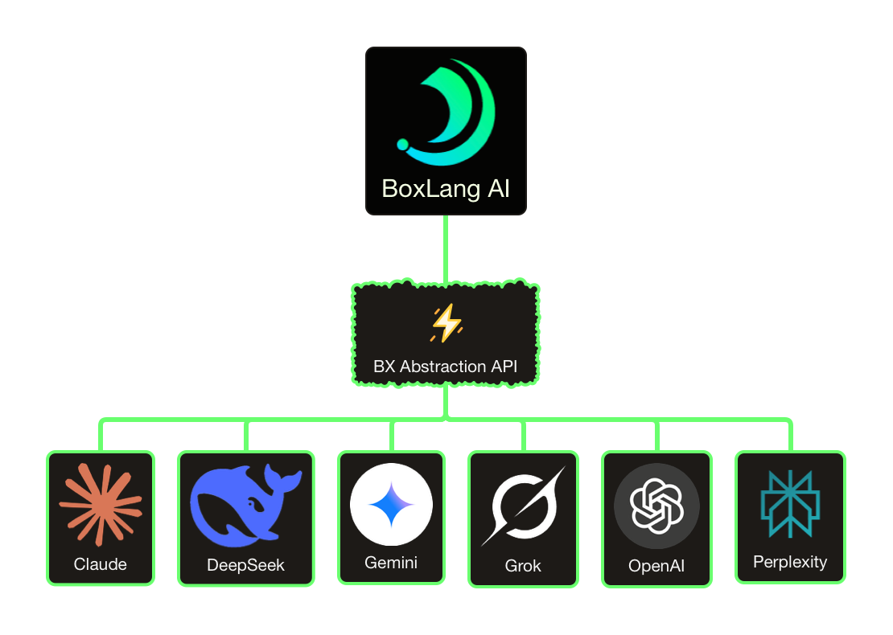

# ⚡︎ BoxLang AI

```
|:------------------------------------------------------:|
| ⚡︎ B o x L a n g ⚡︎
| Dynamic : Modular : Productive
|:------------------------------------------------------:|
```

<blockquote>
	Copyright Since 2023 by Ortus Solutions, Corp
	<br>
	<a href="https://ai.boxlang.io">ai.boxlang.io</a> |
	<a href="https://www.boxlang.io">www.boxlang.io</a>
	<br>
	<a href="https://ai.ortussolutions.com">ai.ortussolutions.com</a> |
	<a href="https://www.ortussolutions.com">www.ortussolutions.com</a>
</blockquote>

<p>&nbsp;</p>

## 👋 Welcome



Welcome to the **BoxLang AI Module** 🚀 The official AI library for BoxLang that provides a unified, fluent API to orchestrate multi-model workflows, autonomous agents, RAG pipelines, and AI-powered applications. **One API → Unlimited AI Power!** ✨

**BoxLang AI** eliminates vendor lock-in and simplifies AI integration by providing a single, consistent interface across **16+ AI providers**. Whether you're using OpenAI, Claude, Gemini, Grok, DeepSeek, MiniMax, Ollama, or Perplexity—your code stays the same. Switch providers, combine models, and orchestrate complex workflows with simple configuration changes. 🔄

## ✨ Key Features

- 🔌 **16+ AI Providers** - Single API for OpenAI, Claude, AWS Bedrock, Gemini, Grok, MiniMax, Ollama, DeepSeek, and more
- 🤖 **AI Agents** - Autonomous agents with memory, tools, sub-agents, and multi-step reasoning
- 🔒 **Multi-Tenant Memory** - Enterprise-grade isolation with 20+ memory types (standard + vector)
- 🧬 **Vector Memory & RAG** - 12 vector databases with semantic search (ChromaDB, Pinecone, PostgreSQL, OpenSearch, etc.)
- 📚 **Document Loaders** - 30+ file formats including PDF, Word, CSV, JSON, XML, web scraping, and databases
- 🛠️ **Real-Time Tools** - Function calling for APIs, databases, and external system integration
- 🌊 **Streaming Support** - Real-time token streaming through pipelines for responsive applications
- 📦 **Structured Output** - Type-safe responses using BoxLang classes, structs, or JSON schemas
- 🔗 **AI Pipelines** - Composable workflows with models, transformers, and custom logic
- 🧩 **Middleware** - Cross-cutting controls for agents/models (logging, retries, guardrails, approval, and replay)
- 🎓 **AI Skills** - Reusable, composable knowledge blocks following the [Claude Agent Skills](https://www.anthropic.com/news/agent-skills) open standard for modular agent behavior
- 📡 **MCP Protocol** - Build and consume Model Context Protocol servers for distributed AI
- 💬 **Fluent Interface** - Chainable, expressive syntax that makes AI integration intuitive
- 🦙 **Local AI** - Full Ollama support for privacy, offline use, and zero API costs
- ⚡ **Async Operations** - Non-blocking `runAsync()` on every runnable; `aiParallel()` for concurrent parallel pipelines
- 🎯 **Event-Driven** - 35+ lifecycle events for logging, monitoring, and custom workflows
- 🏭 **Production-Ready** - Timeout controls, error handling, rate limiting, and debugging tools
- 🧪 **Testable** - Deterministic replay for reliable unit and integration testing

## 📃 License

BoxLang is open source and licensed under the [Apache 2](https://www.apache.org/licenses/LICENSE-2.0.html) license.

🎉 You can also get a professionally supported version with enterprise features and support via our BoxLang +/++ Plans (www.boxlang.io/plans). This includes more vector memories, enhanced features, Agent Dashboard and much more.

## 🚀 Getting Started

You can use BoxLang AI in both operating system applications, AWS Lambda, and web applications.  For OS applications, you can use the module installer to install the module globally.  For AWS Lambda and web applications, you can use the module installer to install it locally in your project or CommandBox as the package manager, which is our preferred method for web applications.

**📚 New to AI concepts?** Check out our [Key Concepts Guide](https://ai.ortusbooks.com/getting-started/concepts) for terminology and fundamentals, or browse our [FAQ](https://ai.ortusbooks.com/readme/faq) for quick answers to common questions.  We also have a [Quick Start Guide](https://ai.ortusbooks.com/getting-started/quickstart) and our intense [AI BootCamp](https://github.com/ortus-boxlang/bx-ai-bootcamp) available to you as well.

### OS

You can easily get started with BoxLang AI by using the module installer for building operating system applications:

```bash
install-bx-module bx-ai
```

This will install the latest version of the BoxLang AI module in your BoxLang environment. Once installed, configure your default AI provider and API key in `boxlang.json` (https://boxlang.ortusbooks.com/getting-started/configuration):

```json
{
    "modules": {
        "bxai": {
            "settings": {
                "provider": "openai",
                "apiKey": "${OPENAI_API_KEY}"
            }
        }
    }
}
```

> 💡 **Tip:** Use environment variable placeholders like `${OPENAI_API_KEY}` so you never commit secrets to source control. Each provider also auto-detects its own env var according to its name(e.g. `OPENAI_API_KEY`, `CLAUDE_API_KEY`, `GEMINI_API_KEY`).

### Module Settings

Below is the full reference of every setting you can place under `settings` in `boxlang.json`:

```json
{
    "modules": {
        "bxai": {
            "settings": {
                "provider": "openai",
                "apiKey": "${OPENAI_API_KEY}",

                "defaultParams": {
                    "model": "gpt-4o",
                    "temperature": 0.7,
                    "max_tokens": 2000
                },

                "memory": {
                    "provider": "window",
                    "config": {
                        "maxMessages": 20
                    }
                },

                "providers": {
                    "openai": {
                        "params": { "model": "gpt-4o", "temperature": 0.7 },
                        "options": { "timeout": 60 }
                    },
                    "claude": {
                        "params": { "model": "claude-3-5-sonnet-20241022" }
                    },
                    "ollama": {
                        "params": { "model": "qwen3:0.6b" }
                    }
                },

                "timeout": 45,

                "logRequest": false,
                "logRequestToConsole": false,
                "logResponse": false,
                "logResponseToConsole": false,

                "returnFormat": "single",

                "skillsDirectory": "/.ai/skills",
                "autoLoadSkills": true,
                "globalSkills": []
            }
        }
    }
}
```

| Setting | Type | Default | Description |
|---------|------|---------|-------------|
| `provider` | `string` | `"openai"` | Default AI provider to use for all requests |
| `apiKey` | `string` | `""` | Default API key; each provider also reads its own env var (e.g. `OPENAI_API_KEY`) |
| `defaultParams` | `struct` | `{}` | Default request parameters sent to every provider (e.g. `model`, `temperature`, `max_tokens`) |
| `memory.provider` | `string` | `"window"` | Default memory type: `window`, `cache`, `file`, `session`, `summary`, `jdbc`, `hybrid`, or any vector provider |
| `memory.config` | `struct` | `{}` | Provider-specific memory configuration (e.g. `maxMessages`, `cacheName`) |
| `providers` | `struct` | `{}` | Per-provider overrides — keys are provider names, values have `params` and `options` structs |
| `timeout` | `numeric` | `45` | Default HTTP request timeout in seconds |
| `logRequest` | `boolean` | `false` | Log outgoing AI requests to `ai.log` |
| `logRequestToConsole` | `boolean` | `false` | Print outgoing AI requests to the console (useful for debugging) |
| `logResponse` | `boolean` | `false` | Log AI responses to `ai.log` |
| `logResponseToConsole` | `boolean` | `false` | Print AI responses to the console (useful for debugging) |
| `returnFormat` | `string` | `"single"` | Default response format: `single`, `all`, `raw`, `json`, `xml`, or `structuredOutput` |
| `skillsDirectory` | `string` | `"/.ai/skills"` | Directory scanned for `SKILL.md` files at startup. Set to `""` to disable auto-discovery |
| `autoLoadSkills` | `boolean` | `true` | When `true`, skills found in `skillsDirectory` are auto-loaded and injected into every `aiAgent()` as global skills |
| `globalSkills` | `array` | `[]` | Internal — populated at startup with auto-discovered skills; access via `aiGlobalSkills()` |

After that you can leverage the global functions (BIFs) in your BoxLang code.  Here is a simple example:

```java
// chat.bxs
answer = aiChat( "How amazing is BoxLang?" )
println( answer )
```

You can then run your BoxLang script like this:

```bash
boxlang chat.bxs
```

### AWS Lambda

In order to build AWS Lambda functions with Boxlang AI for serverless AI agents and applications, you can use the [Boxlang AWS Runtime](https://boxlang.ortusbooks.com/getting-started/running-boxlang/aws-lambda) and our [AWS Lambda Starter Template](https://github.com/ortus-boxlang/boxlang-starter-aws-lambda).   You will use the `install-bx-module` as well to install the module locally using the `--local` flag in the `resources` folder of your project:

```bash
cd src/resources
install-bx-module bx-ai --local
```

Or you can use CommandBox as well and store your dependencies in the `box.json` descriptor.

```bash
box install bx-ai resources/modules/
```

### Web Applications

To use BoxLang AI in your web applications, you can use CommandBox as the package manager to install the module locally in your project.  You can do this by running the following command in your project root:

```bash
box install bx-ai
```

Just make sure you have already a server setup with BoxLang.  You can check our [Getting Started with BoxLang Web Applications](https://boxlang.ortusbooks.com/getting-started/running-boxlang/commandbox) guide for more details on how to get started with BoxLang web applications.

## 🤖 Supported Providers

The following are the AI providers supported by this module. **Please note that in order to interact with these providers you will need to have an account with them and an API key.** 🔑

- ☁️ [AWS Bedrock](https://aws.amazon.com/bedrock/) - Claude, Titan, Llama, Mistral via AWS
- 🧠 [Claude Anthropic](https://www.anthropic.com/claude)
- 🧬 [Cohere](https://cohere.com/)
- 🔍 [DeepSeek](https://www.deepseek.com/)
- 🐳 [Docker Model Runner](https://docs.docker.com/ai/model-runner/) - Local models via Docker Desktop
- 🎙️ [ElevenLabs](https://elevenlabs.io/) - Premium text-to-speech and speech-to-text
- 💎 [Gemini](https://gemini.google.com/)
- ⚡ [Grok](https://grok.com/)
- 🚀 [Groq](https://groq.com/)
- 🤗 [HuggingFace](https://huggingface.co/)
- 🌀 [Mistral](https://mistral.ai/)
- 🌟 [MiniMax](https://platform.minimax.io/)
- 🦙 [Ollama](https://ollama.ai/)
- 🟢 [OpenAI](https://www.openai.com/)
- 🔌 [OpenAI-Compatible](https://platform.openai.com/docs/api-reference) - Any OpenAI-compatible API
- 🔀 [OpenRouter](https://openrouter.ai/)
- 🔮 [Perplexity](https://docs.perplexity.ai/)
- 🚢 [Voyage AI](https://www.voyageai.com/)

### 📊 Provider Support Matrix

Here is a matrix of the providers and their feature support. Please keep checking as we will be adding more providers and features to this module. 🔄

| Provider            | Chat & Streaming | Real-time Tools | Embeddings       | TTS (Speech)     | STT (Transcription) |
|---------------------|------------------|-----------------|------------------|------------------|---------------------|
| AWS Bedrock         | ✅               | ✅              | ✅               | ❌               | ❌                  |
| Claude              | ✅               | ✅              | ❌               | ❌               | ❌                  |
| Cohere              | ✅               | ✅              | ✅               | ❌               | ❌                  |
| DeepSeek            | ✅               | ✅              | ✅               | ❌               | ❌                  |
| Docker Model Runner | ✅               | ✅              | ✅               | ❌               | ❌                  |
| ElevenLabs          | ❌               | ❌              | ❌               | ✅ (Premium)     | ✅ (Scribe v1)      |
| Gemini              | ✅               | [Coming Soon]   | ✅               | ✅               | ✅                  |
| Grok                | ✅               | ✅              | ✅               | ✅               | ❌                  |
| Groq                | ✅               | ✅              | ✅               | ❌               | ✅ (Whisper)        |
| HuggingFace         | ✅               | ✅              | ✅               | ❌               | ❌                  |
| Mistral             | ✅               | ✅              | ✅               | ✅ (Voxtral)     | ✅ (Voxtral)        |
| MiniMax             | ✅               | ✅              | ✅               | ❌               | ❌                  |
| Ollama              | ✅               | ✅              | ✅               | ❌               | ❌                  |
| OpenAI              | ✅               | ✅              | ✅               | ✅               | ✅ (Whisper)        |
| OpenAI-Compatible   | ✅               | ✅              | ✅               | ❌               | ❌                  |
| OpenRouter          | ✅               | ✅              | ✅               | ❌               | ❌                  |
| Perplexity          | ✅               | ✅              | ❌               | ❌               | ❌                  |
| Voyage              | ❌               | ❌              | ✅ (Specialized) | ❌               | ❌                  |

### 🔍 Provider Capability Discovery

Every provider exposes a **runtime capability API** so you can introspect what it supports without consulting documentation — and without risking cryptic errors when you call an unsupported operation. 🛡️

```javascript
// Get all capabilities a provider supports
var provider = aiService( "openai" );
var caps = provider.getCapabilities();
// → [ "chat", "stream", "embeddings" ]

// Check a specific capability before using it
if ( provider.hasCapability( "embeddings" ) ) {
    var embedding = aiEmbed( "Hello world" );
}

// Voyage is embeddings-only — getCapabilities() reflects this
var voyage = aiService( "voyage" );
voyage.getCapabilities(); // → [ "embeddings" ]
voyage.hasCapability( "chat" ); // → false
```

The built-in BIFs (`aiChat`, `aiChatStream`, `aiEmbed`) automatically use this system and throw a clear `UnsupportedCapability` exception when the selected provider does not implement the required capability:

```javascript
// This will throw UnsupportedCapability — Voyage has no chat capability
aiChat( "Hello?", provider: "voyage" );

// This will throw UnsupportedCapability — Claude has no embeddings capability
aiEmbed( "some text", provider: "claude" );
```

Capabilities map to the following **capability interfaces** (in `models/providers/capabilities/`):

| Capability String | Interface                  | Methods Provided                         |
|-------------------|----------------------------|-------------------------------------------|
| `chat`, `stream`  | `IAiChatService`           | `chat()`, `chatStream()`                  |
| `embeddings`      | `IAiEmbeddingsService`     | `embeddings()`                            |
| `speech`          | `IAiSpeechService`         | `speak()`                                 |
| `transcription`   | `IAiTranscriptionService`  | `transcribe()`, `translate()`             |

## 🥊 Quick Overview

Here's a taste of what you can do with BoxLang AI. For full details, explore our [complete documentation](https://ai.ortusbooks.com).

### 💬 Chat with Any Provider

```javascript
// Simple chat — auto-detects OPENAI_API_KEY
answer = aiChat( "What is BoxLang?" )

// Use a specific provider and model
answer = aiChat(
    "Explain quantum computing",
    params : { model: "claude-3-5-sonnet-20241022" },
    options: { provider: "claude" }
)

// Stream responses in real-time
aiChatStream(
    "Write a poem about coding",
    ( chunk ) => print( chunk )
)
```

📖 [Chat & Streaming Guide](https://ai.ortusbooks.com/main-components/chat)

### 🤖 Autonomous Agents with Tools

```javascript
// Create an agent with tools and memory
var agent = aiAgent(
    name        : "researcher",
    description : "Research assistant with web search",
    instructions: "Always cite your sources",
    tools       : [
        aiTool( "search", "Search the web", { query: "string" }, searchWeb )
    ],
    memory      : aiMemory( "window", { maxMessages: 10 } )
)

var result = agent.run( "What are the latest trends in AI?" )
```

📖 [AI Agents Guide](https://ai.ortusbooks.com/main-components/agents) · [Tools & Function Calling](https://ai.ortusbooks.com/main-components/tools)

### 🧠 Memory & RAG Pipelines

```javascript
// Load documents into vector memory for semantic search
var loader = aiDocuments( "pdf", "./docs/*.pdf" )
    .chunk( 1000, 200 )

var memory = aiMemory( "box", { collection: "knowledge-base" } )
loader.ingest( memory )

// Query with context retrieval
var relevant = memory.getRelevant( "How do I configure BoxLang?", 5 )
```

#### 📊 Spreadsheet Loader Integration (bx-spreadsheet)

When the `bx-spreadsheet` module is installed, you can use its `SpreadsheetLoader` for BoxLang AI document loading workflows:

- New `SpreadsheetLoader` in `src/main/bx/loaders/SpreadsheetLoader.bx` for BoxLang AI document loading workflows
- Loads spreadsheet content as AI `Document` objects
- Supports one document per sheet (default) or one document per row (`rowsAsDocuments`)
- Supports header-aware row formatting (`hasHeaders`) and sheet filtering (`sheets`)
- Inherits the `IDocumentLoader` contract via `BaseDocumentLoader`

```javascript
import bxModules.bxSpreadsheet.loaders.SpreadsheetLoader;

// One document per sheet (default)
var docs = new SpreadsheetLoader( source: "./data/customers.xlsx" ).load();

// One document per row on a specific sheet
var rowDocs = new SpreadsheetLoader( source: "./data/customers.xlsx" )
    .rowsAsDocuments()
    .sheets( [ "Customers" ] )
    .load();
```

📖 [Memory Systems](https://ai.ortusbooks.com/main-components/memory) · [Vector Memory & RAG](https://ai.ortusbooks.com/main-components/vector-memory) · [Document Loaders](https://ai.ortusbooks.com/main-components/document-loaders)

### 🔗 Composable Pipelines

```javascript
// Chain models, transformers, and custom logic
var pipeline = aiModel( "openai" )
    .to( aiTransform( "json", { stripMarkdown: true } ) )
    .to( aiTransform( (data) => data.users ) )

var users = pipeline.run( "Generate a JSON array of 5 users with name and email" )
```

📖 [AI Pipelines](https://ai.ortusbooks.com/main-components/pipelines)

### 📡 MCP Servers

```javascript
// Create an MCP server exposing custom tools
var mcpSrv = mcpServer( "my-tools", "Business tools API" )
    .registerTool( aiTool( "getCustomer", "Fetch customer by ID", { id: "string" }, fetchCustomer ) )
    .enableCORS( ["*"] )
```

📖 [MCP Protocol Guide](https://ai.ortusbooks.com/main-components/mcp)

### 🎙️ Speech & Transcription

```javascript
// Text-to-speech
response = aiSpeak( "Welcome to BoxLang!", params: { voice: "nova" } )
response.saveToFile( "./welcome.mp3" )

// Speech-to-text
text = aiTranscribe( "./recording.mp3" )
```

📖 [Speech Synthesis](https://ai.ortusbooks.com/main-components/speech) · [Transcription](https://ai.ortusbooks.com/main-components/transcription)

### 🎓 AI Skills

```javascript
// Load skills from a directory for agent behavior
var skills = aiSkill( "./skills", recurse: true )
var agent  = aiAgent( name: "coder", skills: skills )
```

📖 [AI Skills Guide](https://ai.ortusbooks.com/main-components/skills)

### ⚡ Async & Parallel Execution

```javascript
// Non-blocking chat
var future = aiChatAsync( "Analyze this data..." )
var result = future.get()

// Run multiple pipelines in parallel
var results = aiParallel({
    summary : aiModel( "openai" ),
    tags    : aiModel( "claude" ),
    tone    : aiModel( "gemini" )
}).runAsync( "Review this article" ).get()
```

📖 [Async Operations](https://ai.ortusbooks.com/main-components/async)

----

## 🛠️ Global Functions (BIFs)

| Function | Purpose | Parameters | Return Type | Async Support |
|----------|---------|------------|-------------|---------------|
| `aiAgent()` | Create autonomous AI agent | `name`, `description`, `instructions`, `model`, `memory`, `tools`, `subAgents`, `params`, `options`, `mcpServers=[]`, `skills=[]`, `availableSkills=[]` | AiAgent Object (supports `runAsync()`) | ✅ |
| `aiChat()` | Chat with AI provider | `messages`, `params={}`, `options={}` | String/Array/Struct | ❌ |
| `aiChatAsync()` | Async chat with AI provider | `messages`, `params={}`, `options={}` | BoxLang Future | ✅ |
| `aiChatRequest()` | Compose a reusable chat request object (useful for advanced pipelines and middleware) | `messages`, `params`, `options`, `headers` | AiChatRequest Object | N/A |
| `aiChatStream()` | Stream chat responses from AI provider | `messages`, `callback`, `params={}`, `options={}` | void | N/A |
| `aiChunk()` | Split text into chunks for RAG ingestion or token-window management | `text`, `options={}` _(chunkSize, overlap, strategy)_ | Array of Strings | N/A |
| `aiDocuments()` | Create fluent document loader | `source`, `config={}` | IDocumentLoader Object | N/A |
| `aiEmbed()` | Generate embeddings | `input`, `params={}`, `options={}` | Array/Struct | N/A |
| `aiMemory()` | Create memory instance | `memory`, `key`, `userId`, `conversationId`, `config={}` | IAiMemory Object | N/A |
| `aiMessage()` | Build message object | `message` | ChatMessage Object | N/A |
| `aiModel()` | Create AI model wrapper | `provider`, `apiKey`, `tools`, `mcpServers=[]`, `skills=[]` | AiModel Object | N/A |
| `aiPopulate()` | Populate class/struct from JSON | `target`, `data` | Populated Object | N/A |
| `aiService()` | Create AI service provider | `provider`, `apiKey` | IService Object | N/A |
| `aiSkill()` | Create or discover AI skills | `path`, `name`, `description`, `content`, `recurse=true` | AiSkill / Array | N/A |
| `aiGlobalSkills()` | Get the globally shared skill pool | _(none)_ | Array of AiSkill | N/A |
| `aiSpeak()` | Convert text to speech (TTS) | `text`, `params={}`, `options={}` | AiSpeechResponse / File path | N/A |
| `aiTokens()` | Estimate token count for a text string | `text`, `options={}` _(method: characters\|words)_ | Numeric | N/A |
| `aiTool()` | Create tool for real-time processing | `name`, `description`, `callable` | Tool Object | N/A |
| `aiToolRegistry()` | Get the singleton AI Tool Registry | _(none)_ | AIToolRegistry Object | N/A |
| `aiTranscribe()` | Transcribe audio to text (STT) | `audio`, `params={}`, `options={}` | String / AiTranscriptionResponse | N/A |
| `aiTranslate()` | Translate non-English audio to English | `audio`, `params={}`, `options={}` | String / AiTranscriptionResponse | N/A |
| `aiParallel()` | Run multiple named runnables concurrently and collect results | `runnables` (struct of `{ name: IAiRunnable }`) | AiRunnableParallel Object | ✅ (via `runAsync()`) |
| `aiTransform()` | Create data transformer | `transformer`, `config={}` | Transformer Runnable | N/A |
| `MCP()` | Create MCP client for Model Context Protocol servers | `baseURL` | MCPClient Object | N/A |
| `mcpServer()` | Get or create MCP server for exposing tools | `name="default"`, `description`, `version`, `cors`, `statsEnabled`, `force` | MCPServer Object | N/A |
| `aiWebSearch()` | Search the web via a pluggable provider | `query`, `params={}`, `options={}` _(provider, maxResults)_ | Array of `{title, url, snippet}` | ❌ |
| `aiWebSearchAsync()` | Search the web asynchronously | `query`, `params={}`, `options={}` _(provider, maxResults)_ | BoxLang Future | ✅ |

> **Note on Return Formats:** When using pipelines (runnable chains), the default return format is `raw` (full API response), giving you access to all metadata. Use `.singleMessage()`, `.allMessages()`, or `.withFormat()` to extract specific data. The `aiChat()` BIF defaults to `single` format (content string) for convenience. See the [Pipeline Return Formats](https://ai.ortusbooks.com/main-components/overview.md#return-formats) documentation for details.

## 🌐 GitHub Repository and Reporting Issues

Visit the [GitHub repository](https://github.com/ortus-boxlang/bx-ai) for release notes. You can also file a bug report or improvement suggestion  via [GitHub Issues](https://github.com/ortus-boxlang/bx-ai/issues).

## Contributing

Follow these instructions if you want to contribute to the project:

1. Fork the repository and create a new branch for your feature or bug fix.
2. Make your changes, ensuring you follow the existing code style and conventions.
3. Write tests for your changes to ensure they work as expected.
4. Submit a pull request with a clear description of your changes and the problem they solve.
5. The maintainers will review your pull request and provide feedback or merge it if it meets the project's standards.

## Building a Local Version

To build and test the module locally, you'll need [BoxLang](https://www.boxlang.io) and [Gradle](https://gradle.org/) installed.

### Prerequisites

- **Java 21+** - Required for BoxLang runtime
- **Git** - For cloning the repository
- **Node.js** - For installing agent skills (optional)

### Clone & Build

```bash
# Clone the repository
git clone https://github.com/ortus-solutions/bx-ai.git
cd bx-ai

# Restore agent skills from skills-lock.json
npx skills experimental_install

# Download BoxLang language files for compilation
./gradlew downloadboxLang

# Build the module (outputs to build/module/)
./gradlew build

# Skip tests for faster builds during development
./gradlew shadowJar -x test
```

### Running Tests

```bash
# Run all tests
./gradlew test

# Run a specific test class
./gradlew test --tests "ortus.boxlang.ai.bifs.aiChatTest"

# Start Ollama for local testing (requires Docker)
docker compose up -d ollama
curl http://localhost:11434/api/tags  # Verify model availability
```

### Module Output

After building, the compiled module is available in `build/module/` and can be loaded by any BoxLang application.

## 💖 Ortus Sponsors

BoxLang is a professional open-source project and it is completely funded by the [community](https://patreon.com/ortussolutions) and [Ortus Solutions, Corp](https://ai.ortussolutions.com). Ortus Patreons get many benefits like a cfcasts account, a FORGEBOX Pro account and so much more. If you are interested in becoming a sponsor, please visit our patronage page: [https://patreon.com/ortussolutions](https://patreon.com/ortussolutions)

### THE DAILY BREAD

> "I am the way, and the truth, and the life; no one comes to the Father, but by me (JESUS)" Jn 14:1-12
