# ⚡︎ BoxLang AI

```
|:------------------------------------------------------:|
| ⚡︎ B o x L a n g ⚡︎
| Dynamic : Modular : Productive
|:------------------------------------------------------:|
```

<blockquote>
	Copyright Since 2023 by Ortus Solutions, Corp
	<br>
	<a href="https://www.boxlang.io">www.boxlang.io</a> |
	<a href="https://www.ortussolutions.com">www.ortussolutions.com</a>
</blockquote>

<p>&nbsp;</p>

## 👋 Welcome


Welcome to the **BoxLang AI Module** 🚀 This module provides AI generation capabilities to your [BoxLang](www.boxlang.io) applications in an easy to use and abstracted API, so you can interact with ANY AI provider in a consistent manner. Our core focus is productivity, fluency and ease of use. ✨

BoxLang AI eliminates the complexity of working with multiple AI providers by offering a unified interface. Whether you're using OpenAI, Claude, Gemini, Grok, DeepSeek, or Perplexity, your code remains the same—just change a configuration setting to switch providers. 🔄

### ✨ Key Features

- 🔌 **Multi-Provider Support** - Seamlessly integrate with leading AI providers through a single API
- 💬 **Fluent Interface** - Chainable, expressive syntax that makes AI integration intuitive
- 📝 **Flexible Messaging** - Send simple strings, structured messages, or complex conversation arrays
- 🤖 **Flexible Agents** - Easily create autonomous and composable AI Agents
- ⚡ **Async Support** - Built-in asynchronous capabilities with futures for non-blocking operations
- 🔒 **Multi-Tenant Memory** - Enterprise-grade user and conversation isolation across all memory types
- 📚 **Document Loaders** - 12+ built-in loaders for documents, files, web content, databases, and more
- 🧬 **RAG Pipeline** - Complete Retrieval-Augmented Generation workflow from documents to context injection
- 🎯 **Vector Memory** - Semantic search and retrieval using ChromaDB, PostgreSQL, MySQL, TypeSense, and Weaviate
- ⚙️ **Configurable** - Global defaults, per-request overrides, and comprehensive logging options
- 🎯 **Event-Driven** - Intercept and extend AI processing with lifecycle events
- 🏭 **Production-Ready** - Timeout controls, error handling, and debugging tools

## 📄 License

BoxLang is open source and licensed under the [Apache 2](https://www.apache.org/licenses/LICENSE-2.0.html) license. 🎉 You can also get a professionally supported version with enterprise features and support via our BoxLang +/++ Plans (www.boxlang.io/plans). 💼

## 🚀 Getting Started

You can easily get started with BoxLang AI by using the module installer:

```bash
install-bx-module bx-ai
```

> If you would like to leverage it in your CommandBox Based Web applications, make sure you add it to your `server.json` or use `box install bx-ai`.

Once installed, make sure you setup any of the supported AI providers and their API keys in your `boxlang.json` configuration file.  After that
you can leverage the global functions (BIFs) in your BoxLang code.  Here is a simple example:

```java
// chat.bxs
answer = aiChat( "How amazing is BoxLang?" )
println( answer )
```

**📚 New to AI concepts?** Check out our [Key Concepts Guide](docs/getting-started/concepts.md) for terminology and fundamentals, or browse our [FAQ](docs/getting-started/faq.md) for quick answers to common questions.

## 🤖 Providers

The following are the AI providers supported by this module. **Please note that in order to interact with these providers you will need to have an account with them and an API key.** 🔑

- 🧠 [Claude Anthropic](https://www.anthropic.com/claude)
- 🧬 [Cohere](https://cohere.com/)
- 🔍 [DeepSeek](https://www.deepseek.com/)
- 💎 [Gemini](https://gemini.google.com/)
- ⚡ [Grok](https://grok.com/)
- 🚀 [Groq](https://groq.com/)
- 🤗 [HuggingFace](https://huggingface.co/)
- 🌀 [Mistral](https://mistral.ai/)
- 🦙 [Ollama](https://ollama.ai/)
- 🟢 [OpenAI](https://www.openai.com/)
- 🔀 [OpenRouter](https://openrouter.ai/)
- 🔮 [Perplexity](https://docs.perplexity.ai/)
- 🚢 [Voyage AI](https://www.voyageai.com/)

## 🎯 Features

Here are some of the features of this module:

- 🔌 Integration with multiple AI providers
- 📦 **Structured Output** - Type-safe AI responses using BoxLang classes, structs, or JSON schemas
- 🤖 **AI Agents** - Autonomous agents with memory, tools, and sub-agent orchestration
- 🔒 **Multi-Tenant Memory** - Built-in user and conversation isolation for enterprise applications
- 📚 **Document Loaders** - Built-in loaders for Text, Markdown, CSV, JSON, XML, PDF, Log, HTTP, Feed, SQL, Directory, and WebCrawler
- 🧬 **RAG (Retrieval-Augmented Generation)** - Complete workflow: load documents → chunk → embed → store → retrieve → inject into AI context
- 🎯 **Vector Memory Systems** - Semantic search with ChromaDB, PostgreSQL pgvector, MySQL vector, TypeSense, and Weaviate
- 📝 Compose raw chat requests
- 💬 Build message objects
- 🛠️ Create AI service objects
- 🔧 Create AI tool objects
- 🔍 Generate embeddings for semantic search
- ⛓️ Fluent API
- ⚡ Asynchronous chat requests
- 🌐 Global defaults
- ✨ And much more

## 📊 Provider Support Matrix

Here is a matrix of the providers and their feature support. Please keep checking as we will be adding more providers and features to this module. 🔄

| Provider   | Real-time Tools | Embeddings | Structured Output |
|------------|-----------------|------------|-------------------|
| Claude    	| ✅ | ❌ | ✅ |
| Cohere       | ✅ | ✅ | ✅ |
| DeepSeek  | ✅ | ✅ | ✅ |
| Gemini    	| [Coming Soon]   | ✅ | ✅ |
| Grok      	 | ✅ | ✅ | ✅ |
| Groq         | ✅ | ✅ | ✅ |
| HuggingFace | ✅ | ✅ | ✅ |
| Mistral      | ✅ | ✅ | ✅ |
| Ollama       | ✅ | ✅ | ✅ |
| OpenAI       | ✅ | ✅ | ✅ (Native) |
| OpenRouter   | ✅ | ✅ | ✅ |
| Perplexity   | ✅ | ❌ | ✅ |
| Voyage       | ❌ | ✅ (Specialized) | ❌ |

**Note:**

- OpenAI provides native structured output support with strict schema validation. Other providers use JSON mode with schema constraints, which provides excellent results but may occasionally require prompt refinement.
- Voyage AI is a specialized embeddings-only provider with state-of-the-art models optimized for semantic search, RAG applications, and clustering. It does not support chat completions or structured output.
- Cohere provides high-quality embeddings with excellent multilingual support (100+ languages), chat capabilities, real-time tool calling, and structured output via JSON schema validation.


## 📤 Return Formats

The AI module supports different return formats for the responses. You can specify the return format in the `options` struct when calling the `aiChat()` or `aiChatAsync()` functions, globally in the settings (as we saw above), or in the `ChatRequest` object. 🎯

| Format | Description |
|--------|-------------|
| `single` | Returns a single message as a string (the content from the first choice). This is the default format for BIFs. |
| `all` | Returns an array of all choice messages. Each message is a struct with `role` and `content` keys. |
| `json` | Returns the parsed JSON object from the content string. Automatically parses JSON responses. |
| `xml` | Returns the parsed XML document from the content string. Automatically parses XML responses. |
| `raw` | Returns the full raw response from the AI provider. This is useful for debugging or when you need the full response structure with metadata. This is the default for pipelines. |
| `structuredOutput` | Used internally when `.structuredOutput()` is called. Returns a populated class/struct based on the schema. |

## 📦 Structured Output

Get **type-safe, validated responses** ✅ from AI providers by defining expected output schemas using BoxLang classes, structs, or JSON schemas. The module automatically converts AI responses into properly typed objects, eliminating manual parsing and validation. 🎯

### 🤔 Why Use Structured Output?

- ✅ **Type Safety** - Get validated objects instead of parsing JSON strings
- 🔒 **Automatic Validation** - Schema constraints ensure correct data types and required fields
- 🎯 **Better Reliability** - Reduces hallucinations by constraining response format
- 💻 **Developer Experience** - Work with native BoxLang objects immediately
- 🧪 **Testing & Caching** - Use `aiPopulate()` to create objects from JSON for tests or cached responses

### 💡 Quick Examples

**Using a Class:**

```java
class Person {
    property name="name" type="string";
    property name="age" type="numeric";
    property name="email" type="string";
}

result = aiChat( "Extract person info: John Doe, 30, john@example.com" )
    .structuredOutput( new Person() );

writeOutput( "Name: #result.getName()#, Age: #result.getAge()#" );
```

**Using a Struct Template:**

```java
template = {
    "title": "",
    "summary": "",
    "tags": [],
    "sentiment": ""
};

result = aiChat( "Analyze this article: [long text]" )
    .structuredOutput( template );

writeOutput( "Tags: #result.tags.toList()#" );
```

**Extracting Arrays:**

```java
class Task {
    property name="title" type="string";
    property name="priority" type="string";
    property name="dueDate" type="string";
}

tasks = aiChat( "Extract tasks from: Finish report by Friday (high priority), Review code tomorrow" )
    .structuredOutput( [ new Task() ] );

for( task in tasks ) {
    writeOutput( "#task.getTitle()# - Priority: #task.getPriority()#<br>" );
}
```

**Multiple Schemas (Extract Different Types Simultaneously):**

```java
result = aiChat( "Extract person and company: John Doe, 30 works at Acme Corp, founded 2020" )
    .structuredOutputs( {
        "person": new Person(),
        "company": new Company()
    } );

writeOutput( "Person: #result.person.getName()#<br>" );
writeOutput( "Company: #result.company.getName()#<br>" );
```

### 🔧 Manual Population with aiPopulate()

Convert JSON responses or cached data into typed objects without making AI calls:

```java
// From JSON string
jsonData = '{"name":"John Doe","age":30,"email":"john@example.com"}';
person = aiPopulate( new Person(), jsonData );

// From struct
data = { name: "Jane", age: 25, email: "jane@example.com" };
person = aiPopulate( new Person(), data );

// Populate array
tasksJson = '[{"title":"Task 1","priority":"high"},{"title":"Task 2","priority":"low"}]';
tasks = aiPopulate( [ new Task() ], tasksJson );
```

**Perfect for:** ⭐

- 🧪 Testing with mock data
- 💾 Using cached AI responses
- 🔄 Converting existing JSON data to typed objects
- ✅ Validating data structures

### ✅ Provider Support

All providers support structured output! 🎉 OpenAI offers native structured output with strict validation, while others use JSON mode with schema guidance (which works excellently in practice). 💪

### 📚 Learn More

- 🚀 **Quick Start**: [Simple Interactions Guide](docs/chatting/structured-output.md)
- 🔧 **Advanced Pipelines**: [Pipeline Integration Guide](docs/main-components/structured-output.md)
- 🎓 **Interactive Course**: [Lesson 12 - Structured Output](course/lesson-12-structured-output/)
- 💻 **Examples**: Check `examples/structured/` for complete working examples

## 🧠 Memory Systems

Build **stateful, context-aware AI applications** 🎯 with flexible memory systems that maintain conversation history, enable semantic search, and preserve context across interactions. BoxLang AI provides both traditional conversation memory and advanced vector-based memory for semantic understanding. 💡

### 🤔 Why Use Memory?

- 💭 **Context Retention** - AI remembers previous messages and maintains coherent conversations
- 💬 **Stateful Applications** - Build chat interfaces that remember user preferences and conversation history
- 🔍 **Semantic Search** - Find relevant past conversations using vector embeddings
- 💾 **Flexible Storage** - Choose from in-memory, file-based, database, session, or vector storage
- ⚙️ **Automatic Management** - Memory handles message limits, summarization, and context windows

### 📋 Memory Types

**Standard Memory** 💬 (Conversation History):

| Type | Description | Best For |
|------|-------------|----------|
| **Windowed** | Keeps last N messages | Quick chats, cost-conscious apps |
| **Summary** | Auto-summarizes old messages | Long conversations, context preservation |
| **Session** | Web session persistence | Multi-page web applications |
| **File** | File-based storage | Audit trails, long-term storage |
| **Cache** | CacheBox-backed | Distributed applications |
| **JDBC** | Database storage | Enterprise apps, multi-user systems |

**Vector Memory** 🔍 (Semantic Search):

| Type | Description | Best For |
|------|-------------|----------|
| **BoxVector** | In-memory vectors | Development, testing, small datasets |
| **Hybrid** | Recent + semantic | Best of both worlds approach |
| **Chroma** | ChromaDB integration | Python-based infrastructure |
| **Postgres** | PostgreSQL pgvector | Existing PostgreSQL deployments |
| **MySQL** | MySQL 9 native vectors | Existing MySQL infrastructure |
| **TypeSense** | Fast typo-tolerant search | Low-latency search, autocomplete |
| **Pinecone** | Cloud vector database | Production, scalable semantic search |
| **Qdrant** | High-performance vectors | Large-scale deployments |
| **Weaviate** | GraphQL vector database | Complex queries, knowledge graphs |
| **Milvus** | Enterprise vector DB | Massive datasets, high throughput |

### 💡 Quick Examples

**Windowed Memory (Multi-Tenant):**

```java
// Automatic per-user isolation
memory = aiMemory( "windowed",
    key: createUUID(),
    userId: "user123",
    config: { maxMessages: 10 }
)
agent = aiAgent( name: "Assistant", memory: memory )

agent.run( "My name is John" )
agent.run( "What's my name?" )  // "Your name is John"
```

**Summary Memory (Preserves Full Context):**

```java
memory = aiMemory( "summary", {
    maxMessages: 30,
    summaryThreshold: 15,
    summaryModel: "gpt-4o-mini"
} )
agent = aiAgent( name: "Support", memory: memory )
// Long conversation - older messages summarized automatically
```

**Vector Memory (Semantic Search + Multi-Tenant):**

```java
memory = aiMemory( "chroma",
    key: createUUID(),
    userId: "user123",
    conversationId: "support",
    config: {
        collection: "customer_support",
        embeddingProvider: "openai",
        embeddingModel: "text-embedding-3-small"
    }
)
// Retrieves semantically relevant past conversations
// Automatically filtered by userId/conversationId
```

**Hybrid Memory (Recent + Semantic):**

```java
memory = aiMemory( "hybrid", {
    recentLimit: 5,       // Keep last 5 messages
    semanticLimit: 5,     // Add 5 semantic matches
    vectorProvider: "chroma"
} )
// Combines recency with relevance
```

### 📚 Learn More

- 💬 **Standard Memory**: [Memory Systems Guide](docs/main-components/memory.md)
- 🔍 **Vector Memory**: [Vector Memory Guide](docs/main-components/vector-memory.md)
- 🔧 **Custom Memory**: [Building Custom Memory](docs/advanced/custom-memory.md)
- 🎓 **Interactive Course**: [Lesson 7 - Memory Systems](course/lesson-07-memory/)
- 💻 **Examples**: Check `examples/advanced/` and `examples/vector-memory/` for complete examples

---

## 📚 Document Loaders & RAG

BoxLang AI provides **12+ built-in document loaders** for ingesting content from files, databases, web sources, and more. These loaders integrate seamlessly with vector memory systems to enable **Retrieval-Augmented Generation (RAG)** workflows.

### 🔄 RAG Workflow

```mermaid
graph LR
    LOAD[📄 Load Documents] --> CHUNK[✂️ Chunk Text]
    CHUNK --> EMBED[🧬 Generate Embeddings]
    EMBED --> STORE[💾 Store in Vector Memory]
    STORE --> QUERY[❓ User Query]
    QUERY --> RETRIEVE[🔍 Retrieve Relevant Docs]
    RETRIEVE --> INJECT[💉 Inject into Context]
    INJECT --> AI[🤖 AI Response]

    style LOAD fill:#4A90E2
    style EMBED fill:#BD10E0
    style STORE fill:#50E3C2
    style RETRIEVE fill:#F5A623
    style AI fill:#7ED321
```



### 📄 Available Loaders

| Loader | Type | Use Case | Example |
|--------|------|----------|---------|
| 📝 **TextLoader** | `text` | Plain text files | `.txt`, `.log` |
| 📘 **MarkdownLoader** | `markdown` | Markdown files | `.md` documents |
| 📊 **CSVLoader** | `csv` | CSV files | Data files, exports |
| 🗂️ **JSONLoader** | `json` | JSON files | Configuration, data |
| 🏷️ **XMLLoader** | `xml` | XML files | Config, structured data |
| 📄 **PDFLoader** | `pdf` | PDF documents | Reports, documentation |
| 📋 **LogLoader** | `log` | Log files | Application logs |
| 🌐 **HTTPLoader** | `http` | Web pages | Documentation, articles |
| 📰 **FeedLoader** | `feed` | RSS/Atom feeds | News, blogs |
| 💾 **SQLLoader** | `sql` | Database queries | Query results |
| 📁 **DirectoryLoader** | `directory` | File directories | Batch processing |
| 🕷️ **WebCrawlerLoader** | `webcrawler` | Website crawling | Multi-page docs |

### ✨ Quick Examples

**Load a Single Document:**

```javascript
// Load a PDF document
docs = aiDocuments( "/path/to/document.pdf", "pdf" )
println( "#docs.len()# documents loaded" )

// Load with configuration
docs = aiDocuments(
    source = "/path/to/document.pdf",
    type   = "pdf",
    config = {
        sortByPosition: true,
        addMoreFormatting: true,
        startPage: 1,
        endPage: 10
    }
)
```

**Load Multiple Documents:**

```javascript
// Load all markdown files from a directory
docs = aiDocuments(
    source = "/knowledge-base",
    type   = "directory",
    config = {
        recursive: true,
        extensions: ["md", "txt"],
        excludePatterns: ["node_modules", ".git"]
    }
)
```

**Ingest into Vector Memory:**

```javascript
// Create vector memory
vectorMemory = aiMemory( "chroma", {
    collection: "docs",
    embeddingProvider: "openai",
    embeddingModel: "text-embedding-3-small"
} )

// Ingest documents with chunking and embedding
result = aiMemoryIngest(
    memory        = vectorMemory,
    source        = "/knowledge-base",
    type          = "directory",
    loaderConfig  = { recursive: true, extensions: ["md", "txt", "pdf"] },
    ingestOptions = { chunkSize: 1000, overlap: 200 }
)

println( "✅ Loaded #result.documentsIn# docs as #result.chunksOut# chunks" )
println( "💰 Estimated cost: $#result.estimatedCost#" )
```

**RAG with Agent:**

```javascript
// Create agent with vector memory
agent = aiAgent(
    name: "KnowledgeAssistant",
    description: "AI assistant with access to knowledge base",
    memory: vectorMemory
)

// Query automatically retrieves relevant documents
response = agent.run( "What is BoxLang?" )
println( response )
```

### 📚 Learn More

- 📖 **Full Guide**: [Document Loaders Guide](docs/main-components/document-loaders.md)
- 🧬 **RAG Workflow**: [RAG Implementation Guide](docs/main-components/rag.md)
- 🔧 **Custom Loaders**: [Building Custom Loaders](docs/advanced/custom-loader.md)
- 💻 **Examples**: Check `examples/loaders/` and `examples/rag/` for complete examples

---

## ⚙️ Settings

Here are the settings you can place in your `boxlang.json` file:

```json
{
	"modules" : {
		"bxai" : {
			"settings": {
				// The default provider to use: openai, claude, deepseek, gemini, grok, mistral, ollama, openrouter, perplexity
				"provider" : "openai",
				// The default API Key for the provider
				"apiKey" : "",
				// The default request params to use when calling a provider
				// Ex: { temperature: 0.5, max_tokens: 100, model: "gpt-3.5-turbo" }
				"defaultParams" : {
					// model: "gpt-3.5-turbo"
				},
				// The default timeout of the ai requests
				"timeout" : 30,
				// If true, log request to the ai.log
				"logRequest" : false,
				// If true, log request to the console
				"logRequestToConsole" : false,
				// If true, log the response to the ai.log
				"logResponse" : false,
				// If true, log the response to the console
				"logResponseToConsole" : false,
				// The default return format of the AI response: single, all, raw
				"returnFormat" : "single"
			}
		}
	}
}
```

### 🦙 Ollama Configuration

**Ollama** allows you to run AI models locally on your machine. It's perfect for privacy, offline use, and cost savings. 💰

#### 🔧 Setup Ollama

1. 📥 **Install**: Download from [https://ollama.ai](https://ollama.ai)
2. ⬇️ **Pull a model**: `ollama pull llama3.2` (or any supported model)
3. ▶️ **Start service**: Ollama runs on `http://localhost:11434` by default

#### 📝 Configuration

```json
{
	"modules": {
		"bxai": {
			"settings": {
				"provider": "ollama",
				"apiKey": "",  // Optional: for remote/secured Ollama instances
				"chatURL": "http://localhost:11434",  // Default local instance
				"defaultParams": {
					"model": "llama3.2"  // Any Ollama model you have pulled
				}
			}
		}
	}
}
```

#### 🌟 Popular Ollama Models

- 🦙 `llama3.2` - Latest Llama model (recommended)
- ⚡ `llama3.2:1b` - Smaller, faster model
- 💻 `codellama` - Code-focused model
- 🎯 `mistral` - High-quality general model
- 🔷 `phi3` - Microsoft's efficient model

## 🛠️ Global Functions (BIFs)

| Function | Purpose | Parameters | Return Type | Async Support |
|----------|---------|------------|-------------|---------------|
| `aiAgent()` | Create autonomous AI agent | `name`, `description`, `instructions`, `model`, `memory`, `tools`, `params`, `options` | AiAgent Object | ❌ |
| `aiChat()` | Chat with AI provider | `messages`, `params={}`, `options={}` | String/Array/Struct | ❌ |
| `aiChatAsync()` | Async chat with AI provider | `messages`, `params={}`, `options={}` | BoxLang Future | ✅ |
| `aiChatRequest()` | Compose raw chat request | `messages`, `params`, `options`, `headers` | AiRequestObject | N/A |
| `aiChatStream()` | Stream chat responses from AI provider | `messages`, `callback`, `params={}`, `options={}` | void | N/A |
| `aiChunk()` | Split text into chunks | `text`, `options={}` | Array of Strings | N/A |
| `aiDocuments()` | Create fluent document loader | `source`, `config={}` | IDocumentLoader Object | N/A |
| `aiEmbed()` | Generate embeddings | `input`, `params={}`, `options={}` | Array/Struct | N/A |
| `aiMemory()` | Create memory instance | `type`, `config={}` | IAiMemory Object | N/A |
| `aiMessage()` | Build message object | `message` | ChatMessage Object | N/A |
| `aiModel()` | Create AI model wrapper | `provider`, `apiKey` | AiModel Object | N/A |
| `aiPopulate()` | Populate class/struct from JSON | `target`, `data` | Populated Object | N/A |
| `aiService()` | Create AI service provider | `provider`, `apiKey` | IService Object | N/A |
| `aiTokens()` | Estimate token count | `text`, `options={}` | Numeric | N/A |
| `aiTool()` | Create tool for real-time processing | `name`, `description`, `callable` | Tool Object | N/A |
| `aiTransform()` | Create data transformer | `transformer` | Transformer Runnable | N/A |
| `MCP()` | Create MCP client for Model Context Protocol servers | `baseURL` | MCPClient Object | N/A |
| `mcpServer()` | Get or create MCP server for exposing tools | `name="default"`, `description`, `version`, `cors` | MCPServer Object | N/A |

> **Note on Return Formats:** When using pipelines (runnable chains), the default return format is `raw` (full API response), giving you access to all metadata. Use `.singleMessage()`, `.allMessages()`, or `.withFormat()` to extract specific data. The `aiChat()` BIF defaults to `single` format (content string) for convenience. See the [Pipeline Return Formats](docs/main-components/overview.md#return-formats) documentation for details.

### 💡 Quick Usage Examples

```java
// Simple chat
result = aiChat( "Hello, world!" )

// Create an autonomous AI agent
agent = aiAgent(
    name: "MyAgent",
    description: "A helpful assistant",
    instructions: "Be concise and friendly"
)
response = agent.run( "What is BoxLang?" )

// Async chat with callback
future = aiChatAsync( "Hello!" ).then( r -> println(r) )

// Stream chat responses
aiChatStream( "Tell me a story", ( chunk ) => {
    print( chunk.choices?.first()?.delta?.content ?: "" )
} )

// Build complex request
request = aiChatRequest( messages, { model: "gpt-4" }, { provider: "openai" } )

// Fluent message building
msg = aiMessage().system( "Be helpful" ).user( "Hello" )

// AI Model wrapper
model = aiModel( "openai" ).bindTools( [tool1, tool2] )

// Service with custom settings
service = aiService( "openai", "my-key" ).defaults( { temperature: 0.7 } )

// Tool for function calling
tool = aiTool( "weather", "Get weather data", location => getWeather(location) )

// Load documents from files or directories
docs = aiDocuments( "/path/to/document.txt" )
docs = aiDocuments( "/path/to/folder", "directory", { recursive: true } )

// Create a loader for advanced configuration
loader = aiDocumentLoader( "/docs", "markdown" )
    .splitByHeaders( 2 )
    .removeCodeBlocks()
docs = loader.load()

// Ingest documents into memory with detailed reporting
result = aiMemoryIngest(
    memory = myVectorMemory,
    source = "/knowledge-base",
    type   = "directory",
    loaderConfig  = { recursive: true, extensions: ["md", "txt"] },
    ingestOptions = { chunkSize: 500, overlap: 50 }
)
println( "Ingested #result.documentsIn# docs as #result.chunksOut# chunks" )

// Multi-memory fan-out
result = aiMemoryIngest(
    memory = [ chromaMemory, pgVectorMemory ],
    source = "/docs",
    type   = "markdown"
)

// MCP client for Model Context Protocol servers
client = MCP( "http://localhost:3000" )
    .withTimeout( 5000 )
    .withBearerToken( "token" )
result = client.send( "searchDocs", { query: "syntax" } )

// MCP server for exposing tools to AI clients
mcpServer( "myApp" )
    .registerTool( aiTool( "search", "Search docs", ( query ) => searchDocs( query ) ) )
    .registerResource( uri: "docs://readme", name: "README", handler: () => fileRead( "/readme.md" ) )
```

This module exposes the following BoxLang global functions (BIFs) for you to interact with the AI providers:

### 💬 Chat Functions

- `aiChat( messages, struct params={}, struct options={} )` : This function will allow you to chat with the AI provider and get responses back.  This is the easiest way to interact with the AI providers.
- `aiChatAsync( messages, struct params={}, struct options={} )` : This function will allow you to chat with the AI provider and get a BoxLang future back so you can build fluent asynchronous code pipelines.
- `aiChatStream( messages, callback, struct params={}, struct options={} )` : This function will allow you to stream responses from the AI provider in real-time. A callback function is invoked for each chunk of data received.
- `aiChatRequest( messages, struct params, struct options, struct headers)` - This allows you to compose a raw chat request that you can then later send to an AI service.  The return is a `ChatRequest` object that you can then send to the AI service.

### 🔢 Embedding Functions

- `aiEmbed( input, struct params={}, struct options={} )` : Generate embeddings for text input. Input can be a single string or an array of strings. Returns numerical vectors that capture semantic meaning, useful for semantic search, clustering, and recommendations.
- `aiDocuments( source, type="", struct config={} )` : Load documents from various sources (files, directories, web, databases) using built-in loaders. Supports configuration options for each loader type.

### ✂️ Text Processing Functions

- `aiChunk( text, struct options={} )` : Split text into chunks for processing within AI token limits. Supports multiple chunking strategies (recursive, characters, words, sentences, paragraphs) with configurable chunk size and overlap.
- `aiTokens( text, struct options={} )` : Estimate token count for text using character-based or word-based methods. Useful for planning API usage and managing token budgets.

### 🤖 Agent Functions

- `aiAgent( name, description, instructions, model, memory, tools, params, options )` - Creates an autonomous AI agent that can maintain conversation memory, use tools, and execute tasks. Agents simplify complex AI workflows by managing state and context automatically.
- `aiMemory( type, config )` - Creates a memory instance for agents and pipelines. Available types:
  - **`window`** - Windowed memory keeping last N messages (default, configurable via `maxMessages`)
  - **`summary`** - Intelligently compresses old messages while preserving context
  - **`session`** - Web session-persisted memory
  - **`file`** - File-based persistent storage
  - **`cache`** - CacheBox-backed storage
  - **`jdbc`** - Database-backed storage
  - **`chroma`** - Vector memory with semantic search (ChromaDB)
  - **`mysql`** - MySQL 9 native vector support
  - **`typesense`** - TypeSense fast typo-tolerant search
  - **`hybrid`** - Combines recent + semantic memory

### 🧰 Helper Functions

- `aiMessage( message )` - Allows you to build a message object that you can then use to send to the `aiChat()` or `aiAiRequest()` functions.  It allows you to fluently build up messages as well.
- `aiModel( provider, apiKey )` - Creates an AI model wrapper that can be configured with tools and used in agents or pipelines. Provides a fluent API for model configuration.
- `aiService( provider, apiKey )` - Creates a reference to an AI Service provider that you can then use to interact with the AI service.  This is useful if you want to create a service object and then use it multiple times.  You can pass in optional `provider` and `apiKey` to override the global settings.
- `aiTool( name, description, callable)` - Creates a tool object that you can use to add to a chat request for real-time system processing.  This is useful if you want to create a tool that can be used in multiple chat requests against localized resources.  You can then pass in the tool to the `aiChat()` or `aiAiRequest()` functions.
- `MCP( baseURL )` - Creates a fluent client for consuming Model Context Protocol (MCP) servers. MCP provides standardized access to external tools, resources, and prompts that AI models can use.
- `mcpServer( name, description, version, cors )` - Gets or creates an MCP server instance for registering tools, resources, and prompts that can be exposed to AI clients. Servers are singletons by name, stored globally for access across requests. The `description` and `version` parameters allow you to provide additional metadata for the server instance. The `cors` parameter sets the allowed CORS origin (empty string by default for secure-by-default behavior).

## 📢 Events

The BoxLang AI module emits several events throughout the AI processing lifecycle that allow you to intercept, modify, or extend functionality. These events are useful for logging, debugging, custom providers, and response processing.

### Event Reference Table

| Event | When Fired | Data Emitted | Use Cases |
|-------|------------|--------------|-----------|
| `afterAIAgentRun` | After agent completes execution | `agent`, `response` | Agent monitoring, result tracking |
| `afterAIEmbed` | After generating embeddings | `embeddingRequest`, `service`, `result` | Result processing, caching |
| `afterAIModelInvoke` | After model invocation completes | `model`, `aiRequest`, `results` | Performance tracking, validation |
| `afterAIPipelineRun` | After pipeline execution completes | `sequence`, `result`, `executionTime` | Pipeline monitoring, metrics |
| `afterAIToolExecute` | After tool execution completes | `tool`, `results`, `executionTime` | Tool performance tracking |
| `beforeAIAgentRun` | Before agent starts execution | `agent`, `input`, `messages`, `params` | Agent validation, preprocessing |
| `beforeAIEmbed` | Before generating embeddings | `embeddingRequest`, `service` | Request validation, preprocessing |
| `beforeAIModelInvoke` | Before model invocation starts | `model`, `aiRequest` | Request validation, cost estimation |
| `beforeAIPipelineRun` | Before pipeline execution starts | `sequence`, `stepCount`, `steps`, `input` | Pipeline validation, tracking |
| `beforeAIToolExecute` | Before tool execution starts | `tool`, `name`, `arguments` | Permission checks, validation |
| `onAIAgentCreate` | When agent is created | `agent` | Agent registration, configuration |
| `onAIEmbedRequest` | Before sending embedding request | `dataPacket`, `embeddingRequest`, `provider` | Request logging, modification |
| `onAIEmbedResponse` | After receiving embedding response | `embeddingRequest`, `response`, `provider` | Response processing, caching |
| `onAIError` | When AI operation error occurs | `error`, `errorMessage`, `provider`, `operation`, `canRetry` | Error handling, retry logic, alerts |
| `onAiMemoryCreate` | When memory instance is created | `memory`, `type`, `config` | Memory configuration, tracking |
| `onAIMessageCreate` | When message is created | `message` | Message validation, formatting |
| `onAIModelCreate` | When model wrapper is created | `model`, `service` | Model configuration, tracking |
| `onAIProviderCreate` | After provider is created | `provider` | Provider initialization, configuration |
| `onAIProviderRequest` | When provider is requested | `provider`, `apiKey`, `service` | Custom provider registration |
| `onAIRateLimitHit` | When rate limit (429) is encountered | `provider`, `statusCode`, `retryAfter` | Rate limit handling, provider switching |
| `onAIRequest` | Before sending HTTP request | `dataPacket`, `aiRequest`, `provider` | Request logging, modification, authentication |
| `onAIRequestCreate` | When request object is created | `aiRequest` | Request validation, modification |
| `onAIResponse` | After receiving HTTP response | `aiRequest`, `response`, `rawResponse`, `provider` | Response processing, logging, caching |
| `onAITokenCount` | When token usage data is available | `provider`, `model`, `promptTokens`, `completionTokens`, `totalTokens` | Cost tracking, budget enforcement |
| `onAIToolCreate` | When tool is created | `tool`, `name`, `description` | Tool registration, validation |
| `onAITransformerCreate` | When transformer is created | `transform` | Transform configuration, tracking |

### Event Registration

Leverage the `BoxRegisterListener()` BIF, or if you are developing a module, you can use the `interceptors` structure.

```java
boxRegisterInterceptor( "onAIRequest", myRequestHandler );
boxRegisterInterceptor( "onAIResponse", myResponseHandler );
```

## 🌐 GitHub Repository and Reporting Issues

Visit the [GitHub repository](https://github.com/ortus-boxlang/bx-ai) for release notes. You can also file a bug report or improvement suggestion  via [Jira](https://ortussolutions.atlassian.net/secure/CreateIssueDetails!init.jspa?pid=13359&components=27149&issuetype=1).

---

## 🧪 Testing

This module includes tests for all AI providers. To run the tests:

```bash
./gradlew test
```

### Ollama Testing

For Ollama provider tests, you need to start the test Ollama service first:

```bash
# Start the Ollama test service
docker-compose up -d ollama-test

# Wait for it to be ready (this may take a few minutes for the first run)
# The service will automatically pull the qwen2.5:0.5b model

# Run the tests
./gradlew test --tests "ortus.boxlang.ai.providers.OllamaTest"

# Clean up when done
docker-compose down -v
```

You can also use the provided test script:

```bash
./test-ollama.sh
```

This will start the service, verify it's working, and run a basic test.

**Note**: The first time you run this, it will download the `qwen2.5:0.5b` model (~500MB), so it may take several minutes.

## 💖 Ortus Sponsors

BoxLang is a professional open-source project and it is completely funded by the [community](https://patreon.com/ortussolutions) and [Ortus Solutions, Corp](https://www.ortussolutions.com). Ortus Patreons get many benefits like a cfcasts account, a FORGEBOX Pro account and so much more. If you are interested in becoming a sponsor, please visit our patronage page: [https://patreon.com/ortussolutions](https://patreon.com/ortussolutions)

### THE DAILY BREAD

> "I am the way, and the truth, and the life; no one comes to the Father, but by me (JESUS)" Jn 14:1-12
